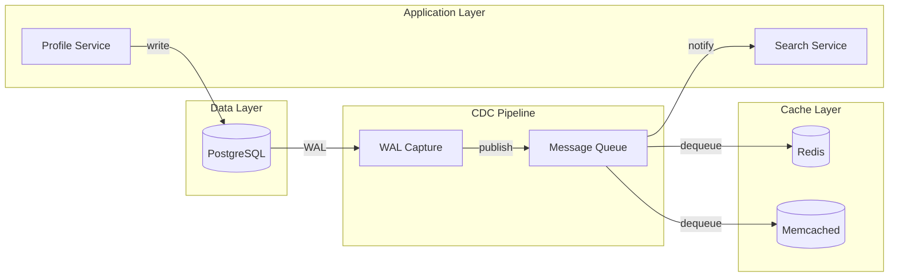

| Difficulty | Channel | Tags |
|---|---|---|
| beginner | backend | redis, memcached, cache-invalidation |

Ever wondered why cache invalidation is considered one of the two hard things in computer science? Airbnb discovered the answer firsthand while running hundreds of microservices across distributed cache clusters. Their approach to solving this — change data capture (CDC) based async invalidation — eliminated race conditions and decoupled services from their caching layer [1]. Here is what they learned, and how you can apply the same principles without burning out your on-call team.

---

> ### Real-World Case — Airbnb
>
> Airbnb ran hundreds of microservices with distributed cache clusters using both Memcached and Redis for frequently accessed data like user profiles and listings. Synchronously invalidating cached data in the request path created tight coupling between services and their caching layer, making the system fragile and hard to scale.
>
> | | |
> |---|---|
> | **Challenge** | How to maintain cache consistency across distributed Memcached and Redis clusters when user profiles or listings were updated, without adding latency to the request path or creating tight coupling between application code and cache infrastructure. |
> | **Solution** | Airbnb built SpinalTap, a Change Data Capture (CDC) service that monitors database write-ahead logs and publishes data mutation events to Kafka. A cache invalidator service subscribes to these events and asynchronously evicts or updates the corresponding entries in both Memcached and Redis clusters — completely outside the application request path. This decoupled cache invalidation from application code entirely. |
> | **Outcome** | The CDC-based async pattern became Airbnb's standard for cache invalidation across all services using Memcached and Redis. It eliminated dual-write failures and race conditions, isolated cache management from request-path availability, and enabled hundreds of services to maintain cache consistency without embedding invalidation logic in application code. |
> | **Lesson** | You don't have to invalidate cache in the request path. Using CDC to drive async cache invalidation decouples caching from application logic, eliminates race conditions from dual-write failures, and lets each layer scale independently — while still maintaining strong eventual consistency. |

---

## Hook — The Two Hard Things in Computer Science

There is a famous quote: "There are only two hard things in computer science: cache invalidation and naming things." Many developers nod along when they hear this, but few have experienced the full horror of distributed cache invalidation at scale. You might think you can just set a TTL and move on. That works fine for a single server with modest traffic. But what happens when you have hundreds of services, multiple cache clusters, and profiles that need to be consistent across your entire platform within seconds of an update? What happens when a stale profile causes a booking to fail, or a listing to display incorrect pricing? The stakes are higher than most developers realize.

## Problem — Why the Simple Approach Breaks at Scale

The textbook solution sounds straightforward: implement write-through caching with TTL-based expiration. When a user updates their profile, you write to the database, then update the cache, and set a TTL so it eventually refreshes. Simple, right? Here is where things fall apart. In a distributed system, synchronously invalidating cache in the request path creates tight coupling between your services and the caching layer [2]. If your cache cluster is slow or unavailable, your profile update fails too. Race conditions emerge when one service updates the database but crashes before updating the cache, leaving stale data that lives until the TTL expires. And with multiple cache nodes, coordinating invalidation becomes a distributed systems problem that makes you question your career choices.

## Real-World Case — Airbnb's Distributed Cache Crisis

Airbnb ran into exactly this wall. They had hundreds of microservices using both Memcached and Redis clusters for frequently accessed data like user profiles and listings. The traditional approach forced every service that wrote data to also manage cache invalidation, creating a spiderweb of dependencies that was fragile and hard to scale [1]. The turning point came when they realized they needed to decouple the cache invalidation logic from the application code entirely. Their solution? A CDC-based async invalidation pipeline that captured database changes from the replication log, published them as events, and let a dedicated invalidation service handle cache cleanup asynchronously [1]. This eliminated dual-write failures, got rid of race conditions, and insulated cache management from request-path availability. The CDC pattern became Airbnb's standard for all services across their entire fleet.

## Deep Dive — Redis vs Memcached: The Real Trade-offs

Building on Airbnb's approach, you need to choose your cache technology. The Redis versus Memcached debate has raged for years, but the real answer depends on your invalidation patterns. Redis offers pub/sub for automatic distributed invalidation — when a key changes, you can broadcast an invalidation event to all subscribers [3]. This is powerful for CDC-based pipelines where multiple services need to react to a single change. Memcached is simpler and faster for pure key-value caching, but you must handle distributed invalidation manually across nodes [4]. Here is the key trade-off: Redis supports persistence, which means you can recover your cache after a restart — critical for pre-warmed hot data. Memcached has lower memory overhead and simpler horizontal scaling, but every node restart means a cold cache. Many developers discover that the choice is less about raw performance and more about the complexity of your invalidation logic [5]. If you need complex invalidation patterns — invalidating related keys, cascading deletes, conditional re-caching — Redis's data structures give you tools that Memcached cannot match. But if your caching needs are simple key-value lookups with straightforward TTLs, Memcached's simplicity is a feature, not a limitation [6].

| Feature | Redis | Memcached |
|---------|-------|-----------|
| Pub/sub invalidation | Built-in | Manual coordination |
| Persistence | Yes (RDB/AOF) | None |
| Data structures | Strings, lists, sets, sorted sets, hashes | Strings only |
| Memory overhead | Higher per key | Lower per key |
| Horizontal scaling | Cluster mode | Simpler sharding |
| Best for | Complex invalidation, durability | Pure caching, high throughput |

## Workflow — Building a CDC-Based Cache Invalidation Pipeline

The key insight from Airbnb's approach is that cache invalidation should be a side effect of database changes, not application logic. Here is how the pipeline works step by step. First, a service writes to the primary database (PostgreSQL). The database's write-ahead log (WAL) captures every change automatically. A CDC capture process reads the WAL and converts database changes into domain events — think ProfileUpdated, ListingPriceChanged, UserDeactivated. These events are published to a message queue like Kafka or RabbitMQ. A dedicated cache invalidator service consumes these events, determines which cache keys need to be invalidated, and deletes them from both Redis and Memcached clusters simultaneously. The diagram below shows this flow — notice how the application layer has no awareness of the caching layer at all.

## Code Example — Implementing Async Cache Invalidation in Python

Let's say you are building a profile service and need to implement CDC-based cache invalidation. The code below shows how a dedicated invalidator service consumes database change events and handles cache cleanup asynchronously, without the application code ever touching the cache layer.

## Lessons Learned — Cache Like You Mean It

After walking through Airbnb's journey and the Redis versus Memcached trade-offs, three key lessons emerge. First, decouple cache invalidation from application logic. If your service code is sprinkled with cache.delete() calls, you are repeating Airbnb's mistakes [1]. Push that logic downstream into a dedicated pipeline. Second, choose your cache technology based on your invalidation patterns, not benchmark numbers. Redis wins when you need pub/sub, complex key relationships, or persistence. Memcached wins when you need raw throughput with simple TTL-based eviction [7]. Third, monitor your cache hit rates religiously. A cache that loses sync silently is worse than no cache at all — it gives you inconsistent behavior that is nearly impossible to debug. Set up alerts for sudden drops in hit rate, and log every invalidation event during the initial rollout. The operational cost of a cache that nobody trusts far exceeds the engineering cost of getting invalidation right the first time [8].

---

## CDC-Based Cache Invalidation Pipeline

<strong>Original Interview Question</strong>

**Q:** You're building a user profile service that caches frequently accessed profiles. How would you implement cache invalidation when a user updates their profile, and what trade-offs would you consider between Redis and Memcached?

**A:** Implement write-through caching with TTL-based expiration. On profile update, invalidate the cache by deleting the key and writing new data to both the database and cache. Redis offers pub/sub for automatic distributed invalidation, while Memcached requires manual coordination across nodes.

## Conclusion

The next time you reach for a cache, ask yourself: what happens when this data changes? If the answer involves adding cache.delete() calls to your service code, you are following a path that Airbnb already paved — with painful lessons. Decouple your invalidation logic, choose your cache technology based on your invalidation patterns, and treat cache consistency as an architectural concern, not a code snippet. Your future on-call self will thank you.

---

## References

1. [Airbnb incident report — Capturing Data Evolution in a Service-Oriented Architecture](https://medium.com/airbnb-engineering/capturing-data-evolution-in-a-service-oriented-architecture-72f7c643ee6f) — blog
2. [Cache invalidation — Wikipedia](https://en.wikipedia.org/wiki/Cache_invalidation) — documentation
3. [Redis Pub/Sub documentation](https://redis.io/topics/pubsub) — documentation
4. [Memcached protocol specification](https://memcached.org/protocol) — documentation
5. [Database Caching Strategies — AWS Whitepaper](https://docs.aws.amazon.com/whitepapers/latest/database-caching-strategies/) — documentation
6. [Change Data Capture — Wikipedia](https://en.wikipedia.org/wiki/Change_data_capture) — documentation
7. [Understanding Redis TTL — DigitalOcean Tutorial](https://www.digitalocean.com/community/tutorials/understanding-redis-ttl) — documentation
8. [HTTP Caching — RFC 7234](https://datatracker.ietf.org/doc/html/rfc7234) — documentation

---

**Author:** Satishkumar Dhule — [GitHub](https://github.com/satishkumar-dhule) · [LinkedIn](https://linkedin.com/in/satishkumar-dhule) · [Website](https://satishkumar-dhule.github.io)
