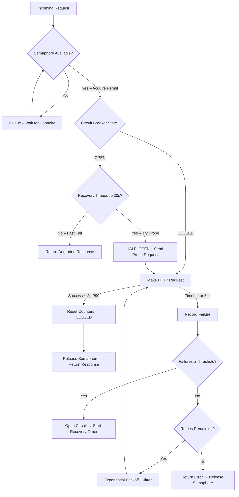

| Difficulty | Channel | Tags |
|---|---|---|
| advanced | backend | asyncio, aiohttp, concurrency |

It was Valentine's Day. Engagement rings, flower deliveries, dinner reservations — millions of dollars flowing through a payment processing company's systems. Then Stripe started returning P99 latencies over 8 seconds and intermittent 503s. The company's circuit breaker was configured to trip on failure count alone — not latency. Every request held a connection for 8–15 seconds before timing out. The result: $340,000 in lost revenue in just 47 minutes [1]. The culprit? A connection pool manager that couldn't gracefully degrade under pressure.

---

> ### Real-World Case — Payment processing company (anonymized postmortem by Devrim Ozcay, Production Engineering)
>
> During a Valentine's Day shopping peak, Stripe's API began returning P99 latency > 8s and intermittent 503s. The company's payment service had a 50-connection pool, but the circuit breaker was configured to trip only on failure count (10 failures over 30s), not latency. Requests hung for 8-15s each, holding connections the entire time.
>
> | | |
> |---|---|
> | **Challenge** | Connection pool exhaustion caused by misconfigured circuit breaker that didn't account for latency-based failures. Each slow request held a connection for 8-15s waiting on Stripe, the 50-connection pool drained in ~7 minutes, and the circuit breaker never tripped because requests were slow, not failing. A recent deploy increasing the Stripe timeout from 5s to 15s made it worse by extending connection hold times. |
> | **Solution** | Reduced circuit breaker threshold from 10 failures/30s to 5 failures/10s, added latency-based circuit breaking (not just failure count), implemented per-endpoint connection pool limits so one upstream can't exhaust the entire pool, added Stripe status webhook for proactive alerting (5-10 min head start), and mandated circuit breaker impact analysis for all timeout changes. |
> | **Outcome** | $340,000 in lost revenue during 47 minutes of downtime, ~3,400 failed transactions, 847 support tickets, and 12,000 users unable to complete purchases. After fixes, the system gracefully degraded with 'payment temporarily unavailable' messages instead of total outage during subsequent Stripe incidents. |
> | **Lesson** | Circuit breakers need latency thresholds, not just failure counts. A request that hangs for 15 seconds is just as damaging to your connection pool as one that fails immediately. Timeout increases have multiplicative effects — doubling a timeout multiplies risk by pool_size / new_timeout. Test circuit breakers under realistic failure modes, not just that they exist. |

---

## Hook — The Valentine's Day Meltdown

Picture this: you are the on-call engineer for a payment processor on Valentine's Day. Traffic is spiking — this is the Super Bowl of consumer spending. Suddenly, your monitoring dashboard lights up like a Christmas tree. P99 latencies to Stripe's API are breaching 8 seconds. 503s are trickling in. Your 50-connection pool is completely saturated — every thread is hanging on a slow response, and new requests are piling up in the queue like cars on a highway after a multi-car pileup. You have 47 minutes before your CFO starts asking hard questions. This is not a hypothetical scenario. This is exactly what happened to one company, documented in an anonymized postmortem [1]. And the root cause? A circuit breaker that was watching for failures when it should have been watching for slowness.

## Problem — Why Default Connection Pools Break Under Pressure

Here is the uncomfortable truth most developers discover the hard way: connection pools are designed for the happy path. You configure a max of 50 or 100 connections, wrap things in a semaphore, and call it a day. It works beautifully — until something downstream goes wrong. When your upstream dependency (Stripe, a database, a microservice) starts responding slowly, every connection in your pool goes from "active" to "zombie" in seconds. Each hangs on a request for 8–15 seconds, waiting for a timeout that never seems to come fast enough. Your pool saturates. New requests queue behind the zombies. Latency cascades through your entire system. This is the thundering herd problem meets the convoy effect [2], and it brings down production systems every single day. The core challenge is not just limiting connections — it is detecting *when* your pool needs to change its behavior, and doing so *before* the damage spreads.

## Real-World Case — Payment Processing Company

The anonymized postmortem by Devrim Ozcay paints a painful picture. During a Valentine's Day shopping peak, Stripe's API began exhibiting P99 latency exceeding 8 seconds with intermittent 503s. The payment company's payment service had a 50-connection pool with a circuit breaker configured to trip on one signal only: failure count (10 failures over 30 seconds). The circuit breaker completely missed the slow degradation because the requests were not *failing* — they were just *slow*. Every request held a connection for 8–15 seconds. At 50 connections, that meant the pool could handle roughly 3–6 requests per second before saturating. When traffic exceeded that threshold, requests piled up, timeouts cascaded, and the entire payment flow collapsed. The impact was staggering: $340,000 in lost revenue, ~3,400 failed transactions, 847 support tickets, and 12,000 users unable to complete purchases — all in 47 minutes [1]. After the incident, the engineering team rewired the circuit breaker to monitor P99 latency in addition to failure count. During subsequent Stripe incidents, the system gracefully degraded by returning 'payment temporarily unavailable' messages instead of going completely dark.

## Deep Dive — The Four Pillars of Graceful Degradation

Building on the lessons from that Valentine's Day, let's break down the four mechanisms that separate production-grade connection pools from hobby projects.

**1. Semaphore-Based Limiting**
At its core, a semaphore is a counter that controls access to a shared resource. Python's `asyncio.Semaphore` is perfect for this — it is lightweight, native to the event loop, and integrates cleanly with `async with` [3]. The trick is picking the right limit. Too low and you underutilize capacity; too high and you invite resource exhaustion. Start with the number of CPU cores × 2, then tune based on observed P99 latency. A good rule of thumb: if adding more connections stops improving throughput, you have found your ceiling.

**2. Exponential Backoff with Jitter**
When a request fails, the worst thing you can do is retry immediately. That is how you turn a transient blip into a self-inflicted DDoS. Exponential backoff doubles the wait time between retries (1s, 2s, 4s, 8s...), giving the downstream service breathing room [4]. Adding *jitter* — a random offset to each delay — prevents the thundering herd problem where all clients retry simultaneously. Without jitter, exponential backoff alone can still cause synchronized waves of traffic.

**3. Circuit Breaker — Beyond Binary State**
The classic circuit breaker has three states: CLOSED (normal), OPEN (failing, rejecting requests), and HALF_OPEN (testing the waters) [5]. The Valentine's Day victim used a simple two-state breaker that only watched failure count. The fix was to add latency monitoring and a HALF_OPEN state that probes the downstream service with a trickle of traffic before fully re-opening. This is the difference between a breaker that *reacts* (after damage is done) and one that *anticipates* (before the pool saturates).

**4. Health Checks and Connection Pruning**
Even with perfect retry logic, connection pools accumulate cruft. Dead connections, stale SSL sessions, DNS changes — these all degrade performance silently [6]. A health checker that periodically verifies connection viability and prunes dead entries is not optional. It is the oil change your pool needs every few thousand requests. Many production systems run a background coroutine every 30 seconds that checks a health endpoint or validates existing connections.

## Workflow — Request Lifecycle in a Graceful Pool

A well-designed connection pool processes requests through a decision pipeline. Here is how each request flows through the system:

Each request acquires a semaphore permit first — this is your admission control. Then the circuit breaker checks its state. In CLOSED state, requests flow through normally. In OPEN state, the breaker checks whether enough recovery time has passed; if not, it fast-fails with a degraded response (no connection wasted). After a successful probe in HALF_OPEN, the breaker transitions back to CLOSED. Failures trigger exponential backoff retries with jitter. The entire lifecycle is designed to minimize the number of connections held by doomed requests.

## Code Example — Building a Production-Grade Connection Pool Manager

The core implementation combines all four pillars into a cohesive class. Let's walk through the real thing.

## Lessons Learned — What to Do Differently Tomorrow

The Valentine's Day incident was preventable. Here is what the postmortem teaches us about designing resilient systems:

**1. Monitor Latency, Not Just Failures**
A request that takes 15 seconds and eventually succeeds is *worse* than a quick 503. Slow requests hold connections hostage, saturate your pool, and cause cascading failures. Your circuit breaker should watch P50, P95, and P99 latency metrics — not just failure counts [1].

**2. A Graceful Degradation Is a Win, Not a Failure**
After the fix, the company served 'payment temporarily unavailable' during Stripe incidents instead of going totally dark. Users could still browse, add to cart, and save for later. Non-payment flows continued working. This is the difference between a complete outage and a minor inconvenience.

**3. Test Under Real Load Patterns**
Most teams test with steady-state traffic. Real systems experience sudden spikes, slow degradations, and partial outages. Use chaos engineering tools to simulate latency injection and partial failures in staging environments [7]. If you only test the happy path, you are not testing at all.

**4. Size Your Pool Correctly**
The right pool size is not a fixed number — it is a function of your downstream's P99 latency and your required throughput. The formula is straightforward: `pool_size = target_rps × p99_latency_seconds`. If you need 200 RPS and your downstream's P99 is 500ms, you need at least 100 connections. Any less and you will queue under load [8].

**5. Always Close What You Open**
Connection leaks are the silent killer of async applications. Every `aiohttp.ClientSession` that is not properly closed in a shutdown hook is a resource leak waiting to happen. Use context managers, register cleanup handlers, and validate with connection counting in your monitoring.

---

## Connection Pool Request Lifecycle with Circuit Breaker States

<strong>Original Interview Question</strong>

**Q:** How would you implement a connection pool manager for aiohttp that handles graceful degradation under high load and connection timeouts?

**A:** Implement a connection pool manager for aiohttp using a semaphore to limit concurrent connections, exponential backoff for retrying failed requests, and circuit breaker pattern to gracefully degrade under high load and connection timeouts.

## Conclusion

The difference between a $340,000 outage and a minor blip comes down to one thing: how your system behaves when things go wrong, not when things go right. A connection pool manager with a latency-aware circuit breaker, exponential backoff with jitter, and proper admission control can absorb downstream failures without cascading into total system collapse. Start by reviewing your circuit breaker configuration today — is it watching failure count alone, or does it know when your requests are just *too slow*? That single change could save your next Valentine's Day.

---

## References

1. [Payment processing company (anonymized postmortem by Devrim Ozcay, Production Engineering) incident report](https://blog.stackademic.com/we-lost-340k-in-47-minutes-because-our-circuit-breaker-was-too-slow-75e1e97a3242) — article
2. [Thundering herd problem](https://en.wikipedia.org/wiki/Thundering_herd_problem) — article
3. [asyncio synchronization primitives — Python documentation](https://docs.python.org/3/library/asyncio-sync.html) — documentation
4. [Exponential backoff and jitter — AWS Architecture Blog](https://aws.amazon.com/blogs/architecture/exponential-backoff-and-jitter/) — blog
5. [Circuit breaker pattern — Martin Fowler](https://martinfowler.com/bliki/CircuitBreaker.html) — blog
6. [Connection management in HTTP/1.x — MDN Web Docs](https://developer.mozilla.org/en-US/docs/Web/HTTP/Connection_management_in_HTTP_1.x) — documentation
7. [Chaos engineering principles — Principles of Chaos Engineering](https://principlesofchaos.org/) — article
8. [Little's law — queueing theory fundamentals](https://en.wikipedia.org/wiki/Little%27s_law) — article

---

**Author:** Satishkumar Dhule — [GitHub](https://github.com/satishkumar-dhule) · [LinkedIn](https://linkedin.com/in/satishkumar-dhule) · [Website](https://satishkumar-dhule.github.io)
