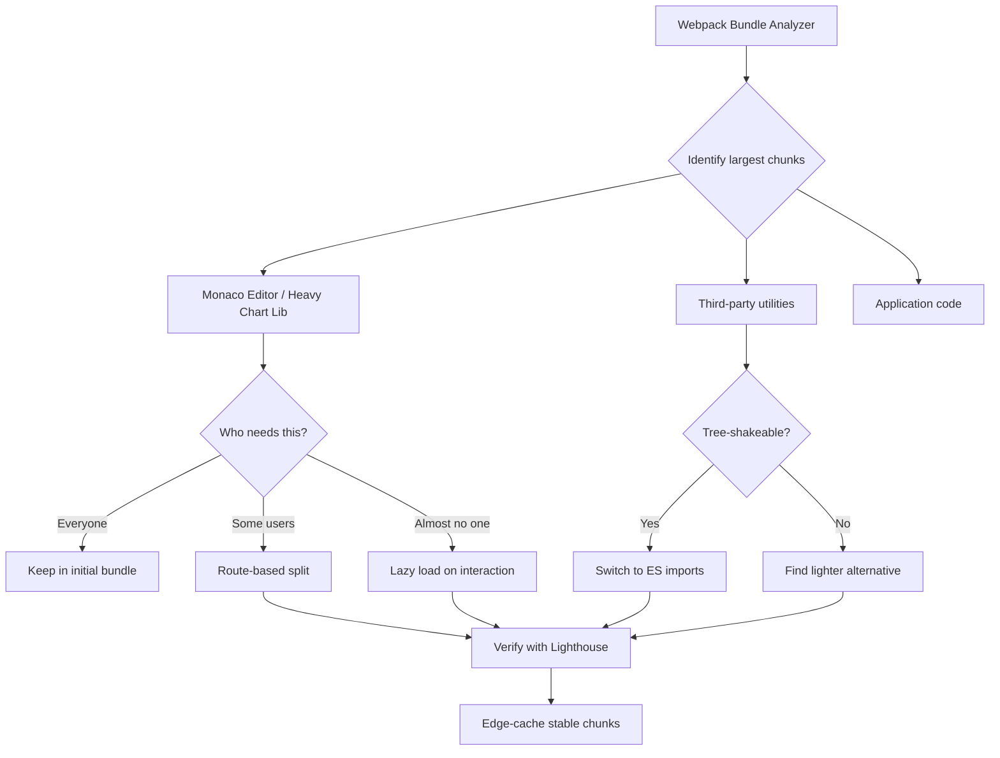

| Difficulty | Channel | Tags |
|---|---|---|
| intermediate | frontend | lighthouse, bundle, lazy-loading |

Imagine shipping 2.1MB of JavaScript to every visitor when 90% of them only needed 100KB. That was the reality for Fastly's Fiddle app — a React-based code playground where the Monaco Editor (the engine behind VS Code) consumed 80% of the entire JavaScript bundle [1]. Most visitors just wanted to view read-only code snippets on Fastly's developer hub. They didn't need a full IDE. But their browser was downloading one anyway. This is a story about bundle bloat, code splitting, and the uncomfortable gap between what you ship and what users actually need.

---

> ### Real-World Case — Fastly
>
> Fastly's Fiddle app (a React-based code playground) embedded Monaco Editor (the IDE that powers VS Code) to display code. Monaco was a 2.1MB dependency consuming 80% of the entire JS bundle — yet most visitors only viewed read-only embedded fiddles on their developer hub, never actually editing code.
>
> | | |
> |---|---|
> | **Challenge** | Every page load shipped 2.1MB of Monaco Editor code even when the code was non-editable. This caused slow initial load times and poor performance for casual users who were just viewing embedded code examples, not writing VCL. |
> | **Solution** | Used React.lazy() and Suspense to code-split Monaco behind a dynamic import so it only loads when editing is needed. For read-only embedded fiddles, swapped Monaco for PrismJS (15KB) — providing syntax highlighting and line numbers without the 2MB IDE. The rendering logic conditionally selects the component based on whether the fiddle is embedded or interactive. |
> | **Outcome** | Initial JS dropped from comfortably over 1MB to just over 100KB for read-only use cases. The 701KB Monaco chunk loads on-demand only for interactive editing and is edge-cached via Fastly's CDN (97ms download for 700KB). Subsequent deploys preserve cached chunks via stable webpack fingerprints. |
> | **Lesson** | The biggest performance win is not just splitting code — it's recognizing when you can skip loading an entire dependency by using a lighter alternative for the dominant user pattern. Understanding your user behavior (most are read-only) enables more impactful optimizations than code-splitting alone. |

---

## Hook — The 2.1MB Elephant in the Room

You have just inherited a React app with a Lighthouse performance score of 65. The bundle weighs 2.1MB. Time to Interactive is 4.2 seconds — an eternity in web performance terms. Your CTO has mandated a score of 90+. Sound familiar? Every team that scales a React app eventually hits this wall. The app started lean. Then came charts, editors, rich text inputs, drag-and-drop libraries, and before you knew it, your bundle was the size of a small operating system. The fix is not about writing less code — it is about delivering the right code, at the right time, to the right user.

## Problem — The Performance Tax Nobody Asks For

A Lighthouse score of 65 is not just a vanity metric. Research shows that a 1-second delay in page load time can reduce conversions by 7% [2]. If your site makes $1M per month, that is $70K in lost revenue every month. For every second you shave off load time, user satisfaction climbs. But here is the thing — bundle size impacts more than just the initial load. It affects CPU time for parsing, memory consumption on low-end devices, and time-to-interactive for users on 3G networks. Many developers think performance optimization is about minification and gzip compression. Those help, but the real leverage is in what you choose not to load at all. This is where the concept of code splitting enters the conversation.

## Real-World Case — Fastly's Fiddle App

Fastly's developer hub hosted an embedded code playground called Fiddle. Think of it like CodePen or JSFiddle, but tightly integrated with their CDN documentation. The app used Monaco Editor — the same editor that powers VS Code — to display code examples with syntax highlighting. There was one problem: Monaco Editor ships at approximately 2.1MB of JavaScript [1]. For users who only viewed read-only embedded fiddles on documentation pages, every single byte of that 2.1MB was wasted. Fastly's engineering team analyzed their traffic and realized a critical insight: the vast majority of visitors never edited code. They just read it. This revelation drove an aggressive code-splitting strategy. Monaco was extracted into a separate chunk that would only load when a user clicked "Edit" — transforming a code playground into an interactive editor on demand. The result? Initial JavaScript dropped from comfortably over 1MB to just over 100KB for read-only use cases. The 701KB Monaco chunk loads on-demand only for interactive editing and is edge-cached via Fastly's CDN — delivering a 700KB download in just 97ms. Subsequent deploys preserve cached chunks via stable webpack fingerprints, so users rarely re-download unchanged chunks [1]. This single architectural decision moved their Lighthouse performance from concerning to stellar — without changing a single feature.

## Deep Dive — The Anatomy of a Bundle

To understand how Fastly achieved this, you need to understand what happens when webpack bundles your application. When you import a module at the top of a file, webpack includes that module in the initial bundle by default. This seems reasonable until you consider the cascade: import a charting library for one dashboard, and suddenly every user on every page downloads 500KB of charting logic they may never see. There are three primary strategies for reducing bundle size [3]. First, static analysis and tree shaking — if you import `{ debounce }` from lodash instead of the entire `lodash` library, bundlers can eliminate unused exports. This works with ES module syntax (`import`/`export`) but not with CommonJS (`require()`). Many developers discover this the hard way when they switch from `require` to `import` and shave 200KB off their bundle without changing any business logic. Second, route-based code splitting. Instead of one monolithic bundle, each route gets its own chunk. When a user visits `/dashboard`, only the dashboard chunk loads. If they never visit `/analytics`, that 800KB charting library never downloads. This is the most impactful optimization because it aligns bundle delivery with actual user behavior [4]. Third, component-based lazy loading. Even within a single route, you can defer heavy components — image carousels, rich text editors, data grids — until they scroll into view or the user interacts with them. This is what Fastly did with Monaco Editor: the component existed in the DOM, but the 700KB JavaScript chunk only loaded when someone clicked "Edit." The trade-off? A brief loading state. But a 300ms spinner is infinitely better than a 2-second penalty on every single page visit.

## Workflow — The Bundle Optimization Blueprint

Here is a repeatable workflow that teams can follow, visualized below as a decision flow from measurement through delivery. The first step is always measurement — running webpack-bundle-analyzer to understand what occupies the most space [5]. This tool generates a treemap visualization of your bundle where each rectangle represents a module, sized by its byte contribution. Without this map, you are optimizing blind. The workflow progresses through identifying the largest chunks, deciding who needs each dependency (everyone, some users, or almost no one), applying the right splitting strategy, and verifying performance improvements through Lighthouse and WebPageTest. The final step — caching at the CDN edge — is what made Fastly's solution so elegant. A 700KB chunk served from the edge in 97ms is barely perceptible, even when it does need to load.

## Code Example — Lazy Loading in Practice

The implementation mechanisms are surprisingly elegant. React provides `React.lazy()` and `Suspense` as first-class primitives for code splitting. Route-based splitting is the most common pattern: defining routes that each load independently. For critical features that users frequently navigate between, route-based splitting can backfire — the overhead of downloading a new chunk on every navigation may outweigh the initial load benefit. In those cases, preloading adjacent routes using `` or webpack's magic comments (`/* webpackPrefetch: true */`) is a better approach.

## Lessons Learned — Ship Less, Deliver More

Fastly's story teaches something deeper than a code-splitting technique. It reveals a mindset shift that separates good frontend engineers from great ones. Great engineers do not ask "how do I make this faster?" They ask "does this user need this code right now?" The uncomfortable truth about bundle optimization is that the biggest wins come from deleting things — not optimizing them. Remove unused dependencies. Audit npm packages for accidental bloat (that one time someone imported `moment-timezone` when they only needed `date-fns`). Question every third-party library. Consider building a tiny version of a feature instead of importing a 200KB library. After debugging React performance issues across many projects, here is what works: start with the bundle analyzer — always. You cannot fix what you cannot see. Split by routes first — it provides the highest impact with the lowest complexity. Then split by components within high-traffic pages. Preload aggressively for features users will likely need next. And finally, own your heavy dependencies. If the charting library is 500KB and you only use three chart types, consider building a lightweight custom chart. It is more work upfront, but your users download the result every single visit.

---

## Bundle Optimization Decision Flow

<strong>Original Interview Question</strong>

**Q:** You're tasked with improving a React app's Lighthouse performance score from 65 to 90+. The bundle size is 2.1MB and Time to Interactive is 4.2s. What specific steps would you take to optimize the bundle and implement lazy loading?

**A:** Implement code splitting with React.lazy() and Suspense, analyze bundle composition with webpack-bundle-analyzer to identify largest chunks, remove unused dependencies and optimize imports, add dynamic imports for heavy components and third-party libraries, implement route-based splitting for better initial load times, and utilize tree shaking with proper ES module configuration.

## Conclusion

The next time you look at a Lighthouse score of 65, do not reach for a minification plugin. Reach for your bundle analyzer. Ask yourself: what is every user downloading that only some users need? Ship less. Deliver more. Your users will never notice the features you deferred — they will only notice how fast your app feels. That is the performance win that actually matters.

---

## References

1. [Fastly: Code splitting and minimal edge latency — the perfect match](https://www.fastly.com/blog/code-splitting-and-minimal-edge-latency-the-perfect-match) — blog
2. [Google Web Fundamentals: Performance and User Experience](https://developer.mozilla.org/en-US/docs/Web/Performance) — documentation
3. [Webpack: Code Splitting](https://webpack.js.org/guides/code-splitting/) — documentation
4. [React: Code-Splitting with React.lazy](https://react.dev/reference/react/lazy) — documentation
5. [webpack-bundle-analyzer](https://github.com/webpack-contrib/webpack-bundle-analyzer) — documentation
6. [MDN: Dynamic import()](https://developer.mozilla.org/en-US/docs/Web/JavaScript/Reference/Operators/import) — documentation
7. [Google Chrome: Lighthouse Performance Scoring](https://developer.chrome.com/docs/lighthouse/performance/) — documentation
8. [MDN: Service Worker API](https://developer.mozilla.org/en-US/docs/Web/API/Service_Worker_API) — documentation
9. [MDN: Tree Shaking](https://developer.mozilla.org/en-US/docs/Glossary/Tree_shaking) — documentation

---

**Author:** Satishkumar Dhule — [GitHub](https://github.com/satishkumar-dhule) · [LinkedIn](https://linkedin.com/in/satishkumar-dhule) · [Website](https://satishkumar-dhule.github.io)
