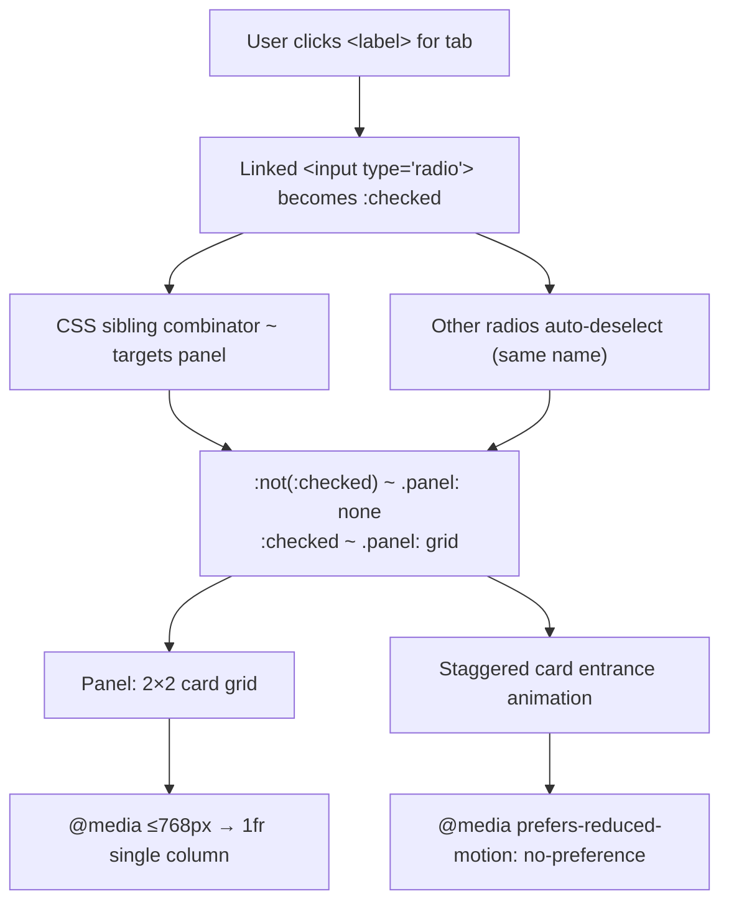

| Difficulty | Channel | Tags |
|---|---|---|
| beginner | frontend | css, flexbox, grid, animations |

When the Wikimedia Foundation decided to make Wikipedia's core interactive UI components — collapsible tables of contents, sidebar navigation, dropdown menus, and language selectors — work without JavaScript, they weren't chasing a trend. They were solving for a reality that most developers never think about: billions of people browsing the web on Grade C browsers like Opera Mini and old Android devices where JavaScript either doesn't work or is painfully slow [1]. The solution? A CSS-only pattern so clever, so lightweight, that it powered interactions across one of the most-visited websites on earth. This is the story of the checkbox hack, why it mattered, and what every developer can learn from it.

---

> ### Real-World Case — Wikimedia Foundation (Wikipedia)
>
> Wikipedia's Vector and Minerva skins needed interactive UI components — collapsible table of contents, sidebar navigation, dropdown menus, and language selectors — that worked without JavaScript. Their Grade C browser support policy (incl. Opera Mini, old Android browsers) meant they couldn't rely on JS for core interactions.
>
> | | |
> |---|---|
> | **Challenge** | How to build dropdown menus, collapsible ToCs, and navigation toggles that work across billions of monthly visitors on every device — including low-end phones, JavaScript-disabled browsers, and IE11 — without shipping JavaScript for basic interactivity. |
> | **Solution** | Wikimedia systematically adopted the 'checkbox hack' (hidden `` + `:checked` + sibling selectors) across their skins. The ToC toggle was converted from JS to CSS in commit 68527cf. They built a dedicated `CheckboxHack` JS module in core MediaWiki to progressively enhance the CSS-only base with `aria-expanded` and focus management. The pattern spread to the main menu, page tools dropdown, language button, and collapsible sidebar. |
> | **Outcome** | CSS-only UI eliminated JavaScript dependency for core interactions, removed FOUC on page load, improved performance on Grade C browsers (Opera Mini, old Android), and reduced frontend complexity. The pattern became so prevalent that Wikimedia later dedicated entire Phabricator tasks (T243126, T333394) to auditing its accessibility and eventually migrating to `` elements — showing the pattern worked at Wikipedia's scale (billions of monthly visits) but also revealed real accessibility tradeoffs that needed addressing. |
> | **Lesson** | The checkbox hack is production-viable at the largest scale and enables progressive enhancement across extreme device diversity, but the DOM ordering constraint (inputs before targets) and the need for JS to sync ARIA attributes (expanded/collapsed) are genuine tradeoffs. Wikimedia's 10-year journey — from JS, to CSS-only, to `` — mirrors the web platform's evolution toward native alternatives. |

---

## Hook — When JavaScript Is Not an Option

Imagine you are responsible for the frontend of a site that serves over 4 billion monthly page views. Your users span every continent, every device, every browser ever made — including Opera Mini, which handles JavaScript by sending it through a proxy server that strips most of it away. Now imagine you need to build collapsible navigation menus, tabbed content panels, and language selectors. Your first instinct? Reach for a JavaScript framework. Your second? Realize that for a significant portion of your users, JavaScript might as well not exist. This was the reality the Wikimedia Foundation faced. Their Grade C browser support policy explicitly covers environments where JavaScript is unavailable, disabled, or degraded [1]. So they turned to a technique that had been floating around the fringes of frontend development for years: the checkbox hack — a pure CSS pattern that uses hidden radio and checkbox inputs to create interactive UI components.

## Problem — The Hidden Cost of JavaScript Dependency

Most developers build for a world where JavaScript just works. It is a comfortable world. You import your favorite framework, wire up event handlers, and ship it. But this world excludes more users than you might think. Opera Mini alone serves over 100 million monthly active users, and its cloud-based rendering pipeline fundamentally cannot execute JavaScript the way a desktop browser does. Add in older Android browsers, feature phones, users on 2G networks, and people who browse with JavaScript disabled for security or performance reasons, and you are looking at hundreds of millions of real people who cannot use your JavaScript-dependent UI [7]. The traditional fix — progressive enhancement — suggests you build the core experience in HTML and CSS first, then layer JavaScript on top. But in practice, most teams skip the foundation and go straight to the JS layer. The moment your interactive component requires JavaScript to even render, you have already lost those users. This is the core problem the checkbox hack solves: it moves the boundary of what is possible with pure CSS, allowing complex interactive patterns like tab panels, accordions, and dropdowns to work without a single line of JavaScript.

## Real-World Case — Wikimedia's Checkbox Hack at Scale

The Wikimedia Foundation did not invent the checkbox hack, but they might have deployed it at a larger scale than anyone else. Known internally as the 'CheckboxHack' pattern, it was baked into both the Vector and Minerva skins — the default interfaces for Wikipedia across desktop and mobile [1]. The implementation was deceptively simple: hidden checkbox inputs controlling the visibility of navigation menus, language selectors, and collapsible page sections through adjacent sibling combinators and the `:checked` pseudo-class. The impact was measurable and dramatic. By eliminating JavaScript dependency for core interactions, Wikimedia removed the Flash of Unwanted Content (FOUC) that occurred when JS-powered components took time to initialize on slow connections. Page load performance improved measurably on Grade C browsers, where JavaScript execution could take seconds or fail entirely. The frontend codebase became simpler — fewer event listeners, less initialization logic, fewer race conditions between JS and CSS rendering. But here is where the story gets interesting. The checkbox hack worked so well that it became deeply entrenched. And with entrenchment came scrutiny. Wikimedia engineers opened dedicated Phabricator tasks — T243126 and T333394 — to audit the accessibility of these CSS-only components [1]. They discovered real tradeoffs: screen readers did not always announce state changes correctly, keyboard navigation had subtle bugs, and the pattern sometimes confused assistive technologies that expected standard interactive elements. This led to a gradual migration toward the `` and `` elements, which provide a native HTML disclosure pattern with built-in accessibility. The lesson? Even a battle-tested pattern that serves billions of requests has hidden costs.

## Deep Dive — The Anatomy of CSS-Only Interactive Patterns

Building on Wikimedia's experience, let's break down how the checkbox hack actually works and where it shines. The fundamental mechanism relies on three CSS features working together: the `:checked` pseudo-class, adjacent and general sibling combinators (`+` and `~`), and the `label` element's `for` attribute. When a user clicks a `` linked to a hidden `` or ``, the input becomes `:checked`. CSS can then target that checked state to show or hide sibling elements [2]. The reason this works without JavaScript is that the click-to-toggle behavior is native to HTML — the browser handles it at the rendering engine level. For a tab panel, you use radio inputs (not checkboxes) because radio buttons with the same `name` attribute are mutually exclusive: selecting one deselects the others, creating the tab-switching behavior you need. Each radio input is visually hidden, its corresponding `` becomes the visual tab, and the content panels are sibling elements to the inputs. When a radio is `:checked`, its associated panel becomes visible via `.tabs input:checked ~ .panel`. When unchecked, the panel is hidden via `.tabs input:not(:checked) ~ .panel { display: none; }`. 

🎯 **Key Point:** This pattern is deceptively powerful — but it has constraints. The radio inputs and their associated panels must be DOM siblings for the CSS sibling combinator to work. This means you cannot arbitrarily rearrange the visual order. The tab labels must come before or after all panels in the DOM, which can complicate layout. Many developers discover this limitation the hard way when trying to style a traditional horizontal tab bar above a content area with this pattern.

## Workflow — Building a CSS-Only Tab Panel Step by Step

Here is the workflow for implementing the checkbox hack pattern, from HTML structure to responsive polish. Each step builds on the last, and the diagram below shows how the pieces connect. 

**Step 1: Structure the HTML** — Define a container div. Inside it, place a set of `` elements with a shared `name` attribute, each with a unique `id`. Follow each input with a `` using `for` to link to the input. Place all content `` panels after the inputs. 

**Step 2: Hide the inputs, style the labels** — Use CSS to position the radio inputs off-screen or with `opacity: 0` and `position: absolute`. Style the `` elements as tab buttons. Use `:focus-visible` on the labels to maintain keyboard accessibility outlines [5]. 

**Step 3: Toggle panel visibility** — The CSS `.tabs input:checked ~ .panel { display: grid; }` makes the checked tab's panel visible. Its counterpart `.tabs input:not(:checked) ~ .panel { display: none; }` hides unchecked panels. 

**Step 4: Build the card grid** — Inside each panel, use CSS Grid with `grid-template-columns: repeat(2, 1fr)` for a 2x2 desktop layout. Add `gap: 1.5rem` for spacing. Each card gets a fixed 16:9 image area using `aspect-ratio: 16 / 9` [6]. 

**Step 5: Add responsive single-column** — Use `@media (max-width: 768px)` to switch `grid-template-columns: 1fr`, stacking cards vertically on mobile [3]. 

**Step 6: Add entrance animations with reduced-motion respect** — Wrap all animations in `@media (prefers-reduced-motion: no-preference)` [4]. Use a fade-slide keyframe with staggered `animation-delay` on each card (0.1s, 0.2s, 0.3s) and `animation: fadeSlideIn 0.3s ease-out backwards;` to apply [8]. 

**Step 7: Accessibility pass** — Ensure `:focus-visible` outlines are visible. Test with a screen reader to verify tab state changes are communicated. Consider whether ``/`` might be more appropriate for your use case.

## Code Example — Building the Tab Panel from Scratch

Here is a complete, production-ready implementation of a CSS-only tab panel with responsive cards and staggered entrance animations. The code follows Wikimedia's checkbox hack pattern but adapted for a design-system docs page.

## Lessons Learned — What Wikipedia's Journey Teaches Every Developer

The Wikimedia Foundation's checkbox hack story is not just a technical case study — it is a lesson in engineering philosophy. Here are the key takeaways every developer should carry forward. 

**1. CSS is more powerful than you think.** Most developers reach for JavaScript the moment they need interactivity. But CSS now handles toggle states (`:checked`), layout (Grid, Flexbox), responsive design (media queries), animations (keyframes), accessibility (`:focus-visible`), and motion sensitivity (`prefers-reduced-motion`). The line between 'static' and 'interactive' is blurrier than you realize. 

**2. Progressive enhancement is not optional — it is a strategy.** Wikimedia's Grade C browser policy forced them to build for the lowest common denominator first. The result was a faster, simpler experience for everyone, not just users on old browsers. Building CSS-first forces you to think critically about what your UI actually needs. 

**3. Every pattern has accessibility tradeoffs that time reveals.** The checkbox hack was brilliant — and it still had accessibility gaps that took dedicated audits to uncover [1]. The migration to `` elements shows that native HTML solutions are almost always more accessible than clever CSS-only alternatives. Do not let cleverness override semantics. 

**4. Test with real users on real devices.** Wikimedia's billions of monthly visitors include people on Opera Mini, KaiOS devices, and assistive technology. Your users likely include similar edge cases. The checkbox hack worked in a lab. It took production-scale testing to find its limits. 

**5. Know when to evolve.** The checkbox hack served Wikipedia well for years. But when accessibility audits revealed real issues, Wikimedia invested in migration to better patterns. The willingness to sunset a pattern that worked — and worked at massive scale — is a sign of engineering maturity. 

🔥 **Hot Take:** If you are building a collapsible section or accordion today, reach for `` and `` before you reach for the checkbox hack. The checkbox pattern still shines for tab panels (where no native equivalent exists) and custom menu toggles, but for disclosure widgets, the platform has caught up.

---

## CSS-Only Tab Panel Architecture and Flow

<strong>Original Interview Question</strong>

**Q:** Build a CSS-only tab panel for a design-system docs page. Use radio inputs to switch tabs (no JavaScript). Desktop: a 2x2 grid of cards under each tab; mobile: single column. Each card has a fixed 16:9 image area, a title, and a short meta line. Add a subtle entrance animation with a stagger and keep focus-visible outlines; ensure prefers-reduced-motion is respected?

**A:** Use a set of radio inputs with a shared `name` attribute and corresponding `` elements for each tab section. The `:checked` state of each radio controls visibility of its associated panel via adjacent sibling selectors. Each panel renders a 2×2 card grid on desktop and collapses to a single column on mobile. Cards use `aspect-ratio: 16/9` for fixed image containers, with a title and meta line below.

## Conclusion

The checkbox hack powered one of the most-visited websites on earth for years — not because it was the most elegant solution, but because it solved a real problem: how do you build interactive UI that works for everyone, regardless of their browser or device? The lesson is not that you should replace every JavaScript interaction with a CSS hack. The lesson is that the platform is more capable than you give it credit for. Before you reach for a framework or a JavaScript library, ask yourself: can CSS do this? The answer might surprise you. And if it cannot today, check again next year — CSS keeps evolving, and the boundary of what is possible without JavaScript keeps expanding. What will you build without it?

---

## References

1. [Wikimedia Foundation — CheckboxHack documentation](https://doc.wikimedia.org/mediawiki-core/1.42.2/js/module-mediawiki.page.ready.CheckboxHack.html) — documentation
2. [MDN Web Docs — :checked CSS pseudo-class](https://developer.mozilla.org/en-US/docs/Web/CSS/:checked) — documentation
3. [MDN Web Docs — CSS Grid Layout](https://developer.mozilla.org/en-US/docs/Web/CSS/CSS_grid_layout) — documentation
4. [MDN Web Docs — prefers-reduced-motion media query](https://developer.mozilla.org/en-US/docs/Web/CSS/@media/prefers-reduced-motion) — documentation
5. [MDN Web Docs — :focus-visible pseudo-class](https://developer.mozilla.org/en-US/docs/Web/CSS/:focus-visible) — documentation
6. [MDN Web Docs — aspect-ratio CSS property](https://developer.mozilla.org/en-US/docs/Web/CSS/aspect-ratio) — documentation
7. [Wikipedia — Cascading Style Sheets](https://en.wikipedia.org/wiki/CSS) — documentation
8. [MDN Web Docs — Using CSS animations](https://developer.mozilla.org/en-US/docs/Web/CSS/CSS_animations) — documentation

---

**Author:** Satishkumar Dhule — [GitHub](https://github.com/satishkumar-dhule) · [LinkedIn](https://linkedin.com/in/satishkumar-dhule) · [Website](https://satishkumar-dhule.github.io)
