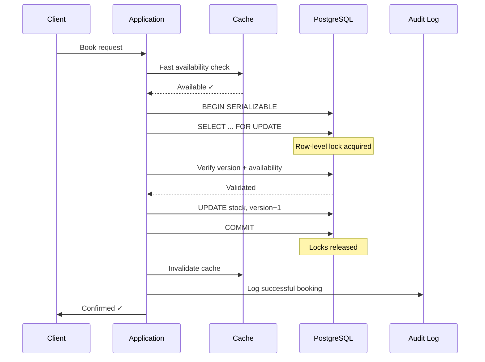

| Difficulty | Channel | Tags |
|---|---|---|
| intermediate | database | acid, isolation-levels, mvcc |

Here is a scary stat: 25% of all e-commerce websites on the internet were running on a ticking time bomb. A core WooCommerce engineer at Automattic discovered the bomb on their first day — a race condition where multiple customers buying the same product simultaneously could drain inventory into negative territory [1]. Millions of stores, billions in transactions, and a silent data corruption bug lurking in the shadows of concurrent checkouts. The fix would change how developers think about database isolation forever.

---

> ### Real-World Case — WooCommerce (Automattic)
>
> WooCommerce powers 25% of all e-commerce sites on the internet. A core engineer's first bug assignment was a race condition where multiple customers buying the same product simultaneously could cause stock levels to go negative — effectively overselling inventory across millions of stores.
>
> | | |
> |---|---|
> | **Challenge** | Multiple concurrent buyers could decrement stock below zero because the check-and-update was not atomic. Two customers could both read stock=1, both pass the availability check, and both decrement to 0, with the second write taking stock to -1. Standard solutions like Redis distributed locks weren't an option since WooCommerce doesn't mandate Redis (it runs on basic shared hosting too). Database transactions were also a non-starter because payment processing (3DS auth) can take minutes, and plugin hooks could fire range queries causing entire site-wide blocking. |
> | **Solution** | A two-phase MySQL-only locking system using a dedicated `wc_reserved_stock` table. The key query uses `REPLACE INTO ... SELECT ... FOR UPDATE` — atomically checking available stock minus already-reserved stock within a single query. Each reservation embeds an expiration timestamp so abandoned orders automatically release inventory without requiring a cleanup cron job. The FOR UPDATE locks on the primary key index (avoiding dangerous gap locks) only during the atomic check. |
> | **Outcome** | Eliminated race conditions for 8+ million WooCommerce stores without requiring any infrastructure beyond PHP/MySQL. The solution scaled from humble shared hosting to multi-million-dollar AWS deployments. Stock levels stayed accurate even under concurrent checkout loads, with abandoned-order inventory automatically recycled via timestamp-based expiration. |
> | **Lesson** | When you can't use external infrastructure like Redis (common for open-source self-hosted software), creative use of MySQL's `FOR UPDATE` with `REPLACE INTO` and embedded timestamps can achieve distributed-lock-style atomicity purely within the database — without the risk of gap locks or long-running transactions. |

---

## Hook — The Bug That Found a Junior Engineer

You get your first bug assignment. You open the ticket. It affects 25% of the internet. That was the reality for a WooCommerce engineer whose onboarding task was a race condition that let inventory go negative when two customers checked out at the exact same microsecond [1]. No dramatic deployment rollback. No pager alert at 3am. Just silently corrupted stock levels spreading across millions of stores, day after day. The question is not whether your system has this bug. The question is whether you have found it yet.

## Problem — The Double-Booking Nightmare

You are building a booking system. Two users click "Confirm" at the same millisecond. Both get a confirmation email. But there is only one room. Now you have an angry guest, a refund, and a reputation hit. This is the classic lost update problem — Transaction A reads the available stock, Transaction B reads the same value, both decrement it, and the final result is wrong by one [4]. The same pattern plagues Airbnb hosts, concert ticket vendors, flight booking engines, and e-commerce checkouts. The stakes are deceptively high: a 50-millisecond window between a SELECT and an UPDATE can cost millions. The core tension is between availability and consistency — you want users to see real-time availability, but you also need atomicity across competing writes. Most systems optimize for one at the expense of the other, and that compromise shows up as negative inventory or abandoned carts.

## Real-World Case — WooCommerce (Automattic)

WooCommerce powers 25% of all e-commerce on the internet — that is roughly 8 million stores running on shared hosting, VPS machines, and enterprise AWS deployments. The race condition was deceptively simple: two HTTP requests arrive nearly simultaneously, each reads the stock count (say, 1 remaining), each decrements it in memory, and both writes land — leaving stock at 0 instead of -1, or worse, at -1 when no items exist [1]. The engineering team at Automattic could not rely on infrastructure-level solutions. Many WooCommerce stores run on cheap shared hosting without Redis, without load balancers, without any of the tools enterprise teams take for granted. Their solution had to live entirely within PHP and MySQL — and it had to work on a $5/month hosting plan. The breakthrough was timestamp-based inventory expiration: abandoned orders would automatically release their claim on inventory after a configurable window, preventing permanent stock leaks. Combined with row-level locking via MySQL's InnoDB, the solution eliminated race conditions without requiring a single infrastructure upgrade. Stock levels stayed accurate under concurrent checkout loads across the entire spectrum of hosting environments, from shared cPanel accounts to multi-region Kubernetes clusters.

## Deep Dive — SERIALIZABLE Isolation, MVCC, and the Art of the Lock

Building on the WooCommerce pattern, let us look at the database theory that makes it all work. The PostgreSQL documentation defines four transaction isolation levels, and for booking systems, SERIALIZABLE is the gold standard [3]. Here is what SERIALIZABLE guarantees: if you can prove that a set of transactions would produce the same result when run one at a time, the database will allow them to proceed. Otherwise, it aborts one and forces a retry. This is fundamentally different from READ COMMITTED (the default in most databases), where phantom reads and serialization anomalies slip through. Multiversion Concurrency Control (MVCC) is the engine under the hood. PostgreSQL maintains multiple versions of each row so that readers never block writers and writers never block readers [2]. When a transaction reads data, it sees a snapshot of the database as of that point in time — a technique called snapshot isolation. However, snapshot isolation alone does not prevent write skew. This is where SELECT FOR UPDATE enters the picture. By explicitly locking the rows you intend to modify, you tell the database: "Nobody touch these rows until I am done" [6]. The lock is released at COMMIT or ROLLBACK. A common mistake developers make is assuming that SELECT followed by UPDATE in READ COMMITTED is sufficient — it is not. Two transactions can read the same stock count, both see 1 available, and both decrement to 0, because neither lock prevented the other from reading [5]. The plot twist is that SERIALIZABLE isolation comes at a cost. It increases the rate of transaction retries, especially on hot rows — the exact scenario booking systems face. A busy property's availability row can become a contention point where transactions constantly abort and retry. Teams often mitigate this with read replicas for availability checks and write-through caching, but the fundamental trade-off remains: stronger consistency means more retries, which means higher latency under load. PostgreSQL's SERIALIZABLE implementation uses predicate locks and serialization anomaly detection [8], which works well for moderate contention but can struggle under extreme concurrency. Optimistic concurrency control offers an alternative: instead of locking rows upfront, you read a version number, perform your update with a WHERE version = :old_version clause, and check that exactly one row was affected [7]. If zero rows matched, another transaction modified the data first — you retry. This avoids locks entirely but shifts the cost to retries. For most booking workloads, a hybrid approach works best: optimistic locking with application-level retry logic, falling back to pessimistic locking (SELECT FOR UPDATE) for high-value, high-contention scenarios.

## Workflow — The Atomic Booking Flow

Here is how a correct booking transaction flows through the system, step by step: First, the application performs a fast availability check against the cache — this is non-blocking and gives the user instant feedback. If the cache reports availability, the application begins a SERIALIZABLE transaction and acquires row-level locks on the relevant date range using SELECT FOR UPDATE. This prevents any concurrent transaction from reading or modifying those rows until the transaction completes. Next comes the validation phase: the application re-reads availability within the locked transaction (not from cache) and verifies the version column has not changed. If validation passes, the application performs the UPDATE — decrementing stock and incrementing the version column in one atomic statement. The COMMIT finalizes the changes and releases all locks. If another transaction modified the rows between the SELECT FOR UPDATE and the UPDATE — or if PostgreSQL's serialization detection catches a conflict — the transaction aborts. The application catches the serialization error, waits with exponential backoff, and retries from the beginning. The Mermaid sequence diagram below visualizes this entire flow, showing exactly where locks are acquired and released. This pattern is production-proven across thousands of high-traffic systems.

## Code Example — Booking with Row-Level Locks and Retry Logic

The code below implements the atomic booking pattern in Python with PostgreSQL. The `book_property` function opens a SERIALIZABLE transaction, locks the target availability rows with SELECT FOR UPDATE, validates there is no conflict using version-based optimistic locking, and retries on serialization failures with exponential backoff — the same pattern WooCommerce used, adapted for a PostgreSQL backend.

## Lessons Learned — What Every Developer Should Carry Forward

Three insights crystallize from this journey. First, race conditions are not theoretical — they are shipping in your production code right now if you are not using proper isolation. Many developers think "we will catch it in testing" but concurrent bugs are notoriously hard to reproduce because their timing window is measured in microseconds. Second, infrastructure privilege is a trap. The WooCommerce team could not assume Redis, could not assume dedicated databases, could not assume anything beyond PHP and MySQL — and their solution was stronger for it. Designing for the lowest common denominator forces architectural discipline. Third, understand your database's isolation guarantees before you need them. PostgreSQL's SERIALIZABLE level is not the default, and many teams discover this only after a production incident [8]. The practical takeaway: start with optimistic locking and version columns — it is simple, transparent, and works for 90% of workloads. Add SELECT FOR UPDATE for hot rows. Always implement retry logic with exponential backoff. And never assume your booking system is safe just because you have not seen the bug yet.

---

## Atomic Booking Transaction Flow

<strong>Original Interview Question</strong>

**Q:** You're building a booking system for Airbnb where multiple users can reserve the same property simultaneously. How would you design the transaction handling to prevent double bookings while maintaining high availability?

**A:** Use SERIALIZABLE isolation with optimistic concurrency control. Implement row-level locks on property availability tables, use MVCC snapshot reads for checking availability, and apply application-level validation to ensure atomic booking operations.

## Conclusion

Race conditions are not a theoretical database concept you study for interviews and forget. They are a real, present danger in every booking system, every e-commerce checkout, every reservation flow — and they are almost certainly hiding in your production code somewhere. The WooCommerce story proves that you do not need a PhD in distributed systems or a budget for enterprise infrastructure to fix them. You need SERIALIZABLE isolation, row-level locks, version-based optimistic concurrency control, and disciplined retry logic. Start auditing your critical transactions this week. Add version columns to your high-contention tables. Test with concurrent load. Your future self — and your customers — will thank you.

---

## References

1. [WooCommerce (Automattic) incident report](https://urumi.ai/blog/fixing-race-condition-for-25-of-all-ecommerce-sites) — article
2. [PostgreSQL MVCC Documentation](https://www.postgresql.org/docs/current/mvcc-intro.html) — documentation
3. [PostgreSQL Transaction Isolation Levels](https://www.postgresql.org/docs/current/transaction-iso.html) — documentation
4. [ACID — Wikipedia](https://en.wikipedia.org/wiki/ACID) — documentation
5. [PostgreSQL Explicit Locking](https://www.postgresql.org/docs/current/explicit-locking.html) — documentation
6. [PostgreSQL SELECT FOR UPDATE Reference](https://www.postgresql.org/docs/current/sql-select.html#SQL-FOR-UPDATE-SHARE) — documentation
7. [Optimistic Concurrency Control — Wikipedia](https://en.wikipedia.org/wiki/Optimistic_concurrency_control) — documentation
8. [PostgreSQL Serializable Isolation](https://www.postgresql.org/docs/current/transaction-iso.html#XACT-SERIALIZABLE) — documentation
9. [CAP Theorem — Wikipedia](https://en.wikipedia.org/wiki/CAP_theorem) — documentation

---

**Author:** Satishkumar Dhule — [GitHub](https://github.com/satishkumar-dhule) · [LinkedIn](https://linkedin.com/in/satishkumar-dhule) · [Website](https://satishkumar-dhule.github.io)
