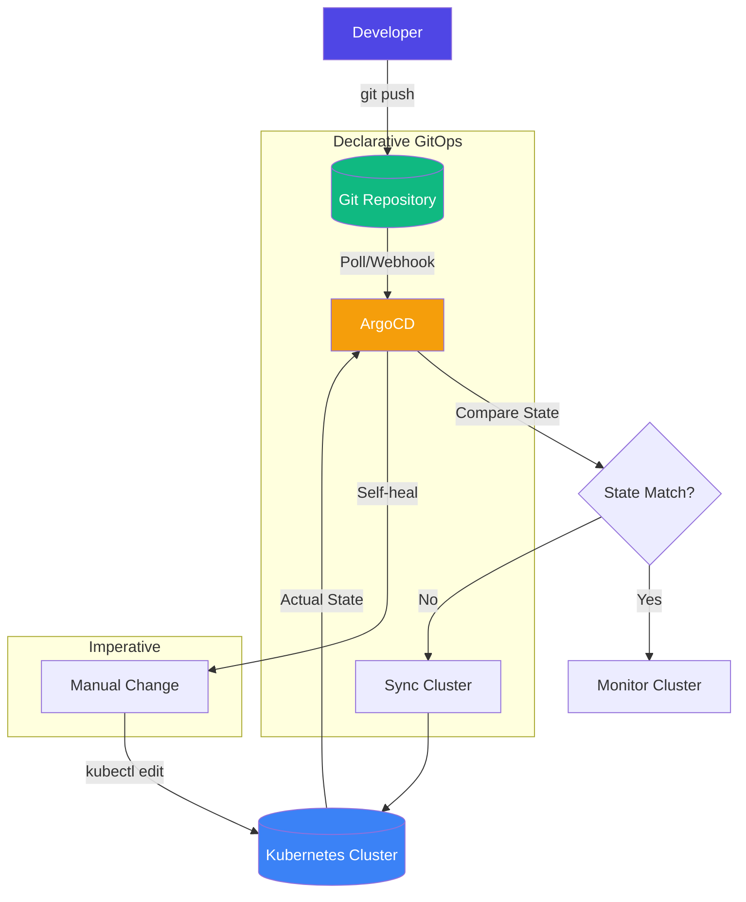

| Difficulty | Channel | Tags |
|---|---|---|
| beginner | devops | argocd, flux, declarative |

Okta's Auth0 team stared at a number that would make any infrastructure engineer's stomach drop: they had 12 Kubernetes clusters and needed to reach over 1,000 [1]. Every single cluster was a snowflake — manually configured, individually maintained, and one wrong kubectl command away from an outage. The imperative approach that worked for a handful of environments was actively blocking their ability to serve hundreds of enterprise customers. Something had to change.

---

> ### Real-World Case — Okta (Auth0)
>
> Okta's Auth0 private cloud platform needed to scale from serving a handful of customers to hundreds, but their infrastructure was built with snowflake configurations and manual updates — basically code running in VMs with an operator manually managing everything.
>
> | | |
> |---|---|
> | **Challenge** | They needed to scale from 12 Kubernetes clusters to over 1,000 while supporting customer-specific Terraform dependencies, deployment windows, and release bundles containing service images, Terraform code, K8s manifests, plugins, and custom logic — all without breaking existing customers. |
> | **Solution** | They bet big on Argo CD for GitOps, but discovered they couldn't use ArgoCD's auto-sync feature because it couldn't handle Terraform dependencies or respect customer-specific deployment windows. They built a custom "auto-sync" using Argo Workflows + a control plane. They also had to build a CLI wrapper to handle transient failures, scale the application controller, and work around upstream bugs like race conditions. |
> | **Outcome** | Scaled from 12 clusters to over 1,000 clusters over 5 years, enabling Auth0's private cloud to serve hundreds of enterprise customers with automated GitOps-driven deployments. |
> | **Lesson** | The most fundamental feature of GitOps — auto-sync — may not work at extreme scale or in complex release models. Sometimes you need to build your own reconciliation engine on top of ArgoCD's primitives. Also, scaling ArgoCD from dozens to thousands of clusters reveals upstream bugs (race conditions, controller crashes, UI slowdowns) that require significant custom tooling and infrastructure investment. |

---

## Hook — The Cluster That Broke the Camel's Back

Picture this: your platform team is celebrating because they finally stabilized 12 Kubernetes clusters. Then leadership announces you need to support 1,000. Not next year. Now. Every cluster has unique SSH keys, manually applied patches, and configuration that lives only in someone's terminal history. One engineer runs kubectl delete pod on the wrong cluster and takes down a production customer. Sound familiar? That is exactly the reality Okta's Auth0 team faced before they adopted GitOps [1]. The imperative approach — typing commands directly against a cluster — works when you have one environment. At scale, it becomes a liability that grows exponentially with every new cluster.

## Problem — Configuration Drift: The Silent Killer of Infrastructure at Scale

Configuration drift is what happens when the actual state of your infrastructure diverges from what you thought it should be. You deploy a cluster, apply a hotfix with kubectl, and never commit that change to version control. Three months later, that cluster behaves differently from every other cluster, and nobody knows why. The root cause is almost always imperative management — making direct changes that bypass your source of truth. For a single cluster, this is inconvenient. For 100 clusters, it is a crisis. For 1,000 clusters, it is impossible to manage without automated reconciliation. Many developers think they can maintain discipline with manual processes, but at infrastructure scale, human error is not an exception — it is a guarantee [2].

## Real-World Case — Okta (Auth0): From Snowflakes to GitOps at Scale

Okta's acquisition of Auth0 brought together two authentication giants with very different infrastructure philosophies. Auth0's private cloud was built to serve enterprise customers with isolated, dedicated clusters. The problem? Every cluster was treated as a unique snowflake, deployed and managed by hand. As enterprise demand exploded, the team realized they could not hire enough operators to keep up. They needed a fundamentally different approach. Their solution was GitOps with ArgoCD — treating Git as the single source of truth and letting automation handle the reconciliation [1]. The results speak for themselves: they scaled from 12 clusters to over 1,000 clusters over five years, serving hundreds of enterprise customers without proportionally growing their operations team. The key insight: every cluster became identical by definition, not by effort. Configuration drift went from a daily struggle to a theoretical impossibility.

## Deep Dive — Declarative vs Imperative: The Fundamental Trade-Off

The difference between declarative and imperative approaches is not just technical — it is philosophical. With imperative management, you tell Kubernetes exactly what to do step by step: create this deployment, scale this service, apply this configmap. Each command is a transaction that moves the cluster from one state to another, but there is no record of the final desired state, only the sequence of commands that got you there. Declarative management flips this entirely. You define the complete desired state in YAML manifests stored in Git, and ArgoCD continuously reconciles the actual cluster state with that declared state [3]. If someone runs a manual kubectl command that changes something, ArgoCD detects the drift and automatically reverts it — a capability called self-healing. This is not just convenience; it is a fundamental shift in how you reason about infrastructure. The question changes from "What commands did we run?" to "What state did we declare?" [4]. The trade-off is that declarative systems require more upfront investment in defining your manifests and less tolerance for quick, one-off fixes. But as Okta discovered, that upfront investment pays for itself the moment you need to operate at scale.

## Workflow — The GitOps Reconciliation Loop: How ArgoCD Keeps Clusters in Line

The GitOps workflow with ArgoCD follows a continuous reconciliation loop that ensures your cluster always matches what is in Git. Here is how it works: a developer commits changes to the Git repository containing Kubernetes manifests or Helm charts. ArgoCD polls the repository (or receives a webhook notification) and compares the desired state in Git with the actual state in the cluster. If they differ, ArgoCD synchronizes the cluster to match Git. If someone makes a manual change to the cluster, ArgoCD detects the drift and self-heals — reverting the cluster back to the declared state. This loop runs continuously at a configurable interval, typically every three minutes [5]. The following diagram shows this flow and contrasts it with the imperative approach that Okta moved away from:

## Code Example — ArgoCD Application Manifest with Auto-Sync and Self-Healing

Below is a real ArgoCD Application Custom Resource that configures automatic synchronization and self-healing for a microservice. This is the kind of manifest Okta uses to deploy identical configurations across hundreds of clusters.

## Lessons Learned — What 1,000 Clusters Taught Okta About Infrastructure

Okta's journey from 12 to 1,000 clusters reveals several hard-won lessons. First, automation is not optional at scale — it is the only viable path. Second, Git as a source of truth provides auditability that imperative approaches simply cannot match. When every change is a commit, you have a complete history of who changed what and why [7]. Third, self-healing is not aggressive; it is the bare minimum for reliable operations at scale. Fourth, the upfront investment in declarative configuration pays compounding returns as your cluster count grows. Finally, the biggest challenge is not technical but cultural — teams must unlearn the habit of SSH-ing into production and making direct changes [8]. If your team is still managing Kubernetes clusters with imperative commands, start your GitOps journey today. Convert one application to a declarative manifest, commit it to Git, and point ArgoCD at it. The 2 AM pager alerts for configuration drift will thank you.

---

## GitOps Reconciliation Loop vs Imperative Management

<strong>Original Interview Question</strong>

**Q:** You're setting up GitOps for a microservices deployment. How would you configure ArgoCD to automatically sync changes from your Git repository to Kubernetes, and what's the difference between declarative and imperative approaches in this context?

**A:** I'd configure ArgoCD by setting up a Git repository containing Kubernetes manifests or Helm charts, creating an Application CRD that points to the Git repository, enabling auto-sync with a health check interval of 3 minutes, and implementing self-healing to automatically revert any manual changes. The declarative approach involves defining the desired state in Git through YAML manifests, Helm charts, or Kustomize configurations, where ArgoCD continuously reconciles the actual state with the desired state. In contrast, the imperative approach uses kubectl commands to make direct changes to the cluster, bypassing the Git repository as the single source of truth.

## Conclusion

The difference between managing 12 clusters and 1,000 clusters is not a matter of effort — it is a matter of architecture. Imperative approaches work until they catastrophically fail. Declarative approaches require more discipline upfront but unlock scalability that is otherwise impossible. Okta's journey proves that GitOps with ArgoCD is not just a trend; it is the operational model that makes multi-cluster Kubernetes viable at enterprise scale. Start small: pick one service, define its desired state in Git, enable auto-sync with self-healing, and watch ArgoCD do the work that used to keep you up at night.

---

## References

1. [How Okta Scaled from 12 to 1,000 Kubernetes Clusters with ArgoCD](https://thenewstack.io/how-okta-scaled-from-12-to-1000-kubernetes-clusters-with-argo-cd/) — article
2. [ArgoCD Documentation](https://argo-cd.readthedocs.io/en/stable/) — documentation
3. [Kubernetes Documentation](https://kubernetes.io/docs/home/) — documentation
4. [GitOps — Wikipedia](https://en.wikipedia.org/wiki/GitOps) — documentation
5. [Helm Documentation](https://helm.sh/docs/) — documentation
6. [ArgoCD — GitHub Repository](https://github.com/argoproj/argo-cd) — blog
7. [What is GitOps?](https://www.digitalocean.com/community/tutorials/an-introduction-to-gitops) — documentation
8. [ArgoCD Auto-Sync Documentation](https://argo-cd.readthedocs.io/en/stable/user-guide/auto_sync/) — documentation

---

**Author:** Satishkumar Dhule — [GitHub](https://github.com/satishkumar-dhule) · [LinkedIn](https://linkedin.com/in/satishkumar-dhule) · [Website](https://satishkumar-dhule.github.io)
