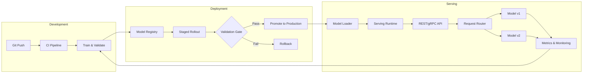

| Difficulty | Channel | Tags |
|---|---|---|
| beginner | devops | mlops, deployment |

Uber's Michelangelo platform was drowning. Thousands of models making millions of predictions per second — powering surge pricing, ETA prediction, and fraud detection — yet every single model update required a full service redeploy. The team had bundled model artifacts directly into Docker images, turning what should have been a simple model swap into a high-stakes infrastructure operation [1]. That bottleneck forced Uber to fundamentally rethink the difference between model deployment and model serving, and the lessons they learned have shaped how modern ML systems are built.

---

> ### Real-World Case — Uber
>
> As ML adoption exploded across Uber, the Michelangelo platform had to manage thousands of models making millions of predictions per second for critical use cases like surge pricing, ETA prediction, and fraud detection. The original approach bundled model artifacts directly into Docker images with the Real-time Prediction Service, forcing a full service redeploy for every model update.
>
> | | |
> |---|---|
> | **Challenge** | The tight coupling of model deployment and service deployment created a critical bottleneck: each model iteration required rebuilding and redeploying the entire serving infrastructure. With hundreds of daily model deployments, this caused friction between model developers and platform engineers, slow iteration cycles, and increased risk of production incidents from service restarts. Additionally, unused models accumulated in memory, causing Java GC pauses and OOM errors that degraded serving performance. |
> | **Solution** | Uber decoupled model deployment from service serving by implementing dynamic model loading via a Model Artifact & Config Store that Real-time Prediction Service instances poll periodically. Model deployment gained its own CI/CD pipeline with artifact validation, compilation into loadable JAR packages, and serving validation. Model auto-retirement was added to reclaim resources from unused models. Service releases got a separate three-stage validation pipeline (staging integration → canary integration across ALL production models → rolling production rollout) to catch compatibility regressions. |
> | **Outcome** | The separation enabled hundreds of daily model deployments without service restarts, eliminated the bottleneck between model and service developers, and maintained high availability through staged validation. Model auto-retirement achieved a 'non-trivial reduction in resource footprint' by purging stale models that were causing GC pressure and memory errors in the multi-tenant serving containers. |
> | **Lesson** | Model deployment (CI/CD, packaging, validation, rollout) and model serving (runtime inference, request routing, model lifecycle management) are fundamentally different concerns that must be decoupled. Conflating them by sealing models into service images creates an anti-pattern that doesn't scale — the correct architecture is separate, coordinated pipelines where the serving layer dynamically loads model artifacts from a central registry without service restart. |

---

## Hook — The Hidden Cost of Bundling Models with Services

Ever wondered why your perfectly trained model crumbles the moment it hits production? You are not alone. Many teams discover that the real challenge is not building a model — it is keeping it running reliably at scale. The gap between a Jupyter notebook and a production inference endpoint is wider than most developers expect, and the companies that bridge this gap successfully are the ones that learned to separate two fundamentally different concerns: deployment and serving.

## Problem — When Models Become Deployment Anchors

Here is the scenario that plays out in organizations everywhere: A data scientist trains a promising model and hands it off to the engineering team. The engineers package it into a Docker image, wire up a REST endpoint, and ship it. It works. Then a second model comes along. Then a third. Soon, teams are managing dozens of bespoke serving stacks, each with its own quirks. A model update means rebuilding and redeploying the entire service — and if something goes wrong, the rollback takes down every model on that endpoint. What started as a simple deployment pattern becomes an operational nightmare. The core tension is this: deployment is about infrastructure and lifecycle, while serving is about runtime and performance. Confusing the two leads to brittle systems that cannot scale.

## Real-World Case — Uber Michelangelo

Uber hit this wall hard. As ML adoption exploded, the Michelangelo platform had to manage thousands of models making millions of predictions per second for critical use cases like surge pricing, ETA prediction, and fraud detection. The original approach bundled model artifacts directly into Docker images with the Real-time Prediction Service, forcing a full service redeploy for every model update [1]. The impact was severe: model updates were slow, service and model developers were bottlenecked on each other, and the multi-tenant serving containers suffered from memory pressure and GC overhead from stale models. The solution was a clean separation of concerns. Uber introduced a dedicated model deployment pipeline that could push updates independently of the serving infrastructure, enabling hundreds of daily model deployments without service restarts [1]. Model auto-retirement achieved a 'non-trivial reduction in resource footprint' by purging stale models that were causing GC pressure. This architectural split eliminated the bottleneck between model and service developers while maintaining high availability through staged validation.

## Deep Dive — Deployment vs Serving: Two Sides of Different Coins

Building on Uber's experience, let us break down what each discipline actually entails. **Deployment** covers the entire lifecycle: CI/CD pipelines that build, test, and validate model artifacts; infrastructure provisioning with tools like Kubernetes, Docker, and Terraform; model registry and versioning through MLflow or SageMaker; and monitoring with rollback strategies for when things go wrong [2][3]. **Serving**, on the other hand, is concerned with what happens at runtime: loading models into memory, handling request routing, managing inference APIs via REST or gRPC, batching requests for throughput, and optimizing for latency [4][5]. The technologies differ too. Deployment leans on Kubernetes, GitHub Actions, Jenkins, and infrastructure-as-code tools. Serving uses specialized frameworks like TensorFlow Serving, TorchServe, or BentoML, paired with FastAPI or Flask for custom logic and NGINX or Envoy for load balancing [6][7]. The key trade-offs are summarized below:

| Concern | Deployment | Serving |
|---|---|---|
| Primary goal | Reliability and repeatability | Performance and availability |
| Key metric | Deployment frequency, success rate | Latency, throughput, error rate |
| Tooling | Kubernetes, MLflow, Terraform | TorchServe, TF Serving, FastAPI |
| Scaling focus | Infrastructure capacity | Request-level autoscaling |
| Failure mode | Failed rollout, resource exhaustion | Cold starts, OOM, latency spikes |

This distinction matters because they optimize for different things. A deployment pipeline prioritizes safety — canary deployments, gradual rollouts, automated rollbacks. A serving layer prioritizes speed — sub-100ms response times, efficient batching, GPU utilization. When you conflate the two, you end up trading safety for speed, or vice versa.

## Workflow — From Git Push to Production Inference

Here is how a well-architected ML system flows from code commit to live prediction. The diagram below traces the full path:

flowchart LR
    subgraph Development
        A[Git Push] --> B[CI Pipeline]
        B --> C[Train & Validate]
    end
    subgraph Deployment
        C --> D[Model Registry]
        D --> E[Staged Rollout]
        E --> F{Validation Gate}
        F -->|Pass| G[Promote to Production]
        F -->|Fail| H[Rollback]
    end
    subgraph Serving
        G --> I[Model Loader]
        I --> J[Serving Runtime]
        J --> K[REST/gRPC API]
        K --> L[Request Router]
        L --> M[Model v1]
        L --> N[Model v2]
        M & N --> O[Metrics & Monitoring]
    end

The journey starts in development, where a git push triggers a CI pipeline that trains and validates the model. On success, the model artifact is registered in the model registry (step one of deployment). A staged rollout pushes it through validation gates — canary testing, shadow traffic, A/B evaluation — before promoting to production. This is the deployment phase. On the serving side, the production model is loaded into memory by the serving runtime, which exposes REST or gRPC endpoints. A request router splits traffic between model versions for gradual rollouts or A/B testing. Metrics feed back into the deployment pipeline, creating a continuous improvement loop [8].

## Code Example — Building a Production-Ready Serving Layer

To see these concepts in action, here is a minimal but production-aware serving implementation using FastAPI and MLflow. This pattern separates model loading (deployment concern) from request handling (serving concern):

```python
import mlflow
import numpy as np
from fastapi import FastAPI, HTTPException
from pydantic import BaseModel
from prometheus_client import Counter, Histogram
import time

# Initialize serving app
app = FastAPI(title="ML Serving API")

# Prometheus metrics for monitoring
PREDICT_TIME = Histogram("predict_duration_seconds", "Time per prediction")
PREDICT_COUNT = Counter("predict_total", "Total predictions", ["model_version", "status"])

# Global model reference — loaded once at startup
model = None
model_version = None

class PredictionRequest(BaseModel):
    features: list[float]

class PredictionResponse(BaseModel):
    prediction: float
    model_version: str
    latency_ms: float

@app.on_event("startup")
def load_model():
    """
    Load model at startup — a deployment concern.
    This runs once when the container starts, not per request.
    """
    global model, model_version
    # Load latest model from MLflow registry
    model_uri = "models:/production-model/latest"
    model = mlflow.pyfunc.load_model(model_uri)
    model_version = mlflow.MlflowClient().get_latest_versions("production-model")[0].version

@app.post("/predict", response_model=PredictionResponse)
async def predict(request: PredictionRequest):
    """
    Handle prediction requests — a serving concern.
    This runs per request and focuses on latency.
    """
    if model is None:
        raise HTTPException(status_code=503, detail="Model not loaded")
    
    start = time.time()
    try:
        features = np.array(request.features).reshape(1, -1)
        result = model.predict(features)
        latency = (time.time() - start) * 1000
        
        PREDICT_TIME.observe(time.time() - start)
        PREDICT_COUNT.labels(model_version=model_version, status="success").inc()
        
        return PredictionResponse(
            prediction=float(result[0]),
            model_version=model_version,
            latency_ms=round(latency, 2)
        )
    except Exception as e:
        PREDICT_COUNT.labels(model_version=model_version, status="error").inc()
        raise HTTPException(status_code=500, detail=str(e))

@app.get("/health")
def health_check():
    """Health endpoint for load balancers and orchestrators."""
    return {"status": "healthy", "model_version": model_version}
```

The key design decisions here are: (1) Model loading happens at startup, not on every request — this keeps prediction latency predictable and avoids cold-start overhead per call. (2) Prometheus metrics track latency distribution and error rates by model version, enabling monitoring and alerting. (3) The health check endpoint lets Kubernetes or your orchestrator verify the service is ready before routing traffic. (4) Separating the `load_model` lifecycle hook (deployment) from the `predict` endpoint (serving) means you can update the model by restarting the container, or — with a more advanced pattern — hot-swap it without downtime using a model version manager.

## Lessons Learned — What to Do Differently Tomorrow

If there is one takeaway from Uber's experience and the patterns above, it is this: **treat deployment and serving as separate disciplines with separate tooling, separate metrics, and separate teams** [1]. Here are the actionable lessons:

**Separate your concerns.** Do not bundle model artifacts into service images. Use a model registry (MLflow, SageMaker Model Registry) as the bridge between deployment and serving [3][6].

**Invest in staged validation.** Canary deployments, shadow testing, and A/B traffic splitting catch failures before they reach all users. Uber's staged validation pipeline was the key to maintaining high availability during hundreds of daily model updates [1].

**Monitor the right things.** For deployment: deploy frequency, success rate, rollback time. For serving: p50/p99 latency, error rate, throughput, GPU/CPU utilization, cold start frequency [8].

**Plan for cold starts.** Model loading is expensive — models can be hundreds of megabytes. Pre-warm containers, use model downloaders that cache to local SSD, and keep a standby replica pool.

**Build for versioning from day one.** Every prediction response should include a model version tag (as shown in the code example). You cannot debug production issues without knowing which model version served which request.

**Automate model retirement.** Stale models consume memory and cause GC pressure — exactly what Uber discovered. Implement TTL-based auto-retirement for unused model versions [1].

---

## ML Model Lifecycle: From Git Push to Production Inference



<details>
<summary><strong>Original Interview Question</strong></summary>

**Q:** Explain the key differences between model serving and model deployment in ML systems, including specific technologies, scaling considerations, and real-world implementation patterns?

**A:** Deployment encompasses CI/CD pipelines, infrastructure setup, and monitoring using tools like Kubernetes, MLflow, and SageMaker. Serving focuses on runtime inference APIs with frameworks like TensorFlow Serving, TorchServe, or BentoML, handling request routing, model versioning, and autoscaling. Key trade-offs include latency vs throughput, batch vs real-time inference, and cold start optimization.

</details>

## Conclusion

The line between model deployment and model serving is not just semantic — it is architectural. Uber learned this the hard way, and the separation they invested in became the foundation for running ML at scale. For your own systems, start by unbundling: use a model registry, separate your deployment pipeline from your serving stack, and instrument everything. The next time your pager goes off at 3am over a bad model rollout, you will be glad you did.

---

## References

1. [Uber — Continuous Integration and Deployment for Machine Learning](https://www.uber.com/us/en/blog/continuous-integration-deployment-ml/) — blog
2. [Kubernetes Documentation — Production-Grade Container Orchestration](https://kubernetes.io/docs/concepts/) — documentation
3. [MLflow Documentation — Open Source ML Platform](https://mlflow.org/docs/latest/) — documentation
4. [TensorFlow Serving — Flexible Serving Architecture](https://www.tensorflow.org/tfx/guide/serving) — documentation
5. [PyTorch TorchServe — Model Serving Framework](https://pytorch.org/serve/) — documentation
6. [AWS SageMaker Documentation — Deploy and Serve Models](https://docs.aws.amazon.com/sagemaker/latest/dg/how-it-works-deployment.html) — documentation
7. [FastAPI Documentation — Modern Python Web Framework for APIs](https://fastapi.tiangolo.com/) — documentation
8. [Prometheus Documentation — Monitoring System & Time Series Database](https://prometheus.io/docs/introduction/overview/) — documentation
9. [gRPC Documentation — High Performance RPC Framework](https://grpc.io/docs/) — documentation
10. [Docker Documentation — Container Platform for Application Packaging](https://docs.docker.com/) — documentation

---

**Author:** Satishkumar Dhule — [GitHub](https://github.com/satishkumar-dhule) · [LinkedIn](https://linkedin.com/in/satishkumar-dhule) · [Website](https://satishkumar-dhule.github.io)
