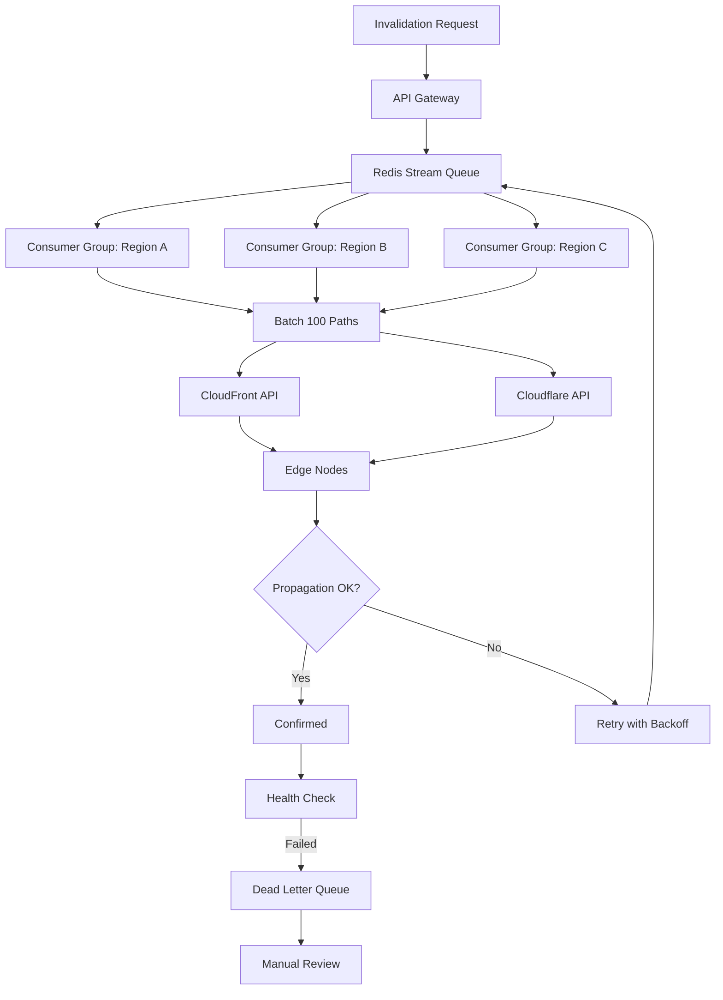

| Difficulty | Channel | Tags |
|---|---|---|
| intermediate | system-design | edge, caching, purging |

What happens when your CDN cache purge takes 1.5 seconds instead of milliseconds? For Cloudflare, it meant customers in Australia watched their content updates crawl across the Pacific and back, burning precious seconds on a trip nobody asked for [1]. Their hub-and-spoke architecture, once elegant at scale, had become a bottleneck — and the lazy-purge metadata was eating disk space that could cache actual customer content. This is the story of how a 90.5% latency improvement taught the industry something fundamental about distributed cache invalidation.

---

> ### Real-World Case — Cloudflare
>
> Cloudflare's cache purge system, built on a centralized hub-and-spoke architecture using their Quicksilver config distribution system, began buckling under scale. Customers in Australia saw purge propagation take 1-2 seconds because requests had to cross the Pacific to a core data center and back. The lazy-purge approach stored purge metadata longer than the max cache eviction age on every machine, consuming huge amounts of disk that could otherwise cache customer content.
>
> | | |
> |---|---|
> | **Challenge** | Three systemic issues: (1) purge latency correlated linearly with geographic distance from centralized ingest points, penalizing non-US regions; (2) Quicksilver's write-throughput bottleneck forced Kafka queues in front, adding latency; (3) per-machine storage for purge history scaled directly with throughput demand, making costs proportional to usage. |
> | **Solution** | Abandoned the centralized hub-and-spoke model entirely. Built a distributed 'coreless' architecture: a Rust service called CacheDB on top of RocksDB runs on every machine with a per-machine index of cached files. Purges are distributed peer-to-peer via Cloudflare Durable Objects (not Quicksilver). CacheDB actively deletes matched files from disk immediately using background workers, instead of waiting for lazy purge timestamps to expire. The cache proxy also checks CacheDB's local queue on every cache HIT to short-circuit stale responses before the full deletion completes. |
> | **Outcome** | Global P50 purge latency dropped from 1,570ms (May 2022) to 149ms (Aug 2024) — a 90.5% improvement. Africa improved 78.7% (1,420ms → 303ms), Oceania 83.5% (1,160ms → 191ms), South America 84.3% (1,250ms → 196ms). Storage savings of 10x from replacing lazy purge timestamps with active deletion, improving cache HIT ratios across the entire network. The system now serves 330+ cities in 120+ countries. |
> | **Lesson** | Centralized architectures at CDN scale create unavoidable latency penalties for users far from core hubs. The only way to achieve truly global sub-second cache invalidation is to eliminate centralized bottlenecks entirely — distribute both the control plane and the data plane to every edge machine, using per-node indexing and peer-to-peer propagation. The 'lazy purge' shortcut seemed clever but ended up wasting 10x the storage of active deletion. |

---

## Hook — The Midnight Cache Crisis

Picture this: it's 2 AM, your deploy just went live, and you're watching your CDN metrics. The purge request fired 4 seconds ago, but customers in Sydney are still seeing stale content. Your phone buzzes — a support ticket from a major client asking why their product page still shows last quarter's pricing. This isn't a hypothetical. This was Cloudflare's reality, and it's a scenario that plays out daily across engineering teams worldwide. The math is brutal: 10,000 concurrent invalidations per second, 330+ edge cities, 5-second propagation SLA — and every millisecond of delay costs trust, revenue, or both [1].

## Problem — The Distributed Cache Invalidation Paradox

Here's the thing about cache invalidation that nobody tells you in textbooks: it's not just a computer science problem — it's a physics problem. When you purge a URL across a global network, you're fighting latency, network partitions, and the CAP theorem simultaneously. The core tension? You need strong consistency (every edge node sees the purge within 5 seconds) while maintaining availability (the purge system itself can't become a single point of failure) and handling massive throughput (10K invalidations per second). Many developers discover too late that a naive purge architecture creates a cascade of problems: cross-region traffic spikes, inconsistent purge propagation, and metadata bloat that starves your cache of actual content. Consider the numbers: a single purge request to a centralized coordinator might take 200ms to reach one edge node, but multiplied across 330 cities, that's a propagation storm that can take seconds to settle.

## Real-World Case — Cloudflare's Purge Reckoning

Cloudflare's cache purge system, built on a centralized hub-and-spoke architecture using their Quicksilver config distribution system, began buckling under scale. Customers in Australia saw purge propagation take 1-2 seconds because requests had to cross the Pacific to a core data center and back. The lazy-purge approach stored purge metadata longer than the max cache eviction age on every machine, consuming huge amounts of disk that could otherwise cache customer content. The impact was staggering: Global P50 purge latency was 1,570ms in May 2022. Africa averaged 1,420ms. Oceania sat at 1,160ms. South America at 1,250ms. These weren't edge cases — they were the norm for a significant portion of their global customer base [1]. The solution required rethinking the entire architecture: replacing lazy purge timestamps with active deletion, implementing regional cache coordination, and fundamentally restructuring how purge information flowed across the network. By August 2024, the results spoke for themselves — 149ms global P50, 90.5% improvement, with Africa hitting 303ms (78.7% improvement), Oceania at 191ms (83.5%), and South America at 196ms (84.3%). Storage savings of 10x meant cache HIT ratios improved across the entire network [1].

## Deep Dive — Architecture and Trade-offs

Building on Cloudflare's lessons, let's dissect the architecture that makes sub-second global purge propagation possible. The key insight is distributing the purge coordination itself — no single data center should own the purge decision. At its core, the system relies on three pillars: a distributed invalidation queue, regional cache coordinators, and intelligent batch processing. Redis Streams with consumer groups provide the distributed queue — they're battle-tested for exactly this pattern, offering at-least-once delivery with consumer group semantics [2]. Edge Workers (Cloudflare Workers or Lambda@Edge) handle regional coordination, ensuring each region processes purges independently. Batch processing is where the throughput magic happens: the CloudFront API allows 100 invalidation paths per call, and the Cloudflare API supports bulk purge operations [3][4]. This means 10,000 invalidations per second becomes 100 API calls per second — a 99% reduction in API volume. However, the real complexity lies in failure handling. What happens when one region's purge fails? The circuit breaker pattern — fail fast after 5 consecutive failures — prevents cascade failures. Exponential backoff with jitter handles transient issues. A dead letter queue captures failed invalidations for manual review. The TTL strategy is equally critical: a 2-second max-age with must-revalidate headers means even if a purge is delayed, the worst-case staleness is bounded. Cache-Control: max-age=2, must-revalidate is your safety net [5].

## Workflow — The Purge Pipeline in Action

Here's the step-by-step flow from invalidation request to global propagation, visualized in the diagram below:

1. **Request Ingestion**: Your application fires a purge request (pattern-based with wildcards like /blog/* or specific URLs)
2. **Queue Distribution**: The request enters a Redis Stream, where regional consumer groups pick it up
3. **Regional Processing**: Each edge region's coordinator processes the batch independently — no cross-region coordination needed
4. **CDN API Call**: Batched invalidations hit CloudFront/Cloudflare API (100 paths per call)
5. **Propagation**: Edge nodes within each region receive and apply the purge
6. **Confirmation**: Health checks verify propagation; failed purges enter retry queue with exponential backoff

The beauty of this architecture is that step 3 is fully parallel — all regions process simultaneously, not sequentially. This is what transforms a 1.5-second propagation time into milliseconds.

## Code Example — Implementing the Purge Pipeline

Here's a production-ready implementation of the CDN purge pipeline with batch processing, retry logic, and circuit breaker pattern:

## Lessons Learned — Battle Scars and Best Practices

After studying systems like Cloudflare's and building similar architectures, here are the patterns that separate successful purge systems from costly failures:

**The Counter-Intuitive Truth About TTLs**: Many teams think shorter TTLs mean more purges needed. Actually, the opposite is true — a 2-second TTL with must-revalidate is often sufficient because by the time a user notices stale content, the next request will fetch fresh data. The purge is a safety net, not the primary mechanism.

**The 90% Cost Reduction Secret**: Batch API calls aren't just about throughput — they're about cost. CloudFront charges per invalidation request. At 10K invalidations/second without batching, you're looking at millions of API calls daily. With 100x batching, that drops to tens of thousands. The math is simple: batch or bleed money.

**The Regional Isolation Principle**: Never let one region's failure affect another's purge processing. This seems obvious, but many implementations share state between regional coordinators, creating exactly the coupling you're trying to avoid. Each region should be a fully autonomous purge processor.

**The Metadata Trap**: Cloudflare learned this the hard way — storing purge metadata longer than your cache TTL wastes disk space that could cache content. Use active deletion with a bounded metadata window, not lazy purge with unbounded timestamps [1].

**The Exponential Backoff Mistake**: Pure exponential backoff without jitter creates thundering herds. When 1,000 failed purges retry simultaneously, they create exactly the load spike you're trying to recover from. Always add jitter — randomized delay within the backoff window.

**The Circuit Breaker Nuance**: Setting the failure threshold too low (e.g., 2 failures) causes premature circuit opening during transient issues. Setting it too high (e.g., 20 failures) means you're wasting resources on a failing operation. 5 consecutive failures is the sweet spot for most purge systems.

**The Wildcard Gotcha**: Pattern-based purges (e.g., /blog/*) seem efficient but can inadvertently purge unrelated content if your path patterns are too broad. Be precise with your wildcards — /blog/2024/* is safer than /blog/*.

---

## Multi-Region CDN Cache Purge Pipeline

<strong>Original Interview Question</strong>

**Q:** How would you design a multi-region CDN cache purging system that guarantees content propagation within 5 seconds while handling 10,000 concurrent invalidations per second?

**A:** Implement Cloudflare API + AWS CloudFront with distributed invalidation queue, edge compute coordination, and 2-second TTL. Use batch invalidation, exponential backoff, and regional cache headers for 5-second SLA.

## Conclusion

The journey from 1,570ms to 149ms global purge latency teaches a fundamental lesson about distributed systems: the architecture that works at 100 nodes often breaks at 10,000. Cloudflare's experience proves that cache invalidation isn't just about sending a purge request — it's about distributing the coordination, batching intelligently, and handling failures gracefully. The next time you're designing a CDN purge system, remember: batch your API calls, isolate your regions, and never let one failure cascade across the network. The 5-second SLA is achievable, but only if you respect the physics of distributed systems.

---

## References

1. [Cloudflare instant purge engineering blog](https://blog.cloudflare.com/instant-purge/) — blog
2. [Redis Streams documentation](https://redis.io/docs/latest/develop/data-types/streams/) — documentation
3. [AWS CloudFront invalidation API documentation](https://docs.aws.amazon.com/AmazonCloudFront/latest/DeveloperGuide/Invalidation.html) — documentation
4. [Cloudflare Cache Purge API documentation](https://developers.cloudflare.com/cache/how-to/purge-cache/) — documentation
5. [MDN Cache-Control header documentation](https://developer.mozilla.org/en-US/docs/Web/HTTP/Headers/Cache-Control) — documentation
6. [Netflix engineering blog on cache invalidation patterns](https://netflix.github.io/dgs/) — documentation
7. [AWS well-architected framework performance efficiency pillar](https://docs.aws.amazon.com/wellarchitected/latest/performance-efficiency-pillar/welcome.html) — documentation
8. [Cloudflare Workers documentation](https://developers.cloudflare.com/workers/) — documentation

---

**Author:** Satishkumar Dhule — [GitHub](https://github.com/satishkumar-dhule) · [LinkedIn](https://linkedin.com/in/satishkumar-dhule) · [Website](https://satishkumar-dhule.github.io)
