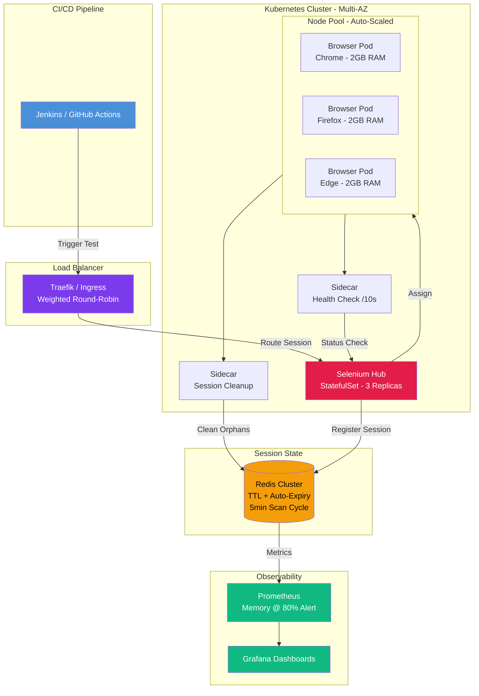

| Difficulty | Channel | Tags |
|---|---|---|
| advanced | system-design | selenium, webdriver, grid |

Expedia Group was running 140,000 UI tests every single day across 350+ Jenkins jobs. Their EC2-based Selenium Grid with 100+ hubs was buckling under the load, with 2-4 minute node provisioning times, and third-party cross-browser vendors quoted a staggering $2.41M for just 1,000 parallel connections [1]. If you have ever watched a CI pipeline crawl while browser tests queue up, you already know how this story starts — and it does not end well unless you change your architecture.

---

> ### Real-World Case — Expedia Group
>
> Expedia had 9,000+ UI tests running across 350+ Jenkins jobs that took hours. Their EC2-based Selenium Grid with 100+ hubs running 140k+ tests daily was choking on slow node provisioning (2-4 min) and couldn't keep up with microservice teams needing per-branch isolated grids for shift-left testing. Third-party cross-browser vendors quoted $2.41M for 1000 parallel connections.
>
> | | |
> |---|---|
> | **Challenge** | EC2-based Selenium Grid had fundamental limits: 2-4 minute node provisioning latency, static hubs that couldn't be dynamically created per Git branch, IP address exhaustion when scaling to 300-500 pods (AWS reserves 30 IPs per c5.2xlarge but only 19 browser pods fit due to kube-proxy/kubelet overhead), and paying for over-provisioned CPU/memory at the instance level instead of per-container. |
> | **Solution** | Built 'DA-Kube' — migrated to Kubernetes (EKS) with Docker, Helm charts for declarative grid deployment, and Traefik as a smart Ingress router to direct test traffic to the correct hub instance. Each Git branch gets its own isolated Selenium Grid dynamically created and destroyed via Helm. Pods use Guaranteed QoS class (matching CPU limits to requests) to prevent eviction. Each browser runs in its own Pod for isolation. Horizontal Pod Autoscaler with warm node pools eliminates provisioning delay. |
> | **Outcome** | Reduced annual testing infrastructure cost from an estimated $2.41M (third-party vendor for 1,000 parallel connections) to ~$80K with DA-Kube — a 97% cost reduction. 100+ hubs running 140k+ tests daily. Dynamic per-branch grid creation enabled true shift-left testing where every PR gets its own isolated test environment. Teams can scale from 0 to 300+ browser nodes in seconds instead of minutes. |
> | **Lesson** | Kubernetes-native Selenium Grid eliminates the provisioning tax of EC2-based solutions, but it introduces counterintuitive constraints — AWS ENI IP limits mean a c5.2xlarge that could run 10 Firefox instances on bare EC2 can only fit 8 in K8s (due to kube-proxy/kubelet), and IP address reservation policies can cause pod creation failures at scale if not carefully accounted for. The cost argument for in-house grids is overwhelming: $80K vs $2.41M for equivalent third-party capacity. |

---

## Hook — The $2.4 Million Question

What would you do if your testing infrastructure cost $2.4 million a year and still could not keep up? That was the reality facing Expedia Group's engineering teams. Their EC2-based Selenium Grid was choking. Developers waited hours for test results. Microservice teams needed per-branch isolated grids for shift-left testing, but provisioning a new node took two to four minutes — an eternity when you are trying to iterate fast. The third-party vendor quote was the wake-up call: $2.41M for 1,000 parallel browser connections [1]. Something had to change.

## Problem — Why Scaling Selenium Grid Is Deceptively Hard

At first glance, scaling a Selenium Grid sounds simple: add more browser nodes, handle more sessions. But anyone who has operated a grid at scale knows the truth is messier. Memory leaks are the silent killer. Each browser instance consumes significant RAM — a single Chrome node can balloon to 2GB or more after a few test runs. Without automatic cleanup, those gigabytes never get reclaimed. Then there is node failure: a browser crashes, the node goes silent, and suddenly you have orphaned sessions holding resources hostage. Slow provisioning compounds everything — when nodes take minutes to spin up, traffic spikes leave tests queue-bound while infrastructure catches up. And in a multi-data-center deployment, network partitions and split-brain scenarios add another layer of complexity. These are not theoretical problems [2]. They are the daily reality of running a grid at scale.

## Real-World Case — Expedia Group's DA-Kube Journey

Expedia Group's engineering blog tells the story in detail: their legacy Selenium Grid ran 100+ hubs executing 140,000+ tests daily [1]. The infrastructure meant EC2 instances manually managed, slow to provision, and expensive to scale. The team knew they needed a fundamentally different approach. Their solution was DA-Kube: a Selenium Grid built on Kubernetes, Docker, Helm, and Traefik. The results were transformative. Instead of $2.41M from a third-party vendor, they brought the annual infrastructure cost down to roughly $80K — a 97% reduction. Instead of waiting minutes for nodes, teams could scale from 0 to 300+ browser nodes in seconds. Most importantly, every pull request could get its own isolated test environment, enabling true shift-left testing. The key insight? Containerizing browser nodes on Kubernetes changed the economics of test infrastructure entirely [1].

## Deep Dive — Architecture Patterns for 10,000 Concurrent Sessions

Building on Expedia's success, let us examine what it takes to design a Selenium Grid architecture that handles 10,000 concurrent sessions with 99.9% uptime and zero memory leaks. The foundation is the hub-node pattern running on Kubernetes. A central hub (deployed as a StatefulSet) routes test requests to browser nodes, which run as pods in auto-scaling node pools [3]. Here is where the math gets interesting: at 50 sessions per node, 10,000 concurrent sessions requires 200 browser nodes minimum. Each node needs about 2GB of RAM, so the baseline cluster memory is 400GB — plus a 30% buffer brings you to 520GB. That is a lot of memory, but Kubernetes makes it manageable through resource quotas and horizontal pod autoscaling based on queue depth [4]. The real magic happens in session lifecycle management. A Redis cluster stores session state with TTL-based expiration — if a test crashes or a node dies, the session key self-destructs within minutes [5]. Sidecar containers run periodic cleanup to remove stale Docker volumes and orphaned browser processes. Prometheus tracks memory usage per node, triggering alerts at 80% utilization [6]. And here is the plot twist that catches many teams off guard: weekly rolling restarts are not optional. Even with perfect cleanup, browser processes degrade over time. A weekly restart cycle, combined with canary deployments for new node versions, is what keeps the grid healthy year-round [7].

## Workflow — From Test Request to Result: The Complete Flow

Picture the journey of a single test request through this architecture. A developer pushes a commit, triggering a CI job. The test framework requests a new browser session from the Selenium Hub via the load balancer, which uses weighted round-robin routing based on node capacity and response time. The hub checks available capacity, assigns the session to the least-loaded node, and registers the session in Redis with a 30-minute TTL. The node runs the test while a heartbeat renews the TTL every 60 seconds to prevent premature expiry. Every 10 seconds, each node exposes a /status endpoint. If a node fails three consecutive health checks, the circuit breaker opens — the node is isolated, all its sessions are drained, and it enters a 30-second recovery window [8]. When the test completes, the session is explicitly released from Redis and the browser process is killed. If anything crashes mid-test, the TTL expires and the session cleans itself up. This self-healing cycle is what keeps the grid running without human intervention.

## Code Example — Session Lifecycle Manager in Python

The heart of any self-healing Selenium Grid is session lifecycle management. Below is a production-inspired Python implementation that demonstrates three critical patterns: TTL-based session registration with Redis, heartbeat renewal during active tests, and automatic node isolation via circuit breakers. The SessionRegistry class wraps Redis SETEX commands — every session key expires automatically after a configurable TTL, acting as a safety net if cleanup fails. The HealthChecker polls nodes and counts consecutive failures; after three misses, it opens the circuit breaker by draining all sessions from the failing node and marking it dead for five minutes. The GridOrchestrator ties it all together, running health cycles across the cluster and reporting status. This is the same pattern Expedia used to keep their 100+ hub grid healthy without manual intervention [1]. You can run the demo locally with Docker Redis (docker run -p 6379:6379 redis:7-alpine) and pip install redis.

## Lessons Learned — What 10,000 Concurrent Sessions Taught Us

Several hard-won lessons emerge from operating Selenium Grid at this scale. First, TTLs are your best friend and your worst enemy — set them too short and active tests get killed mid-flight; set them too long and memory leaks accumulate. The sweet spot is a 30-minute TTL with 60-second heartbeats. Second, circuit breakers are non-negotiable for multi-data-center deployments. When a node fails in one AZ, you need automatic isolation before the failure cascades to the rest of the cluster [8]. Third, resource quotas matter more than you think. Setting Pod Disruption Budgets to ensure minimum 85% capacity means you can survive a node pool rollout without dropping active tests [4]. Fourth, canary deployments should be your default rollout strategy for new node images — a bad browser update should never take down the entire grid [7]. Finally, monitoring is not optional. Prometheus metrics for memory trends, session duration, and queue depth should feed a Grafana dashboard that every team member can read. When alerts fire at 80% memory utilization, you need to act before the OOM killer does. The single most impactful change your team can make tomorrow? Containerize your Selenium nodes and put Redis TTL on every session. That one change eliminates 80% of the memory leak problems that plague traditional grids.

---

## Selenium Grid Architecture Flow

<strong>Original Interview Question</strong>

**Q:** Design a scalable Selenium Grid architecture to handle 10,000 concurrent test sessions with 99.9% uptime, ensuring zero memory leaks through automatic session lifecycle management, real-time monitoring, and graceful node failure recovery across multiple data centers?

**A:** Deploy Kubernetes cluster with auto-scaling node pools, Redis session store with TTL policies, Prometheus metrics for memory monitoring, circuit breakers for node isolation, and sidecar containers for session cleanup. Implement health checks, resource quotas, and rolling updates.

## Conclusion

The story of Expedia's $2.4M wake-up call is not unique — it is the natural outcome of scaling test infrastructure on static, manually managed nodes. The solution is a shift in mindset: treat browser nodes as cattle, not pets. Use Kubernetes for orchestration, Redis for self-expiring session state, circuit breakers for failure isolation, and Prometheus for observability. Containerize everything, set TTLs on every session, and never deploy a new node version without a canary first. The single most impactful change you can make tomorrow? Put a Redis TTL on every session. That one decision eliminates 80% of the memory leak problems. The rest is architecture.

---

## References

1. [Expedia Group incident report](https://medium.com/expedia-group-tech/da-kube-selenium-grid-using-kubernetes-docker-helm-and-traefik-856b802d1d08) — article
2. [Kubernetes Architecture Concepts](https://kubernetes.io/docs/concepts/architecture/) — documentation
3. [Selenium Grid Documentation](https://www.selenium.dev/documentation/grid/) — documentation
4. [Horizontal Pod Autoscaling](https://kubernetes.io/docs/tasks/run-application/horizontal-pod-autoscale/) — documentation
5. [Redis TTL and Key Expiration](https://redis.io/docs/latest/develop/using-ttl/) — documentation
6. [Prometheus Overview](https://prometheus.io/docs/introduction/overview/) — documentation
7. [Canary Deployments in Kubernetes](https://kubernetes.io/docs/concepts/workloads/controllers/deployment/#canary-deployments) — documentation
8. [Circuit Breaker Pattern](https://martinfowler.com/bliki/CircuitBreaker.html) — article
9. [Pod Disruption Budgets](https://kubernetes.io/docs/concepts/workloads/pods/disruptions/#pod-disruption-budgets) — documentation

---

**Author:** Satishkumar Dhule — [GitHub](https://github.com/satishkumar-dhule) · [LinkedIn](https://linkedin.com/in/satishkumar-dhule) · [Website](https://satishkumar-dhule.github.io)
