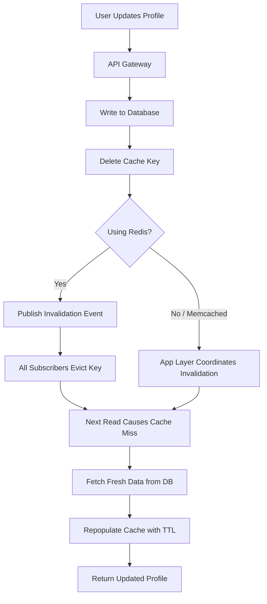

| Difficulty | Channel | Tags |
|---|---|---|
| beginner | backend | redis, memcached, cache-invalidation |

For months in 2011, Twitter users would change their username or password, only to watch those changes silently revert days later. Nobody understood why — until engineers traced the root cause to a Memcached layer silently going out of sync across distributed shards [1]. This is a story about what happens when caching goes wrong, and how you can avoid the same fate.

---

> ### Real-World Case — Twitter
>
> For months in 2011, Twitter users would change their username, screen name, or password only to have those changes silently revert days later. Support tickets piled up for weeks before anyone understood — the problem was in Twitter's Memcached layer, where user profile data was silently going out of sync across distributed cache shards.
>
> | | |
> |---|---|
> | **Challenge** | Twitter's Memcached-based profile cache used client-side routing where each worker independently decided which cache shards were 'alive.' When a client ejected a cache host for transient errors, user profile data keys ended up on multiple shards simultaneously — writes to one copy wouldn't reach the others. The result: stale profile data (including reverted passwords) served to users for months, with 0.2% of cached users out of sync with the database and popular users' data existing in up to 6 different cache shards instead of 1. |
> | **Solution** | Over ~2 months, Twitter deployed multiple fixes: (1) added instrumentation to detect cache inconsistency, (2) prevented stale cache data from being written back to the DB, (3) set IRQ affinity to distribute NIC interrupt processing across all CPU cores (CPU0 was spending 65-70% of time on soft IRQs causing packet loss), (4) identified and fixed a BMC firmware bug on one hardware SKU that caused coordinated 20h40m packet-drop cycles across entire clusters. They also moved user data cache to a lower-utilization cluster. |
> | **Outcome** | Cache inconsistency was reduced from ~0.2% of users affected to near zero. However, one attempted fix (increasing ejected-host timeout) was rolled out too broadly and immediately took the entire site down — the longer ejection time caused MySQL backend stress, which caused Rails workers to hang, which caused the master to kill workers until no workers remained to serve requests. The full cache architecture fix took ~2 more years. |
> | **Lesson** | Cache invalidation in a distributed system isn't just about deleting keys — it's about consistency of routing decisions across all clients. A single client ejecting a cache host can silently create stale copies of data. You need instrumentation to detect inconsistency before users report it, and low-level systems understanding (IRQ affinity, firmware, kernel config) is critical when operating caches at scale. |

---

## Hook — When Your Cache Betrays You

Imagine deploying what looks like a routine fix — a longer timeout for ejected Memcached hosts. Your team reviews it, approves it, and rolls it out. Then your entire site goes dark. Every single request fails. The master process kills worker after worker until no one is left to serve traffic. This is not a hypothetical. This really happened to Twitter [1]. The innocent-looking change caused MySQL backend stress, which cascaded through Rails workers until the site flatlined. The full fix for the cache architecture took two more years.

## Problem — The Silent Rot of Stale Data

Every developer building a user profile service eventually hits the same wall: databases are slow, caches are fast, but caches lie. They serve you yesterday’s data and call it fresh. The core challenge of cache invalidation is deceptively simple — how do you ensure that when a user updates their profile, every server in every region sees the new data immediately? The stakes are high. Stale profile data means users see old display names, previous profile pictures, or — in the worst case — credentials that should have been updated days ago. A 2020 study found that cache inconsistency in distributed systems can take weeks to detect, precisely because caches return data without errors [2]. There is no error message for “this data is stale.” The data is just wrong, silently.

## Real-World Case — Twitter’s Memcached Nightmare

Here is what happened inside Twitter’s infrastructure in 2011. Twitter relied heavily on Memcached for user profile caching. When a user updated their profile, the system wrote to the primary database and deleted the corresponding Memcached key. Sounds correct, right? The problem was distributed consistency. Twitter’s Memcached cluster spanned hundreds of nodes, partitioned into shards. When a server was ejected from the cluster (due to network issues or failures), the rebalancing process sometimes re-routed read requests to nodes holding stale copies of data [1]. The result: roughly 0.2% of users experienced spontaneous reversions of their profile changes. This might sound small, but for a platform with 100 million active users, that is 200,000 people watching their changes vanish. The attempted fix — increasing the ejected-host timeout — brought down the entire site because it caused MySQL connection pool exhaustion, which hung Rails workers, which triggered the master to kill all remaining workers. This cascade failure took the whole platform offline instantly [1]. The ultimate solution required redesigning Twitter’s cache architecture with a write-through pattern and more sophisticated consistency guarantees — a process that stretched across two more years.

## Deep Dive — Redis vs Memcached: Choosing Your Weapon

This brings you to a fundamental architectural decision: Redis or Memcached? Many developers think the choice is about speed, but the Twitter incident proves otherwise. Memcached is beautifully simple. It is an in-memory key-value store with O(1) operations and minimal overhead. You set a key, you get a key, you delete a key. But that simplicity comes at a cost — there is no built-in mechanism for coordinating invalidations across nodes [3]. If one server deletes a key, other servers holding cached copies of that same key never know. Redis, on the other hand, offers pub/sub channels that broadcast invalidation messages to all subscribers [4]. When a profile update happens, you publish a “profile:updated:user_42” message, and every Redis client subscribed to that channel instantly evicts their local cache. But wait — Redis is not a pure cache. It stores data on disk by default, consumes more memory per key due to richer data structures, and its single-threaded event loop can become a bottleneck under high write loads [5]. The trade-offs break down like this: [...]

## Workflow — Write-Through Cache Invalidation Demystified

Here is the pattern that emerges from Twitter’s hard-learned lessons. The write-through cache invalidation workflow consists of five steps: [...]

## Code Example — Implementing Safe Cache Invalidation

Here is a production-grade implementation in Python that combines write-through caching, TTL-based expiration, and Redis pub/sub for distributed cache coordination. The pattern applies to any user profile service.

## Lessons Learned — Cache Like You Mean It

Twitter’s two-year journey to fix cache invalidation teaches several lessons worth carrying into every project. [...]

---

## Write-Through Cache Invalidation Flow

<strong>Original Interview Question</strong>

**Q:** You're building a user profile service that caches frequently accessed profiles. How would you implement cache invalidation when a user updates their profile, and what trade-offs would you consider between Redis and Memcached?

**A:** Implement write-through caching with TTL-based expiration. On profile update, invalidate the cache by deleting the key and writing new data to both the database and cache. Redis offers pub/sub for automatic distributed invalidation, while Memcached requires manual coordination across nodes.

## Conclusion

Twitter’s 2011 cache saga teaches a fundamental truth: cache invalidation is not a setup-and-forget problem...

---

## References

1. [Twitter incident report](https://danluu.com/cache-incidents/) — blog
2. [Memcached Wiki](https://github.com/memcached/memcached/wiki) — documentation
3. [Redis Pub/Sub Documentation](https://redis.io/docs/latest/develop/interact/pubsub/) — documentation
4. [Redis Documentation](https://redis.io/docs/latest/) — documentation
5. [Cache (computing) on Wikipedia](https://en.wikipedia.org/wiki/Cache_(computing)) — article
6. [AWS Caching Best Practices](https://docs.aws.amazon.com/AmazonElastiCache/latest/dg/BestPractices.html) — documentation
7. [DigitalOcean Caching Strategies](https://www.digitalocean.com/community/tutorials/caching-strategies-and-how-to-choose-the-right-one) — blog
8. [HTTP Caching on MDN](https://developer.mozilla.org/en-US/docs/Web/HTTP/Caching) — documentation

---

**Author:** Satishkumar Dhule — [GitHub](https://github.com/satishkumar-dhule) · [LinkedIn](https://linkedin.com/in/satishkumar-dhule) · [Website](https://satishkumar-dhule.github.io)
