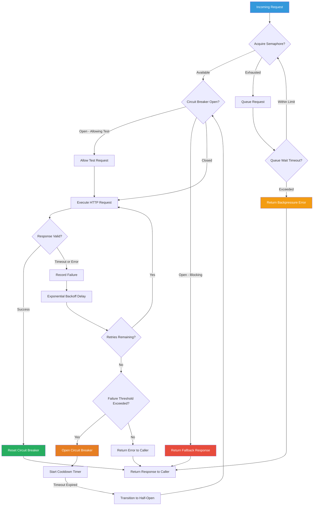

| Difficulty | Channel | Tags |
|---|---|---|
| advanced | backend | asyncio, aiohttp, concurrency |

It was 2012, and Netflix was deep in its microservice migration. A single video playback request—something millions of users triggered daily without a second thought—fanned out into dozens of internal service calls. Recommendations. A/B testing. Licensing. Billing. Encoding. Any one of those services going slow—not failing, just slow—could exhaust thread pools and cascade failures across the entire system. By the time engineers noticed, the API gateway was handling over 1 billion incoming calls per day with a 1:6 fan-out ratio, all fighting for the same finite pool of connections. This is the story of how Netflix learned to make their connection pools fight back—and what every developer can learn from their battle scars [1].

---

> ### Real-World Case — Netflix
>
> By 2012, Netflix was deep in its microservice migration. A single video playback request fanned out into dozens of internal service calls across recommendations, A/B testing, licensing, billing, and encoding. Any one of those services going slow — not failing, just slow — could exhaust thread pools and cascade failures across the entire system. The API gateway handled over 1 billion incoming calls per day, fanning out at a 1:6 ratio to several billion outgoing dependency calls.
>
> | | |
> |---|---|
> | **Challenge** | Traditional timeouts were too coarse. Thread-pool exhaustion was the real failure mode: one slow dependency could consume all available threads, causing the entire service to stall. With 30+ dependencies at 99.99% individual uptime, composite uptime without isolation was only 99.7% — roughly 2 hours of downtime per month. |
> | **Solution** | Netflix built Hystrix, wrapping every external call in a HystrixCommand with per-dependency thread pools (default 10 threads) acting as bulkheads, per-command timeouts (100-1000ms), a sliding-window circuit breaker (50% failure threshold over a 10-second rolling window with ≥20 requests), half-open probing after 5 seconds, and mandatory fallback methods for graceful degradation. This directly mirrors the semaphore-based limiting, circuit breaker, and graceful degradation patterns in the topic. |
> | **Outcome** | Tens of billions of thread-isolated and hundreds of billions of semaphore-isolated calls executed daily at Netflix, processing over 100,000 dependency requests per second at peak, with dramatic improvement in uptime and resilience. The circuit breaker pattern became industry standard, adopted by Spring Cloud, Resilience4j, and countless other frameworks. |
> | **Lesson** | Fail fast and shed load is better than wait and propagate. The system must decide how to degrade at design time, not during an outage. However, the plot twist: Netflix deprecated Hystrix in 2018 because static thread pools required 300+ tuning knobs nobody tuned correctly, and the per-call context-switch overhead was significant at scale. They moved to adaptive concurrency control using TCP congestion-control algorithms (Vegas, Gradient2) that dynamically discover the right concurrency limit from measured latency — no manual tuning required. |

---

## Hook — The Slow Motion Crisis You Never See Coming

Ever watched a system die in slow motion? It starts innocently: one upstream service takes a few extra milliseconds to respond. No big deal, right? But here is the thing about connection pools—they are finite. Every millisecond that a connection stays open waiting for a slow service is a millisecond that connection is not available for another request. At scale, that "few extra milliseconds" compounds into thread pool exhaustion, cascading connection timeouts, and a full-blown outage. The most dangerous kind of failure does not crash your system. It just slows it down—one connection at a time—until everything grinds to a halt. By the time your pager lights up, the damage is already done.

## Problem — Why Connection Pools Fail Under Pressure

The fundamental problem with connection pools is that they are a shared resource with no natural defense mechanism. Without proper safeguards, a single misbehaving dependency can consume every available connection, starving every other request that needs to talk to a different service. The worst part? The failing service does not even need to be down. Slow responses are far more dangerous than fast failures because a failed request returns its connection quickly, while a slow one holds onto it hostage. Many developers optimize for handling failures but forget to plan for slowdowns. That is a fatal blind spot. A connection pool without backpressure handling, circuit breakers, and concurrency limits is not a pool—it is a liability waiting to cascade.

## Real-World Case — Netflix's Hystrix Revolution

By 2012, Netflix was facing precisely this crisis at an unprecedented scale. Their API gateway processed over 1 billion incoming calls per day, each fanning out to an average of six downstream services [1]. At peak, this meant over 100,000 dependency requests per second. A single slow recommendation service could exhaust the entire connection pool, blocking billing, encoding, and licensing requests from getting through. Netflix engineers realized they needed something radically different: a system that could gracefully degrade when dependencies falter instead of cascading failure across the entire platform. The result was Hystrix—a resilience library built on three core patterns: the circuit breaker, bulkhead isolation, and the semaphore-based thread pool [1]. Hystrix isolated each dependency into its own thread pool, preventing a single slow service from consuming all available connections. When a service's failure rate exceeded a threshold, the circuit breaker tripped and all subsequent requests returned a fallback immediately, giving the struggling service time to recover. The impact was dramatic: tens of billions of thread-isolated calls executed daily, with dramatic improvements in uptime and resilience. Hystrix became the industry standard for resilience engineering, inspiring Spring Cloud Circuit Breaker, Resilience4j, and countless other frameworks [7].

## Deep Dive — The Architecture of Resilience

Building on Netflix's hard-won lessons, let us break down the fundamental building blocks of a resilient connection pool. Each pattern plays a specific role, and together they form a defense-in-depth strategy against cascading failures.

**Semaphore-Based Concurrency Limiting** — A semaphore acts as a bouncer for your connection pool. Instead of letting every request pile on simultaneously, the semaphore limits how many concurrent requests can access the pool at any given moment [3]. When the limit is reached, additional requests either queue politely or receive an immediate backpressure signal rather than exhausting system resources.

**Exponential Backoff with Jitter** — When a request fails, retrying immediately is almost always the wrong move. The failing service is already under load—hammering it harder only makes things worse [6]. Exponential backoff means the first retry waits 1 second, the second waits 2 seconds, the third waits 4 seconds, and so on. Adding jitter (random variation) prevents the "thundering herd" problem where all retrying clients land on the same retry interval and slam the recovering service simultaneously.

**Circuit Breaker Pattern** — Inspired by its electrical namesake, the circuit breaker monitors failure rates and automatically stops sending requests to a failing service when failures exceed a threshold [5]. After a cooldown period, the breaker transitions to a "half-open" state, allowing a single test request through. If it succeeds, the breaker closes and traffic resumes. If it fails, the breaker stays open and the cooldown resets. This prevents the system from repeatedly hitting a dying service and wasting connections.

**Bulkhead Isolation** — Named after ship bulkheads that prevent a hull breach from flooding the entire vessel, this pattern isolates each downstream dependency into its own connection pool or thread pool [1]. A failure in the recommendations service cannot starve connections for the billing service because each has its own pool.

**Health Checks and Connection Pruning** — Dead connections are worse than no connections. Regularly verifying connection viability and pruning stale connections ensures the pool stays healthy and does not hand out broken connections to waiting requests.

## Workflow — A Request's Journey Through the Resilient Pool

Here is how every request navigates through a properly designed connection pool manager. Follow the flow in the diagram below to see how semaphore limiting, circuit breakers, retry logic, and backpressure work together to handle both fast failures and silent slowdowns.

**Step 1 — Semaphore Acquisition:** Every incoming request first tries to acquire a semaphore slot. If the semaphore is exhausted, the request is queued. If the queue times out, the request returns an immediate error rather than waiting indefinitely.

**Step 2 — Circuit Breaker Check:** Before making any network call, the pool checks whether the circuit breaker for the target service is open. If it is, the request short-circuits to a fallback response without ever touching the network.

**Step 3 — Execute with Timeout:** The HTTP request is made with strict timeouts at multiple levels: connection timeout (how long to wait for the TCP handshake), read timeout (how long to wait for data), and total timeout (the maximum time for the entire request).

**Step 4 — Success Handling:** If the request succeeds, the circuit breaker's failure count resets. The response is returned to the caller, and the connection is returned to the pool for reuse.

**Step 5 — Failure and Retry:** If the request fails due to a timeout or server error, the failure is recorded. If the failure count is below the circuit breaker threshold and retries remain, the request waits for the exponential backoff interval and retries.

**Step 6 — Circuit Breaker Trip:** When failures exceed the threshold, the circuit breaker opens. All subsequent requests to that service are immediately rejected with a fallback response for the duration of the cooldown period.

**Step 7 — Recovery Test:** After the cooldown, one test request is allowed through. Success closes the breaker. Failure resets the cooldown timer.

## Code Example — Building Your Own Resilient ConnectionPoolManager

Here is a production-inspired implementation that combines semaphore limiting, exponential backoff with jitter, and a per-service circuit breaker pattern. The code below is designed for aiohttp but the patterns translate directly to any HTTP client library.

## Lessons Learned — What Netflix's Battle Scars Taught Us

After studying how Netflix—and the countless engineering teams that followed their lead—solved the connection pool crisis, several hard-won lessons emerge. These are not theoretical best practices; they are patterns forged in the fire of production incidents at planetary scale.

**🎯 Key Point: Always plan for slow, not just down.** A failed service releases its connection quickly. A slow service holds it hostage. Your timeout configuration is the single most important defense against this. If you only tune for failures, you are missing the bigger threat.

**🔥 Hot Take: Connection pools without circuit breakers are not production-ready.** If you are running any async HTTP client in production with default connection pool settings and no circuit breaker integration, you are one slow dependency away from a cascading outage. Add a circuit breaker before you need one.

**💡 Insight: Semaphores beat unbounded queues every time.** It is tempting to let requests queue up when the pool is saturated, but unbounded queues just delay the inevitable. They build pressure silently until the system buckles. A bounded semaphore with immediate backpressure is safer—it tells the caller "try again later" early, rather than letting them pile up into a memory explosion.

**⚠️ Watch Out: Jitter is non-negotiable.** Exponential backoff without jitter creates synchronized retry storms. When all your retrying clients hit the same 4-second mark, they recreate the exact traffic spike that caused the failure in the first place [6]. Even a small random offset makes a massive difference.

**🔧 Battle-Tested Advice:** Implement circuit breakers at the client level (in your connection pool), not at a centralized proxy. Centralized circuit breakers create single points of failure and single points of decision-making. Each service client should independently decide when to stop retrying a failing dependency, because each client has different tolerance levels, traffic patterns, and fallback capabilities.

**📊 Measure What Matters:** Monitor these metrics on every connection pool: active connections vs. pool size, request latency percentiles (p50, p95, p99), circuit breaker state changes (open/close/half-open transitions), queue depth and wait times, and retry rates. When your pager goes off at 3 AM, these metrics will tell you whether you are dealing with a slow dependency or a systemic failure.

---

## Request Flow Through Resilient Connection Pool

<strong>Original Interview Question</strong>

**Q:** How would you implement a connection pool manager for aiohttp that handles graceful degradation under high load and connection timeouts?

**A:** Implement a connection pool manager for aiohttp using a semaphore to limit concurrent connections, exponential backoff for retrying failed requests, and circuit breaker pattern to gracefully degrade under high load and connection timeouts.

## Conclusion

Netflix's Hystrix journey taught the industry something profound: resilience is not about preventing failures—it is about containing them. A connection pool without circuit breakers, semaphore limits, exponential backoff, and health checks is a single point of cascading failure hiding in plain sight. The patterns that kept Netflix running through billions of requests per day are not Netflix-specific. They are universal. They apply to your three-service startup as much as they apply to a global streaming platform. Start small: add a semaphore to your existing connection pool. Monitor your p95 latency. Then add a circuit breaker for your most critical dependency. The goal is not to build the perfect system on day one. The goal is to make sure that when something goes wrong—and it will—only that one thing goes wrong, not everything. If you walk away from this article with one thing, let it be this: always plan for slow, not just down. Your future self, staring at a pager at 3 AM, will thank you.

---

## References

1. [Introducing Hystrix for Resilience Engineering](https://netflixtechblog.com/introducing-hystrix-for-resilience-engineering-13531c1ab362) — blog
2. [Python asyncio — Asynchronous I/O](https://docs.python.org/3/library/asyncio.html) — documentation
3. [Python asyncio Synchronization Primitives — Semaphore](https://docs.python.org/3/library/asyncio-sync.html#asyncio.Semaphore) — documentation
4. [aiohttp Client Documentation](https://docs.aiohttp.org/en/stable/) — documentation
5. [Circuit Breaker Design Pattern](https://en.wikipedia.org/wiki/Circuit_breaker_design_pattern) — documentation
6. [Exponential Backoff and Jitter](https://aws.amazon.com/blogs/architecture/exponential-backoff-and-jitter/) — blog
7. [Resilience4j — A Fault Tolerance Library Designed for Java](https://github.com/resilience4j/resilience4j) — documentation
8. [HTTP Connection Management in HTTP/1.x](https://developer.mozilla.org/en-US/docs/Web/HTTP/Connection_management_in_HTTP_1.x) — documentation
9. [Configure Liveness, Readiness and Startup Probes](https://kubernetes.io/docs/tasks/configure-pod-container/configure-liveness-readiness-startup-probes/) — documentation

---

**Author:** Satishkumar Dhule — [GitHub](https://github.com/satishkumar-dhule) · [LinkedIn](https://linkedin.com/in/satishkumar-dhule) · [Website](https://satishkumar-dhule.github.io)
