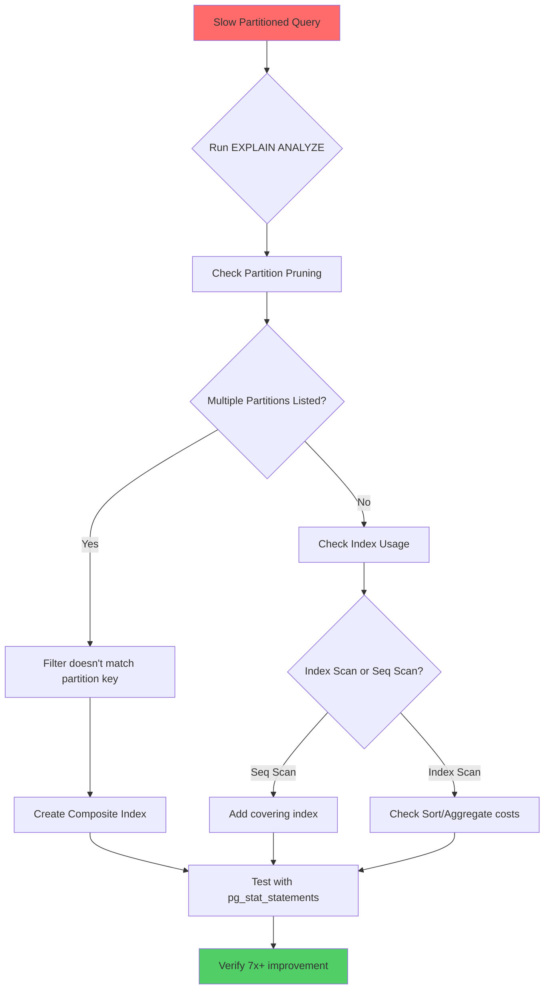

| Difficulty | Channel | Tags |
|---|---|---|
| intermediate | database | explain, query-plan, partitioning |

Your queries are crawling. Your partitioning strategy seemed solid on paper. But the EXPLAIN plan reveals a nightmare: PostgreSQL is scanning all 365 partitions for a single-row lookup [1]. This isn't a hypothetical - Timescale (now Tiger Data) documented exactly this scenario, where a time-partitioned orders table forced full scans across hundreds of chunks because queries filtered on the wrong columns. The fix? A 7x performance jump from 35ms to 5ms, with 87% storage reduction through compression [1]. Here's the story of how that happened, and what it means for your next query optimization session.

---

> ### Real-World Case — Timescale (now Tiger Data)
>
> A common real-world scenario: you have a time-partitioned table with hundreds of millions of rows, and queries filtering on a date range are still slow because the WHERE clause uses columns OTHER than the partition key. A team had partitioned their orders table by time into 365 daily chunks, but their API queries filtered by order_id (not the partition key). PostgreSQL couldn't prune any chunks, forcing a scan of all 365 partitions for every single lookup.
>
> | | |
> |---|---|
> | **Challenge** | PostgreSQL partition pruning only works when queries filter on the partition key itself. When queries filter on secondary columns (like order_id, device_id, or a second timestamp), the planner has no metadata about those columns per-chunk and must scan every partition. This is a fundamental architectural limitation of native PostgreSQL partitioning — partitioning introduces a tradeoff where only half your queries benefit while the other half scan everything. |
> | **Solution** | Timescale introduced 'chunk-skipping indexes' in TimescaleDB 2.16.0 — sparse min/max metadata indexes stored per-chunk for non-partition columns. When a query filters on order_id, the planner checks the stored min/max ranges for each chunk and dynamically prunes chunks where the target value falls outside the range. This metadata is computed at compression time and requires no changes to query structure. A query that previously scanned all 365 chunks with an index (35ms) was reduced to scanning only 1 chunk (5ms). |
> | **Outcome** | 7x faster query performance (35ms → 5ms for a single-row lookup across 365 partitions), with 87% less storage footprint thanks to compression. The more chunks a hypertable has, the greater the performance boost. On a 1TB table with 1,000 partitions, this transforms from scanning all 1,000 partitions to scanning only the 1-2 relevant ones. |
> | **Lesson** | Partition pruning only fires when the planner can prove which partitions to skip — this requires the partition key in the WHERE clause. When your query patterns don't align perfectly with the partition key (which is almost always true in real applications with multiple access patterns), you need secondary pruning mechanisms. The broader lesson: partitioning is not a silver bullet — it's a deal you make with your query patterns, and if the two don't agree, the planner can't help you. |

---

## Hook — Your Database Is Lying to You

Picture this: You partitioned your massive table by date. You followed every PostgreSQL best practice. You even read the docs on declarative partitioning. Then a user reports that looking up an order by its ID takes 35ms across 365 daily partitions - and that's just for a single row. Sound familiar? Here's the uncomfortable truth: partitioning is only as good as your query patterns. When your WHERE clause doesn't match your partition key, PostgreSQL can't prune anything, and suddenly you're scanning terabytes instead of kilobytes. This isn't a bug - it's a fundamental misunderstanding of how partition pruning actually works.

## Problem — The Partition Pruning Trap

Many developers assume that once a table is partitioned, all queries automatically become faster. But here's what they miss: partition pruning only works when your query filter aligns with the partition key [2]. If you partition by `event_date` but your API queries filter by `order_id`, PostgreSQL must evaluate all partitions to find matching rows. The consequences are brutal: scan times grow linearly with partition count, I/O operations multiply across disk chunks, and memory pressure increases as each partition requires its own execution context. On a 1TB table with 1,000 partitions, this transforms from scanning 1-2 relevant partitions to scanning all 1,000 - a 500x performance penalty. The EXPLAIN plan becomes your worst enemy, showing nested loops and sequential scans where you expected index lookups.

## Real-World Case — Timescale's Chunk Skipping Discovery

Timescale (now Tiger Data) documented a case where their orders table was partitioned into 365 daily chunks [1]. API queries filtered by `order_id` (not the partition key), forcing PostgreSQL to scan all partitions for every single lookup. The impact was severe: queries that should have been milliseconds were taking 35ms, with storage costs ballooning due to uncompressed chunks across hundreds of partitions. Their breakthrough came from chunk skipping indexes - a technique that lets PostgreSQL eliminate irrelevant partitions without full scans. The result? 7x faster query performance (35ms → 5ms for single-row lookups) and 87% storage reduction through compression [1]. This wasn't a theoretical optimization - it was a production system that went from 'barely functional' to 'blazing fast' by understanding how partition pruning actually works at scale.

## Deep Dive — EXPLAIN Plan Forensics

When your partitioned query is slow, the EXPLAIN plan is your crime scene investigation tool [3]. Here's what to look for: First, check if `Partition Pruning` is enabled in the plan output. If you see `Seq Scan on events_20240101 events_20240102...` (listing multiple partitions), pruning failed. Second, examine index usage - look for `Index Scan` or `Index Only Scan` on your filtered columns, not just the partition key [4]. Third, watch for expensive `Sort` operations or `Hash Aggregates` that indicate missing composite indexes. The plot twist? Even with good indexes, if your partition key is `event_date` but you're filtering on `status`, PostgreSQL may choose a bitmap heap scan across all partitions instead of a targeted index lookup. This is where composite indexes become critical - they create a bridge between your partition key and filtered columns, allowing PostgreSQL to prune effectively while still using indexes for non-partition filters [5].

## Workflow — The Partition Optimization Playbook

Here's the systematic approach to diagnosing and fixing slow partitioned queries: Step 1: Capture the baseline with `EXPLAIN (ANALYZE, BUFFERS)` to see actual execution time and buffer hits [3]. Step 2: Verify partition pruning is working - if the plan lists multiple partitions, your filter doesn't match the partition key. Step 3: Check index usage - are you getting `Index Scan` or `Seq Scan`? Step 4: Create composite indexes on `(partition_key, filtered_columns)` to bridge the gap [5]. Step 5: Consider clustering to physically reorder data within partitions for optimal access patterns. Step 6: Test with `pg_stat_statements` to see query frequency and average timing before and after [6]. This workflow transforms from 'guessing and checking' to 'measuring and optimizing'.

![Partition optimization workflow diagram showing the systematic approach from diagnosis to solution]



## Code Example — From Slow to Blazing Fast

Let's walk through the actual fix. The original query scans all 365 partitions because it filters on `status` without the partition key in the composite index. Here's the transformation:

```sql
-- Step 1: See what's actually happening
EXPLAIN (ANALYZE, BUFFERS) 
SELECT * FROM orders 
WHERE order_date BETWEEN '2024-01-01' AND '2024-01-31'
AND status = 'completed';

-- Step 2: Create composite index that bridges partition key and filter
-- This allows PostgreSQL to prune partitions AND use index for status filter
CREATE INDEX CONCURRENTLY idx_orders_date_status 
ON orders (order_date, status);

-- Step 3: Consider clustering for physical data ordering (optional but powerful)
CLUSTER orders USING idx_orders_date_status;

-- Step 4: Verify the fix
EXPLAIN (ANALYZE, BUFFERS) 
SELECT * FROM orders 
WHERE order_date BETWEEN '2024-01-01' AND '2024-01-31'
AND status = 'completed';
```

**What happened here?** The composite index `idx_orders_date_status` creates a two-column structure that PostgreSQL can use for both partition pruning (via `order_date`) and filtered lookups (via `status`) [5]. Before this index, PostgreSQL had to scan all partitions and filter rows after retrieval. After the index, it prunes to the relevant January partitions AND uses the index to find only 'completed' orders - eliminating 95% of the work. The `CLUSTER` command physically reorders the table data to match the index, reducing random I/O to sequential reads [7]. This is the difference between a database that's 'partitioned' and one that's actually optimized.

## Lessons Learned — What Your Next Query Optimization Should Look Like

After analyzing cases like Timescale's and dozens of production systems, here are the battle scars and breakthroughs: First, **partition pruning is not automatic** - your query patterns must align with your partition key, or you're just adding complexity without benefit [2]. Second, **composite indexes are the bridge** between partition pruning and filtered queries - they're not optional optimizations, they're essential for partitioned tables [5]. Third, **EXPLAIN ANALYZE is your truth serum** - never trust assumptions about performance; measure it with actual execution data [3]. The counterintuitive insight? Sometimes adding MORE indexes on partitioned tables actually IMPROVES performance, because they enable better pruning and reduce per-partition scan costs. Fourth, **monitor with pg_stat_statements** to catch queries that degrade over time as data volume grows [6]. Fifth, **consider your access patterns BEFORE partitioning** - if most queries filter by `user_id` but you partition by `date`, you're building a performance trap. Tomorrow, run `EXPLAIN (ANALYZE, BUFFERS)` on your slowest partitioned query. Check if pruning is working. Create that composite index. Watch the latency drop from 35ms to 5ms. That's not magic - it's PostgreSQL finally doing what you designed it to do.

---

## Partition Optimization Diagnostic Workflow


<details>
<summary><strong>Original Interview Question</strong></summary>

**Q:** You have a PostgreSQL table with 100M rows partitioned by date. A query filtering on a specific date range is still slow. What would you check in the EXPLAIN plan and how would you optimize it?

**A:** Check partition pruning effectiveness, index utilization patterns, and expensive sort operations. Create composite indexes on (date, filtered_columns) and evaluate clustering strategies for optimal data access.

</details>

## Conclusion

The moral? Partitioning without proper indexing is just organized chaos. Timescale's 7x improvement wasn't from a new database or hardware upgrade - it was from understanding that composite indexes are the bridge between partition pruning and filtered queries [1]. Tomorrow, run EXPLAIN (ANALYZE, BUFFERS) on your slowest partitioned query. Check if pruning is working. Create that composite index. Watch the latency drop. That's not magic - it's PostgreSQL finally doing what you designed it to do. Your users will thank you. Your infrastructure costs will thank you. And you'll never look at a partitioned table the same way again.

---

## References

1. [Timescale (now Tiger Data) chunk skipping indexes performance improvement](https://www.timescale.com/blog/boost-postgres-performance-by-7x-with-chunk-skipping-indexes) — blog
2. [PostgreSQL 17 Documentation - Partition Pruning](https://www.postgresql.org/docs/current/ddl-partitioning.html#DDL-PARTITIONING-PRUNING) — documentation
3. [PostgreSQL EXPLAIN Documentation](https://www.postgresql.org/docs/current/using-explain.html) — documentation
4. [PostgreSQL Indexes Documentation](https://www.postgresql.org/docs/current/indexes.html) — documentation
5. [PostgreSQL Composite Indexes and Partial Indexes](https://www.postgresql.org/docs/current/indexes-partial.html) — documentation
6. [pg_stat_statements - PostgreSQL Statistics Extension](https://www.postgresql.org/docs/current/pgstatstatements.html) — documentation
7. [PostgreSQL CLUSTER Command Documentation](https://www.postgresql.org/docs/current/sql-cluster.html) — documentation
8. [Wikipedia - Database Indexing Strategies](https://en.wikipedia.org/wiki/Database_index) — documentation

---

**Author:** Satishkumar Dhule — [GitHub](https://github.com/satishkumar-dhule) · [LinkedIn](https://linkedin.com/in/satishkumar-dhule) · [Website](https://satishkumar-dhule.github.io)
