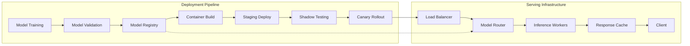

| Difficulty | Channel | Tags |
|---|---|---|
| beginner | devops | mlops, deployment |

In 2015, Uber's ML teams were drowning in infrastructure chaos. Every model was sealed into a custom Docker container, every update required a full service redeployment, and the median time from 'model trained' to 'model serving traffic' was a staggering six weeks [1]. Engineers spent 60–70% of their time fighting infrastructure instead of building models. This is the story of how Uber escaped that hell — and what every developer can learn about the critical difference between model deployment and model serving.

---

> ### Real-World Case — Uber
>
> By 2015, Uber's ML landscape was fragmented chaos. Each team built custom one-off serving containers and deployment scripts. The median time from 'model trained' to 'model serving traffic' was 6 weeks, and ML engineers spent 60-70% of their time on infrastructure, not modeling. Models were sealed into Docker images alongside application code, meaning every model update required a full service redeployment.
>
> | | |
> |---|---|
> | **Challenge** | Uber needed to decouple model deployment (CI/CD, versioning, artifact management) from model serving (runtime inference, request routing, autoscaling) at global scale. The conflation of these concerns created a bottleneck where model iteration was gated by service deployment cycles, and the growing number of models caused memory bloat, GC pauses, and OOM errors in serving containers. |
> | **Solution** | Uber built Michelangelo, an end-to-end ML platform with two separate layers: (1) a Model Deployment Service handling CI/CD pipelines, artifact validation, staged rollouts (staging → canary → production), and auto-retirement; and (2) a Real-time Prediction Service handling runtime inference with dynamic model loading, model version routing via UUID/tags, built-in A/B testing, and auto-shadow deployments. The key innovation was dynamic model loading — serving instances poll a Model Artifact & Config store and load/unload models at runtime without service restarts, completely decoupling the model lifecycle from the service lifecycle. |
> | **Outcome** | Today Michelangelo runs 400+ active ML use cases, executes 20,000+ training jobs per month, and serves 15M+ real-time predictions per second at peak with P95 latency under 5ms for tree-based models. Deployment time dropped from weeks to hours. Dynamic model loading eliminated the coupling between model and service releases. Auto-retirement reduced memory footprint significantly. Shadow testing now covers 75%+ of critical online models. The entire platform has been battle-tested across Uber's 25M+ daily trips in 10,000+ cities. |
> | **Lesson** | The single most impactful decision was separating 'what models to run' (a deployment concern managed through CI/CD) from 'how to run them' (a serving concern managed through a prediction service with dynamic loading). Conflating model deployment with service deployment creates a bottleneck that slows iteration and increases risk. Treating models as hot-swappable artifacts referenced by config, rather than baked into container images, enables independent velocity for ML teams and infrastructure teams alike. |

---

## Hook — The 6-Week Deployment Nightmare

Picture this: your team just trained a breakthrough model. It crushes every benchmark. The business is waiting. But deploying it to production? That is a six-week odyssey involving custom Docker images, manual infrastructure scripts, and a full service redeployment for every single change. Sound familiar? Before 2015, this was daily life at Uber. Each team built their own one-off serving containers. There was no shared platform, no standardized pipeline, and no way to update a model without redeploying an entire service [1]. ML engineers were not modeling — they were babysitting infrastructure.

## Problem — The Great Deployment Confusion

Here is a question that trips up even senior engineers: what is the difference between model deployment and model serving? Many developers use the terms interchangeably, but treating them as the same thing is exactly what leads to the kind of chaos Uber experienced. Deployment is the **pipeline** — CI/CD, infrastructure provisioning, monitoring, rollback strategies. Serving is the **runtime** — inference APIs, request routing, model loading, latency optimization. Confuse the two, and you end up baking models into application code, coupling model releases to service releases, and wondering why your deployment pipeline takes weeks instead of minutes.

## Real-World Case — Uber Michelangelo

Uber's response to this crisis was **Michelangelo**, their internal ML platform that has since become a case study in ML infrastructure done right. The transformation was dramatic. Today, Michelangelo runs 400+ active ML use cases, executes 20,000+ training jobs per month, and serves 15 million real-time predictions per second at peak — all with P95 latency under 5ms for tree-based models [1]. Deployment time dropped from weeks to hours. Dynamic model loading eliminated the coupling between model and service releases. Shadow testing now covers 75%+ of critical online models. The platform has been battle-tested across Uber's 25 million daily trips in 10,000+ cities. The key insight? They separated the *what* (deployment infrastructure) from the *how* (runtime serving).

## Deep Dive — Deployment vs Serving: The Technical Taxonomy

The distinction between deployment and serving is not academic — it has real consequences for architecture, scalability, and team velocity.

**Deployment** covers the full lifecycle: infrastructure provisioning (Kubernetes, Terraform), CI/CD pipelines (GitHub Actions, Jenkins), model registry (MLflow, SageMaker), A/B testing infrastructure, monitoring and alerting (Prometheus, Grafana), and rollback strategies. Think of deployment as the *factory* that builds, tests, and ships the model.

**Serving** covers runtime concerns: inference API endpoints (FastAPI, gRPC), model servers (TensorFlow Serving, TorchServe, BentoML), request routing and load balancing (NGINX, Envoy), autoscaling policies, model versioning for seamless rollouts, and latency optimization through batching and caching. Think of serving as the *engine* that runs the model in real time [2][3][4].

The critical trade-offs emerge when these two worlds collide:

| Dimension | Deployment | Serving |
|-----------|-----------|---------|
| Primary concern | Reliability, repeatability | Latency, throughput |
| Failure mode | Failed rollout, config drift | Timeout, OOM, cold start |
| Scaling approach | Horizontal (pod replicas) | Vertical (GPU memory) + horizontal |
| Monitoring metric | Deployment success rate | P50/P95/P99 latency |
| Update strategy | Blue-green, canary | Model version routing |
| Key tooling | K8s, Terraform, CI/CD | Model servers, load balancers |

**🔥 Hot Take:** If your model update requires a service redeployment, you have already lost. The goal is dynamic model loading where models can be swapped without touching application code.

## Workflow — From Training to Production Inference

Here is the end-to-end pipeline that separates deployment concerns from serving concerns. The key architectural insight is the **model registry** — a shared boundary where deployment ends and serving begins.



The deployment pipeline (left) ensures the model is validated, containerized, and promoted through environments. Once a model version is registered, the serving layer (right) can load it dynamically without any deployment — the model router simply points to the new version. This is the decoupling that Uber's Michelangelo platform pioneered [1].

**⚠️ Watch Out:** Shadow testing is your safety net. Deploy a model to serve traffic silently alongside your current version, compare predictions, and only promote when you detect regressions. Uber uses shadow testing on 75%+ of critical online models for exactly this reason [1].

## Code Example — A Decoupled Serving Architecture with FastAPI

Here is a practical implementation that separates model loading from the serving API. This is the pattern every ML service should follow:

```python
import asyncio
import logging
from typing import Dict, Optional
import numpy as np
from fastapi import FastAPI, HTTPException
from pydantic import BaseModel

app = FastAPI(title="Model Serving API")

# In-memory model registry — maps version -> loaded model
_model_registry: Dict[str, object] = {}
_active_version: Optional[str] = None

class PredictionRequest(BaseModel):
    features: list[float]
    model_version: Optional[str] = None  # allows client-side version pinning

class PredictionResponse(BaseModel):
    prediction: float
    model_version: str
    latency_ms: float

@app.on_event("startup")
async def warm_up():
    """Pre-load the default model version on startup to avoid cold starts."""
    default_version = "v1.0.0"
    _model_registry[default_version] = await load_model(default_version)
    global _active_version
    _active_version = default_version
    logging.info(f"Loaded default model: {default_version}")

async def load_model(version: str) -> object:
    """Simulates loading a model from a registry.
    In production, this would download from S3/MLflow and deserialize."""
    await asyncio.sleep(0.1)  # simulated load time
    return {"version": version, "weights": np.random.randn(10)}

@app.post("/predict", response_model=PredictionResponse)
async def predict(request: PredictionRequest):
    """Run inference using the specified model version.
    Falls back to the active version if none specified."""
    version = request.model_version or _active_version
    
    if version not in _model_registry:
        # Hot-load the model version on demand (dynamic model loading)
        try:
            _model_registry[version] = await load_model(version)
        except Exception as e:
            raise HTTPException(status_code=404, detail=f"Model {version} not found")
    
    start = asyncio.get_event_loop().time()
    model = _model_registry[version]
    features = np.array(request.features)
    prediction = float(np.dot(features, model["weights"]))
    latency = (asyncio.get_event_loop().time() - start) * 1000
    
    return PredictionResponse(
        prediction=prediction,
        model_version=version,
        latency_ms=round(latency, 2)
    )

@app.post("/admin/rollout")
async def set_active_version(version: str):
    """Canary rollout: swap the active model version without redeployment.
    Model must already be loaded in the registry."""
    if version not in _model_registry:
        raise HTTPException(status_code=404, detail=f"Model {version} not loaded")
    global _active_version
    _active_version = version
    return {"status": "ok", "active_version": version}
```

**Explanation:** This example demonstrates the deployment-serving separation. The `startup` event pre-loads a default model to prevent cold starts — a common pitfall that can spike latency by 10x. The `_model_registry` dictionary acts as an in-memory model catalog, supporting dynamic model loading through the `/predict` endpoint. Clients can optionally pin a specific model version for A/B testing. The `/admin/rollout` endpoint enables canary rollouts: load a new model version silently, run shadow predictions, then flip `_active_version` with zero downtime. Notice that model loading (`load_model`) is completely decoupled from the request handling — you can add new versions to the registry without any code change or service restart [5][6].

**💡 Insight:** This pattern eliminates the coupling between model and service releases. Your data scientists can push new model versions independently of your platform team's deployment schedule.

## Lessons Learned — What Uber's Pain Taught the Industry

The ML community learned hard lessons from Uber's six-week deployment nightmare. Here is what matters most:

1. **Separate deployment from serving.** Treat them as distinct systems with different concerns, tooling, and metrics. Deployment is about reliability; serving is about latency. Never bake a model into your application code [1].

2. **Invest in a model registry.** The registry is the boundary between the two worlds. It is where validated models are stored, versioned, and made available to the serving layer. MLflow and SageMaker both provide this pattern [7][8].

3. **Shadow test before you canary.** Never trust a model in production without comparing its predictions against the current champion. Shadow testing catches silent regressions before they reach users.

4. **Cold starts are the enemy of latency.** Pre-warm your model workers, use model caching, and consider batching for throughput-sensitive workloads. Uber achieves sub-5ms P95 latency by aggressively pre-loading models [1].

5. **Dynamic model loading is non-negotiable.** If your architecture requires a deploy to update a model, you have coupled serving to deployment. Fix it. Dynamic model loading is what brought Uber's deployment time from weeks to hours.

**🎯 Key Point:** The companies that win at ML in production are not the ones with the best models — they are the ones that can ship, iterate, and roll back models faster than anyone else.

---

## ML Deployment Pipeline vs Serving Architecture


<details>
<summary><strong>Original Interview Question</strong></summary>

**Q:** Explain the key differences between model serving and model deployment in ML systems, including specific technologies, scaling considerations, and real-world implementation patterns?

**A:** Deployment encompasses CI/CD pipelines, infrastructure setup, and monitoring using tools like Kubernetes, MLflow, and SageMaker. Serving focuses on runtime inference APIs with frameworks like TensorFlow Serving, TorchServe, or BentoML, handling request routing, model versioning, and autoscaling. Key trade-offs include latency vs throughput, batch vs real-time inference, and cold start optimization.

</details>

## Conclusion

The line between deployment and serving is the single most important architectural boundary in production ML. Uber learned this the hard way — six weeks per deploy, 70% of engineering time lost to infrastructure. The fix was not a better model. It was a better separation of concerns. Build a model registry, decouple your serving layer from your deployment pipeline, and never let a model update require a service redeployment. Your future self — and your on-call rotation — will thank you.

---

## References

1. [Uber: Continuous Integration and Deployment for ML](https://www.uber.com/blog/continuous-integration-deployment-ml/) — blog
2. [Kubernetes Architecture Overview](https://kubernetes.io/docs/concepts/architecture/) — documentation
3. [TensorFlow Serving Guide](https://www.tensorflow.org/tfx/guide/serving) — documentation
4. [BentoML Documentation](https://docs.bentoml.com/en/latest/) — documentation
5. [TorchServe: PyTorch Model Serving](https://pytorch.org/serve/) — documentation
6. [MLflow Documentation](https://mlflow.org/docs/latest/index.html) — documentation
7. [AWS SageMaker Developer Guide](https://docs.aws.amazon.com/sagemaker/latest/dg/whatis.html) — documentation
8. [Envoy Proxy Architecture Overview](https://www.envoyproxy.io/docs/envoy/latest/) — documentation
9. [Docker Overview](https://docs.docker.com/get-started/) — documentation
10. [GitHub Actions Documentation](https://docs.github.com/en/actions) — documentation

---

**Author:** Satishkumar Dhule — [GitHub](https://github.com/satishkumar-dhule) · [LinkedIn](https://linkedin.com/in/satishkumar-dhule) · [Website](https://satishkumar-dhule.github.io)
