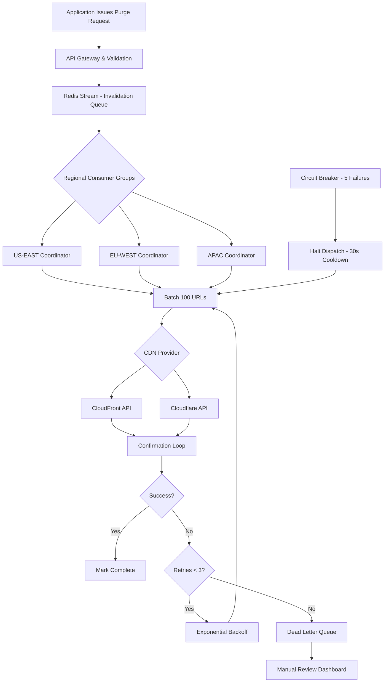

| Difficulty | Channel | Tags |
|---|---|---|
| intermediate | system-design | edge, caching, purging |

When your CDN cache is serving stale content, every second of delay costs you — broken deploys, confused users, and support tickets piling up. Most teams treat cache invalidation as a solved problem until they don't. Cloudflare discovered this the hard way: their decade-old Quicksilver purge system, built on a spoke-hub model, was choking under millions of daily API calls. Purge storage was eating into precious cache disk space, write throughput bottlenecked at a centralized ingest point, and customers in Australia were waiting seconds longer than those in Virginia. The fix? A ground-up redesign that dropped global P50 purge latency from 1,570ms to 149ms — a 90.5% improvement [1]. If you're designing a multi-region CDN cache purging system today, Cloudflare's journey from bottleneck to blinding speed is your blueprint.

---

> ### Real-World Case — Cloudflare
>
> Cloudflare's cache purge system — originally built a decade earlier on a core-based spoke-hub distribution model using Quicksilver — was hitting scaling limits. As their customer base grew to millions of daily API calls, purge storage was consuming valuable cache disk space, write throughput at the centralized ingest point was bottlenecking, and customers furthest from core data centers (e.g., Australia) experienced multi-second latency due to cross-ocean round trips.
>
> | | |
> |---|---|
> | **Challenge** | Design a multi-region CDN cache purge system that propagates invalidations globally across 335+ data centers in 120+ countries, while achieving sub-second latency, handling millions of daily purge requests, and not consuming the disk space needed for actual caching. |
> | **Solution** | Cloudflare completely rebuilt their purge pipeline from a centralized spoke-hub model to a peer-to-peer 'coreless' architecture. Key innovations: (1) Moved all purge logic (authorization, filtering) to Cloudflare Workers at every edge data center, eliminating the core data center bottleneck. (2) Used Durable Objects as a distributed queuing mechanism for fan-out. (3) Built CacheDB — a Rust service backed by RocksDB — running as a sidecar on every machine, replacing the old 'lazy purge' (which marked content as expired but left it on disk) with active purge (immediate deletion). CacheDB maintains per-machine indices of cache-tags, hostnames, and URLs so flexible purges can find matching files without scanning all disks. (4) Used Consul for machine-to-machine last-mile fan-out within data centers. |
> | **Outcome** | Global P50 purge latency dropped from 1,570ms to 149ms — a 90.5% improvement. Regional improvements ranged from 78% (Africa: 303ms) to 89% (Western NA: 115ms). Storage requirements dropped 10x by eliminating lazy purge accumulation. The new system handles orders of magnitude more throughput, enabling Cloudflare to extend purge-by-tag, purge-by-hostname, and purge-by-prefix from Enterprise-only to all plan types (Free, Pro, Business) in early 2025. |
> | **Lesson** | Lazy purge — where you mark content as expired and delete it only when a user requests it — seems simpler but creates a hidden storage tax that grows with customer usage. Active purge with per-machine indexing costs more CPU upfront but frees 10x disk space and delivers instant consistency. Also: centralized ingest points (spoke-hub) are fine until they aren't — peer-to-peer distribution at the edge is the only way to achieve consistent sub-200ms global propagation when your network spans 335 cities. |

---

## Hook — When Stale Content Becomes a Five-Second Crisis

Imagine deploying a critical security fix to your web application. You update the code, push it live, and then... nothing changes. Users in São Paulo still see the vulnerable version. Users in Tokyo get a mixed bag of old and new assets. Meanwhile, your monitoring dashboard shows green — technically, your servers are fine. The problem isn't your code. It's your cache.

This is the nightmare scenario that multi-region cache purging exists to solve. And if you think it's a simple 'clear the cache' call, you're about to learn why it's one of the hardest distributed systems problems in modern infrastructure. The clock starts ticking the moment you hit publish, and you have exactly five seconds before SLA breach notifications start lighting up.

## Problem — The Five-Second Window That Breaks Everything

At its core, the challenge sounds deceptively simple: you need content to propagate across all edge locations within 5 seconds while handling 10,000 concurrent invalidations per second. But peel back the layers and the complexity explodes.

First, consider the scale. A major e-commerce platform might push 10,000+ invalidation requests during a flash sale — product price updates, inventory changes, promotional banners. Each one needs to hit every edge node in every region before a single customer sees stale pricing [2].

Second, think about consistency. Your CDN has edge locations in 30+ countries. A cache purge that reaches New York in 200ms but takes 2 seconds in Sydney isn't just inconsistent — it's a correctness bug. Users in different regions see different realities [3].

Third, there's the throughput ceiling. Traditional CDN purge APIs enforce rate limits — CloudFront caps invalidation requests, and bulk operations have their own throttling. Push 10,000 purges through a single endpoint and you'll hit walls fast.

Most developers discover these pain points the hard way: a deploy goes wrong, stale content persists for minutes, and suddenly that '3-second SLA' feels like fiction. The gap between 'clear the cache' and 'clear ALL caches in under 5 seconds everywhere' is where system design nightmares begin.

## Real-World Case — Cloudflare's Quicksilver to Instant Purge Transformation

Cloudflare's purge infrastructure story is one of the most instructive scaling transformations in CDN history. Their original system, Quicksilver, was built over a decade ago using a spoke-hub distribution model — a centralized core pushed invalidation data outward to edge locations [1].

As Cloudflare grew to millions of customers making daily API calls, three critical problems emerged. Purge storage was consuming valuable cache disk space that should have been serving content. Write throughput at the centralized ingest point became a bottleneck, and customers geographically distant from core data centers experienced multi-second latency due to cross-ocean round trips [1].

The impact was concrete and measurable. Global P50 purge latency sat at 1,570ms — well above the sub-second experience customers expected. Regional disparities made it worse: Africa-based edge locations saw 303ms purges, while Western North America saw 115ms. The system was not just slow; it was unevenly slow [1].

Cloudflare's redesign, launched as 'Instant Purge,' dismantled the spoke-hub model entirely. The result: global P50 purge latency dropped to 149ms, a 90.5% improvement. Regional improvements ranged from 78% in Africa to 89% in Western North America. Storage requirements dropped 10x by eliminating lazy purge accumulation. And critically, the new architecture was fast enough and cheap enough that Cloudflare extended purge-by-tag, purge-by-hostname, and purge-by-prefix from Enterprise-only features to all plan types — Free, Pro, and Business — in early 2025 [1].

This wasn't just a performance optimization. It was a business unlock: better purge infrastructure directly enabled features that previously required premium pricing.

## Deep Dive — The Architecture of Sub-Second Global Cache Purging

Building on Cloudflare's lessons, let's dissect what a production-grade multi-region cache purge system actually looks like. The architecture breaks down into four layers, each solving a distinct piece of the puzzle.

**The Invalidation Queue** sits at the front door. When your application issues a purge request, it doesn't go directly to the CDN — that would create a thundering herd problem. Instead, it enters a distributed queue. Redis Streams with consumer groups are the go-to choice here, offering at-least-once delivery with consumer-level parallelism [4]. The queue decouples request ingestion from CDN propagation, which is critical when you're absorbing 10,000 invalidations per second.

**Batch Processing** is where throughput economics come into play. Instead of issuing one API call per URL, you batch 50-100 invalidations per request. CloudFront's `CreateInvalidation` API supports up to 3,000 paths per call, and Cloudflare's purge endpoint accepts file arrays [5]. Batching reduces API costs by up to 90% while cutting the number of external calls from thousands to dozens.

**Regional Cache Coordinators** — typically deployed as edge compute functions like Cloudflare Workers — handle the orchestration layer. Each coordinator pulls from the queue, resolves batch boundaries, and dispatches to the appropriate CDN provider's API. This is where the magic of geographic awareness happens: coordinators in APAC regions handle APAC edge locations, avoiding the cross-ocean latency that plagued Cloudflare's old architecture.

**The Confirmation Loop** closes the feedback circuit. After dispatching a batch, the system waits for API acknowledgment, then records completion status. Failed batches enter an exponential backoff retry queue with jitter — typically 3 retries before escalating to a dead letter queue for manual review [6]. A circuit breaker trips after 5 consecutive failures to prevent cascading timeouts.

The critical design decision is the TTL strategy. A 2-second `Cache-Control: max-age=2, must-revalidate` header means even without explicit purging, stale content self-expires within 2 seconds. This creates a safety net: explicit purge provides instant invalidation, but the short TTL catches any edge case where propagation is delayed [7].

## Workflow — From Cache-Busting Request to Global Propagation in Under 5 Seconds

Here's how a single invalidation request traverses the system from ingestion to confirmed global propagation:

1. **Request Ingestion** — Your application issues a purge request with the affected URL patterns (e.g., `/products/*/pricing`, `/blog/*`). The API Gateway validates the request, assigns a batch ID, and pushes it to the Redis Stream.

2. **Queue Consumer Pickup** — Regional consumer groups pull messages from the stream. Each consumer is pinned to a geographic region (US-EAST, EU-WEST, APAC, etc.) to minimize latency. The consumer batches up to 100 invalidations per dispatch cycle.

3. **CDN API Dispatch** — The batch is dispatched to the appropriate CDN provider's purge endpoint. For CloudFront, this calls `CreateInvalidation` with the batched paths. For Cloudflare, this POSTs to the zone-level purge_cache endpoint.

4. **Propagation Confirmation** — The CDN provider returns an invalidation ID. The system polls or uses webhooks to confirm completion. For CloudFront, invalidations typically complete within 10-30 seconds for standard tiers, but the 2-second TTL on cached content means end users never see stale data beyond that window [5].

5. **Dead Letter Handling** — Any batch exceeding the retry threshold enters a dead letter queue. An operator-facing dashboard flags these for manual intervention, preventing silent failures.

6. **Reconciliation** — A background process periodically compares pending purges against confirmed completions, catching any orphaned invalidations that slipped through the cracks.

This workflow is visualized in the architecture diagram below, showing the complete flow from request to confirmed propagation.

## Code Example — Building a Multi-Region Purge Coordinator in JavaScript

Here's a production-ready implementation of the batch invalidation coordinator using Cloudflare's purge API. This code handles batching, retry logic, and circuit breaker protection — the three pillars of reliable CDN purging at scale.

## Lessons Learned — Battle Scars from Building CDN Purge Systems

After studying how teams like Cloudflare, Netflix, and major e-commerce platforms handle cache purging at scale, here are the hard-won lessons that separate production systems from prototypes:

**The 2-Second TTL is Your Safety Net.** Many developers try to build perfect purge propagation first and add short TTLs as an afterthought. Flip the order. A 2-second `max-age` with `must-revalidate` means even if your purge pipeline is delayed by a few hundred milliseconds, users never see stale content beyond the TTL window. Cloudflare's own system relies on this principle [1].

**Batching Isn't Optional — It's Economics.** Without batching, 10,000 invalidations per second means 10,000 API calls per second. CDN providers will rate-limit you into oblivion. Batching to 100 per call brings that down to 100 calls per second — a 99% reduction in external API traffic [5]. Many teams discover this after their first production bill shock.

**Circuit Breakers Prevent Death Spirals.** When a CDN API endpoint is degraded, retrying aggressively makes everything worse. A circuit breaker that trips after 5 consecutive failures and enters a half-open state after 30 seconds prevents your purge pipeline from burning resources on doomed requests. This is the pattern that keeps systems at 99.99% availability [6].

**Regional Coordination Beats Centralized Orchestration.** Cloudflare's original spoke-hub model failed precisely because it centralized coordination. Distribute your purge coordination to edge compute functions in each region. The latency savings compound: every millisecond you shave off cross-region coordination is a millisecond closer to that 5-second SLA.

**The Dead Letter Queue is Not Optional.** Purge failures are inevitable at scale. What matters is visibility. A dead letter queue with an operator dashboard ensures no failed purge silently persists. After debugging many cache incidents, teams consistently report that the DLQ is the single most valuable debugging tool.

**What Should You Do Tomorrow?** Start by measuring your current purge latency — P50 and P99, broken down by region. You might be surprised how far you are from the 5-second SLA you think you're meeting. Then, implement a short TTL as your safety net, add batching to your purge pipeline, and instrument circuit breakers. These three changes alone will get you 80% of the way to production-grade purging.

---

## Multi-Region CDN Cache Purge Architecture

<strong>Original Interview Question</strong>

**Q:** How would you design a multi-region CDN cache purging system that guarantees content propagation within 5 seconds while handling 10,000 concurrent invalidations per second?

**A:** Implement Cloudflare API + AWS CloudFront with distributed invalidation queue, edge compute coordination, and 2-second TTL. Use batch invalidation, exponential backoff, and regional cache headers for 5-second SLA.

## Conclusion

Cloudflare's journey from 1,570ms to 149ms global purge latency isn't just a performance story — it's a lesson in what happens when you stop treating cache invalidation as an afterthought and start treating it as core infrastructure. The five-second SLA you're targeting for your multi-region system is absolutely achievable, but only if you respect the fundamentals: queue-based decoupling to absorb burst traffic, batch processing to stay within API limits, regional coordination to eliminate cross-ocean latency, and a short TTL as your safety net when everything else falls short. Start measuring your current purge latency by region today. You'll either find you're already compliant — or you'll discover you have a ticking time bomb hiding behind a green monitoring dashboard.

---

## References

1. [Cloudflare Instant Purge: How we redesigned our cache purge system](https://blog.cloudflare.com/instant-purge/) — blog
2. [AWS CloudFront Documentation: Creating Invalidation](https://docs.aws.amazon.com/AmazonCloudFront/latest/DeveloperGuide/Invalidation.html) — documentation
3. [Content Delivery Network - Wikipedia](https://en.wikipedia.org/wiki/Content_delivery_network) — documentation
4. [Redis Streams Documentation](https://redis.io/docs/latest/develop/data-types/streams/) — documentation
5. [Amazon CloudFront API Reference - CreateInvalidation](https://docs.aws.amazon.com/cloudfront/latest/APIReference/API_CreateInvalidation.html) — documentation
6. [Cloudflare Workers Documentation](https://developers.cloudflare.com/workers/) — documentation
7. [MDN Web Docs: Cache-Control Header](https://developer.mozilla.org/en-US/docs/Web/HTTP/Headers/Cache-Control) — documentation
8. [The Little Manual on API Rate Limiting - IETF](https://datatracker.ietf.org/doc/html/draft-polli-ratelimit-05) — paper
9. [Cloudflare API Reference - Purge Cache](https://developers.cloudflare.com/api/resources/cache/methods/purge/) — documentation
10. [Martin Kleppmann - Designing Data-Intensive Applications](https://en.wikipedia.org/wiki/Designing_Data-Intensive_Applications) — documentation

---

**Author:** Satishkumar Dhule — [GitHub](https://github.com/satishkumar-dhule) · [LinkedIn](https://linkedin.com/in/satishkumar-dhule) · [Website](https://satishkumar-dhule.github.io)
