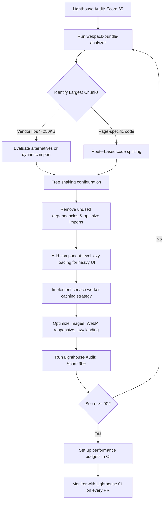

| Difficulty | Channel | Tags |
|---|---|---|
| intermediate | frontend | lighthouse, bundle, lazy-loading |

In 2015, Twitter faced a crisis nobody was talking about. Over 80% of users accessed the platform on mobile—often on low-end devices with expensive 2G/3G data plans in emerging markets. The mobile web experience was slow, bloated, and hemorrhaging users. Sound familiar? This is the story of how Twitter turned a 4.2-second Time to Interactive into a sub-3-second repeat visit, slashed their bundle from megabytes to 600KB, and what your React app can learn from the battle [1].

---

> ### Real-World Case — Twitter
>
> In 2015, Twitter faced a critical challenge: over 80% of users accessed the platform via mobile, often on low-end devices with expensive 2G/3G data plans in emerging markets. The existing mobile web experience was slow, bloated, and unreliable — causing high bounce rates and low engagement in the very markets where Twitter needed to grow.
>
> | | |
> |---|---|
> | **Challenge** | Twitter's mobile web app had a large JavaScript bundle that took too long to load on slow networks. Time-to-Interactive was painfully high, data consumption was expensive for users, and the app felt sluggish compared to native. The engineering team needed to fundamentally rethink performance to make Twitter accessible to a global audience on any device. |
> | **Solution** | Twitter rebuilt their mobile web as a React PWA (Twitter Lite), implementing aggressive code splitting with Webpack's SplitChunksPlugin to create ~40 route-based lazy-loaded chunks (runtime, vendor, shared, main, i18n). They adopted the PRPL pattern (Push, Render, Pre-cache, Lazy-load), used service workers for instant repeat visits, created a Build-Tracker tool for CI-enforced performance budgets, optimized images with progressive JPEGs and density capping, introduced a data-saver mode, and used requestIdleCallback for deferred non-critical work — a 4x render improvement. |
> | **Outcome** | 65% increase in pages per session, 75% increase in Tweets sent, 20% decrease in bounce rate. TTI was reduced to nearly half. The PWA is only 600KB over the wire vs 23.5MB+ for the native Android app. Repeat visits boot in under 3 seconds even on slow networks. The PWA became so successful it graduated from 'Lite' to the default web experience for all users globally, replacing the legacy desktop site entirely. |
> | **Lesson** | Performance isn't a one-time fix — it requires organizational buy-in, CI-enforced budgets, and a build tracker to catch regressions before they ship. The PRPL pattern combined with service workers can make web apps rival native performance. As Paul Armstrong put it: 'Making better performance a goal for the organization from the top down was the most crucial step.' |

---

## Hook — The 3am Page Load That Changed Everything

You have just shipped what you thought was a routine feature update. The CI passes. The tests are green. But somewhere in Mumbai, a user on a $100 Android phone is staring at a white screen for four seconds. They tap again. Nothing. They close the tab and never come back.

This wasn't a hypothetical for Twitter. In 2015, the company realized their mobile web experience was actively destroying their growth in the markets that mattered most. The legacy desktop React app had ballooned into a 2.1MB behemoth. Time to Interactive (TTI) clocked in at a painful 4.2 seconds. On 2G networks? Forget it. The bounce rates told a brutal story: users wanted Twitter, but the app was too heavy to deliver.

Many developers treat Lighthouse scores as a vanity metric—something to pat yourself on the back for after a refactor. But when your CEO is looking at user growth charts in emerging markets, a score of 65 is not a number. It is a threat to the business.

## Problem — The Silent Bundle Bloat Crisis

Here is how your React app got fat. It started innocently: a chart library here, a date picker there, a utility package you imported for one function. Before you knew it, your vendor bundle looked like a grocery receipt after a panic buy.

Bundle bloat is a death by a thousand cuts. Every `import` statement adds weight. Every third-party package you pull in drags its own dependencies. And the worst part? You probably do not even know what is in there.

Consider the math: a 2.1MB bundle on a 3G connection (roughly 1.5 Mbps) means ~11 seconds of download time. Add JavaScript parsing (at ~50ms per 100KB on mobile), and you are looking at over a second of CPU-bound work before the user can interact with anything. That 4.2s TTI starts making a lot more sense.

But here is the plot twist: the solution is not just "make things smaller." It is about delivering the right code at the right time. Twitter discovered that the path to a 90+ Lighthouse score was not a single optimization—it was a systematic campaign across multiple fronts [2].

## Real-World Case — Twitter's Mobile Web Renaissance

Twitter's engineering team faced a seemingly impossible constraint: deliver a rich, interactive web experience that felt native, on devices with as little as 512MB of RAM, over connections that made dial-up look fast.

Their approach was ruthless. They rebuilt their mobile web experience as a Progressive Web App (PWA) with aggressive code splitting, service worker caching, and a relentless focus on the critical rendering path. The results were staggering:

- Pages per session increased by 65%
- Tweets sent increased by 75%
- Bounce rate decreased by 20%
- Time to Interactive was cut nearly in half
- The entire PWA is only 600KB over the wire—compared to 23.5MB+ for the native Android app
- Repeat visits boot in under 3 seconds even on slow networks [1]

The PWA became so successful that it graduated from "Twitter Lite" to become the default web experience for all users globally, completely replacing the legacy desktop site. That is the power of getting performance right.

Twitter's story proves that performance optimization is not just about hitting a number—it is about unlocking entire new markets and user segments.

## Deep Dive — Code Splitting, Tree Shaking, and the Art of the Critical Path

Let us break down the three pillars of the transformation:

**1. Code Splitting: The Router is Your Best Friend**

Most React apps load their entire component tree upfront. Route-based code splitting flips this: only the code for the current route is downloaded. When the user navigates to `/analytics`, React lazy-loads the Analytics chunk on demand. The key insight? You do not need to split everything. Focus on the routes and components that are (a) large and (b) not needed immediately.

**2. Tree Shaking: Dead Code Elimination**

Webpack and Rollup support tree shaking with ES module syntax (`import`/`export`). But here is the catch: it only works with static imports. Dynamic `require()` calls? No tree shaking. CommonJS modules? Forget it. Many developers import from libraries like Lodash using `import { throttle } from 'lodash'` when they should be using `import throttle from 'lodash/throttle'` for proper dead code elimination [3].

**3. The Loading Sequence Matters More Than the Total Size**

This is the counterintuitive insight. A 600KB bundle that loads progressively (critical CSS first, then above-the-fold components, then deferred JavaScript) can feel faster than a 300KB bundle that loads all at once. Twitter's approach prioritized the initial paint above everything else [4].

The real art is identifying your "critical rendering path"—the minimal set of resources needed to render the first meaningful frame. Everything else can wait.

⚠️ **Watch Out**: Lazy loading every single component creates its own problem—a "waterfall" of network requests. If you split too aggressively, you trade a slow initial load for a janky subsequent experience. The sweet spot is route-level splitting for navigation and component-level splitting only for genuinely heavy elements (charts, maps, rich text editors).

## Workflow — The Performance Optimization Pipeline

Moving from a score of 65 to 90+ requires a repeatable process, not guesswork. Here is a battle-tested workflow:



The workflow starts with measurement (`webpack-bundle-analyzer` gives you X-ray vision into your bundle [2]), moves to strategic splitting (route-based first, component-based second), then optimizes delivery through caching and image optimization. The final and most critical step: automate performance budgets in CI so no regression slips through [5].

## Code Example — Practical Lazy Loading with Error Boundaries

Here is a production-ready pattern for implementing code splitting in a React app with proper error handling:

```javascript
import React, { Suspense, lazy } from 'react';
import { BrowserRouter, Routes, Route } from 'react-router-dom';

// Route-level splitting: each chunk loaded only when needed
const Dashboard = lazy(() => import(/* webpackChunkName: "dashboard" */ './pages/Dashboard'));
const Analytics = lazy(() => import(/* webpackChunkName: "analytics" */ './pages/Analytics'));
const Settings = lazy(() => import(/* webpackChunkName: "settings" */ './pages/Settings'));

// Component-level splitting: heavy UI elements loaded on demand
const DataVisualization = lazy(() => import(/* webpackChunkName: "viz" */ './components/DataVisualization'));
const RichTextEditor = lazy(() => import(/* webpackChunkName: "editor" */ './components/RichTextEditor'));

// Error boundary catches failures when chunks fail to load
class ChunkErrorBoundary extends React.Component {
  state = { hasError: false };

  static getDerivedStateFromError() {
    return { hasError: true };
  }

  render() {
    if (this.state.hasError) {
      return <FallbackUI onRetry={() => this.setState({ hasError: false })} />;
    }
    return this.props.children;
  }
}

function App() {
  return (
    <BrowserRouter>
      <ChunkErrorBoundary>
        <Suspense fallback={<LoadingSpinner />}>
          <Routes>
            <Route path="/" element={<Dashboard />} />
            <Route path="/analytics" element={<Analytics />} />
            <Route path="/settings" element={<Settings />} />
          </Routes>
        </Suspense>
      </ChunkErrorBoundary>
    </BrowserRouter>
  );
}
```

The `/* webpackChunkName: "dashboard" */` magic comment tells webpack to name the output chunk—making debugging easier in production. The `ChunkErrorBoundary` wraps all lazy routes to gracefully handle network failures (a common issue with lazy loading on flaky connections). Without this, a single failed chunk load can crash the entire app [6].

💡 **Insight**: The `fallback` prop in `` is your opportunity to show a skeleton UI rather than a generic spinner. Skeleton screens reduce perceived latency by up to 40% compared to spinning loaders.

## Lessons Learned — What Twitter's Journey Teaches Us

Performance optimization is not a one-time project. It is a discipline. Here are the takeaways you can apply tomorrow:

**1. Measure First, Optimize Second**

You cannot fix what you do not measure. `webpack-bundle-analyzer` should be the first tool you reach for. It will reveal the 20% of your bundle causing 80% of the bloat.

**2. Route Splitting is the Highest ROI**

If you only do one thing, split by routes. It is the easiest win with the biggest payoff. Most users never visit most of your routes on their first session [7].

**3. Error Boundaries are Non-Negotiable**

Lazy loading introduces a new failure mode: network failures during chunk loading. Without error boundaries, a user on a flaky connection gets a white screen instead of your app.

**4. Performance Budgets Prevent Regressions**

Twitter did not stop after one optimization. They set performance budgets—maximum bundle sizes, maximum TTI—and enforced them in CI. Every PR that exceeds the budget gets flagged [8].

**5. The Bundle Size is Not the Full Story**

Twitter's PWA is 600KB, which is still "large" by some standards. But because they optimized the loading sequence—critical CSS first, above-the-fold components immediately, everything else deferred—the *perceived* performance was dramatically better. Perceived performance matters more than raw metrics.

🔥 **Hot Take**: A 90+ Lighthouse score is achievable for most React apps within two weeks of focused work. The bottleneck is rarely technical skill—it is the willingness to make hard trade-offs. Which dependencies are actually essential? Which features can wait? The teams that ask those questions are the ones that ship fast apps.

---

## Performance Optimization Workflow Pipeline


<details>
<summary><strong>Original Interview Question</strong></summary>

**Q:** You're tasked with improving a React app's Lighthouse performance score from 65 to 90+. The bundle size is 2.1MB and Time to Interactive is 4.2s. What specific steps would you take to optimize the bundle and implement lazy loading?

**A:** Implement code splitting with React.lazy() and Suspense, analyze bundle composition with webpack-bundle-analyzer to identify largest chunks, remove unused dependencies and optimize imports, add dynamic imports for heavy components and third-party libraries, implement route-based splitting for better initial load times, and utilize tree shaking with proper ES module configuration.

</details>

## Conclusion

Twitter proved that a 65 Lighthouse score is not a life sentence. With systematic bundle analysis, strategic code splitting, and a relentless focus on the critical rendering path, any React application can make the leap from bloated to blazing fast. The real lesson? Performance is not a feature — it is a cultural value. Start measuring. Start cutting. You might just unlock your next hundred million users.

What is the one dependency in your app right now that you know you could cut? Go remove it. Your Lighthouse score will thank you.

---

## References

1. [Twitter (Twitter Lite) PWA Case Study — Large Apps](https://largeapps.dev/case-studies/twitter/) — article
2. [webpack-bundle-analyzer — GitHub](https://github.com/webpack-contrib/webpack-bundle-analyzer) — documentation
3. [Tree Shaking — MDN Web Docs](https://developer.mozilla.org/en-US/docs/Glossary/Tree_shaking) — documentation
4. [Critical Rendering Path — MDN Web Docs](https://developer.mozilla.org/en-US/docs/Web/Performance/Critical_rendering_path) — documentation
5. [Lighthouse Performance Budgets — web.dev](https://web.dev/articles/performance-budgets) — documentation
6. [React.lazy and Suspense — React Documentation](https://react.dev/reference/react/lazy) — documentation
7. [Code Splitting — React Documentation](https://react.dev/reference/react/lazy#suspense-for-code-splitting) — documentation
8. [Lighthouse CI Overview — web.dev](https://github.com/GoogleChrome/lighthouse-ci) — documentation
9. [Service Workers — MDN Web Docs](https://developer.mozilla.org/en-US/docs/Web/API/Service_Worker_API) — documentation
10. [Web Performance: Optimizing Loading Performance — MDN Web Docs](https://developer.mozilla.org/en-US/docs/Learn/Performance/Multimedia) — documentation

---

**Author:** Satishkumar Dhule — [GitHub](https://github.com/satishkumar-dhule) · [LinkedIn](https://linkedin.com/in/satishkumar-dhule) · [Website](https://satishkumar-dhule.github.io)
