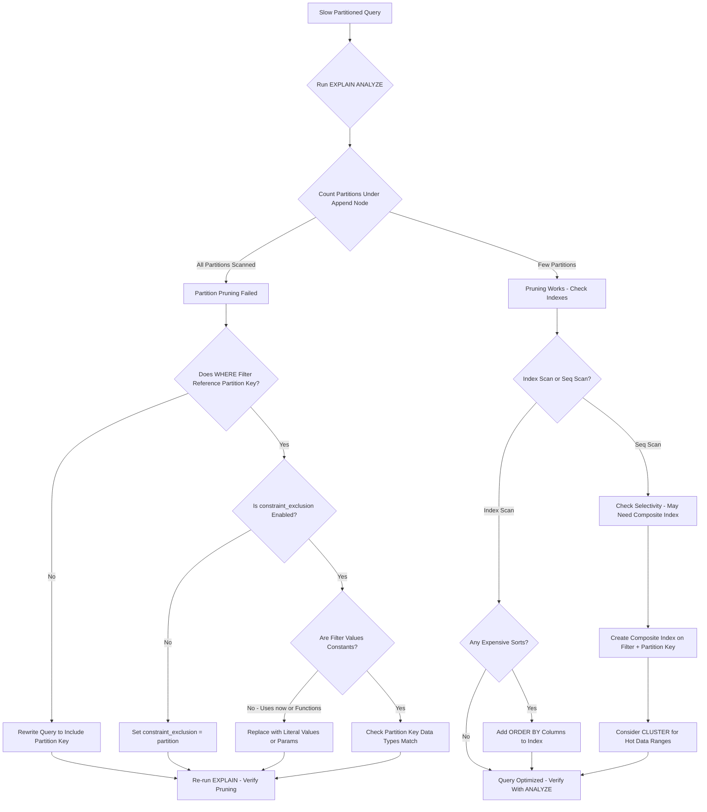

| Difficulty | Channel | Tags |
|---|---|---|
| intermediate | database | explain, query-plan, partitioning |

It was 2am when the alert fired — a dashboard query that normally returned in 5ms was now taking 34ms, and climbing. The team had partitioned their 100M-row PostgreSQL table by date, expecting lightning-fast range scans. Instead, queries filtering on columns OTHER than the partition key — like fetching an order by order_id — were scanning ALL 365+ partitions. This isn't a hypothetical. Timescale's users hit this exact wall with their hypertables, discovering that standard indexes across hundreds of chunks couldn't help PostgreSQL prune partitions it had no metadata to skip [1]. The fix? Chunk-skipping indexes that delivered a 7x performance improvement and slashed storage by 87%. Here's what they learned — and what you can steal from their playbook.

---

> ### Real-World Case — Timescale
>
> Timescale's users had hypertables (PostgreSQL tables automatically partitioned by time) with hundreds of chunks. Queries filtering by non-partitioning columns—like fetching an order by order_id or querying by a secondary timestamp—forced PostgreSQL to scan ALL 365+ partitions because the planner had no metadata to prune them. Even with standard indexes, execution times stayed high and storage overhead ballooned.
>
> | | |
> |---|---|
> | **Challenge** | When queries don't filter on the partition key, PostgreSQL's partition pruning is powerless. A query like `SELECT * FROM orders WHERE order_id = 3942785` on a 365-partition hypertable with 31M+ rows triggered sequential scans across every single chunk (2.1 seconds), or index scans across all partitions (34ms) with 37% extra storage overhead. Neither solution scaled as tables grew to billions of rows. |
> | **Solution** | Timescale introduced chunk-skipping indexes (TimescaleDB 2.16.0) that track min/max metadata for secondary columns at the partition level. When compressing a chunk, min/max ranges are stored in a catalog table, enabling the planner to dynamically prune chunks during planning or execution—even for non-partitioning columns. Combined with columnar compression, this eliminated the need for large per-chunk indexes. |
> | **Outcome** | Query execution dropped from 34.8ms (with standard indexes across 365 chunks) to 5.06ms—a 7x improvement. Storage footprint reduced by 87% thanks to compression replacing large per-partition indexes. The approach scales: more chunks = greater relative speedup. |
> | **Lesson** | Partition pruning is only as good as the metadata the planner can see. If your dominant query patterns don't filter on the partition key, you need a secondary pruning mechanism. Storing min/max column stats at the partition level unlocks pruning for correlated non-partitioning columns—a counterintuitive approach since these columns aren't the partition key. |

---

## The 34ms Problem That Should Have Been 5ms

Picture this: your PostgreSQL table is partitioned by date, you've added indexes on the columns you query, and everything looks correct in the schema. But when you run EXPLAIN ANALYZE, you see something alarming — PostgreSQL is scanning every single partition instead of skipping the ones that don't match your filter. This is the silent killer of partitioned table performance. Partitioning promises faster queries by dividing data into smaller chunks, but here's the uncomfortable truth many developers discover too late: partitioning only helps when PostgreSQL can PROVE which partitions it needs. If your WHERE clause doesn't reference the partition key, or if you're filtering on a secondary column like order_id or user_email, the planner has no choice but to scan every partition. With 365 daily partitions and millions of rows each, that 'fast partitioned query' becomes slower than a simple table scan ever was.

## Problem — Why Partitioned Tables Still Feel Slow

The core issue is partition pruning — or more precisely, the lack of it. PostgreSQL uses constraint exclusion to determine which partitions can be skipped [2]. When you filter on the partition key (like event_date), the planner examines each partition's CHECK constraint and eliminates those that can't contain matching rows. But when your query filters on a non-partition column — say, status = 'completed' — the planner has zero metadata about which partitions contain 'completed' rows. So it reads them all.

Many developers assume adding an index on the filtered column will solve this. It won't. An index on (status) inside each partition only helps AFTER PostgreSQL decides to scan that partition. It doesn't help PostgreSQL SKIP the partition in the first place. The result? You've added 365 indexes instead of one, each one slowing down INSERTs and UPDATEs, while query performance stays painfully slow. Specifically, you'll notice in EXPLAIN output: sequential scans across every partition under an Append node, expensive sort operations because data is scattered, and memory pressure from loading multiple index structures simultaneously [3].

## Real-World Case — Timescale's Chunk-Skipping Breakthrough

Timescale's users ran into this exact problem at scale. Their hypertables — PostgreSQL tables automatically partitioned by time — accumulated hundreds of chunks. Queries filtering by non-partitioning columns, like fetching an order by order_id or querying by a secondary timestamp, forced PostgreSQL to scan ALL partitions because the planner had no metadata to prune them [1].

The numbers were brutal. A query filtering on a secondary timestamp across 365 daily chunks with standard indexes took 34.8ms. That's not terrible in isolation, but when this query runs thousands of times per minute on a production dashboard, those milliseconds compound into real user-facing latency.

The breakthrough came with chunk-skipping indexes — a feature that stores min/max metadata for specified columns at the chunk level. Instead of scanning every chunk, PostgreSQL consults this metadata during planning and skips chunks where the target column's range doesn't overlap the query filter. The result? Query execution dropped from 34.8ms to 5.06ms — a 7x improvement [1]. Storage footprint also reduced by 87% because compression replaced large per-partition indexes with compact metadata structures.

Here's what makes this story particularly instructive: the approach scales inversely with chunk count. The MORE partitions you have, the GREATER the relative speedup from chunk-skipping, because there are more chunks to skip [1]. This directly contradicts the intuition that more partitions mean more overhead.

## Deep Dive — Reading the EXPLAIN Plan Like a Story

To optimize a slow partitioned query, you need to read the EXPLAIN plan as a narrative. Here's the five-act structure you'll encounter:

**Act 1: Partition Pruning** — Look at the Append node. Count how many child plans appear beneath it. A handful means pruning worked. ALL partitions means it didn't. This is the single most important signal in your plan [4].

**Act 2: Scan Type** — Within each partition, check whether you're seeing Seq Scan or Index Scan. A sequential scan on every partition means PostgreSQL isn't even trying to use your indexes. This happens when the planner estimates that scanning the index + heap for each matching row costs more than just reading the whole partition sequentially — typically when the query returns more than ~5-10% of a partition's rows [5].

**Act 3: Sort Operations** — Look for Sort or HashAggregate nodes. If PostgreSQL is sorting results from multiple partitions, that's expensive. A composite index that includes ORDER BY columns can eliminate this entirely [6].

**Act 4: Buffer Hits** — Run EXPLAIN (ANALYZE, BUFFERS) to see shared_buffers usage. High 'shared read' counts indicate the index or table data isn't fitting in memory, which means each partition scan is hitting disk [4].

**Act 5: Rows vs. Actual Rows** — Compare estimated rows with actual rows. Large discrepancies mean PostgreSQL's statistics are stale. Run ANALYZE on the partitioned table to refresh them [7].

The key insight: partition pruning is a planning-time optimization. If it fails, no amount of indexing within individual partitions can compensate. You must fix pruning first, then optimize within partitions.

## Workflow — The Five-Step Optimization Process

Here's the systematic approach to diagnose and fix slow partitioned queries. Follow this workflow in order — skipping steps leads to premature optimization and wasted effort.

**Step 1: Verify Partition Pruning** — Run EXPLAIN (ANALYZE) and count partitions under the Append node. If all partitions appear, your query doesn't reference the partition key, or the planner can't evaluate the filter at planning time.

**Step 2: Check Index Utilization** — Within each scanned partition, confirm whether Index Scan or Seq Scan is used. If Seq Scan dominates, your indexes may not match the query pattern, or the selectivity is too low.

**Step 3: Identify Expensive Operations** — Look for Sort, HashAggregate, or Nested Loop nodes with high cost values. These are where the real CPU and memory go.

**Step 4: Design Composite Indexes** — Create indexes that cover your WHERE clause AND ORDER BY columns. The leftmost column should be the partition key to assist with pruning, followed by your filter columns.

**Step 5: Evaluate Clustering** — For frequently accessed ranges, CLUSTER the table using your composite index to physically reorder data on disk. This improves sequential scan performance within partitions.

The following diagram illustrates this diagnostic workflow:

## Code Example — From Diagnosis to Resolution

Here's the complete code walkthrough, from diagnosing the problem to implementing the fix. Each step builds on the previous one, forming a complete optimization story.

## Lessons Learned — What the Best Teams Do Differently

After watching many teams struggle with partitioned table performance, five patterns consistently separate the winners from the rest:

**1. Pruning First, Indexes Second** — The biggest mistake is adding indexes before verifying pruning works. Always check the Append node first. If all partitions are scanned, no index within a partition will save you [2].

**2. Design Queries and Keys Together** — Partitioning is a contract between your data model and your query patterns. If the two don't agree, the planner can't help you. Before choosing a partition key, map out your top 10 queries and ensure each one filters on the partition key [8].

**3. Embrace Composite Indexes** — Single-column indexes on filtered columns are rarely sufficient for partitioned tables. Composite indexes on (partition_key, filter_column) serve double duty: they assist pruning AND speed up within-partition scans [6].

**4. Watch the Index-to-Data Ratio** — Timescale's 87% storage reduction shows that smart metadata (like chunk-skipping indexes) beats brute-force indexing. With 365 partitions, you're maintaining 365 separate index structures. That overhead adds up in storage, maintenance, and write latency [1].

**5. Benchmark With Real Data** — Test with production-scale data volumes. A query that returns 100 rows from 10 partitions behaves fundamentally differently than the same query against 365 partitions with millions of rows each. Use EXPLAIN (ANALYZE, BUFFERS) on production-representative datasets [4].

⚠️ **Watch Out:** If your partition pruning requires dynamic values (like now() - interval '7 days'), ensure constraint_exclusion is set to 'partition' or 'on' in postgresql.conf. Without it, PostgreSQL may skip pruning entirely for function-based predicates [2].

🎯 **Key Point:** The goal isn't just fast queries — it's predictable queries. Partition pruning turns O(n) scans into O(1) lookups. When your data grows from 100M to 1B rows, that O(1) behavior is what keeps your SLA intact.

---

## Partitioned Query Optimization Workflow

<strong>Original Interview Question</strong>

**Q:** You have a PostgreSQL table with 100M rows partitioned by date. A query filtering on a specific date range is still slow. What would you check in the EXPLAIN plan and how would you optimize it?

**A:** Check partition pruning effectiveness, index utilization patterns, and expensive sort operations. Create composite indexes on (date, filtered_columns) and evaluate clustering strategies for optimal data access.

## Conclusion

The moral of this story is counterintuitive: partitioning your table by date doesn't automatically make date-range queries fast. What makes them fast is ensuring PostgreSQL can SKIP partitions it doesn't need — and that requires your queries to give the planner the right signals. Start by reading your EXPLAIN plan's Append node. If all partitions appear, fix pruning before touching any index. Then layer on composite indexes that cover your WHERE and ORDER BY clauses. Timescale proved this approach works at scale with a 7x speedup and 87% storage reduction [1]. Tomorrow morning, open your most problematic partitioned query's EXPLAIN plan and count the partitions. That number tells you everything.

---

## References

1. [Timescale: Boost Postgres Performance by 7x With Chunk-Skipping Indexes](https://www.tigerdata.com/blog/boost-postgres-performance-by-7x-with-chunk-skipping-indexes) — blog
2. [PostgreSQL Documentation: Table Partitioning and Partition Pruning](https://www.postgresql.org/docs/current/ddl-partitioning.html) — documentation
3. [MonPG: PostgreSQL Partition Pruning — Fast Queries Only When the Planner Can Prove It](https://monpg.app/blog/postgresql-partition-pruning-performance) — blog
4. [CrunchyData: How to Read Postgres EXPLAIN — A Guide to Scan Types](https://www.crunchydata.com/blog/postgres-scan-types-in-explain-plans) — blog
5. [Stack Overflow: Why Does PostgreSQL Perform Sequential Scan on Indexed Column](https://stackoverflow.com/questions/5203755/why-does-postgresql-perform-sequential-scan-on-indexed-column) — blog
6. [BigData Boutique: PostgreSQL Indexes Best Practices — Choosing the Right Index for Every Query](https://bigdataboutique.com/blog/postgresql-indexes-best-practices) — blog
7. [RockData: PostgreSQL Tutorial — Reasons Partition Pruning Not Working](https://www.rockdata.net/tutorial/troubleshooting-partition-pruning) — blog
8. [Stormatics: Improving PostgreSQL Performance with Partitioning](https://stormatics.tech/blogs/improving-postgresql-performance-with-partitioning) — blog
9. [Percona: A Practical Guide to PostgreSQL Indexes](https://www.percona.com/blog/a-practical-guide-to-postgresql-indexes/) — blog
10. [pganalyze: EXPLAIN — Sequential Scan Documentation](https://pganalyze.com/docs/explain/scan-nodes/sequential-scan) — documentation

---

**Author:** Satishkumar Dhule — [GitHub](https://github.com/satishkumar-dhule) · [LinkedIn](https://linkedin.com/in/satishkumar-dhule) · [Website](https://satishkumar-dhule.github.io)
