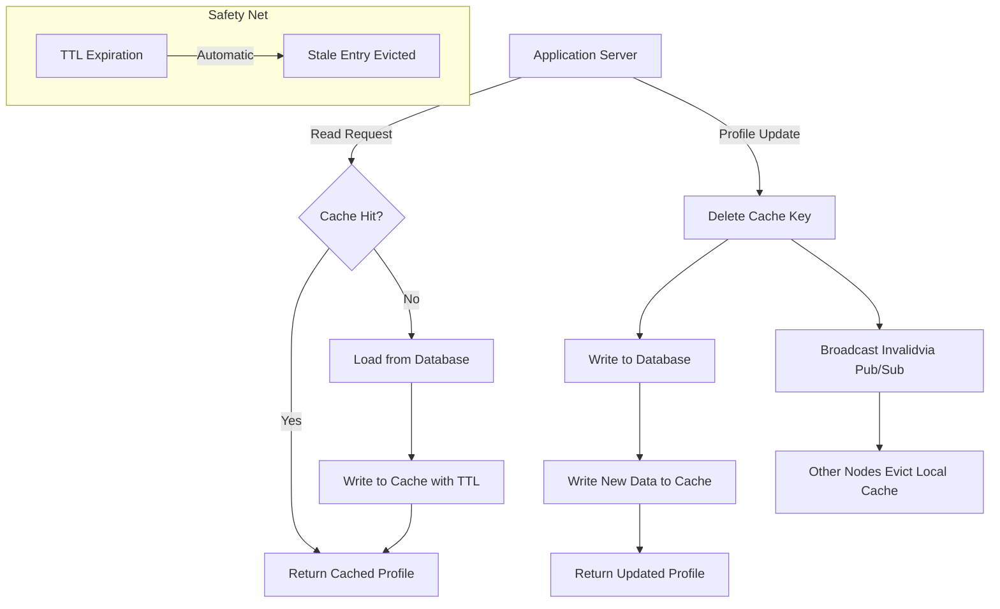

| Difficulty | Channel | Tags |
|---|---|---|
| beginner | backend | redis, memcached, cache-invalidation |

On September 23, 2010, Facebook went dark for 2.5 hours — the worst outage in over four years, affecting hundreds of millions of users worldwide [1]. An automated cache invalidation system, ironically designed to fix bad data, created a catastrophic feedback loop that crashed the entire platform. Here is the uncomfortable truth: every backend system you build will eventually face this exact problem. Cache invalidation is not just a technical challenge — it is a ticking time bomb hiding in every profile service, every e-commerce cart, and every real-time feed. Understanding why Facebook's system failed, and how they later solved it, will save you from your own 3am pager alert.

---

> ### Real-World Case — Facebook
>
> On September 23, 2010, Facebook suffered its worst outage in over four years — a 2.5-hour global outage affecting hundreds of millions of users. The root cause was an automated cache invalidation system that was designed to fix invalid cache entries but instead created a catastrophic feedback loop when the persistent store itself contained an invalid value.
>
> | | |
> |---|---|
> | **Challenge** | Facebook had built an automated verification system to check for invalid configuration values in their cache and replace them with updated values from the database. The problem: this system was not designed to handle the case where the database itself contained an invalid value. When a configuration change was made that was interpreted as invalid, every single client attempted to fix it by querying the database cluster simultaneously. |
> | **Solution** | The automated system detected the invalid cache entry, fetched the (also invalid) value from the database, replaced the cache entry, and then clients fetching that value got cache misses, which triggered more database queries — creating a self-reinforcing feedback loop. Even after engineers fixed the database value, the damage was already cascading: database errors were interpreted as invalid values, causing even more cache deletions and queries. The only way to break the cycle was to stop ALL traffic to the database cluster — effectively turning off Facebook entirely — then slowly bringing it back up once databases recovered. |
> | **Outcome** | 2.5-hour global outage affecting hundreds of millions of users. Hundreds of thousands of queries per second overwhelmed the database cluster. The incident led Facebook to completely redesign their cache invalidation approach, eventually publishing the landmark 'Scaling Memcache at Facebook' paper (NSDI 2013) which introduced lease tokens that reduced peak database queries from 17,000/s to 1,300/s — a 92% reduction. |
> | **Lesson** | Cache invalidation systems must be designed to handle failure of the persistent store itself, not just failure of the cache. An automated 'fix-it' system that doesn't account for invalid source data can turn a minor configuration error into a site-wide outage. The lesson: your cache invalidation safety net can become the thing that brings you down if it doesn't fail gracefully. |

---

## The 3am Phone Call Nobody Wants

Picture this: it is the middle of the night. Your phone buzzes. The monitoring dashboard is red. Your user profile service — the one you optimized last sprint — is returning stale data. Users are seeing other people's profile pictures. Some are seeing blank pages. The cache says the data is fresh. The database says the data has changed. And you are staring at both, wondering which one is lying. This is the reality of cache invalidation, and it is one of the two hard problems in computer science that has not been solved — only managed [2]. Every system that caches data faces a version of this dilemma. The moment you decide to store a copy of something for speed, you have created a second source of truth. And when that truth drifts from the original, chaos follows.

## The Core Problem: Stale Data at Scale

At its heart, cache invalidation is about keeping copies of data in sync with the source of truth. When a user updates their profile — changes their name, uploads a new photo, edits their bio — you need that change to propagate to every cached copy. If it does not, users see outdated information. At small scale, this is trivial: delete the key, write to the database, done. But scale changes everything. Consider a profile service handling 500,000 reads per second with a cache hit rate of 95%. That means 25,000 requests per second still hit the database. Now imagine a cache invalidation bug causes a thundering herd — all 500,000 requests suddenly miss the cache simultaneously [3]. Your database cluster, designed for 25,000 queries per second, is now drowning in 500,000. This is not theoretical. This is exactly what happened to Facebook. The invalidation system was supposed to clean up stale entries. Instead, it triggered a cascade that overwhelmed the persistent store with hundreds of thousands of queries per second [1]. The fundamental tension is between consistency and performance. Stronger consistency guarantees mean more coordination, more latency, and more complexity. Faster systems often accept eventual consistency — but that window of staleness is where bugs, user confusion, and outages live.

## Real-World Case — Facebook's Cache Catastrophe

Facebook's September 2010 outage was not a minor blip. It was a 2.5-hour global outage affecting hundreds of millions of users, with hundreds of thousands of queries per second hammering the database cluster [1]. The root cause was elegant in its cruelty: an automated cache invalidation system detected invalid entries and began aggressively fixing them. But the persistent store itself contained an invalid value. So the system kept invalidating, kept re-reading the bad data, and kept invalidating again — a feedback loop that turned a safety mechanism into a weapon. What made this incident transformative was not the outage itself, but what Facebook learned from it. The incident directly led to the landmark 'Scaling Memcache at Facebook' paper published at NSDI 2013 [4], which introduced lease tokens. Lease tokens give a client a unique ticket when it requests a cache miss — if the cache is repopulated before the client finishes loading from the database, the lease is revoked. This seemingly simple mechanism reduced peak database queries from 17,000 per second to just 1,300 — a staggering 92% reduction [4]. The lesson is brutal but clear: cache invalidation at scale is not a feature you bolt on. It is an architectural decision that must be designed from day one. Facebook went from a naive invalidation system that nearly took down the platform to a sophisticated lease-based architecture that became the industry reference for distributed caching [5].

## Deep Dive — Redis vs Memcached and the Invalidation Trade-offs

When building a user profile caching layer, you face two primary choices: Redis and Memcached. Each has distinct characteristics that fundamentally change how you approach cache invalidation. Memcached is the simpler beast. It is a distributed in-memory key-value store designed for pure caching. It has no persistence, no complex data structures, and no built-in pub/sub mechanism [6]. For horizontal scaling, Memcached uses consistent hashing to distribute keys across nodes, but coordination between nodes for invalidation must be handled at the application layer. Redis, on the other hand, is a data structure server that happens to excel at caching. It offers pub/sub channels that enable automatic distributed invalidation — when one node invalidates a key, it can broadcast that event to all other nodes [7]. Redis also supports persistence (RDB snapshots and AOF logs), transactions, Lua scripting for atomic operations, and advanced data structures like sorted sets and HyperLogLogs. Here is the critical trade-off: Redis gives you more tools, but more tools mean more complexity. Memcached forces simplicity, which at scale can be a feature rather than a limitation. Many developers think Redis is always the right choice because it has more features. But Facebook's original Memcache architecture — serving billions of requests per second — proves that Memcached's simplicity scales remarkably well when paired with a well-designed invalidation layer [4]. The decision often comes down to your invalidation pattern. If you need pub/sub-based automatic invalidation across many nodes, Redis wins. If your invalidation is simple (delete on write) and you want minimal operational overhead, Memcached may be the better fit. For most profile caching use cases, Redis's pub/sub and persistence make it the pragmatic default — but understanding why you are choosing it matters more than the choice itself.

## Workflow — The Write-Through Invalidation Pipeline

The write-through caching pattern with TTL-based expiration is the most battle-tested approach for profile caching. Here is how the full pipeline works, step by step. First, on a read request, the application checks the cache. If the key exists (cache hit), the cached profile is returned immediately. If the key does not exist (cache miss), the application loads from the database, writes the result to the cache with a TTL of 5–30 minutes, and returns it [3]. Second, on a write request (profile update), the application performs a delete-on-update invalidation. It deletes the cache key first, then writes the new data to the database. This ordering is critical: if you write to the database first and delete the cache second, there is a window where a concurrent read could re-populate the cache with the old value [8]. Third, for distributed invalidation across multiple cache nodes, you use either Redis pub/sub or a dedicated invalidation service. When one application server invalidates a key, the event is broadcast to all other servers so they can evict their local cache copies. Finally, TTL acts as a safety net. Even if an invalidation message is missed, the cached entry expires within the configured window. This is your backstop against the kind of feedback loop that took down Facebook [1]. The diagram below visualizes this entire flow from application request through cache and database coordination.

## Code Example — Python Implementation of Write-Through Profile Caching

The following Python implementation demonstrates a production-grade write-through cache invalidation pattern for a user profile service. It uses Redis for caching and pub/sub-based distributed invalidation.

## Lessons Learned — What Facebook's Outage Should Teach Every Backend Developer

The journey from Facebook's 2010 outage to their 2013 lease token architecture reveals several hard-won lessons that every backend developer should internalize. First, always delete before you write. The delete-on-update pattern eliminates the race condition where a stale value re-enters the cache [8]. This is not optional — it is the foundation of correct cache invalidation. Second, TTL is your safety net, not your strategy. A 5–30 minute TTL ensures that even if every invalidation mechanism fails, staleness is bounded [3]. But relying on TTL alone means users see outdated data for up to 30 minutes. Third, pub/sub invalidation solves distributed coordination but introduces its own failure modes. If the pub/sub message is lost, nodes become inconsistent. Lease tokens, as Facebook discovered, provide a stronger guarantee by tying cache reads to explicit authorizations [4]. Fourth, monitor cache hit rates obsessively. A sudden drop in hit rate often signals an invalidation storm or a misconfigured TTL. Set alerts for hit rates below 90% — that 10% drop can translate to thousands of extra database queries per second [5]. Finally, test your invalidation under load. The feedback loop that killed Facebook only manifested at scale. Unit tests that validate invalidation logic in isolation will not catch the thundering herd problem. You need load testing that simulates cache misses across your entire cluster. The most memorable lesson from Facebook's outage is this: the system that was designed to fix bad data became the thing that broke everything. Your cache invalidation strategy should be designed with the same humility — assume it will fail, and build the guardrails to contain the blast radius [1].

---

## Write-Through Cache Invalidation Pipeline

<strong>Original Interview Question</strong>

**Q:** You're building a user profile service that caches frequently accessed profiles. How would you implement cache invalidation when a user updates their profile, and what trade-offs would you consider between Redis and Memcached?

**A:** Implement write-through caching with TTL-based expiration. On profile update, invalidate the cache by deleting the key and writing new data to both the database and cache. Redis offers pub/sub for automatic distributed invalidation, while Memcached requires manual coordination across nodes.

## Conclusion

Facebook's 2010 outage is not just a war story — it is a blueprint for what happens when cache invalidation is treated as an afterthought. The delete-before-write pattern, pub/sub-based distributed invalidation, and TTL safety nets are not theoretical best practices. They are patterns forged in the fire of a 2.5-hour global outage affecting hundreds of millions of users. The next time you build a profile caching layer, start with the invalidation strategy before you write a single line of caching code. Design for failure. Assume the pub/sub message will be lost. Assume the TTL will be the only thing preventing stale data from reaching users. Build the guardrails before you need them — because the 3am phone call is coming, and when it does, you want your system to degrade gracefully rather than cascade into a feedback loop. The most important insight from Facebook's journey is this: they did not just fix the bug. They redesigned the entire architecture and published the solution for the rest of the industry to learn from [4]. That humility — building systems that assume their own failure — is what separates production-grade caching from a demo project.

---

## References

1. [Facebook incident report — More details on today's outage](https://engineering.fb.com/2010/09/23/uncategorized/more-details-on-today-s-outage/) — blog
2. [Two hard problems in computer science — Wikipedia](https://en.wikipedia.org/wiki/Two_hard_things_in_computer_science) — documentation
3. [Cache-aside pattern — Microsoft Azure Architecture Center](https://learn.microsoft.com/en-us/azure/architecture/cache-aside) — documentation
4. [Scaling Memcache at Facebook — NSDI 2013 paper](https://www.usenix.org/system/files/conference/nsdi13/nsdi13-final170_update.pdf) — paper
5. [Scaling Memcache at Facebook — NSDI 2013 presentation slides](https://www.usenix.org/conference/nsdi13/technical-sessions/presentation/nishtala) — paper
6. [Memcached — Wikipedia](https://en.wikipedia.org/wiki/Memcached) — documentation
7. [Redis Pub/Sub documentation](https://redis.io/docs/latest/develop/interact/pubsub/) — documentation
8. [Cache invalidation strategies — AWS Architecture Blog](https://docs.aws.amazon.com/elasticache/latest/red-ug/BestPractices.html) — documentation

---

**Author:** Satishkumar Dhule — [GitHub](https://github.com/satishkumar-dhule) · [LinkedIn](https://linkedin.com/in/satishkumar-dhule) · [Website](https://satishkumar-dhule.github.io)
