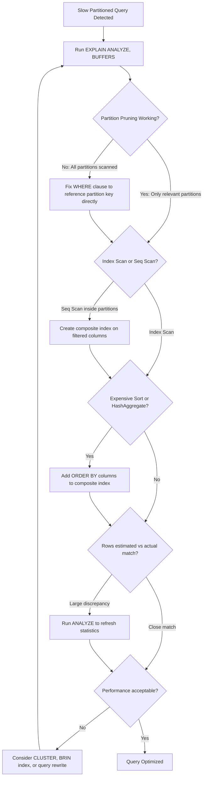

| Difficulty | Channel | Tags |
|---|---|---|
| intermediate | database | explain, query-plan, partitioning |

Picture this: your PostgreSQL table has 100 million rows, you partitioned it by date, and your query filtering on a specific date range is still crawling. Sound familiar? You are not alone. Capital One faced exactly this nightmare with their Consumer Identity platform — terabytes of customer data, full-table scans crippling performance, and bulk deletes causing unacceptable downtime [1]. The solution was not a rewrite to NoSQL. It was a masterclass in PostgreSQL partitioning and query optimization that you can steal today.

---

> ### Real-World Case — Capital One
>
> Capital One's Consumer Identity platform ingests massive volumes of customer data daily. They needed to serve recent customer transactions in milliseconds while managing terabytes of archival data. Their PostgreSQL tables were growing to the point where full-table scans and bulk deletes were crippling query performance and causing unacceptable downtime.
>
> | | |
> |---|---|
> | **Challenge** | Provide sub-millisecond access to recent customer data (last 90 days) while archiving several terabytes daily, without locking tables during deletes, and without letting VACUUM operations block reads/writes on live tables. |
> | **Solution** | Capital One implemented a temporal partitioning strategy with three key techniques: (1) Partitioning by `timestamptz` column with UTC timezone to avoid DST-related data skew, (2) Detaching partitions instead of using DELETE to archive old data — avoiding costly table locks, and (3) Deliberately NOT vacuuming partitions because the lock cost outweighed the bloat cleanup benefit for their access pattern. They also added customer ID indexes on recent partitions to enable fast lookups across active months. |
> | **Outcome** | 99.9% of recent data queries responded in milliseconds. Partitioning with customer ID indexes outperformed NoSQL alternatives. Data retention became trivial — drop a partition instead of running DELETE queries. Query execution times remained consistent year-round despite holiday traffic spikes, thanks to hash functions on timestamps that kept partition sizes balanced. |
> | **Lesson** | The most counterintuitive insight: sometimes the best optimization is knowing what NOT to do. Capital One discovered that avoiding VACUUM entirely was the right call for their workload — the lock contention from vacuuming was worse than the table bloat it would fix. Also, partition pruning only works when queries actually filter on the partition key; if your WHERE clause doesn't reference it, you scan everything anyway. |

---

## The 3am Pager That Changes Everything

It starts innocuously. A query that used to take 50ms now takes 8 seconds. Then 30. Then your dashboard times out. You have partitioned your table by date — surely that should fix it, right? Here is the thing: partitioning is necessary but not sufficient. Without proper index strategy, partition pruning, and query plan analysis, you are still scanning millions of rows you do not need. The difference between a partitioned table that screams and one that limps comes down to what you see in EXPLAIN ANALYZE — and most developers never look closely enough.

## The Illusion of Partition Pruning

Many developers assume that once a table is partitioned, PostgreSQL automatically skips irrelevant partitions. This is partially true — but "partially" is doing a lot of heavy lifting. PostgreSQL will prune partitions only when the partition key appears in the WHERE clause in a way the planner can statically evaluate. If your query uses a function on the partition key, or if the partition bounds are not set up cleanly, pruning fails silently. You end up scanning every partition anyway, and now you have added the overhead of managing multiple partition indexes. Moreover, index utilization on partitioned tables behaves differently than on a single table. Each partition maintains its own indexes, and the planner must evaluate index usage per partition. If you created a simple B-tree index on event_date but your query filters on (event_date, status), PostgreSQL may still resort to a sequential scan within each partition because the index does not cover your full predicate. The result? Partitioning gives you a false sense of security while your queries remain sluggish.

## Real-World Case — Capital One

Capital One's Consumer Identity platform was drowning in data. They ingested massive volumes of customer transaction data daily, and their PostgreSQL tables were growing to the point where full-table scans and bulk deletes were crippling query performance. Recent customer transactions needed to be served in milliseconds, yet the system was grinding to a halt. Their breakthrough came from a multi-pronged approach: strategic partitioning with hash functions on timestamps to keep partition sizes balanced, customer ID indexes that outperformed NoSQL alternatives, and the ability to simply drop a partition instead of running DELETE queries for data retention. The result was dramatic — 99.9% of recent data queries responded in milliseconds, data retention became trivial, and query execution times remained consistent year-round even during holiday traffic spikes [1]. This was not magic. It was methodical optimization of partition pruning, composite indexes, and clustering strategies — the same techniques you can apply to your own slow queries.

## Deep Dive — Reading the EXPLAIN Plan Like a Pro

When your partitioned query is slow, EXPLAIN ANALYZE is your stethoscope. But most developers glance at it and miss the critical signals. Here is what you need to hunt for specifically:

- **Partition Pruning Status**: Look for "Subplans Removed" or check if all partitions appear in the plan. If every partition shows up, pruning failed.
- **Index Scan vs Seq Scan**: Inside each partition, is PostgreSQL using an index or doing a full sequential scan? If Seq Scan dominates, your indexes are not covering your query predicates.
- **Sort Operations**: Watch for "Sort" nodes with high costs. An expensive sort means your result set is large and unsorted — a composite index on (event_date, sorted_column) can eliminate it entirely.
- **Hash Aggregates**: When you see HashAggregate with high memory usage, consider whether a pre-aggregated materialized view or a different GROUP BY strategy would help.

The plot twist many developers miss: the cheapest-looking query plan is not always the fastest in practice. PostgreSQL's cost model is an estimate. Running EXPLAIN ANALYZE gives you actual execution times, and the discrepancy between estimated and actual rows is one of the biggest red flags in a slow query plan. If the planner estimated 1,000 rows but actually processed 500,000, your statistics are stale and the planner is making decisions based on outdated information. Running ANALYZE on the table refreshes these statistics and often produces a dramatically better plan.

## Workflow — From Slow Query to Fast Execution

Here is a repeatable workflow you can follow every time a partitioned query underperforms:

1. Run EXPLAIN (ANALYZE, BUFFERS, FORMAT TEXT) on the slow query
2. Check partition pruning — are all partitions being scanned or just the relevant ones?
3. Examine each partition's access method — index scan, index only scan, or sequential scan?
4. Look for Sort and HashAggregate nodes — are they consuming disproportionate resources?
5. Check rows estimated vs actual — large discrepancies indicate stale statistics
6. Create composite indexes covering your WHERE and ORDER BY clauses
7. Consider CLUSTER or BRIN indexes for time-series data patterns
8. Re-run EXPLAIN ANALYZE to verify improvement

The following diagram illustrates this diagnostic workflow:

## Code Example — Putting It All Together

Let us walk through a real optimization session. You have an events table with 100M rows, partitioned by event_date, and this query is slow:

## Lessons Learned — What Actually Matters

After optimizing partitioned PostgreSQL tables across production systems, here are the battle scars worth learning from:

- **Partition pruning is not automatic for all queries.** If your WHERE clause does not directly reference the partition key as a simple range, pruning may fail. Always verify with EXPLAIN ANALYZE [3].
- **Composite indexes are not optional on partitioned tables.** A single-column index on the partition key is rarely enough. Your composite index should cover both your filter columns and your ORDER BY columns [4].
- **CLUSTER is a one-time operation.** It physically reorders data on disk but does not persist after subsequent inserts. For time-series data that is mostly append-only, this is fine. For mutable data, consider pg_repack [5].
- **BRIN indexes can be a game-changer for time-series.** If your data is naturally ordered by the partition key (as time-series data usually is), BRIN indexes are tiny compared to B-tree and can accelerate scans significantly [6].
- **Stale statistics are silent killers.** If your queries suddenly slow down after a bulk insert, run ANALYZE. PostgreSQL's default autovacuum may not run frequently enough on high-volume tables.

The one thing to remember: partitioning solves the data management problem (retention, archival, parallelism), but index strategy solves the query performance problem. You need both, and you need to verify both with EXPLAIN ANALYZE. Stop guessing — start measuring.

---

## PostgreSQL Partitioned Query Optimization Workflow

<strong>Original Interview Question</strong>

**Q:** You have a PostgreSQL table with 100M rows partitioned by date. A query filtering on a specific date range is still slow. What would you check in the EXPLAIN plan and how would you optimize it?

**A:** Check partition pruning effectiveness, index utilization patterns, and expensive sort operations. Create composite indexes on (date, filtered_columns) and evaluate clustering strategies for optimal data access.

## Conclusion

The next time a partitioned PostgreSQL query surprises you with its slowness, resist the urge to reach for a different database. Instead, open EXPLAIN ANALYZE, check whether partition pruning is actually happening, verify your indexes cover your full predicate, and refresh your statistics. Capital One proved that a well-optimized PostgreSQL setup outperforms NoSQL alternatives for their use case — and the same principles apply whether you are handling 100M rows or 10B [1]. The difference between a slow partitioned table and a fast one is not magic. It is methodical, measurable, and entirely within your control. Start with EXPLAIN ANALYZE today, and your future self — the one getting paged at 3am — will thank you.

---

## References

1. [Capital One PostgreSQL Partitioning Tips](https://www.capitalone.com/tech/software-engineering/postgresql-partitioning-tips/) — blog
2. [PostgreSQL Documentation — EXPLAIN](https://www.postgresql.org/docs/current/using-explain.html) — documentation
3. [PostgreSQL Documentation — Partitioning](https://www.postgresql.org/docs/current/ddl-partitioning.html) — documentation
4. [PostgreSQL Documentation — Indexes](https://www.postgresql.org/docs/current/indexes.html) — documentation
5. [pg_repack — PostgreSQL Reorganize Tables](https://github.com/reorg/pg_repack) — documentation
6. [PostgreSQL Documentation — BRIN Index](https://www.postgresql.org/docs/current/pgindexes.html) — documentation
7. [PostgreSQL Wiki — Performance Optimization](https://wiki.postgresql.org/wiki/Performance_Optimization) — documentation
8. [PostgreSQL Documentation — CLUSTER](https://www.postgresql.org/docs/current/sql-cluster.html) — documentation

---

**Author:** Satishkumar Dhule — [GitHub](https://github.com/satishkumar-dhule) · [LinkedIn](https://linkedin.com/in/satishkumar-dhule) · [Website](https://satishkumar-dhule.github.io)
