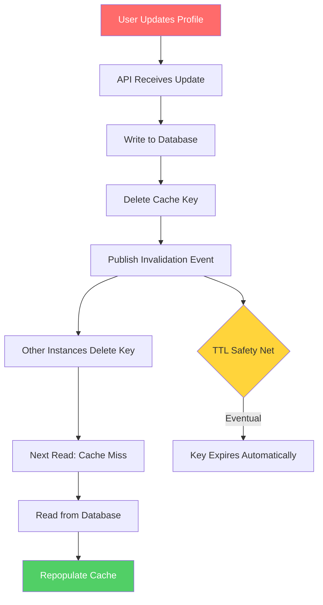
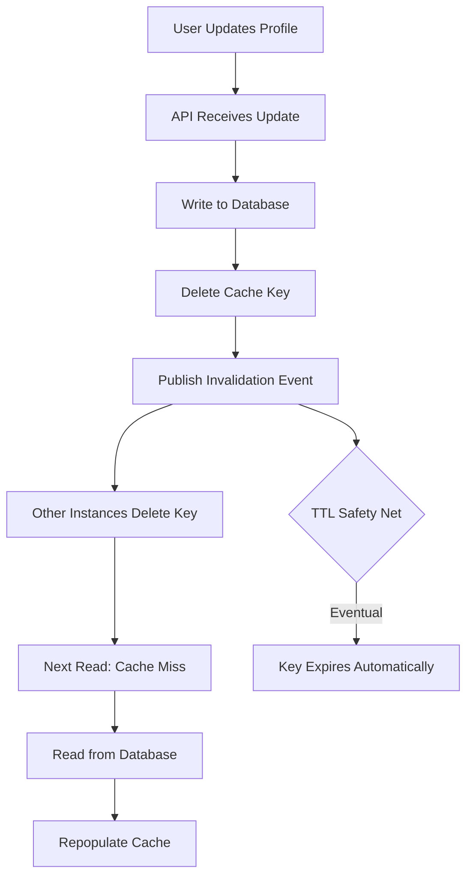

| Difficulty | Channel | Tags |
|---|---|---|
| beginner | backend | redis, memcached, cache-invalidation |

It was 2016, and Netflix had a problem that kept engineers up at night. With 30 million cache requests hitting their systems every single second across four AWS regions, a single stale user profile served to the wrong subscriber could cascade into personalized recommendations going haywire for millions. The company had built EVCache — a distributed in-memory caching layer serving nearly 2 trillion requests per day — but keeping cached data consistent across global regions was hemorrhaging network bandwidth and burning through infrastructure budgets at an alarming rate [1]. This is the story of cache invalidation at planetary scale, and what it teaches you about building profile caching that actually works.

---

> ### Real-World Case — Netflix
>
> Netflix needed to keep cached data consistent across 4 AWS regions while serving 30 million cache requests per second. When a user's profile or recommendations are updated in one region, stale data must be invalidated globally — but replicating full data payloads across regions was destroying network bandwidth and costing a fortune.
>
> | | |
> |---|---|
> | **Challenge** | Cross-region cache invalidation at massive scale: keeping 2 trillion cached items (14.3 petabytes across 22,000 server instances) consistent across Virginia, Oregon, Ireland, and other regions without impacting local cache performance or breaking the bank on network transfer costs. |
> | **Solution** | Netflix built EVCache (Ephemeral Volatile Cache) on top of Memcached — not Redis — and designed a client-initiated replication system using Kafka as the message queue. The key insight: instead of replicating full data payloads, they send only key metadata (the key name + TTL) to Kafka, and the Replication Relay fetches the actual data from the local cache before sending it to the destination region. For non-critical caches, they send just a DELETE (invalidation) instead of the full SET — letting cache misses trigger lazy re-fetches rather than constantly replicating data. This 'invalidate, don't replicate' pattern reduced network bandwidth by 35% through batch compression, and removing network load balancers in favor of Eureka DNS cut transfer costs by 50%. |
> | **Outcome** | EVCache handles 30 million replication events per second and 400 million total operations per second globally. Cross-region replication latency is under 1 second at the 99th percentile (400ms for highest-volume caches). Netflix engineers confirmed EVCache is approximately 10x cheaper than Redis alternatives at their scale. The system manages ~2 trillion items across 200 Memcached clusters with full 4-region active-active replication. |
> | **Lesson** | The counterintuitive insight: at hyperscale, Memcached beat Redis for caching because its simpler architecture (no persistence, no pub/sub overhead, better memory efficiency for pure key-value workloads) translated to 10x lower cost. And for cache invalidation, sending just a DELETE key is far cheaper than replicating the full data — let cache misses handle the lazy re-fetch. The 'plot twist' is that Redis's advanced features (pub/sub, persistence) become overhead rather than advantages when you only need fast key-value caching with invalidation. |

---

## Hook — 30 Million Reasons to Get Cache Invalidation Right

Picture this: a user updates their profile photo on Netflix. That change needs to ripple across four AWS regions, 200 Memcached clusters, and 22,000 server instances — all while 30 million requests per second continue pouring in. Replicate the full data payload across regions, and you'll destroy network bandwidth. Skip replication, and users in Dublin see a stale profile while users in Oregon see the updated one. Netflix engineers discovered that naive full-payload replication was destroying cross-region link capacity and costing a fortune in inter-region transfer fees [1]. The solution wasn't to replicate everything — it was to be ruthlessly smart about what to invalidate, and how.

## Problem — The Billion-Dollar Question of Stale Data

Here is the thing about cache invalidation: it's one of only two problems in computer science that Phil Karlton declared essentially unsolvable — the other being naming things. But for backend engineers building user profile services, this isn't an academic curiosity. It's a production crisis waiting to happen.

Consider what happens when you cache a user profile. On a read, you fetch from cache — fast, cheap, scalable. On a write, the user updates their email, changes their avatar, or modifies preferences. Now your cache holds data that contradicts your database. The window between those two states is where bugs breed, where support tickets multiply, and where trust erodes.

Many developers assume a short TTL — maybe 5 minutes — solves this. And for read-heavy workloads with tolerable staleness, it does. But for profile data that affects billing, notifications, or personalized content? Five minutes of inconsistency can mean five minutes of showing the wrong subscription tier, sending emails to deprecated addresses, or surfacing outdated recommendations. The stakes are higher than most teams realize until they're staring at a 2 AM incident report explaining why a user saw another user's viewing history [2].

## Real-World Case — Netflix's EVCache at Global Scale

Netflix's caching challenge wasn't hypothetical — it was existential. By 2016, the streaming service had expanded to 130 additional countries, and their microservice architecture depended on EVCache (Ephemeral Volatile Cache) for low-latency data access across every one of them [1].

EVCache is a RAM store built on top of Memcached, optimized for cloud environments. At peak, it handles upwards of 30 million requests per second, storing hundreds of billions of objects across tens of thousands of Memcached instances [1]. That translates to nearly 2 trillion requests per day globally. The system manages approximately 2 trillion items across 200 Memcached clusters with full 4-region active-active replication [3].

The critical problem: when a user's profile or recommendations were updated in one region, stale data had to be invalidated across all regions. But replicating full data payloads across regions was destroying network bandwidth. Netflix engineers confirmed EVCache is approximately 10x cheaper than Redis alternatives at their scale [4], but only because they engineered a sophisticated invalidation system rather than brute-force replication.

Their solution used Kafka-based asynchronous replication with a message queue. Instead of copying entire cache entries, they published invalidation signals — small messages telling remote regions to delete specific keys. The 99th percentile of cross-region replication latency dropped to under 1 second, with their highest-volume caches achieving 400ms [1]. At peak, the system replicates more than 1.5 million messages per second. The result: eventual consistency where it matters, at a fraction of the cost of full replication.

## Deep Dive — Write-Through Caching, TTL Strategy, and the Redis vs. Memcached Decision

Building on Netflix's experience, let's dissect the core patterns that make cache invalidation work for user profile services.

**Write-Through Caching: The Consistency Foundation**

Write-through caching ensures every write hits both the database and the cache simultaneously. When a user updates their profile, you don't just write to the database and hope the cache catches up — you explicitly update both. This eliminates the stale-data window almost entirely. The trade-off? Slightly higher write latency, since you're making two writes instead of one. For profile updates — which happen infrequently compared to reads — this is almost always the right choice [5].

**The Cache-Aside Read Pattern**

On the read side, cache-aside (lazy loading) is the dominant pattern. Your application checks the cache first. On a miss, it reads from the database, populates the cache, and returns the data. This keeps your cache cold-start friendly and avoids unnecessary cache pollution from write-heavy keys [6].

**TTL: The Safety Net, Not the Strategy**

TTL (Time To Live) acts as a safety net rather than your primary invalidation mechanism. For user profiles, 5 to 30 minutes is a reasonable range. A 15-minute TTL means that even if an invalidation message is lost — and at Netflix's scale, messages do occasionally get dropped — the stale data self-heals within minutes [5]. But relying solely on TTL without explicit invalidation is playing Russian roulette with data consistency.

**Redis vs. Memcached: The Real Trade-offs**

Here's where many teams get stuck. Both are excellent in-memory stores, but they solve different problems:

| Feature | Redis | Memcached |
|---------|-------|-----------|
| Distributed Invalidation | Built-in Pub/Sub for automatic cross-node invalidation | Requires manual coordination or external message bus |
| Data Persistence | Supports RDB snapshots and AOF logging | No persistence — purely ephemeral |
| Data Structures | Strings, lists, hashes, sets, sorted sets, streams | Key-value only |
| Memory Efficiency | Higher overhead per key | Lower overhead, better for pure caching |
| Horizontal Scaling | Redis Cluster with hash slots | Consistent hashing, simpler to scale |
| Pub/Sub for Invalidation | Native support — publish invalidation events | Not available — need external solution |
| Cost at Scale | Higher (more features, more memory) | Lower (leaner, fewer features) |

The plot twist many developers miss: Netflix chose Memcached (via EVCache) over Redis not because Memcached is "better," but because at their scale — 400 million operations per second globally — Redis couldn't leverage flash storage effectively and cost roughly 10x more [4]. For most teams, Redis is the pragmatic choice precisely because of its native Pub/Sub for distributed invalidation.

## Workflow — The Invalidation Dance, Step by Step

Here's the complete flow for implementing cache invalidation in a user profile service, from write to read:

1. **User submits profile update** — The API receives the change (e.g., new email, avatar URL).
2. **Write-through to database** — The update is persisted to the primary database (PostgreSQL, MySQL, etc.).
3. **Invalidate cache key** — The old cache key is explicitly deleted, not overwritten. This prevents race conditions where a stale read overwrites a fresh write.
4. **Publish invalidation event** — If running multiple cache nodes, publish a Pub/Sub message (Redis) or use a message bus (Kafka, RabbitMQ) to notify other instances.
5. **Subscribers delete their local keys** — Other application instances receive the invalidation signal and remove the stale entry from their local cache.
6. **Next read triggers cache miss** — The subsequent read fetches fresh data from the database and repopulates the cache.
7. **TTL as safety net** — Even if steps 4-5 fail, the TTL ensures stale data expires within the configured window.



The key insight from Netflix's architecture: separating the invalidation signal from the data payload. Sending a 50-byte "delete this key" message is orders of magnitude cheaper than sending a 50KB serialized profile object across regions [1].

## Code Example — Python Implementation with Redis Pub/Sub Invalidation

Here's a production-pattern implementation of write-through caching with Redis Pub/Sub for distributed invalidation across multiple application instances:

```python
import redis
import json
import hashlib
from datetime import timedelta
from typing import Optional, Any

# Initialize Redis clients — one for caching, one for pub/sub
redis_cache = redis.Redis(host='localhost', port=6379, db=0, decode_responses=True)
pubsub_client = redis.Redis(host='localhost', port=6379, db=0, decode_responses=True)

# Channel for broadcasting cache invalidation events
INVALIDATION_CHANNEL = "profile:cache:invalidate"

def _cache_key(user_id: str) -> str:
    """Generate a consistent cache key for a user profile."""
    return f"profile:{user_id}"

def get_profile(user_id: str) -> Optional[dict]:
    """Cache-aside read: check cache first, fall back to database."""
    key = _cache_key(user_id)
    
    # Step 1: Try reading from cache
    cached = redis_cache.get(key)
    if cached:
        return json.loads(cached)
    
    # Step 2: Cache miss — fetch from database (simulated)
    profile = _fetch_from_database(user_id)
    if profile:
        # Step 3: Populate cache with 15-minute TTL as safety net
        redis_cache.setex(key, timedelta(minutes=15), json.dumps(profile))
    return profile

def update_profile(user_id: str, updates: dict) -> dict:
    """Write-through: update database, invalidate cache, notify other nodes."""
    # Step 1: Write to database first (source of truth)
    updated_profile = _write_to_database(user_id, updates)
    
    # Step 2: Delete the cache key (not overwrite — avoids race conditions)
    key = _cache_key(user_id)
    redis_cache.delete(key)
    
    # Step 3: Publish invalidation event to all subscribed nodes
    invalidation_payload = json.dumps({
        "user_id": user_id,
        "action": "invalidate",
        "timestamp": updated_profile.get("updated_at")
    })
    pubsub_client.publish(INVALIDATION_CHANNEL, invalidation_payload)
    
    return updated_profile

def start_invalidation_listener():
    """Subscribe to invalidation events from other application instances."""
    listener = pubsub_client.pubsub()
    listener.subscribe(INVALIDATION_CHANNEL)
    
    print("Listening for cache invalidation events...")
    for message in listener.listen():
        if message["type"] == "message":
            payload = json.loads(message["data"])
            user_id = payload["user_id"]
            key = _cache_key(user_id)
            
            # Remove stale entry from local cache
            deleted = redis_cache.delete(key)
            print(f"Invalidated cache for user {user_id} (deleted: {deleted})")

def _fetch_from_database(user_id: str) -> dict:
    """Simulate database read — replace with your ORM/query logic."""
    # In production: SELECT * FROM users WHERE id = user_id
    return {"id": user_id, "name": "Demo User", "email": "demo@example.com"}

def _write_to_database(user_id: str, updates: dict) -> dict:
    """Simulate database write — replace with your ORM/query logic."""
    # In production: UPDATE users SET ... WHERE id = user_id
    return {"id": user_id, **updates, "updated_at": "2025-01-15T10:30:00Z"}
```

**Walkthrough of the implementation:**

- **`get_profile()`** follows the cache-aside pattern: check cache, miss → database → populate cache. The 15-minute TTL acts as the safety net Netflix engineers rely on [1].
- **`update_profile()`** implements write-through with explicit key deletion. Notice we delete rather than overwrite — this prevents a race condition where a concurrent read writes stale data back to the cache before the update propagates.
- **Pub/Sub broadcast** ensures other application instances invalidate their local caches within milliseconds. This is exactly the pattern Redis documentation recommends for distributed cache invalidation [7].
- **`start_invalidation_listener()`** runs as a background thread on each application instance, subscribing to the invalidation channel and cleaning up stale entries as they arrive.

⚠️ **Watch Out:** Redis Pub/Sub provides at-most-once delivery semantics [7]. If a subscriber is disconnected when a message is published, it won't receive the invalidation. The TTL safety net handles this gracefully, but for mission-critical consistency, consider Redis Streams which offer at-least-once delivery [8].

## Lessons Learned — Battle Scars and What Actually Works

After examining Netflix's approach and production patterns across the industry, here are the hard-won lessons:

**1. Delete, Don't Overwrite**
Deleting the cache key on update and letting the next read repopulate it is safer than writing new values. It eliminates race conditions where stale reads overwrite fresh data. This is the pattern Netflix engineers use in production [1].

**2. TTL Is Your Safety Net, Not Your Strategy**
Relying solely on short TTLs for consistency is expensive — you're trading cache hit rates for consistency. Use explicit invalidation as your primary mechanism and TTL as the fallback for edge cases where invalidation messages are lost [5].

**3. The Pub/Sub Decision Is About Your Failure Mode**
Redis Pub/Sub gives you automatic distributed invalidation — no external message bus needed. But it's fire-and-forget. If you need guaranteed delivery, you're better off with Redis Streams or an external message queue like Kafka, which is what Netflix chose for their global replication [1].

**4. Monitor Your Cache Hit Rate Aggressively**
If your hit rate drops below 80-90% for frequently accessed profiles, something is wrong with your invalidation strategy. Netflix engineers continuously tune batch sizes and buffer flush intervals to optimize this [1].

**5. Cost Scales with Architecture, Not Just Features**
Redis costs roughly 10x more than Memcached at Netflix's scale [4]. For most teams (sub-100K requests/second), Redis is the right choice because of its richer features. But if you're approaching massive scale with simple caching needs, Memcached's leaner footprint becomes compelling.

🎯 **Key Takeaway:** Cache invalidation isn't a problem you solve once — it's a system you operate. Start with write-through + explicit invalidation + Pub/Sub, add a TTL safety net, and instrument everything. The teams that get this right don't just build faster systems — they build systems they can sleep through the night with.

---

## Cache Invalidation Flow



<details>
<summary><strong>Original Interview Question</strong></summary>

**Q:** You're building a user profile service that caches frequently accessed profiles. How would you implement cache invalidation when a user updates their profile, and what trade-offs would you consider between Redis and Memcached?

**A:** Implement write-through caching with TTL-based expiration. On profile update, invalidate the cache by deleting the key and writing new data to both the database and cache. Redis offers pub/sub for automatic distributed invalidation, while Memcached requires manual coordination across nodes.

</details>

## Conclusion

The journey from Netflix's 30-million-requests-per-second crisis to your profile caching implementation follows the same arc: start with write-through consistency, add explicit invalidation, layer on distributed Pub/Sub for multi-node coordination, and keep TTL as your safety net. Netflix proved that even at planetary scale, the core pattern holds — it's the engineering around the edges that makes it work. Tomorrow, audit your own profile caching: are you deleting keys or overwriting them? Do you have Pub/Sub invalidation across your instances, or are you hoping TTL saves you? The teams that get this right don't just avoid stale data — they build the confidence to ship faster, knowing their caching layer won't betray them at 2 AM.

---

## References

1. [Netflix Tech Blog — Caching for a Global Netflix](https://netflixtechblog.com/caching-for-a-global-netflix-7bcc457012f1) — blog
2. [Martin Fowler — Patterns of Distributed Systems: Invalidation](https://martinfowler.com/articles/patterns-of-distributed-systems/invalidation.html) — documentation
3. [InfoQ — Building a Global Caching System at Netflix: A Deep Dive](https://www.infoq.com/articles/netflix-global-cache/) — blog
4. [Netflix/EVCache — GitHub Repository](https://github.com/Netflix/EVCache) — documentation
5. [AWS — Amazon ElastiCache for Redis: Developer Guide](https://docs.aws.amazon.com/AmazonElastiCache/latest/red-ug/WhatIs.html) — documentation
6. [Martin Fowler — Patterns of Distributed Systems: Cache-Aside](https://martinfowler.com/articles/patterns-of-distributed-systems/cache-aside.html) — documentation
7. [Redis Documentation — Pub/Sub Messaging](https://redis.io/docs/latest/develop/pubsub/) — documentation
8. [Redis Documentation — Streams Introduction](https://redis.io/docs/latest/develop/data-types/streams/) — documentation
9. [Wikipedia — Cache Invalidation](https://en.wikipedia.org/wiki/Cache_invalidation) — documentation
10. [Wikipedia — Distributed Cache](https://en.wikipedia.org/wiki/Distributed_cache) — documentation

---

**Author:** Satishkumar Dhule — [GitHub](https://github.com/satishkumar-dhule) · [LinkedIn](https://linkedin.com/in/satishkumar-dhule) · [Website](https://satishkumar-dhule.github.io)
