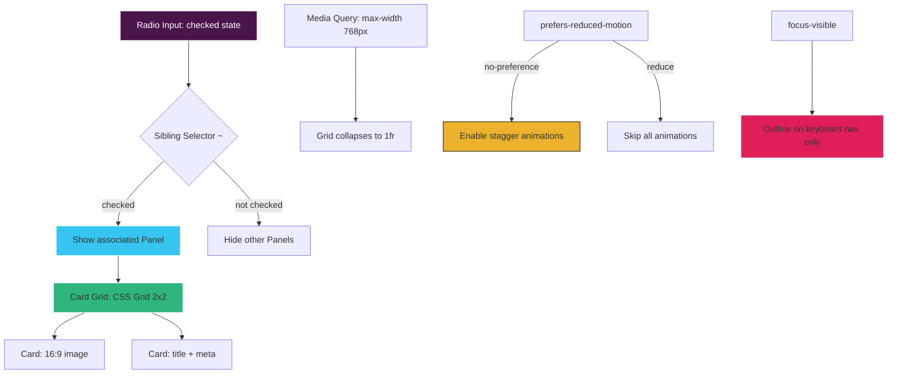
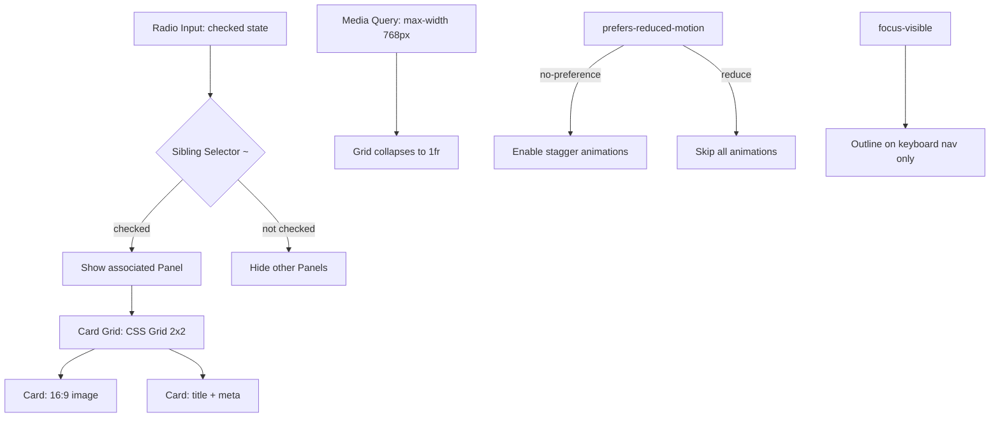

| Difficulty | Channel | Tags |
|---|---|---|
| beginner | frontend | css, flexbox, grid, animations |

Picture this: your marketing website is so tangled with your web app that a single button style change requires a coordinated deploy across both codebases. That was Slack's reality — until they ripped it all apart and rebuilt it with pure CSS Grid, cutting their CSS payload from 416kB to 132kB in the process [1]. The secret wasn't a new framework or a clever bundler trick. It was a disciplined, component-based CSS architecture that started with exactly the kind of fundamentals you are about to learn. If you have ever been asked to build a tab panel without JavaScript in a design-system docs page, this is why that question matters more than it first appears.

---

> ### Real-World Case — Slack
>
> In 2019, Slack rebuilt their marketing website (slack.com) from scratch, decoupling it from their web app and creating a new CSS framework called 'Spacesuit' built entirely on CSS Grid for responsive layouts. The old site shared code dependencies with the Slack client, creating maintenance headaches and performance issues across their design system documentation and marketing pages.
>
> | | |
> |---|---|
> | **Challenge** | Slack needed a responsive, accessible layout system that could handle everything from 2x2 card grids on desktop to single-column mobile layouts — the exact pattern described in CSS-only tab panels. They also needed to ensure keyboard accessibility (focus-visible outlines) and respect user motion preferences, all while reducing CSS payload and maintaining a consistent design system across hundreds of pages. |
> | **Solution** | They adopted CSS Grid natively instead of forcing a traditional 12-column Bootstrap-style grid, creating custom Grid objects for common layout patterns (including 2x2 card grids). They used `@supports` feature queries to provide Flexbox fallbacks for older browsers. The Spacesuit framework used BEM-like naming with ITCSS philosophy, and they built utility classes for consistent spacing. Accessibility was baked in from the start with skip links, aria-live regions, and noticeable focus states for keyboard navigation. |
> | **Outcome** | CSS payload reduced by nearly 70% (from 416kB to 132kB). The pricing page specifically saw a 53% decrease in loading time. The component-based architecture meant Dark Mode could be added to Slack's Posts app with a single PR in an afternoon. The system scaled to support 75%+ of applicable UI areas across the product. |
> | **Lesson** | CSS Grid isn't just for simple layouts — when applied thoughtfully to design system documentation and marketing pages, it can dramatically reduce both markup complexity and CSS payload while improving accessibility. The key insight was using Grid as an enhancement with Flexbox fallbacks, rather than forcing a column-based grid paradigm onto a two-dimensional layout tool. |

---

## Hook — The Interview Question Nobody Expects to Be This Hard

You walk into a frontend interview. The interviewer leans back and says: 'Build a tab panel. No JavaScript. Just CSS.' Your first instinct? That sounds trivial. You have used radio buttons before. You have written a media query or two. But then the constraints start stacking up: a 2×2 card grid on desktop, single column on mobile, 16:9 image containers, staggered entrance animations, focus-visible outlines, and — the curveball — respect for `prefers-reduced-motion`. Suddenly this "simple" CSS question is testing responsive layout, accessibility, animation performance, and component architecture all at once. Sound familiar? Many developers discover that the hardest frontend problems are not the ones that require thousands of lines of code. They are the ones that demand precision within tight constraints.

## Problem — Why CSS-Only Interactivity Is Harder Than It Looks

Here is the core challenge: JavaScript makes state management trivial. You click a tab, a variable flips, the DOM re-renders. Remove JavaScript, and you suddenly need CSS to handle state. The `:checked` pseudo-class on a radio input becomes your only state signal [2]. This is not just an academic exercise. Design-system documentation pages — the kind that power component libraries for products like yours — need to be fast, accessible, and maintainable. If your docs page requires JavaScript to switch between component examples, you have added a dependency that can break, load slowly, or fail in restricted environments. Moreover, the constraints multiply quickly. A responsive card grid that works across breakpoints needs CSS Grid or Flexbox [3]. Image containers with fixed aspect ratios need `aspect-ratio` or padding hacks. Staggered animations need `animation-delay` with careful timing. And every single piece needs to degrade gracefully for users who prefer reduced motion or navigate with a keyboard. The tradeoff is clear: invest in pure CSS fundamentals now, or fight JavaScript dependency bugs forever.

## Real-World Case — Slack's 70% CSS Reduction

In 2019, Slack faced a crisis that many growing companies eventually hit. Their marketing website at slack.com shared code dependencies with the Slack client application. This coupling created maintenance headaches across their design system documentation and marketing pages, and it inflated performance metrics unnecessarily [1]. The solution was dramatic: Slack decoupled the two entirely and built a new CSS framework called 'Spacesuit' — built on CSS Grid for responsive layouts. The results speak volumes. Their CSS payload dropped from 416kB to 132kB, a reduction of nearly 70%. The pricing page specifically saw a 53% decrease in loading time. Even more striking, the component-based architecture meant Dark Mode could be added to Slack's Posts app with a single pull request in a single afternoon. The system scaled to support over 75% of applicable UI areas across the product [1]. What does this have to do with a CSS-only tab panel? Everything. Slack's success was not about a clever CSS trick. It was about understanding that CSS is a powerful layout and interaction language when used deliberately — the exact same philosophy behind building accessible, JavaScript-free UI components.

## Deep Dive — The Mechanics of CSS-Only Tab Switching

Let us break down how this pattern actually works under the hood. The magic lies in the sibling selector. Radio inputs and their corresponding labels share a `name` attribute, which means only one can be `:checked` at a time [2]. By placing the radio inputs, labels, and panel sections as siblings inside a container, you can use the `:checked` state combined with the general sibling combinator (`~`) to show or hide panels. Specifically, when a radio input is checked, its associated panel becomes visible. When it is not checked, the panel is hidden. The key architectural insight is DOM order. The radio inputs must come first, followed by the labels, then the panels. This is because CSS can only select forward siblings — not backward. Many developers trip up here and wonder why their panels never show up. The responsive layer uses CSS Grid with `repeat(2, 1fr)` for the desktop card layout, collapsing to a single column via a media query at 768px [3]. Each card's image container uses `aspect-ratio: 16 / 9` for consistent proportions without JavaScript height calculations [4]. For the staggered entrance animation, the trick is applying the same `fadeSlideIn` keyframe to all cards but varying the `animation-delay` per child. And critically, the entire animation block is wrapped in `@media (prefers-reduced-motion: no-preference)`, which ensures users who have indicated motion sensitivity in their OS settings see no animation at all [5]. The final piece is accessibility. `:focus-visible` outlines ensure keyboard users always see which element has focus, without showing outlines for mouse clicks [6].

## Workflow — Building the Tab Panel Step by Step

Here is the architecture laid out visually, showing how the radio inputs, labels, panels, and cards flow together:



The workflow follows five logical steps: first, structure the HTML with radio inputs, labels, and panels as siblings. Second, wire up the CSS sibling selector to toggle panel visibility. Third, build the responsive card grid with CSS Grid. Fourth, add the entrance animation with stagger timing wrapped in the motion preference media query. Fifth, apply focus-visible outlines for keyboard accessibility. Each step builds on the previous one, and skipping any step breaks the whole pattern.

## Code Example — The Complete Implementation

Here is the full, working implementation. This is the kind of code that survives production scrutiny:

```html
<!-- Complete CSS-Only Tab Panel -->
<div class="tabs">
  <!-- Radio inputs control which panel is visible -->
  <input type="radio" id="tab-overview" name="tabs" checked>
  <label for="tab-overview">Overview</label>
  <input type="radio" id="tab-components" name="tabs">
  <label for="tab-components">Components</label>
  <input type="radio" id="tab-patterns" name="tabs">
  <label for="tab-patterns">Patterns</label>

  <!-- Panel 1: Overview -->
  <section class="panel">
    <article class="card">
      <div class="card__image"></div>
      <h3 class="card__title">Button Variants</h3>
      <p class="card__meta">Core · 12 components</p>
    </article>
    <article class="card">
      <div class="card__image"></div>
      <h3 class="card__title">Form Elements</h3>
      <p class="card__meta">Input · 8 components</p>
    </article>
    <article class="card">
      <div class="card__image"></div>
      <h3 class="card__title">Navigation</h3>
      <p class="card__meta">Layout · 6 components</p>
    </article>
    <article class="card">
      <div class="card__image"></div>
      <h3 class="card__title">Feedback</h3>
      <p class="card__meta">Overlay · 9 components</p>
    </article>
  </section>

  <!-- Panel 2: Components -->
  <section class="panel">
    <article class="card">
      <div class="card__image"></div>
      <h3 class="card__title">Card Component</h3>
      <p class="card__meta">Layout · Updated 2 days ago</p>
    </article>
    <article class="card">
      <div class="card__image"></div>
      <h3 class="card__title">Modal Dialog</h3>
      <p class="card__meta">Overlay · Updated 1 week ago</p>
    </article>
    <article class="card">
      <div class="card__image"></div>
      <h3 class="card__title">Toast Notifications</h3>
      <p class="card__meta">Feedback · Updated 3 days ago</p>
    </article>
    <article class="card">
      <div class="card__image"></div>
      <h3 class="card__title">Data Table</h3>
      <p class="card__meta">Data · Updated yesterday</p>
    </article>
  </section>

  <!-- Panel 3: Patterns -->
  <section class="panel">
    <article class="card">
      <div class="card__image"></div>
      <h3 class="card__title">Form Validation</h3>
      <p class="card__meta">Pattern · 4 examples</p>
    </article>
    <article class="card">
      <div class="card__image"></div>
      <h3 class="card__title">Loading States</h3>
      <p class="card__meta">Pattern · 6 examples</p>
    </article>
    <article class="card">
      <div class="card__image"></div>
      <h3 class="card__title">Empty States</h3>
      <p class="card__meta">Pattern · 3 examples</p>
    </article>
    <article class="card">
      <div class="card__image"></div>
      <h3 class="card__title">Error Handling</h3>
      <p class="card__meta">Pattern · 5 examples</p>
    </article>
  </section>
</div>
```

```css
/* --- Tab Container --- */
.tabs {
  max-width: 960px;
  margin: 2rem auto;
  padding: 0 1rem;
}

/* Hide raw radio inputs — labels become the tabs */
.tabs input[type="radio"] {
  position: absolute;
  width: 1px;
  height: 1px;
  overflow: hidden;
  clip: rect(0 0 0 0);
}

/* Tab labels */
.tabs label {
  display: inline-block;
  padding: 0.5rem 1.25rem;
  margin: 0 0.25rem 1rem;
  cursor: pointer;
  font-weight: 600;
  border-bottom: 3px solid transparent;
  transition: border-color 0.2s ease;
}

/* Active tab indicator */
.tabs input#tab-overview:checked ~ label[for="tab-overview"],
.tabs input#tab-components:checked ~ label[for="tab-components"],
.tabs input#tab-patterns:checked ~ label[for="tab-patterns"] {
  border-bottom-color: #4A154B;
}

/* Hide all panels by default */
.tabs .panel {
  display: none;
  grid-template-columns: repeat(2, 1fr);
  gap: 1.5rem;
}

/* Show only the panel whose radio is checked */
.tabs input#tab-overview:checked ~ .panel:nth-of-type(1),
.tabs input#tab-components:checked ~ .panel:nth-of-type(2),
.tabs input#tab-patterns:checked ~ .panel:nth-of-type(3) {
  display: grid;
}

/* --- Responsive: single column on mobile --- */
@media (max-width: 768px) {
  .tabs .panel {
    grid-template-columns: 1fr;
  }
}

/* --- Card Styles --- */
.card {
  border: 1px solid #e0e0e0;
  border-radius: 8px;
  overflow: hidden;
  background: #fff;
}

.card__image {
  aspect-ratio: 16 / 9;
  background: #eee;
}

.card__title {
  margin: 0.75rem 1rem 0.25rem;
  font-size: 1rem;
}

.card__meta {
  margin: 0 1rem 1rem;
  font-size: 0.85rem;
  color: #666;
}

/* --- Staggered Entrance Animation --- */
@media (prefers-reduced-motion: no-preference) {
  .card {
    animation: fadeSlideIn 0.3s ease-out backwards;
  }
  .card:nth-child(2) { animation-delay: 0.1s; }
  .card:nth-child(3) { animation-delay: 0.2s; }
  .card:nth-child(4) { animation-delay: 0.3s; }
}

@keyframes fadeSlideIn {
  from {
    opacity: 0;
    transform: translateY(10px);
  }
  to {
    opacity: 1;
    transform: translateY(0);
  }
}

/* --- Accessibility: keyboard focus outlines --- */
:focus-visible {
  outline: 2px solid currentColor;
  outline-offset: 2px;
}
```

The walkthrough: First, the radio inputs are visually hidden with the clip technique but remain accessible to screen readers. This is critical — `display: none` would remove them from the accessibility tree entirely. The labels act as visible tab triggers. The `:checked` state combined with sibling selectors shows exactly one panel at a time [2]. The grid layout uses `repeat(2, 1fr)` for the desktop two-column layout and collapses to `1fr` at 768px [3]. Cards use `aspect-ratio: 16 / 9` for consistent image containers without JavaScript [4]. The animation wraps in `prefers-reduced-motion: no-preference` so it only runs for users who have not opted out [5]. And the `:focus-visible` outline ensures keyboard users always see focus state [6].

## Lessons Learned — What This Pattern Teaches You About Building Design Systems

After walking through this pattern, several insights emerge that apply far beyond a single tab component. Here is what to carry forward:

**1. CSS is a state machine — if you know how to use it.** The `:checked` pseudo-class on radio inputs is not a hack. It is a legitimate, accessible way to manage UI state without JavaScript [2]. Many developers reach for React or Vue components for patterns that CSS can handle natively, adding unnecessary bundle weight and hydration cost.

**2. Accessibility is not a feature — it is a constraint that makes your code better.** The `prefers-reduced-motion` media query [5] and `:focus-visible` outlines [6] are not afterthoughts. They force you to think about every user, not just the happy path. Slack's 70% CSS reduction [1] came from the same philosophy: strip away what you do not need, keep what works for everyone.

**3. Responsive design starts with the right layout primitive.** CSS Grid's `repeat()` function with `1fr` gives you a responsive card layout in two lines of code [3]. No media query for column count on desktop — just a single breakpoint collapse on mobile. This is the kind of leverage that scales across an entire design system.

**4. Watch out for these common mistakes:**
- Placing panels before radio inputs in the DOM (the sibling selector cannot reach backward)
- Using `display: none` on radio inputs (kills accessibility — use the clip technique instead)
- Forgetting to reset `animation-delay` when switching tabs (cards on inactive panels keep their delay)
- Not testing with `prefers-reduced-motion` enabled (animations can cause nausea and vestibular issues for some users)

**5. The bigger picture.** Slack's experience [1] proves that CSS-first architectures scale. Their Spacesuit framework powered 75%+ of UI across the product. A tab panel might seem small, but the discipline it teaches — semantic HTML, CSS state management, responsive grid layout, animation with motion preferences, keyboard accessibility — is exactly the foundation that scales into a design system capable of supporting an entire product suite.

Tomorrow, when you are building a component, ask yourself: does this actually need JavaScript? Often, the answer is no.

---

## CSS-Only Tab Panel Architecture



<details>
<summary><strong>Original Interview Question</strong></summary>

**Q:** Build a CSS-only tab panel for a design-system docs page. Use radio inputs to switch tabs (no JavaScript). Desktop: a 2x2 grid of cards under each tab; mobile: single column. Each card has a fixed 16:9 image area, a title, and a short meta line. Add a subtle entrance animation with a stagger and keep focus-visible outlines; ensure prefers-reduced-motion is respected?

**A:** Use a set of radio inputs with a shared `name` attribute and corresponding `` elements for each tab section. The `:checked` state of each radio controls visibility of its associated panel via adjacent sibling selectors. Each panel renders a 2×2 card grid on desktop and collapses to a single column on mobile. Cards use `aspect-ratio: 16/9` for fixed image containers, with a title and meta line below.

</details>

## Conclusion

The CSS-only tab panel is not just an interview trick. It is a microcosm of what makes design systems scale. Slack proved that when you treat CSS as a first-class architecture language — not a styling afterthought — you can cut 70% of your payload, add features in a single pull request, and cover 75%+ of your UI with a coherent component model [1]. The same discipline applies here: semantic HTML for structure, CSS Grid for layout, pseudo-classes for state, media queries for motion preferences, and focus-visible for accessibility. These are not separate concerns. They are one coherent approach to building UI that is fast, accessible, and maintainable. The next time someone hands you a "simple" CSS question, remember — the simplest patterns often teach the deepest lessons. Take this tab panel, drop it into your design system docs, and watch what happens when you stop reaching for JavaScript by default.

---

## References

1. [Slack engineering — Rebuilding slack.com](https://slack.engineering/rebuilding-slack-com/) — blog
2. [MDN — :checked pseudo-class](https://developer.mozilla.org/en-US/docs/Web/CSS/:checked) — documentation
3. [MDN — CSS Grid Layout](https://developer.mozilla.org/en-US/docs/Web/CSS/CSS_grid_layout) — documentation
4. [MDN — aspect-ratio property](https://developer.mozilla.org/en-US/docs/Web/CSS/aspect-ratio) — documentation
5. [MDN — prefers-reduced-motion media query](https://developer.mozilla.org/en-US/docs/Web/CSS/@media/prefers-reduced-motion) — documentation
6. [MDN — :focus-visible pseudo-class](https://developer.mozilla.org/en-US/docs/Web/CSS/:focus-visible) — documentation
7. [MDN — HTML input type radio](https://developer.mozilla.org/en-US/docs/Web/HTML/Element/input/radio) — documentation
8. [MDN — General sibling combinator](https://developer.mozilla.org/en-US/docs/Web/CSS/General_sibling_combinator) — documentation

---

**Author:** Satishkumar Dhule — [GitHub](https://github.com/satishkumar-dhule) · [LinkedIn](https://linkedin.com/in/satishkumar-dhule) · [Website](https://satishkumar-dhule.github.io)
