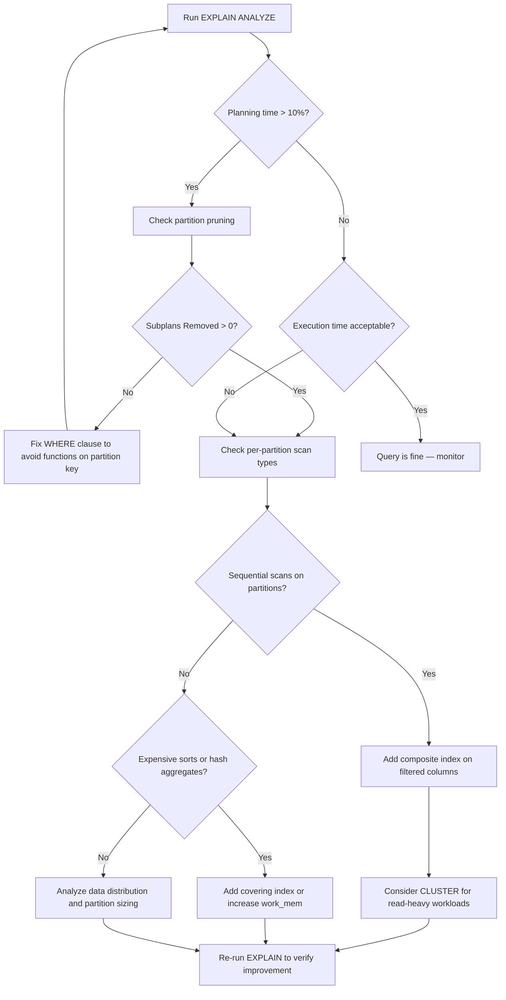

| Difficulty | Channel | Tags |
|---|---|---|
| intermediate | database | explain, query-plan, partitioning |

Picture this: you partitioned your massive table by date, you wrote a query filtering on a single week, and the database still takes 600ms — before a single row is ever read. That is exactly what happened to TimescaleDB. Their hypertables with 4,000+ date-based partitions were hemorrhaging planning time on every single query, even though partition pruning should have eliminated most chunks instantly [1]. The bottleneck was not execution. It was not indexing. It was PostgreSQL's planner reading metadata from every partition's heap files before pruning even had a chance to kick in. The fix cut planning time from 600ms to 36ms — a 15x improvement with zero overhead. And the lesson inside that fix will change how you read every EXPLAIN plan from now on.

---

> ### Real-World Case — TimescaleDB
>
> TimescaleDB's hypertables with 4000+ date-based partitions were spending 600ms just on query PLANNING before a single row was ever read — even when the query only needed to scan a single week's worth of data out of a year's worth of partitions. The bottleneck was not in query execution but in PostgreSQL's planner reading metadata from every partition's heap files regardless of whether that partition would be pruned.
>
> | | |
> |---|---|
> | **Challenge** | PostgreSQL's get_relation_info() function opens and reads metadata from every partition's heap data file to estimate row counts during planning — even for partitions that will be excluded by constraint exclusion. With 4000+ partitions, this meant 600ms of planning overhead on every single query, regardless of how selective the WHERE clause was. |
> | **Solution** | Used flamegraph profiling to identify that the bottleneck was in get_relation_info() → RelationGetNumberOfBlocks() → estimate_rel_size(). Implemented custom range exclusion that moves chunk/partition exclusion BEFORE the planner opens heap files and fetches statistics, inspired by Amit Langote's Faster Partition Pruning PR for PostgreSQL 11. Shipped in TimescaleDB v0.10.0 (PR #502). |
> | **Outcome** | Query planning time dropped from 600ms to 36ms — a 15x improvement for hypertables with 4000+ partitions. Even with small partition counts (6 chunks), planning improved from 6.6ms to 5.9ms with zero overhead. This revealed that partition pruning is fundamentally a PLANNING-phase optimization, and any work done before pruning is wasted effort. |
> | **Lesson** | When partitioned queries are slow, the bottleneck may not be in execution at all — it can be in the query planner itself reading metadata from partitions that will never be scanned. Always check planning time separately from execution time in EXPLAIN ANALYZE output, because partition pruning only helps if it happens before expensive planning operations. |

---

## Hook — 600ms of Wasted Effort

You have a PostgreSQL table with 100 million rows, partitioned by date. A user fires a query filtering on a specific date range — maybe one week out of a full year of data. The query should be fast. Pruning should knock out 95% of partitions. But instead of returning in 50ms, the query takes 600ms. And here is the twist that catches most developers off guard: the slowness is not in the execution phase at all. It is in the planning phase — the part of the query lifecycle that happens before a single row is ever scanned. You add indexes. You tweak configuration. You rewrite the WHERE clause. None of it helps, because you are optimizing the wrong stage of the pipeline. This is the exact scenario that stumped the engineering team at TimescaleDB, and their investigation revealed a subtlety about how PostgreSQL handles partitioned tables that very few developers understand.

## Problem — The Hidden Tax of Partitioning

When you partition a table in PostgreSQL, you expect the planner to be smart about it. You write a query with a date range, and the planner should skip the partitions that cannot possibly contain matching rows. This is called partition pruning, and it is the single biggest reason partitioning makes queries faster [2]. But here is the problem: partition pruning is a planning-phase optimization. It happens before the executor ever runs. And in PostgreSQL's default behavior, there is expensive work that happens *before* pruning gets a chance to fire. Specifically, when the planner expands a partitioned table, it calls `get_relation_info()` on every single child partition. This function fetches statistics — including an approximate row count — by opening the heap data file for each partition and reading metadata inside it [1]. For a table with 12 monthly partitions, this overhead is negligible. For a hypertable with 4,000 chunks, it means the planner opens 4,000 files, reads 4,000 metadata blocks, and acquires 4,000 locks — every single time you run a query. Even if your query only needs data from one chunk out of those 4,000. The performance impact scales linearly with partition count. With small datasets, you will never notice. With time-series data that accumulates thousands of partitions, it becomes a show-stopper.

## Real-World Case — TimescaleDB's 15x Planning Fix

TimescaleDB hit this problem head-on with their hypertable architecture. Hypertables automatically partition data by time into chunks — and for customers with years of high-frequency data, these hypertables routinely contained tens of thousands of chunks [1]. During profiling, the engineering team generated a flamegraph and discovered that roughly two-thirds of total planning time was consumed by a single function: `get_relation_info()`. Within that function, the culprit was `RelationGetNumberOfBlocks()` and `estimate_rel_size()` — both of which require opening each partition's heap file to read metadata [1]. The key insight was that this metadata gathering is completely wasted when the partition will be pruned anyway. Chunk exclusion does not require table statistics at all. TimescaleDB's fix, delivered in version 0.10.0, moved chunk exclusion to *before* the expensive metadata-gathering step [1]. Instead of expanding all chunks and then pruning, they used their own range-exclusion mechanism (inspired by Amit Langote's Faster Partition Pruning work for PostgreSQL 11) to identify the needed chunks first, then expanded only those. The results: planning time dropped from 600ms to 36ms for 4,000+ chunks — a 15x improvement. Even on small hypertables with just 6 chunks, planning improved from 6.6ms to 5.9ms with zero additional overhead [1]. The lesson? Partition pruning is not just about execution — it is fundamentally about what happens *before* execution begins.

## Deep Dive — Reading the EXPLAIN Plan Like a Detective

So how do you actually diagnose this problem on your own tables? The answer starts with EXPLAIN ANALYZE — but not the way most developers use it. Most developers glance at the total cost number and move on. To find partitioning-related performance issues, you need to look for three specific things in the plan output [3].

**1. Partition Pruning Effectiveness.** Look at the `Append` node at the top of your plan. If pruning is working, you will see `Subplans Removed: N` — where N is the number of partitions the planner eliminated during planning [2]. If N is zero, the planner could not prune anything, and you are scanning every partition. This is the most common red flag.

**2. Index Utilization Per Partition.** Each surviving partition in the plan will show its own scan type — sequential scan, index scan, bitmap scan, and so on. If some partitions are doing sequential scans while others use indexes, the index coverage is inconsistent. A composite index on your date column plus filtered columns can fix this [4].

**3. Expensive Sort and Hash Operations.** Look for `Sort` or `HashAggregate` nodes with high cost estimates. These often appear when the query lacks a supporting index, forcing PostgreSQL to sort results in memory or spill to disk. If you see `Sort Method: external merge Disk`, your work_mem is too small or you need a covering index [3].

The most counterintuitive finding? Your query's execution time might be fast, but the planning time — shown separately at the bottom of EXPLAIN ANALYZE output — tells a different story. If planning time is a significant fraction of total time, the problem is structural, not query-level.

## Workflow — From Diagnosis to Optimization in 5 Steps

Here is a systematic workflow for diagnosing and fixing slow queries on partitioned tables. Each step builds on the previous one, so resist the urge to skip ahead.

**Step 1: Baseline the Query.** Run `EXPLAIN (ANALYZE, BUFFERS, FORMAT TEXT)` on your slow query. Record both planning time and execution time. If planning time exceeds 10% of total time on a partitioned table, you likely have a pruning or metadata overhead issue [3].

**Step 2: Verify Partition Pruning.** Check the `Append` node for `Subplans Removed`. If pruning is not happening, your WHERE clause may be wrapping the partition key in a function — a common mistake that defeats pruning entirely [2]. For example, `date_trunc('month', event_date) = '2024-01-01'` prevents pruning, while `event_date >= '2024-01-01' AND event_date  B{Planning time > 10%?}
    B -->|Yes| C[Check partition pruning]
    B -->|No| D{Execution time acceptable?}
    C --> E{Subplans Removed > 0?}
    E -->|No| F[Fix WHERE clause to avoid functions on partition key]
    E -->|Yes| G[Check per-partition scan types]
    D -->|Yes| H[Query is fine — monitor]
    D -->|No| G
    G --> I{Sequential scans on partitions?}
    I -->|Yes| J[Add composite index on filtered columns]
    I -->|No| K{Expensive sorts or hash aggregates?}
    J --> L[Consider CLUSTER for read-heavy workloads]
    K -->|Yes| M[Add covering index or increase work_mem]
    K -->|No| N[Analyze data distribution and partition sizing]
    F --> A
    L --> O[Re-run EXPLAIN to verify improvement]
    M --> O
    N --> O

## Code Example — Putting It All Together

Here is a practical example that demonstrates the full diagnostic and optimization cycle. This SQL targets a partitioned events table with 100 million rows across monthly partitions, and walks through pruning verification, index creation, and clustering.

```sql
-- Step 1: Baseline — run EXPLAIN ANALYZE to capture both planning and execution time
EXPLAIN (ANALYZE, BUFFERS, COSTS, FORMAT TEXT)
SELECT * FROM events
WHERE event_date BETWEEN '2024-01-15' AND '2024-01-21'
  AND status = 'completed';

-- Look for:
--   Planning time: if > 10% of total, investigate pruning overhead
--   Append node: Subplans Removed: N — N should be > 0
--   Per-partition scan types: Index Scan vs Seq Scan

-- Step 2: Verify pruning is actually working by disabling it temporarily
SET enable_partition_pruning = off;

EXPLAIN (ANALYZE, BUFFERS)
SELECT * FROM events
WHERE event_date BETWEEN '2024-01-15' AND '2024-01-21'
  AND status = 'completed';

-- Compare: with pruning off, every partition appears in the plan
-- The difference is exactly what pruning was saving you
RESET enable_partition_pruning;

-- Step 3: Add a composite index that covers the most common query pattern
-- Partition key (event_date) must be the leading column for pruning synergy
CREATE INDEX CONCURRENTLY idx_events_date_status
ON events (event_date, status);

-- CONCURRENTLY avoids locking the table during index creation
-- Critical for production tables with active write traffic [6]

-- Step 4: For read-heavy workloads, cluster physical storage to match the index
-- This is a one-time operation — rows inserted later won't be clustered
CLUSTER events USING idx_events_date_status;

-- Step 5: Re-run the baseline query to verify improvement
EXPLAIN (ANALYZE, BUFFERS, COSTS, FORMAT TEXT)
SELECT * FROM events
WHERE event_date BETWEEN '2024-01-15' AND '2024-01-21'
  AND status = 'completed';

-- Expected: Index Scan on only the January partition(s)
-- Planning time should be minimal if pruning is effective
-- Execution time should reflect index seeks, not sequential scans
```

**Walkthrough:** Step 1 establishes your baseline. You capture both planning time (the hidden overhead) and execution time (the actual work). Step 2 is the diagnostic trick — disabling pruning temporarily shows you exactly how many partitions the planner was skipping, confirming whether pruning is working. Step 3 creates the composite index using `CONCURRENTLY`, which is essential for production tables because a standard `CREATE INDEX` locks the table against writes for the entire duration [6]. Step 4 physically reorders rows on disk to match the index order, reducing random I/O for range queries [7]. Step 5 confirms the improvement.

## Lessons Learned — What to Do Differently Tomorrow

Here is what the TimescaleDB story — and the mechanics behind it — teach you about working with partitioned tables in PostgreSQL:

- **Partition pruning is a planning-phase optimization, not an execution-phase one.** Any work the planner does before pruning kicks in is wasted. This means the number of partitions directly impacts planning overhead, even when queries only touch a few [1].
- **The single most common partitioning bug is wrapping the partition key in a function.** `WHERE date_trunc('month', created_at) = '2024-01-01'` defeats pruning entirely. Always write predicates against the raw column using range comparisons [2][5].
- **Composite indexes should have the partition key as the leading column.** This creates synergy between pruning and index lookups — the planner prunes to the right partitions, then the index narrows the scan within each partition [4][6].
- **Planning time is part of your query's latency.** Always check both planning and execution time in EXPLAIN ANALYZE. If planning is a significant fraction, the problem is structural [3].
- **Cluster for read-heavy workloads, but understand the tradeoff.** `CLUSTER` is a one-time operation that physically reorders rows. New inserts will not be clustered, so you need to re-run it periodically or use `pg_repack` for zero-downtime re-clustering [7].
- **The sweet spot for partition count is typically 30-500 per table.** Fewer than 30 and you may not get meaningful pruning benefits. More than 500 and planning overhead starts to matter, even with modern PostgreSQL optimizations [5].

The one thing to remember? When your query on a partitioned table is slow, do not reach for more indexes first. Reach for EXPLAIN (ANALYZE, BUFFERS) and look at the planning time. That number is telling you something important.

---

## Partitioned Table Query Optimization Workflow



<details>
<summary><strong>Original Interview Question</strong></summary>

**Q:** You have a PostgreSQL table with 100M rows partitioned by date. A query filtering on a specific date range is still slow. What would you check in the EXPLAIN plan and how would you optimize it?

**A:** Check partition pruning effectiveness, index utilization patterns, and expensive sort operations. Create composite indexes on (date, filtered_columns) and evaluate clustering strategies for optimal data access.

</details>

## Conclusion

The TimescaleDB story is a masterclass in how partitioning can introduce hidden costs that have nothing to do with data access. The 600ms planning overhead was not caused by slow disks, missing indexes, or bad queries — it was caused by the planner doing work that pruning would have made unnecessary. If you take one thing from this article, let it be this: when a query on a partitioned table is slow, open EXPLAIN (ANALYZE, BUFFERS) and look at the planning time first. That number tells you whether your problem is structural or query-level. If planning is expensive, check that your WHERE clause allows pruning, verify that your indexes align with your partition key, and consider whether your partition count has grown beyond what the planner handles efficiently. Partitioning is one of PostgreSQL's most powerful features — but only when the planner can actually prune. Make sure it can.

---

## References

1. [TimescaleDB incident report — Optimizing queries on hypertables with thousands of partitions](https://www.tigerdata.com/blog/optimizing-queries-timescaledb-hypertables-with-partitions-postgresql-6366873a995d) — blog
2. [PostgreSQL Documentation — Partition Pruning](https://www.postgresql.org/docs/current/ddl-partitioning.html) — documentation
3. [PostgreSQL Documentation — Using EXPLAIN](https://www.postgresql.org/docs/current/using-explain.html) — documentation
4. [PostgreSQL Documentation — CREATE INDEX](https://www.postgresql.org/docs/current/sql-createindex.html) — documentation
5. [The Build — enable_partition_pruning: All Your GUCs in a Row](https://thebuild.com/blog/all-your-gucs-in-a-row-enable_partition_pruning/) — blog
6. [TimescaleDB Docs — Improve Query Performance on Hypertables](https://github.com/timescale/docs/blob/latest/use-timescale/hypertables/improve-query-performance.md) — documentation
7. [PostgreSQL Documentation — CLUSTER](https://www.postgresql.org/docs/current/sql-cluster.html) — documentation
8. [TimescaleDB Source — expand_hypertable.c (chunk exclusion optimization)](https://github.com/timescale/timescaledb/blob/main/src/planner/expand_hypertable.c) — documentation

---

**Author:** Satishkumar Dhule — [GitHub](https://github.com/satishkumar-dhule) · [LinkedIn](https://linkedin.com/in/satishkumar-dhule) · [Website](https://satishkumar-dhule.github.io)
