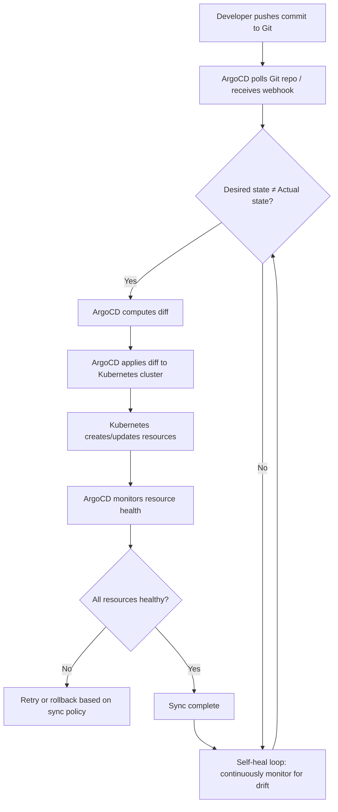

| Difficulty | Channel | Tags |
|---|---|---|
| beginner | devops | argocd, flux, declarative |

Imagine managing 3,000 applications across 130 Kubernetes clusters with deployment times stretching to 90 minutes and nearly one in five production deploys requiring a manual rollback. That was the reality for Intuit's 4,000 developers serving 50 million TurboTax and QuickBooks customers — until they made a bet on declarative GitOps with ArgoCD [1]. The results were staggering: 71% faster builds, 78% faster deployments, and an 83% improvement in both release and rollback times. Here is how they did it, and what your team can learn from their journey.

---

> ### Real-World Case — Intuit
>
> Intuit, maker of TurboTax and QuickBooks, needed to migrate from imperative Spinnaker-based deployments to declarative GitOps with ArgoCD across 3,000+ applications and 130+ Kubernetes clusters serving 4,000 developers and 50 million customers. Their legacy system used custom Groovy scripts and manual approval workflows that couldn't scale, with deployment times reaching 90 minutes and 18% of production deployments requiring manual rollbacks.
>
> | | |
> |---|---|
> | **Challenge** | The imperative Spinnaker-based CI/CD pipeline was fundamentally broken at scale: deployment failures happened in 1 out of every 5 releases, rollback took 14 minutes on average, and 73% of the platform team's backlog was Spinnaker-related tickets. Configuration drift between Git and the cluster caused 4 outages in a single quarter because engineers used kubectl commands that bypassed version control. |
> | **Solution** | Intuit built and open-sourced ArgoCD, implementing a declarative GitOps model where Git became the single source of truth for all desired state. They replaced imperative Spinnaker scripts with Application CRDs pointing to Git repos, enabled auto-sync with self-healing to revert any manual kubectl changes, and redesigned the Application Controller to use Kubernetes watch API with in-memory caching instead of polling. This eliminated the fundamental tension between imperative operations and declarative state. |
> | **Outcome** | After migration: CI build time dropped from 14 to 4 minutes (71% faster), code deployment time fell from 90 to 20 minutes (78% faster), release time went from 18 to 3 minutes (83% faster), and rollback time dropped from 18 to 3 minutes (83% faster). The controller redesign achieved a 120x improvement in reconciliation speed—Istio reconciliation went from ~60 seconds to 0.5 seconds. They now reconcile 150+ applications in under 5 seconds. 3 release engineers were repurposed to platform reliability work. |
> | **Lesson** | The biggest insight was that the naive approach of 'watch Git, check cluster' doesn't scale—Intuit hit a hidden bottleneck where K8s API query throttling (5 QPS default) was silently capping their reconciliation speed. The lesson: in a declarative GitOps model, the performance of the reconciliation loop itself becomes the critical bottleneck, and you must instrument and optimize the controller to match your scale. Also, the imperative vs declarative debate isn't theoretical—every kubectl command that bypasses Git creates drift that cascades into outages. |

---

## Hook — The Deploy That Took an Afternoon

It is a scenario far too familiar: you push a commit, grab coffee, attend a standup, eat lunch, and still find your deployment stuck in a pipeline at 2 PM. For teams using imperative deployment methods — where every change is a `kubectl` command fired manually — this sluggish, error-prone reality is the norm. You might think this is just the cost of doing business at scale. But what if you could reconcile 150+ applications in under five seconds? What if rolling back a bad deploy took three minutes instead of 18? That is not theoretical. That is what ArgoCD delivered for Intuit [1].

## Problem — The Hidden Tax of Imperative Deployments

Every time you type `kubectl apply` directly against a cluster, you are incurring technical debt. The imperative approach feels immediate and intuitive — you run a command, things happen. But there is a hidden cost: that change bypasses version control entirely. There is no audit trail, no peer review, and no single source of truth. Over weeks and months, your production environment drifts from what your manifests declare. Different team members patch different services with different flags. Microservices drift apart. Configuration drift becomes the silent killer of reliability, making rollbacks a guessing game. Worse, when something breaks — and with 18% of deploys requiring manual rollbacks at Intuit, something certainly was breaking [1] — you cannot simply revert a Git commit and trust the system to fix itself. You must SSH into clusters, hunt down the offending change, and manually restore state. The imperative approach may feel fast, but it leaves your infrastructure in a state that actively resists automation and scaling.

## Real-World Case — How Intuit Broke the Spinnaker Spell

Intuit's engineering organization had invested heavily in Spinnaker — a deployment platform that relies on imperative pipelines with custom Groovy scripts and manual approval gates. At its peak, their system managed 3,000+ applications across 130+ Kubernetes clusters for 4,000 developers [1]. But the cracks were becoming impossible to ignore. A typical CI build took 14 minutes. Code deployment consumed 90 minutes. Release cycles were 18 minutes end-to-end — and every rollback took equally long. The custom scripting meant that every new service required bespoke pipeline configuration. The manual approval workflows created bottlenecks where senior engineers became gatekeepers rather than builders. The 18% manual rollback rate was a symptom of a deeper problem: humans were too involved in the deploy process. The transformation to ArgoCD was not just a tool swap — it was a philosophical shift from "how do we deploy this service?" to "how do we declare what this service should be?" The impact was dramatic: CI builds dropped from 14 to 4 minutes (71% faster). Code deployment went from 90 to 20 minutes (78% faster). Release time shrank from 18 to 3 minutes (83% faster). Their Istio reconciliation went from roughly 60 seconds to 0.5 seconds — a 120x improvement [1]. Three release engineers were repurposed to platform reliability work.

## Deep Dive — Declarative vs. Imperative: The Real Tradeoffs

The core difference between declarative and imperative approaches comes down to one question: who owns the truth? In an imperative world, you write scripts that tell Kubernetes *what to do*. In a declarative world, you write manifests that tell Kubernetes *what you want*, and the system figures out the rest. Declarative GitOps treats your Git repository as the single source of truth [2]. When you want to change a deployment, you edit a YAML file, commit it, open a PR, and merge. ArgoCD detects the change in Git, diffs it against the live cluster state, and reconciles any differences. This means every change is peer-reviewed, auditable, and trivially revertible. The imperative approach, by contrast, is like giving driving directions to someone versus handing them a map and a destination. Directions work fine until the road changes. A map adapts. ArgoCD's self-healing capability [3] is the concrete expression of this philosophy: if an operator runs `kubectl delete deployment nginx` directly on the cluster (and they will — developers are creative), ArgoCD detects the drift and recreates it within the health check interval. The cluster self-heals without human intervention. But here is the plot twist: declarative GitOps is not simpler. The initial setup requires understanding Custom Resource Definitions (CRDs), sync waves, prune policies, and health checks [4]. The payoff is not day-one simplicity — it is day-365 reliability.

## Workflow — The GitOps Reconciliation Loop

Here is how the GitOps reconciliation loop works in practice, step by step:

1. **Developer commits** — A pull request is merged into the Git repository containing updated Kubernetes manifests or Helm charts.
2. **ArgoCD detects change** — ArgoCD polls the Git repository (or receives a webhook notification) and identifies that the desired state has changed.
3. **Diff computation** — ArgoCD compares the desired state in Git against the live state of resources in the target Kubernetes cluster.
4. **Auto-sync** — If auto-sync is enabled, ArgoCD applies the diff to the cluster, creating, updating, or deleting resources as needed.
5. **Health assessment** — ArgoCD monitors the health of deployed resources (pods becoming Ready, Services getting endpoints, etc.).
6. **Self-healing** — If any manual change drifts the cluster from Git state, ArgoCD automatically reverts it on the next sync cycle.

The diagram below illustrates this continuous reconciliation loop from commit to healthy cluster state.

## Code Example — Configuring an ArgoCD Application with Auto-Sync

The heart of any ArgoCD setup is the Application Custom Resource. This YAML ties your Git repository to a target cluster and namespace, then enables auto-sync with self-healing. Here is a production-ready example configured with a three-minute health check interval:

## Lessons Learned — What to Do Differently Tomorrow

Intuit's journey reveals several counterintuitive lessons about GitOps at scale. First, the bottleneck is rarely the tool — it is the mental model. Teams that succeed with ArgoCD are teams that embrace the discipline of declaring everything in Git, including secrets (via sealed secrets or external secret operators) and cluster configuration. Second, start with auto-sync disabled. Many teams rush to enable auto-sync and immediately trigger a cascade of unintended changes when ArgoCD diffs their messy clusters against pristine Git manifests [3]. Enable auto-sync only after a manual sync confirms the cluster matches Git. Third, implement proper sync waves [4] for dependency ordering — your database migration Helm chart should deploy before your application chart, and your application chart should deploy before your service mesh configuration. Fourth, invest in observability for the GitOps pipeline itself. ArgoCD exposes rich Prometheus metrics for sync duration, health status, and reconciliation frequency [5]. Monitor these before you need them. Finally, remember that declarative GitOps does not eliminate complexity — it moves complexity from runtime debugging to design-time configuration. The 18% manual rollback rate at Intuit was replaced by a system where rollbacks became a single Git revert. But that only works when your manifests are correct. Test your manifests in CI. Validate them with tools like `kubeconform` [7]. The goal is not zero manual intervention — it is making manual intervention deliberate, rare, and impactful.

---

## GitOps Reconciliation Loop with ArgoCD

<strong>Original Interview Question</strong>

**Q:** You're setting up GitOps for a microservices deployment. How would you configure ArgoCD to automatically sync changes from your Git repository to Kubernetes, and what's the difference between declarative and imperative approaches in this context?

**A:** I'd configure ArgoCD by setting up a Git repository containing Kubernetes manifests or Helm charts, creating an Application CRD that points to the Git repository, enabling auto-sync with a health check interval of 3 minutes, and implementing self-healing to automatically revert any manual changes. The declarative approach involves defining the desired state in Git through YAML manifests, Helm charts, or Kustomize configurations, where ArgoCD continuously reconciles the actual state with the desired state. In contrast, the imperative approach uses kubectl commands to make direct changes to the cluster, bypassing the Git repository as the single source of truth.

## Conclusion

Intuit's journey from 90-minute imperative deploys to sub-5-second GitOps reconciliation is proof that the declarative approach scales where imperative scripts break. The investment is in discipline — writing correct manifests, testing them in CI, and trusting the reconciliation loop. Start small: pick one service, write its Application CRD, disable auto-sync, verify manually, and only then turn on the automation. Your future self, the one who used to stare at a 90-minute deploy, will thank you.

---

## References

1. [Intuit incident report](https://blog.argoproj.io/doing-gitops-at-scale-6313f5889775) — blog
2. [ArgoCD Documentation - Declarative Setup](https://argo-cd.readthedocs.io/en/stable/operator-manual/declarative-setup/) — documentation
3. [ArgoCD Documentation - Auto Sync and Self-Healing](https://argo-cd.readthedocs.io/en/stable/user-guide/auto_sync/) — documentation
4. [ArgoCD Documentation - Sync Waves and Sync Phases](https://argo-cd.readthedocs.io/en/stable/user-guide/sync-waves/) — documentation
5. [Kubernetes Documentation - Declarative Management of Kubernetes Objects](https://kubernetes.io/docs/tasks/manage-kubernetes-objects/declarative-config/) — documentation
6. [CNCF - What is GitOps?](https://www.cncf.io/blog/2021/08/11/what-is-gitops/) — blog
7. [Kubeconform - Kubernetes Manifest Validation](https://github.com/yannh/kubeconform) — documentation
8. [ArgoCD Documentation - Application CRD Reference](https://argo-cd.readthedocs.io/en/stable/operator-manual/declarative-setup/#applications) — documentation

---

**Author:** Satishkumar Dhule — [GitHub](https://github.com/satishkumar-dhule) · [LinkedIn](https://linkedin.com/in/satishkumar-dhule) · [Website](https://satishkumar-dhule.github.io)
