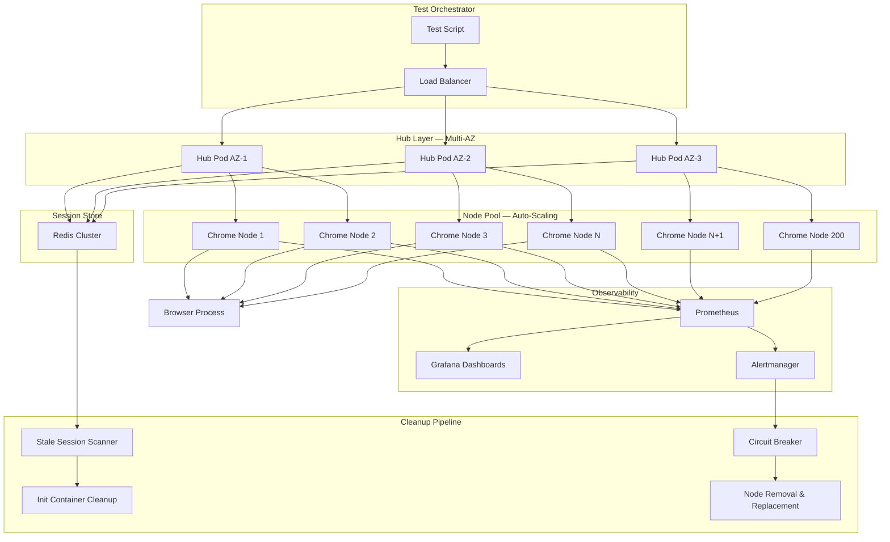

| Difficulty | Channel | Tags |
|---|---|---|
| advanced | system-design | selenium, webdriver, grid |

Walmart Labs was drowning. Their e-commerce platform shipped twice a month because QA was a manual bottleneck, and the three-week dev cycle meant teams couldn't possibly test across the hundreds of browser-OS-device combinations their customers actually used [1]. Then they built Test Armada — and it changed everything. Within a year, 50,000+ automated tests ran daily, covering 700+ browser-OS combos and 300+ real devices. Deployment frequency jumped from twice a month to multiple times daily, and they saved over 750,000 man-hours in a single year [1]. The lesson is clear: at scale, your Selenium Grid architecture isn't a nice-to-have — it's the difference between shipping confidently and shipping blind.

---

> ### Real-World Case — Walmart Labs
>
> Walmart's e-commerce platform was stuck deploying only twice per month because the entire QA process was manual. With a three-week dev cycle, teams couldn't test across the hundreds of browser/OS/device combinations their customers actually used. Goal misalignment and legacy tooling made it nearly impossible to scale quality assurance to match the pace of app improvement the business demanded.
>
> | | |
> |---|---|
> | **Challenge** | Scale automated browser testing from zero to tens of thousands of daily tests across 700+ browser/OS combinations and 300+ real devices, while eliminating manual testing bottlenecks and achieving continuous deployment velocity — all without creating an unsustainable internal infrastructure burden. |
> | **Solution** | In 2015, Walmart built Test Armada, an open-source quality automation platform for native, web, and backend testing. They formed a Center of Excellence (DXT team) to standardize on Selenium, Appium, Espresso, and XCUITest. They adopted Sauce Labs as their cloud-based Selenium Grid to offload browser/device infrastructure, avoiding the memory leaks, session management headaches, and scaling complexity of self-hosted Grid deployments. Test Armada imports data from Sauce Labs runners to provide a unified quality dashboard across all Walmart.com, Grocery, and backend systems. |
> | **Outcome** | 50,000+ automated tests executed daily, covering 700+ browser/OS combos and 300+ real devices. Deployment frequency increased from twice per month to multiple times daily. 14 million+ tests run in 7 years. 750,000+ man-hours saved in one year. Over 40 projects standardized on Test Armada. One team went from 200 test cases to 500 with every production build. |
> | **Lesson** | Self-hosted Selenium Grid at massive scale creates compounding operational debt — memory leaks, session cleanup, node failure recovery, and cross-browser provisioning. Walmart's key insight was to build their own orchestration layer (Test Armada) for test management while outsourcing the browser grid infrastructure entirely to a managed service. This separation of concerns let them scale test volume without scaling infrastructure teams. |

---

## Hook — It Was 3am When the Entire Test Fleet Went Dark

Picture this: your team has just greenlit a major release. Thousands of Selenium tests are queued across your Grid — 10,000 concurrent sessions, browsers humming on 200 nodes. Then the alerts start. Memory is climbing. Nodes are timing out. Sessions are piling up in the queue with no resolution. The on-call engineer opens Grafana to find half the fleet is red. This isn't a hypothetical. Every company that scales Selenium Grid to production-grade eventually faces the same reality: managing thousands of concurrent browser sessions across multiple data centers is a distributed systems problem, not a testing problem. And if you treat it like a testing problem, you will get burned.

## Problem — Why 10,000 Concurrent Sessions Breaks Everything You Know

Most developers' first experience with Selenium Grid is a single hub and a handful of nodes. It works beautifully — until it doesn't. At 10,000 concurrent sessions, you're dealing with a fundamentally different beast. Every assumption about session management, memory allocation, and node health flips upside down.

Consider the math. With 50 sessions per node — a reasonable density for Chrome containers with 2GB RAM each — you need at minimum 200 nodes. That's 400GB of baseline cluster memory, and that's before you add the 30% buffer real production workloads demand. Your hub, once a simple traffic cop, becomes a critical single point of failure. And your session store? If it's in-memory, you're one restart away from losing every active test session.

Here is the thing that catches most teams off guard: the challenge isn't spinning up nodes — Kubernetes handles that with auto-scaling. The real nightmare is what happens between the sessions. Memory leaks creep in after hours of continuous operation. Zombie sessions hold onto browser processes long after their test scripts have finished. Nodes degrade silently, passing health checks while their actual throughput drops to a trickle. And if you're running across multiple data centers, network partitions can split your Grid into isolated islands that can't agree on which sessions belong where.

The conventional wisdom — just add more nodes — doesn't solve these problems. It multiplies them. Every new node is another potential memory leak, another surface for silent degradation, another thing that needs graceful cleanup when it fails. What you actually need is an architecture designed from the ground up for resilience, not just scale.

## Real-World Case — Walmart's Test Armada Revolution

Walmart Labs faced a challenge that will feel painfully familiar to many teams. Their e-commerce platform — serving millions of customers daily — was stuck deploying only twice per month. The bottleneck wasn't engineering velocity; it was QA. The entire process was manual, and with a three-week development cycle, teams simply couldn't test across the hundreds of browser-OS-device combinations their customers relied on [1]. Goal misalignment between engineering and QA teams, combined with legacy tooling, made it nearly impossible to match the pace of improvement the business demanded.

The transformation was dramatic. Walmart built Test Armada, a unified test infrastructure that standardized testing across 40+ projects. The numbers speak for themselves: 50,000+ automated tests executed daily, coverage across 700+ browser-OS combinations and 300+ real devices, and deployment frequency increasing from twice monthly to multiple times daily [1]. Over seven years, they ran 14 million+ tests and saved 750,000+ man-hours in a single year alone.

But here's what's worth studying: Walmart didn't just throw more Selenium instances at the problem. They fundamentally rethought how test infrastructure should work — standardization, automation of lifecycle management, and real-time observability became the pillars. One team went from 200 test cases to 500, running against every production build [1]. That kind of confidence only comes from an architecture that handles failure gracefully, cleans up after itself, and gives you clear visibility into what's happening across the entire fleet.

## Deep Dive — The Architecture Behind 10,000 Concurrent Sessions

Building on Walmart's lessons, let's dissect what a production-grade Selenium Grid actually looks like when you need 10,000 concurrent sessions with 99.9% uptime. There are five pillars that hold the whole thing together, and skipping any one of them will eventually bring your Grid to its knees.

**Hub-Node Pattern on Kubernetes**
The foundation is Kubernetes — but not in the way most tutorials describe. Your hub runs as a StatefulSet, not a Deployment, because you need stable network identities and persistent storage for session routing state. Browser nodes run as separate pods across multiple availability zones, each with strict CPU and memory limits. Kubernetes' Horizontal Pod Autoscaler scales nodes based on queue depth — not CPU utilization — because in a Selenium Grid, a node at 100% CPU might still be fine while a node at 30% CPU could be bottlenecked on session startup.

**Redis Session Store with TTL**
Here's where many grids fail catastrophically. If your session registry is in the hub's memory, a hub restart wipes every active session. Redis solves this with a cluster-mode deployment where each session gets a TTL — typically matching the maximum test timeout plus a safety buffer. This means stale sessions self-cleanup. Connection pooling ensures you're not burning Redis connections per session, and key expiration scans run every 5 minutes to catch anything the TTL missed [2].

**Memory Management: The Silent Killer**
Memory leaks in Selenium nodes are insidious. Chrome's renderer process grows over time, and garbage collection tuning in the JVM-based hub only goes so far. The solution is layered: Kubernetes init containers remove stale Docker volumes on node recycle, weekly rolling restarts clear accumulated state, and Prometheus alerts fire at 80% memory usage — giving you time to investigate before pods get OOM-killed [3]. This is the kind of operational discipline that separates a Grid that runs in demos from one that runs in production.

**Load Balancing and Circuit Breakers**
Simple round-robin load balancing doesn't work at this scale because nodes aren't equal. Some have faster CPUs, some have more available memory, some are in a data center with lower latency to your test orchestrator. Weighted round-robin based on node capacity and response time is the minimum viable approach. Health checks hit an HTTP /status endpoint every 10 seconds, and three consecutive failures trigger immediate node removal. Circuit breakers — inspired by the Hystrix pattern — isolate failing nodes for 30-second recovery windows, preventing a single sick node from degrading the entire fleet [4].

**Multi-Data Center Resilience**
Running across multiple data centers introduces the specter of network partitions. If your Grid can't determine which data center "owns" a session during a split, you get split-brain: duplicate session assignments, corrupted state, and tests that silently pass when they should fail. Leader election using etcd or ZooKeeper prevents this, while Pod Disruption Budgets ensure that even during rolling updates or node failures, at least 85% of your capacity stays online [5].

## Workflow — From Green Button to 10,000 Sessions in 60 Seconds

So how does a session actually flow through this architecture? Let's walk through the journey of a single test request — and then multiply it by 10,000.

When a test script requests a browser session, the request first hits the load balancer, which routes it to the healthiest hub instance. The hub checks the Redis session store for existing session state (in this case, none — it's a new request), then evaluates the requested browser capabilities against available nodes. Weighted selection picks the optimal node, the hub provisions the session on that node, stores the session metadata in Redis with a TTL, and returns the session endpoint to the test script.

Meanwhile, the monitoring pipeline is watching. Prometheus scrapes metrics from every hub and node every 15 seconds — session count, memory usage, response latency, error rates. Grafana dashboards visualize these in real time. If a node's memory crosses 80%, it gets flagged. If it fails three consecutive health checks, it's removed from the pool and a replacement is spun up by the autoscaler.

The following diagram illustrates the complete session lifecycle from request to cleanup:

## Code Example — Kubernetes-Native Selenium Grid with Session Lifecycle Management

Here's a practical implementation of the core session lifecycle manager — the component that bridges Redis session tracking, Kubernetes node management, and Prometheus metrics. This Python service monitors active sessions, detects stale ones, and orchestrates cleanup while exposing metrics for observability.

## Lessons Learned — What 14 Million Tests Teach You About Grid Architecture

After walking through this architecture, several patterns emerge that separate successful large-scale Selenium deployments from the ones that collapse under their own weight.

**Battle scars from the field:**
- **Don't trust memory metrics alone.** A node can report healthy memory usage while its Chrome process is leaking file descriptors. Monitor open file handles, thread counts, and process tree depth alongside memory [6].
- **TTL is not optional.** Every session MUST have an expiration. Without it, a crashed test script leaves a zombie session that consumes a browser process indefinitely. This is the single most common cause of gradual Grid degradation.
- **Health checks must be active, not passive.** Waiting for a test to fail on a bad node tells you too late. HTTP health checks every 10 seconds with immediate failover is the baseline. Many teams also add synthetic test runs — real browser sessions that exercise the node — as a deeper health signal.
- **Circuit breakers save more than uptime.** They save debugging time. Without them, a failing node contaminates dozens of sessions before it's detected, making root cause analysis a nightmare.
- **Multi-AZ is table stakes, not a luxury.** If you're running 10,000 sessions, you cannot afford a single availability zone taking your entire fleet offline. Deploy across at least three AZs with Pod Disruption Budgets guaranteeing minimum capacity [5].

**The Walmart takeaway:** Standardization matters as much as scale. Walmart didn't just build a bigger Grid — they standardized how every project interacted with it, making the infrastructure invisible to individual teams [1]. That's the real unlock: when developers don't have to think about the Grid, they write more tests, catch more bugs, and ship more confidently.

If you're starting this journey, begin with these three moves: (1) move your session store to Redis with aggressive TTLs, (2) implement circuit breakers on your nodes before you need them, and (3) instrument everything with Prometheus from day one — you cannot improve what you cannot measure.

---

## Selenium Grid Architecture — Session Lifecycle and Observability Pipeline

<strong>Original Interview Question</strong>

**Q:** Design a scalable Selenium Grid architecture to handle 10,000 concurrent test sessions with 99.9% uptime, ensuring zero memory leaks through automatic session lifecycle management, real-time monitoring, and graceful node failure recovery across multiple data centers?

**A:** Deploy Kubernetes cluster with auto-scaling node pools, Redis session store with TTL policies, Prometheus metrics for memory monitoring, circuit breakers for node isolation, and sidecar containers for session cleanup. Implement health checks, resource quotas, and rolling updates.

## Conclusion

The journey from a handful of Selenium nodes to a 10,000-session Grid is really a journey from thinking about testing to thinking about distributed systems. Walmart proved that scaling test infrastructure isn't just about more browsers — it's about session lifecycle management, observability, and graceful failure recovery [1]. The architecture patterns that make this possible — Redis TTLs for session safety, circuit breakers for node isolation, Prometheus for real-time visibility, and Kubernetes for orchestration — aren't Selenium-specific. They're the same patterns that power every resilient distributed system. Start with session lifecycle management tomorrow: audit your current session TTLs, add Prometheus metrics to your hub, and implement circuit breakers on your node pool. The Grid you build today determines how confidently you ship next quarter.

---

## References

1. [Walmart Labs incident report](https://assets.ctfassets.net/czwjnyf8a9ri/2hAezPNKo2vATvujFja6ac/4dad2ae379cc2db50c5beb8b4995a4c1/cs-walmart-labs.pdf) — article
2. [Redis TTL Documentation](https://redis.io/docs/latest/develop/expire/) — documentation
3. [Kubernetes Resource Management for Pods](https://kubernetes.io/docs/concepts/configuration/manage-resources-containers/) — documentation
4. [Kubernetes Health Checks — Liveness, Readiness, and Startup Probes](https://kubernetes.io/docs/tasks/configure-pod-container/configure-liveness-readiness-startup-probes/) — documentation
5. [Pod Disruption Budgets — Kubernetes Documentation](https://kubernetes.io/docs/tasks/run-application/configure-pdb/) — documentation
6. [Selenium Grid 4 — Documentation](https://www.selenium.dev/documentation/grid/) — documentation
7. [Chrome DevTools Protocol — Browser Automation](https://chromedevtools.github.io/devtools-protocol/) — documentation
8. [etcd Leader Election — Distributed Consensus](https://etcd.io/docs/v3.5/dev-guide/interacting_api/#leader-election) — documentation

---

**Author:** Satishkumar Dhule — [GitHub](https://github.com/satishkumar-dhule) · [LinkedIn](https://linkedin.com/in/satishkumar-dhule) · [Website](https://satishkumar-dhule.github.io)
