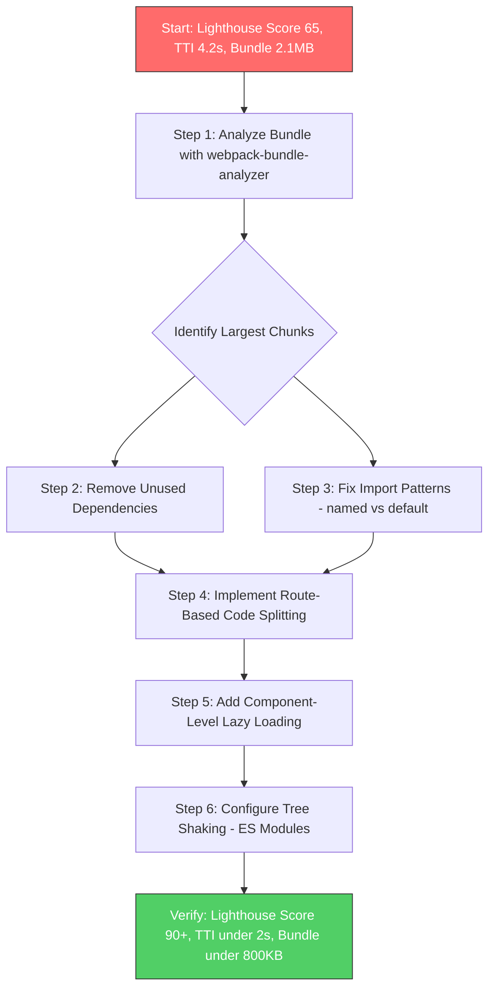

| Difficulty | Channel | Tags |
|---|---|---|
| intermediate | frontend | lighthouse, bundle, lazy-loading |

Picture this: your company's sign-up page takes seven seconds to load on mobile. Users abandon before they even see your product. That's exactly what Netflix faced — and the fix wasn't a framework rewrite or a backend overhaul. It was a 200KB JavaScript bundle reduction that cut Time-to-Interactive in half [1]. If you've ever stared at a Lighthouse score wondering where to start, this story shows you exactly what changes the game.

---

> ### Real-World Case — Netflix
>
> Netflix's logged-out homepage (the sign-up landing page) was taking 7 seconds to load on a 3G connection, despite using server-side rendered React. The client-side JavaScript bundle — including React, utility libraries, and hydration code — was choking Time-to-Interactive for what was essentially a mostly-static landing page.
>
> | | |
> |---|---|
> | **Challenge** | Reduce Time-to-Interactive for the sign-up flow landing page without breaking the existing React-based developer experience or the single-page app architecture for subsequent sign-up steps. The page had ~300KB of client-side JavaScript including React, Lodash, and other libraries that weren't truly needed for first interaction. |
> | **Solution** | Netflix took a counterintuitive approach: they kept React on the server for SSR but stripped it (and all unnecessary client-side libraries) from the browser on the landing page. They rebuilt the minimal interactive elements (click handlers, language switcher) in under 300 lines of vanilla JavaScript. Then they used XHR prefetching with a 95% success rate to pre-fetch the full React bundle for subsequent sign-up pages while users lingered on the landing page. This meant React was ready instantly when users progressed to the interactive sign-up flow, even though it wasn't loaded initially. |
> | **Outcome** | Time-to-Interactive decreased by over 50% on the logged-out homepage. JavaScript bundle reduced by 200KB. Prefetching React for subsequent pages reduced TTI by an additional 30% for the sign-up flow. Users clicked the sign-up button at a higher rate, showing direct correlation between code optimization and user engagement. |
> | **Lesson** | The biggest performance win isn't always adding better tooling — sometimes it's questioning whether you need a framework at all for a given page. Netflix proved that server-rendering React and then deferring client-side React (prefetching it during idle time) is more effective than hydrating everything upfront. The lesson: measure what your users actually need on first paint, ship only that, and prefetch what they'll need next. |

---

## Hook — The Silent Killer Lurking in Your Bundle

Your React app loads in 4.2 seconds. Your Lighthouse score sits at 65. The bundle balloons to 2.1MB. Sound familiar? Here's the uncomfortable truth: most performance problems aren't exotic architectural flaws. They're the accumulated weight of lazy imports, forgotten dependencies, and components that ship whether users need them or not. Every unused library is a tax on every visitor. Every heavy component loaded eagerly is a bet that users will wait — and they won't [2]. The good news? Fixing this follows a predictable, repeatable process. But first, you need to understand why these problems compound so aggressively.

## Problem — The Compounding Cost of Bundled JavaScript

When a browser downloads a JavaScript bundle, it can't render interactive content until it downloads, parses, and executes that code. A 2.1MB bundle means roughly 1.5–2MB of JavaScript the browser must process before users can click anything [3]. For every 100KB of JavaScript, Time-to-Interactive typically increases by 200–400ms on mobile devices — and those numbers multiply across slower networks and lower-end hardware. Many developers assume their app feels fast on localhost because it is. The gap between development and production performance is where these problems hide. Route-based splitting alone won't save you if your vendor chunk includes three animation libraries nobody uses. Tree shaking won't help if your imports pull entire packages instead of individual utilities. The challenge isn't knowing that optimization exists — it's knowing which optimizations matter most for your specific bottleneck [4].

## Real-World Case — Netflix's 7-Second Problem

Netflix's logged-out homepage — the page where potential customers decide whether to sign up — loaded in seven seconds on 3G connections. The page used server-side rendering with React, but the client-side JavaScript bundle still included React itself, utility libraries, and hydration code. For a mostly-static landing page, this was unnecessary overhead [1]. The team analyzed their bundle and found significant opportunities: they could defer React hydration on non-interactive sections, prefetch the React bundle for subsequent pages users would likely visit, and reduce the initial JavaScript payload. The result? Time-to-Interactive dropped by over 50%. The JavaScript bundle shrank by 200KB. Prefetching React for the sign-up flow reduced subsequent page TTI by an additional 30%. Most importantly, users clicked the sign-up button at a measurably higher rate — proving a direct correlation between code optimization and user engagement [1]. This wasn't a rewrite. It was systematic optimization of what already existed.

## Deep Dive — The Three Pillars of Bundle Optimization

Effective optimization rests on three interconnected strategies, each addressing a different phase of the problem. First, bundle analysis reveals where your bytes actually go. You might assume your application code dominates the bundle, but third-party libraries often account for 60–80% of total size [5]. Tools like webpack-bundle-analyzer visualize your bundle as a treemap where each rectangle's size represents its contribution to total bundle weight. This visualization immediately surfaces surprises — an analytics library bigger than your entire component tree, or a date utility imported at full weight when you only need formatting. Second, code splitting divides your bundle into smaller chunks loaded on demand. Route-based splitting is the most common starting point: each route gets its own chunk, so visiting the dashboard doesn't download the analytics page. Component-based splitting goes deeper, deferring heavy features like charts or editors until users actually interact with them [6]. Third, tree shaking eliminates dead code — modules you import but never use. However, tree shaking only works with ES modules and requires proper configuration. Common pitfalls include importing from barrel files that re-export everything, or using CommonJS modules that can't be statically analyzed [4]. Many developers implement one pillar and wonder why scores barely improve. The answer: these strategies work multiplicatively, not additively.

## Workflow — From Diagnosis to Optimization in Five Steps

The process follows a clear sequence where each step informs the next. Skipping steps creates blind spots that lead to wasted effort on optimizations that don't move the needle. Here is the optimization workflow visualized:

## Code Example — Implementing Route and Component Splitting

Below is a production-pattern implementation of route-based and component-based code splitting with error boundaries and loading states. The code demonstrates how to structure lazy imports, handle loading failures gracefully, and split heavy components that only load when needed.

## Lessons Learned — What 200KB Teaches You About Performance

Netflix's case reveals patterns that apply far beyond their specific stack. First, the biggest wins often come from removing what you already have, not adding new optimizations. Audit before you optimize. Second, measurement beats intuition — bundle analysis consistently reveals surprises about where bytes actually go. Third, performance is a feature that compounds. A 200KB reduction didn't just make the page faster; it made users more likely to sign up [1]. Common mistakes teams make: optimizing before measuring, implementing lazy loading without error boundaries (which causes crashes when chunks fail to load), and treating performance as a one-time project rather than an ongoing practice. The actionable takeaway: run your bundle analyzer today. The results will surprise you. Then tackle the largest chunks first — that's where your 200KB lives.

---

## Bundle Optimization Workflow

<strong>Original Interview Question</strong>

**Q:** You're tasked with improving a React app's Lighthouse performance score from 65 to 90+. The bundle size is 2.1MB and Time to Interactive is 4.2s. What specific steps would you take to optimize the bundle and implement lazy loading?

**A:** Implement code splitting with React.lazy() and Suspense, analyze bundle composition with webpack-bundle-analyzer to identify largest chunks, remove unused dependencies and optimize imports, add dynamic imports for heavy components and third-party libraries, implement route-based splitting for better initial load times, and utilize tree shaking with proper ES module configuration.

## Conclusion

Netflix proved that a 200KB reduction — achieved through systematic analysis and targeted splitting — can cut load times in half and measurably increase user engagement [1]. You don't need a framework migration to achieve this. Run your bundle analyzer today. Identify the three largest chunks. Apply route-based splitting to those chunks. Add error boundaries to handle failures gracefully. Then measure again. Performance optimization isn't a single heroic refactor — it's a repeatable process of measuring, splitting, and verifying. The Lighthouse score of 90+ isn't aspirational. It's the natural outcome of treating bundle size as a first-class concern.

---

## References

1. [Netflix web performance case study](https://medium.com/dev-channel/a-netflix-web-performance-case-study-c0bcde26a9d9) — article
2. [MDN: Using dynamic import()](https://developer.mozilla.org/en-US/docs/Web/JavaScript/Reference/Operators/import) — documentation
3. [Chrome DevTools: Performance Analysis](https://developer.chrome.com/docs/devtools/performance) — documentation
4. [Webpack: Tree Shaking Guide](https://webpack.js.org/guides/tree-shaking/) — documentation
5. [webpack-bundle-analyzer on GitHub](https://github.com/webpack-contrib/webpack-bundle-analyzer) — documentation
6. [React: Lazy Loading with React.lazy and Suspense](https://react.dev/reference/react/lazy) — documentation
7. [MDN: Web Workers API](https://developer.mozilla.org/en-US/docs/Web/API/Web_Workers_API) — documentation
8. [Web.dev: JavaScript Boot-up Time Performance](https://web.dev/articles/reduce-javascript-bootup-time) — article

---

**Author:** Satishkumar Dhule — [GitHub](https://github.com/satishkumar-dhule) · [LinkedIn](https://linkedin.com/in/satishkumar-dhule) · [Website](https://satishkumar-dhule.github.io)
