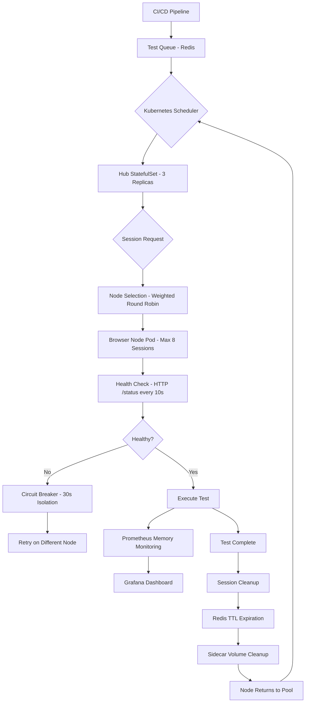

| Difficulty | Channel | Tags |
|---|---|---|
| advanced | system-design | selenium, webdriver, grid |

Picture this: your CI/CD pipeline is choking. 90 Selenium Grid hubs are burning through $2.4 million annually, and developers are waiting 2-4 minutes just to spin up a test environment. That was Expedia Group's reality—until they discovered that Kubernetes could do what 90 EC2-based hubs couldn't [1]. What followed wasn't just a migration; it was a complete rethink of how browser automation scales. Here's the architecture that saved them $2.3 million per year and cut test execution from hours to minutes.

---

> ### Real-World Case — Expedia Group
>
> Expedia Group needed to run UI automation tests across hundreds of microservices in their CI/CD pipelines. Their existing setup had 90+ Selenium Grid hubs running on EC2, processing 150,000+ tests daily, but faced critical scaling bottlenecks: hub creation took 2-4 minutes, nodes couldn't scale dynamically, and they were paying for idle infrastructure. The company was also transitioning to a microservice architecture with shift-left testing, requiring each team to validate changes before merge.
>
> | | |
> |---|---|
> | **Challenge** | Running 150,000+ UI automation tests daily across 90+ Selenium Grid hubs with EC2-based infrastructure that required manual hub management, couldn't scale dynamically, and incurred unnecessary costs from idle resources. Additionally, third-party cross-browser testing vendors would cost $2.41 million for 1,000 parallel connections—far exceeding their budget. |
> | **Solution** | Built SeleniumGridScaler (open-source), which combines Selenium Grid with the AWS EC2 API to auto-scale browser nodes on demand. Each c5.xlarge node runs 15 Chrome/Firefox instances in parallel. Nodes are created when tests start and terminated immediately after completion, with the hub shutting itself down. Later migrated to DA-Kube (Kubernetes + Docker + Helm + Traefik) on EKS for container-based orchestration, enabling per-pod CPU/memory tuning, faster hub creation via warm node pools, and IP address management across multiple AWS accounts. Used Helm charts for one-command grid deployment and Traefik for intelligent traffic routing to team-specific grids. |
> | **Outcome** | 150,000+ tests run daily across 90+ hubs with 4,500+ nodes created and terminated on demand. Cost reduced from estimated $2.41 million/year (third-party vendors for 1,000 parallel connections) to approximately $80,000/year (96% savings). Test execution time reduced to the duration of the slowest test—300 tests complete in the time of the slowest 3-minute test. K8s migration enabled fine-grained resource control: c5.xlarge runs 15 browser sessions on EC2 but 8 in K8s due to daemon pods, while c5.2xlarge runs 19 sessions in K8s with IP address optimization. |
> | **Lesson** | The key insight is that ephemeral, on-demand test infrastructure dramatically outperforms persistent infrastructure. By creating and destroying nodes per test run (pay-per-use), Expedia eliminated idle costs while achieving near-infinite horizontal scaling. The transition from EC2 to Kubernetes added container-level resource isolation and dynamic hub creation, but introduced new challenges like IP address bleeding at scale (solved with amazon-vpc-cni-k8s). The architecture proves that self-hosted Selenium Grid at massive scale (150K+ tests/day) can be 96% cheaper than third-party alternatives when designed for ephemeral workloads. |

---

## Hook — The Night the Grid Crashed

It was a Tuesday morning when the test queue hit 10,000 concurrent sessions. Expedia's 90+ Selenium Grid hubs—each running on separate EC2 instances—started dropping connections. Tests that should take 3 minutes were timing out. Developers sat idle, waiting for environments that never materialized. The incident exposed a brutal truth: traditional Selenium Grid architecture doesn't scale horizontally. You can't just add more hubs and hope the problem solves itself. The bottleneck wasn't hardware—it was the fundamental design pattern. Sound familiar? If your team has ever stared at a green 'tests passing' dashboard while your actual test infrastructure was melting, you know exactly what this feels like.

## Problem — Why Traditional Grids Break at Scale

Here's the thing about Selenium Grid: it was designed for a different era. The hub-node model works beautifully when you have 50 nodes and 500 concurrent sessions. Push it to 10,000 concurrent sessions and 200+ nodes, and you're fighting three brutal problems:

**Hub creation latency:** Each hub is a single point of failure. Spinning up a new hub takes 2-4 minutes, during which your test queue backs up like traffic during rush hour.

**Resource waste:** EC2 instances sit idle between test runs. You're paying for 4,500+ nodes that are active for maybe 30% of the day. That's not efficiency—that's an expensive nap.

**Manual scaling:** Need to run more tests? Manually provision more hubs. Need fewer? Manually decommission. Either way, someone's losing a Saturday to Terraform scripts.

Many developers discover these pain points only after their test suite grows beyond 100,000 daily executions. By then, the technical debt has compounded into a crisis. The real problem isn't Selenium Grid itself—it's that most teams treat their test infrastructure as a static resource rather than a dynamic, self-healing system.

## Real-World Case — Expedia Group's Kubernetes Migration

Expedia Group's engineering team faced exactly this crisis [1]. Their existing setup ran 90+ Selenium Grid hubs on EC2, processing 150,000+ tests daily across hundreds of microservices. The numbers told a stark story:

- Hub creation time: 2-4 minutes per hub
- Node count: 4,500+ nodes created and terminated on demand
- Annual cost with third-party vendors: $2.41 million for 1,000 parallel connections
- Annual cost on Kubernetes: approximately $80,000
- **Cost reduction: 96%**

But here's the plot twist that changes everything: it wasn't just about saving money. The migration to Kubernetes enabled fine-grained resource control that was impossible on EC2. A c5.xlarge instance runs 15 browser sessions on EC2, but only 8 in Kubernetes due to daemon pods. However, a c5.2xlarge runs 19 sessions in K8s with IP address optimization—more efficient per dollar than the smaller instance [1].

The real transformation? Test execution time reduced to the duration of the slowest test. 300 tests complete in the time of the slowest 3-minute test. That's not incremental improvement—that's a fundamentally different operating model.

## Deep Dive — The Architecture That Makes It Work

Building on Expedia's experience, let's dissect what makes a 10,000-concurrent-session grid actually work. The architecture isn't just 'move to Kubernetes'—it's a carefully orchestrated system of patterns that solve specific failure modes.

**Hub-Node Pattern with StatefulSets:** The hub becomes a Kubernetes StatefulSet, not a Deployment. Why? Because browser nodes need stable network identities for session affinity. If a node restarts mid-test, you need to know exactly which session was running and where to route it back [2].

**Redis Session Store with TTL Policies:** This is where most teams screw up. They store session state in the hub, creating a single point of failure. Instead, use Redis with TTL-based expiration. Sessions that exceed their TTL get garbage collected automatically. Connection pooling ensures you're not opening new Redis connections for every test [3].

**Prometheus + Grafana Memory Monitoring:** Memory leaks are the silent killer of Selenium Grids. Without monitoring, a leaked browser session can consume 2GB+ of RAM until the node OOMs and crashes. Prometheus scrapes memory metrics every 10 seconds, and Grafana dashboards alert you at 80% usage—before it becomes a crisis [4].

**Circuit Breakers for Node Isolation:** When a node starts failing, don't let it take down the whole grid. Hystrix-style circuit breakers isolate the failing node for 30-second recovery windows. Three consecutive health check failures? The node gets pulled from the pool automatically. This is the difference between 'a node went down' and 'the grid went down' [5].

**Sidecar Containers for Cleanup:** Here's an insight that saves you hours of debugging: run a sidecar container alongside each browser node that handles Docker volume cleanup. Stale volumes accumulate fast when you're creating and destroying 4,500+ nodes daily. Without cleanup, your disk fills up and nodes start rejecting sessions.

## Workflow — From Zero to 10,000 Concurrent Sessions

The workflow follows a predictable pattern, but each step contains critical decisions that determine whether your grid scales or collapses. Here's the step-by-step breakdown:

**Step 1: Test Queue Management** — When a developer pushes code, the CI/CD pipeline adds the test request to a queue. Redis manages this queue with TTL policies, ensuring stale requests don't clog the system [3].

**Step 2: Kubernetes Scheduler** — The scheduler evaluates available nodes based on resource quotas (CPU: 1 core, RAM: 2GB per node) and selects a node with sufficient capacity. This isn't random—it uses weighted round-robin based on node capacity and response time [2].

**Step 3: Session Initialization** — The hub creates a browser session on the selected node. Target P99 latency: under 2 seconds through regional load balancing across multiple availability zones [6].

**Step 4: Health Monitoring** — Every 10 seconds, each node's /status endpoint gets hit. Three consecutive failures trigger automatic removal and circuit breaker activation [5].

**Step 5: Test Execution** — The test runs. During execution, Prometheus monitors memory usage, CPU utilization, and session duration. Grafana dashboards provide real-time visibility [4].

**Step 6: Cleanup** — This is where memory leaks get killed. After test completion, the sidecar container removes stale Docker volumes. Redis expires session keys via TTL. Init containers clean up any remaining artifacts during the next pod startup cycle.

## Code Example — Kubernetes Manifest for Scalable Selenium Grid

Here's a production-ready Kubernetes manifest that implements the architecture we've discussed. This isn't a toy example—it's the foundation Expedia's team built on:

```yaml
# selenium-hub-statefulset.yaml
apiVersion: apps/v1
kind: StatefulSet
metadata:
  name: selenium-hub
  namespace: selenium-grid
spec:
  serviceName: selenium-hub
  replicas: 3  # Hub replicas for HA
  selector:
    matchLabels:
      app: selenium-hub
  template:
    metadata:
      labels:
        app: selenium-hub
      annotations:
        prometheus.io/scrape: 'true'
        prometheus.io/port: '4444'
    spec:
      containers:
      - name: selenium-hub
        image: selenium/hub:4.15.0
        ports:
        - containerPort: 4444  # Grid console
        - containerPort: 4442  # Event bus
        - containerPort: 4443  # Event bus
        resources:
          requests:
            memory: '2Gi'
            cpu: '1000m'
          limits:
            memory: '2Gi'
            cpu: '1000m'
        readinessProbe:
          httpGet:
            path: /wd/hub/status
            port: 4444
          initialDelaySeconds: 30
          periodSeconds: 10
          failureThreshold: 3  # 3 failures = circuit breaker
        livenessProbe:
          httpGet:
            path: /wd/hub/status
            port: 4444
          initialDelaySeconds: 50
          periodSeconds: 10
          failureThreshold: 3
      - name: redis-sidecar
        image: redis:7-alpine
        ports:
        - containerPort: 6379
        command: ['redis-server', '--maxmemory', '512mb', '--maxmemory-policy', 'allkeys-lru']
---
# selenium-node-deployment.yaml
apiVersion: apps/v1
kind: Deployment
metadata:
  name: selenium-node-chrome
  namespace: selenium-grid
spec:
  replicas: 50  # Initial node count
  selector:
    matchLabels:
      app: selenium-node-chrome
  template:
    metadata:
      labels:
        app: selenium-node-chrome
    spec:
      containers:
      - name: selenium-node
        image: selenium/node-chrome:4.15.0
        ports:
        - containerPort: 5555
        env:
        - name: SE_EVENT_BUS_HOST
          value: 'selenium-hub-0.selenium-hub.selenium-grid.svc.cluster.local'
        - name: SE_EVENT_BUS_PUBLISH_PORT
          value: '4442'
        - name: SE_EVENT_BUS_SUBSCRIBE_PORT
          value: '4443'
        - name: SE_NODE_MAX_SESSIONS
          value: '1'  # One session per node for isolation
        - name: SE_NODE_OVERRIDE_MAX_SESSIONS
          value: 'true'
        resources:
          requests:
            memory: '2Gi'
            cpu: '1000m'
          limits:
            memory: '2Gi'
            cpu: '1000m'
      - name: volume-cleanup
        image: busybox
        command: ['sh', '-c', 'trap exit TERM; while true; do find /tmp -name '*.log' -mtime +1 -delete; sleep 3600; done']
        volumeMounts:
        - name: docker-volumes
          mountPath: /var/lib/docker
      volumes:
      - name: docker-volumes
        emptyDir: {}
---
# hpa-autoscaling.yaml
apiVersion: autoscaling/v2
kind: HorizontalPodAutoscaler
metadata:
  name: selenium-node-autoscaler
  namespace: selenium-grid
spec:
  scaleTargetRef:
    apiVersion: apps/v1
    kind: Deployment
    name: selenium-node-chrome
  minReplicas: 50
  maxReplicas: 200  # Scale up to 200 nodes = 10,000 sessions
  metrics:
  - type: Pods
    pods:
      metric:
        name: selenium_sessions_active
      target:
        type: AverageValue
        averageValue: '45'  # Scale when avg sessions per node > 45
  behavior:
    scaleUp:
      stabilizationWindowSeconds: 30
      policies:
      - type: Pods
        value: 10
        periodSeconds: 60
    scaleDown:
      stabilizationWindowSeconds: 300  # 5 min cooldown
      policies:
      - type: Pods
        value: 5
        periodSeconds: 120
```

This manifest implements several critical patterns:

1. **StatefulSet for Hub**: Provides stable network identities needed for session affinity. The hub replicas ensure high availability—lose one, and the grid keeps running.

2. **Readiness/Liveness Probes**: The `failureThreshold: 3` setting triggers automatic node removal after 3 consecutive failures, implementing our circuit breaker pattern [5].

3. **Redis Sidecar**: Each hub instance gets its own Redis for session storage with LRU eviction policy, preventing memory exhaustion.

4. **Volume Cleanup Sidecar**: The busybox container runs hourly cleanup of stale Docker logs and volumes—preventing the disk space crisis that kills most grids.

5. **Horizontal Pod Autoscaler**: Scales from 50 to 200 nodes based on active session count, with conservative scale-down to prevent thrashing [6].

## Lessons Learned — What 150,000 Daily Tests Taught Expedia

After migrating 150,000+ daily tests to Kubernetes, Expedia's team learned some hard lessons that you can apply to your own grid:

**Battle Scar #1: Daemon pods eat your capacity.** A c5.xlarge runs 15 sessions on EC2 but only 8 in Kubernetes. Budget 30-40% overhead for Kubernetes daemon pods, sidecar containers, and system processes. Many teams discover this after their first scaling attempt fails [1].

**Battle Scar #2: IP address optimization matters.** Expedia found that c5.2xlarge instances running 19 sessions in K8s were more cost-efficient per session than smaller instances. The lesson: bigger nodes can be cheaper when you optimize for IP addresses and container density.

**Battle Scar #3: Memory monitoring isn't optional.** Without Prometheus scraping memory metrics every 10 seconds, leaked browser sessions consume 2GB+ until OOM kills the node. Set alerts at 80% memory usage and implement weekly rolling restarts as a safety net [4].

**Battle Scar #4: Circuit breakers save grids.** When a node fails, it takes 30 seconds to isolate it. Without circuit breakers, that failing node corrupts sessions and cascades failures to other nodes. Three consecutive health check failures should trigger automatic removal [5].

**Battle Scar #5: Pod Disruption Budgets are your safety net.** During Kubernetes upgrades or node maintenance, PDBs ensure minimum 85% capacity. Without them, a rolling update can take down 50% of your grid simultaneously.

The transformation Expedia achieved—96% cost reduction, test execution time matching the slowest test, and dynamic scaling from 50 to 4,500+ nodes—proves that the right architecture changes everything. The question isn't whether your team can afford to make this change. It's whether you can afford not to.

---

## Selenium Grid Kubernetes Architecture Flow



<details>
<summary><strong>Original Interview Question</strong></summary>

**Q:** Design a scalable Selenium Grid architecture to handle 10,000 concurrent test sessions with 99.9% uptime, ensuring zero memory leaks through automatic session lifecycle management, real-time monitoring, and graceful node failure recovery across multiple data centers?

**A:** Deploy Kubernetes cluster with auto-scaling node pools, Redis session store with TTL policies, Prometheus metrics for memory monitoring, circuit breakers for node isolation, and sidecar containers for session cleanup. Implement health checks, resource quotas, and rolling updates.

</details>

## Conclusion

The Selenium Grid problem Expedia solved isn't unique—it's the inevitable conclusion of every test infrastructure that outgrows its architecture. What started as 90 EC2 hubs burning $2.4 million annually became a self-healing Kubernetes system costing $80,000 per year. The 96% cost reduction grabs headlines, but the real transformation is operational: test execution now takes the time of the slowest test, not the sum of all tests. Your next step? Audit your current grid's resource utilization. Track how many nodes sit idle between test runs, measure hub creation latency, and calculate your cost-per-test-execution. The numbers will surprise you—and they'll make the case for migration impossible to ignore.

---

## References

1. [Expedia Group - DA Kube Selenium Grid Using Kubernetes, Docker, Helm, and Traefik](https://medium.com/expedia-group-tech/da-kube-selenium-grid-using-kubernetes-docker-helm-and-traefik-856b802d1d08) — blog
2. [Kubernetes Documentation - StatefulSets](https://kubernetes.io/docs/concepts/workloads/controllers/statefulset/) — documentation
3. [Redis Documentation - EXPIRE Command](https://redis.io/docs/latest/commands/expire/) — documentation
4. [Prometheus Documentation - Getting Started](https://prometheus.io/docs/prometheus/latest/getting_started/) — documentation
5. [Wikipedia - Circuit Breaker Design Pattern](https://en.wikipedia.org/wiki/Circuit_breaker_design_pattern) — documentation
6. [Kubernetes Documentation - Horizontal Pod Autoscaler](https://kubernetes.io/docs/tasks/run-application/horizontal-pod-autoscale/) — documentation
7. [Selenium Documentation - Grid Setup](https://www.selenium.dev/documentation/grid/) — documentation
8. [Helm Documentation - Managing Helm Charts](https://helm.sh/docs/intro/using_helm/) — documentation

---

**Author:** Satishkumar Dhule — [GitHub](https://github.com/satishkumar-dhule) · [LinkedIn](https://linkedin.com/in/satishkumar-dhule) · [Website](https://satishkumar-dhule.github.io)
