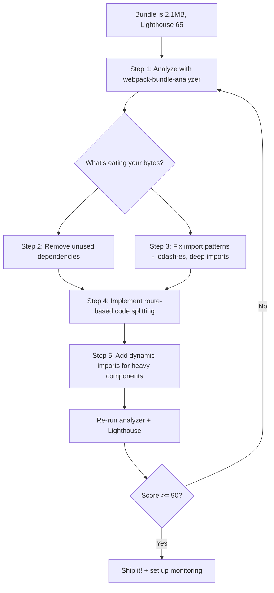

| Difficulty | Channel | Tags |
|---|---|---|
| intermediate | frontend | lighthouse, bundle, lazy-loading |

Picture this: millions of potential subscribers hitting your signup page on a spotty 3G connection, waiting seven agonizing seconds for a page that ships 300KB of JavaScript just to render a login form. That was Netflix's reality, and every second of delay was burning through conversion rates [1]. The fix wasn't a rewrite — it was a systematic attack on the JavaScript bundle. If you've ever stared at a Lighthouse score of 65 and wondered how to push past 90, this is the playbook that companies like Netflix use to turn sluggish apps into speed demons.

---

> ### Real-World Case — Netflix
>
> Netflix discovered that many new users were signing up on mobile devices with slow connections. Their logged-out homepage—the critical signup funnel—took 7 seconds to load on 3G due to shipping 300KB of client-side JavaScript including React, Lodash, and hydration data. This was directly impacting user acquisition and conversion rates.
>
> | | |
> |---|---|
> | **Challenge** | Reduce Time to Interactive and JavaScript bundle size for the logged-out homepage without sacrificing developer experience or the server-rendered React architecture used across the rest of the site. |
> | **Solution** | Netflix's team, profiled by Google's Addy Osmani, took a counterintuitive approach: instead of optimizing React on the client, they removed it entirely from the logged-out homepage. They kept React for server-side rendering (using Hypernova) but rewrote interactive components—tab navigation, language switcher, cookie banner, analytics, and ads—in vanilla JavaScript, saving roughly 300 lines of React code. Then, using XHR prefetching, they fetched the full React bundle and code for the subsequent signup flow during idle time after the initial page loaded. |
> | **Outcome** | Loading and Time to Interactive decreased by 50% on 3G. JavaScript bundle size reduced by 200KB (from ~300KB to ~100KB). Prefetching the full React code for future navigations reduced their Time to Interactive by an additional 30%. React was still used server-side, maintaining the same developer experience and architecture. |
> | **Lesson** | The best React performance optimization isn't always better React code—it's sometimes shipping less JavaScript entirely. For simple pages like a logged-out landing page, vanilla JS can outperform framework hydration dramatically. The prefetching strategy also showed that you can defer the framework cost to idle time without users ever noticing, combining the simplicity of vanilla JS with the power of React for subsequent navigations. |

---

## Hook — The Silent Killer Lurking in Your Bundle

Your React app loads in 4.2 seconds. Your Lighthouse score sits at 65. Your bundle weighs 2.1MB. And here's the uncomfortable truth: nobody complained — they just left. Performance degradation is invisible until it isn't. By the time you notice the drop in engagement, you've already lost the users who would have told you about it. Sound familiar? You're not alone. Studies show that 53% of mobile users abandon sites that take over 3 seconds to load [7]. The gap between 65 and 90 on Lighthouse isn't just a number — it's the difference between an app that feels alive and one that feels like it's dragging its feet.

## Problem — Why 2.1MB Is Worse Than You Think

Let's be specific about what's actually happening when your bundle balloons to 2.1MB. First, raw bytes aren't the villain — parse time is. JavaScript must be downloaded, parsed, compiled, and executed before anything becomes interactive [5]. A 2.1MB bundle doesn't just take longer to download; it takes dramatically longer to parse, especially on mid-range mobile devices where CPU power is a fraction of your MacBook Pro.

Consider the cascade: while the browser parses that bloated bundle, your Time to Interactive stretches to 4.2 seconds. During those 4.2 seconds, users see a page that looks functional but responds to nothing. They click buttons. Nothing happens. They rage-click. Still nothing. That gap between paint and interactivity is where trust dies.

Moreover, bundle bloat compounds. A single lodash import (`import _ from 'lodash'`) pulls in the entire 70KB library when you only use `debounce`. That moment-map library you imported for one component? Another 40KB. Each unnecessary dependency isn't just dead weight — it's dead time on your users' devices [2]. The math is unforgiving: every 100KB of uncompressed JavaScript adds roughly 1 second to interactive time on a mid-range Android device [3].

## Real-World Case — Netflix's 3G Wake-Up Call

Netflix discovered something jarring: their logged-out homepage — the very page where new users decide whether to subscribe — took 7 seconds to load on 3G connections [1]. The culprit was a 300KB client-side JavaScript payload that included React, Lodash, and hydration data for a page that needed to be fast above all else.

The impact was direct and measurable. Every additional second of load time correlated with decreased signups. Netflix's engineering team attacked the problem with surgical precision. They achieved a 50% reduction in both loading and Time to Interactive on 3G by cutting 200KB from the bundle — from roughly 300KB down to 100KB [1]. But here's where it gets interesting: they didn't abandon React. They still used it server-side for the same developer experience and architecture. The magic was in what they *didn't* ship to the client.

Additionally, Netflix implemented prefetching of the full React code for future navigations, which shaved off another 30% of Time to Interactive [1]. The lesson? Sometimes the most powerful optimization isn't adding something clever — it's removing something unnecessary.

## Deep Dive — The Anatomy of Bundle Optimization

To beat the bundle, you need to understand how modern JavaScript delivery actually works. There are three levers you can pull, and they work best together.

**Code Splitting** is the practice of breaking your monolithic bundle into smaller chunks that load on demand. React provides two flavors: route-based splitting (the entire page loads only when a user navigates to it) and component-based splitting (a heavy widget loads only when it enters the viewport) [4]. Route-based is your first big win — most users never visit every page in your app, so why make them download code for pages they'll never see?

**Tree Shaking** is the process of eliminating dead code that's imported but never used. This only works with ES modules (`import/export`), not CommonJS (`require()`) [2]. Many developers think they're getting tree shaking but aren't because their Webpack or Vite config isn't set up for it, or they're importing from barrel files that re-export everything.

**Dynamic Imports** let you defer loading non-critical features. That Markdown editor? Load it only when someone clicks "compose." The chart library with 80KB of D3 dependencies? Load it when the analytics tab is activated, not on initial render.

Here's the counterintuitive insight: these techniques don't just reduce total bytes — they change the *shape* of what loads and *when*. A 1.5MB app that loads incrementally feels faster than a 500KB app that loads all at once. Perception of speed matters as much as raw speed [5].

## Workflow — The 5-Step Optimization Playbook

After studying how high-performing teams approach bundle optimization, a clear workflow emerges. Here's the systematic process that takes you from a bloated 2.1MB bundle to a lean, fast-loading application:



**Step 1: Analyze before you optimize.** Run `webpack-bundle-analyzer` to visualize exactly what's in your bundle [6]. Don't guess — look at the treemap. You might discover that a single date formatting library accounts for 12% of your total bundle.

**Step 2: Remove ruthlessly.** That utility library with 200 functions when you use 5? Replace it with focused alternatives. Swap `moment.js` (300KB) for `date-fns` (tree-shakeable, ~2KB per function). Replace `lodash` with `lodash-es` and use deep imports.

**Step 3: Fix your import paths.** Many developers unknowingly defeat tree shaking by importing from barrel files. Instead of `import { debounce } from 'lodash-es'` (which may still pull more than needed depending on config), use `import debounce from 'lodash-es/debounce'`.

**Step 4: Split by route.** Wrap each top-level route component in `React.lazy()` so the code for `/dashboard` only loads when someone navigates there [4].

**Step 5: Split heavy components.** That rich text editor, the data visualization, the video player — wrap them in `React.lazy()` and give them their own loading states.

The result? You're not just shipping less code. You're shipping the *right* code at the *right* time.

## Code Example — From Monolith to Lean Machine

Here's what route-based code splitting looks like in practice, with proper error handling and loading states:

```javascript
import React, { Suspense, lazy } from 'react';
import { Routes, Route } from 'react-router-dom';

// Lazy-load route components — each becomes its own chunk
const Dashboard = lazy(() => import('./pages/Dashboard'));
const Analytics = lazy(() => import('./pages/Analytics'));
const Settings = lazy(() => import('./pages/Settings'));

// Heavy component split separately for in-route optimization
const HeavyChart = lazy(() => import('./components/HeavyChart'));

// Error boundary catches chunk loading failures
function ErrorFallback() {
  return (
    <div role="alert">
      <h2>Something went wrong loading this page.</h2>
      <button onClick={() => window.location.reload()}>Retry</button>
    </div>
  );
}

function App() {
  return (
    <ErrorFallback>
      {/* Suspense provides a loading UI while chunks load */}
      <Suspense fallback={
        <div className="loading-spinner" aria-label="Loading page...">
          <div className="spinner" />
          <span>Loading...</span>
        </div>
      }>
        <Routes>
          <Route path="/dashboard" element={<Dashboard />} />
          <Route path="/analytics" element={
            <div>
              <h1>Analytics</h1>
              {/* This chart loads only when analytics page renders */}
              <Suspense fallback={<div>Loading chart...</div>}>
                <HeavyChart />
              </Suspense>
            </div>
          } />
          <Route path="/settings" element={<Settings />} />
        </Routes>
      </Suspense>
    </ErrorFallback>
  );
}

export default App;
```

**Line-by-line walkthrough:**

- **`lazy(() => import('./pages/Dashboard'))`** — This dynamic import tells your bundler (Webpack, Vite, or Rollup) to create a separate chunk for Dashboard. The code only downloads when someone actually navigates to `/dashboard` [4].

- **``** — While the chunk downloads, React renders the fallback UI. This is crucial: without it, you'd see a blank screen or an error. The fallback can be as simple as a spinner or as sophisticated as a skeleton layout.

- **Nested `Suspense` for `HeavyChart`** — Notice the second `Suspense` wrapper inside the Analytics route. This means even within a loaded route, heavy components can load independently. The page renders instantly; the chart fades in when ready.

- **`ErrorFallback`** — Chunk loading can fail on slow networks. An error boundary prevents the entire app from crashing when one lazy chunk fails to load [4]. Always pair `lazy()` with error handling.

The result? Your initial bundle now contains only your shell app, React, and routing code — potentially 80KB instead of 2.1MB. Every other page loads on demand, and users on 3G get a functional app in under 2 seconds while heavier features stream in progressively.

## Lessons Learned — What Separates Good from Great

After walking through Netflix's approach and the technical mechanics, several hard-won lessons stand out:

**1. Measure first, optimize second.** Many developers start deleting dependencies at random. That's like remodeling a house without a blueprint. Use `webpack-bundle-analyzer` or Vite's built-in `rollup-plugin-visualizer` to see exactly where bytes live before touching a single import [6].

**2. Lazy loading is not "set it and forget it."** Every lazy-loaded route needs a loading state, an error boundary, and a way to handle chunk loading failures gracefully. Skipping these creates a worse UX than not lazy-loading at all.

**3. Barrel files are tree-shaking kryptonite.** That index.js file that re-exports everything from your utils folder? It defeats tree shaking in many bundlers. Use direct path imports for critical performance paths [2].

**4. Prefetch strategically, like Netflix did.** Netflix's prefetching of React code for future navigations reduced TTI by an additional 30% [1]. Once your initial load is lean, use `` or dynamic `import()` hints to preload likely-next-route code during idle time.

**5. Set up continuous monitoring.** A Lighthouse score of 92 today can silently regress to 70 next month when someone adds a heavy dependency. Automate Lighthouse checks in your CI pipeline [3].

⚠️ **Watch Out:** Lazy loading images and lazy loading code are completely different techniques. Image lazy loading (`loading="lazy"` attribute) is trivially easy. Code splitting requires architectural decisions that ripple through your entire routing and component hierarchy.

🎯 **Key Point:** The goal isn't a 0KB bundle — it's the right code at the right time. Netflix didn't remove React; they removed the parts users didn't need immediately. That mindset shift — from "how do I make this smaller" to "how do I make this arrive smarter" — is what separates engineers who hit 90+ on Lighthouse from those who plateau at 70.

---

## Bundle Optimization Workflow


<details>
<summary><strong>Original Interview Question</strong></summary>

**Q:** You're tasked with improving a React app's Lighthouse performance score from 65 to 90+. The bundle size is 2.1MB and Time to Interactive is 4.2s. What specific steps would you take to optimize the bundle and implement lazy loading?

**A:** Implement code splitting with React.lazy() and Suspense, analyze bundle composition with webpack-bundle-analyzer to identify largest chunks, remove unused dependencies and optimize imports, add dynamic imports for heavy components and third-party libraries, implement route-based splitting for better initial load times, and utilize tree shaking with proper ES module configuration.

</details>

## Conclusion

Netflix proved that you don't need to rewrite your stack to get fast — you need to be ruthless about what ships to the client and when. Start by analyzing your bundle with webpack-bundle-analyzer [6], then systematically apply code splitting, tree shaking, and dynamic imports. The journey from 65 to 90+ on Lighthouse isn't about one magic trick — it's about stacking small, deliberate optimizations that compound into a dramatically faster experience. Run the analyzer this afternoon. You'll be surprised — and maybe a little horrified — at what you find.

---

## References

1. [Netflix web performance case study](https://medium.com/dev-channel/a-netflix-web-performance-case-study-c0bcde26a9d9) — blog
2. [MDN: JavaScript modules — dynamic import()](https://developer.mozilla.org/en-US/docs/Web/JavaScript/Reference/Operators/import) — documentation
3. [web.dev: What is Lighthouse?](https://web.dev/articles/what-is-lighthouse) — documentation
4. [React: lazy() API reference](https://react.dev/reference/lazy) — documentation
5. [web.dev: Performance metrics](https://web.dev/articles/vitals) — documentation
6. [webpack-bundle-analyzer on GitHub](https://github.com/webpack-contrib/webpack-bundle-analyzer) — documentation
7. [MDN: Web Performance — Critical rendering path](https://developer.mozilla.org/en-US/docs/Web/Performance/Critical_rendering_path) — documentation
8. [MDN: HTML script element — defer and async attributes](https://developer.mozilla.org/en-US/docs/Web/HTML/Element/script) — documentation

---

**Author:** Satishkumar Dhule — [GitHub](https://github.com/satishkumar-dhule) · [LinkedIn](https://linkedin.com/in/satishkumar-dhule) · [Website](https://satishkumar-dhule.github.io)
