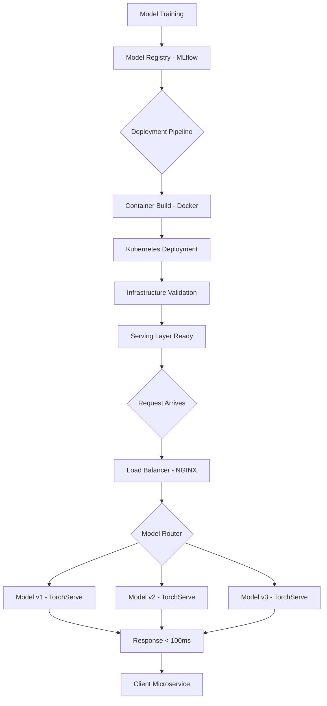

| Difficulty | Channel | Tags |
|---|---|---|
| beginner | devops | mlops, deployment |

It was 3am when Netflix's centralized model serving platform — the backbone powering recommendations for 250 million users — started bleeding 10 to 20 milliseconds per request. Their custom routing service, Switchboard, had become a single point of failure handling over 1 million requests per second [1]. What Netflix discovered about the line between model deployment and model serving would change how they architect ML systems forever — and it should change how you think about yours too.

---

> ### Real-World Case — Netflix
>
> Netflix's centralized ML serving platform powers hundreds of model types across recommendation, fraud detection, search, and personalization use cases for 250M+ users. When they built 'Switchboard' — a custom routing service handling 1M+ requests per second — it initially solved the problem of routing traffic to the right model instance. But as scale increased, Switchboard became a single point of failure adding 10-20ms latency per request, forcing them to rethink the entire architecture.
>
> | | |
> |---|---|
> | **Challenge** | How to route traffic to the right model instance across hundreds of model versions serving 1M+ requests per second, while supporting A/B testing, canary deployments, and instant rollbacks — without exposing ML complexity to client microservices. Standard API gateway solutions (AWS API Gateway, service mesh proxies) lacked first-class integration with Netflix's experimentation platform, gRPC support, and context-aware routing capabilities. |
> | **Solution** | Built Switchboard, a custom centralized routing service with JavaScript-defined 'Switchboard Rules' that researchers use to configure model variants, A/B experiments, and traffic splits. When Switchboard became a bottleneck, evolved to 'Lightbulb' — separating routing metadata resolution (Lightbulb service) from actual request routing (Envoy proxy). Lightbulb provides minimal context for model selection while Envoy handles VIP-based routing, eliminating the routing service from the critical request path. |
> | **Outcome** | Successfully serving 1M+ requests per second across hundreds of model types and versions. The evolution from Switchboard to Lightbulb eliminated the 10-20ms latency overhead from the request path, removed the single point of failure, and maintained the single integration point abstraction for 30+ client microservices while enabling seamless A/B testing and model versioning. |
> | **Lesson** | The distinction between model deployment (infrastructure, CI/CD, monitoring) and model serving (runtime inference, request routing, model loading) is critical — and the serving layer often requires custom solutions at scale. Generic API gateways and service meshes don't handle ML-specific needs like experiment-based routing, model lifecycle management, and context-aware traffic splitting. Also: your first serving architecture probably won't be your last — expect to evolve as scale reveals hidden failure modes. |

---

## Hook — The 20-Millisecond Ghost That Haunted Netflix

Picture this: your ML pipeline is humming beautifully. Models are trained, validated, packaged, and deployed. The dashboards are green. Your team pops the champagne. Then latency creeps up — 5ms here, 10ms there — until your recommendation engine is slower than a cold database query. Sound familiar? Many developers discover the hard way that "deploying a model" and "serving a model" are two fundamentally different problems that demand two fundamentally different solutions. The gap between these two concepts is where production ML systems go to die. And Netflix learned this the expensive way.

## Problem — The Deployment-Serving Confusion That Breaks Everything

Here is the thing that trips up even seasoned ML engineers: deployment and serving sound like they should be the same thing. They are not. Deployment is everything that happens before a request hits your model — CI/CD pipelines, infrastructure provisioning with Terraform, container orchestration on Kubernetes, monitoring setup, rollback strategies, and the glue code that ties your ML pipeline to your infrastructure [2]. It is the plumbing. Serving, on the other hand, is what happens the moment a real user request arrives — model loading, request routing, inference execution, response serialization, and the milliseconds-critical path that determines whether your user waits 50ms or 5 seconds [3]. When teams conflate these two concerns, they end up with architectures where infrastructure changes accidentally break inference paths, where scaling deployment infrastructure has nothing to do with scaling request handling, and where debugging latency issues means untangling two completely separate systems. The real-world consequence? You think your system is "deployed" when it is actually barely functional under load.

## Real-World Case — Netflix's Switchboard to Lightbulb Evolution

Netflix's journey perfectly illustrates why this distinction matters at scale. Their centralized ML serving platform powers hundreds of model types across recommendation, fraud detection, search, and personalization for over 250 million subscribers [1]. When they built Switchboard — a custom routing service handling 1 million plus requests per second — it initially solved the critical problem of routing traffic to the right model instance across their massive infrastructure. But as scale increased, Switchboard became a single point of failure that added 10 to 20 milliseconds of latency per request [1]. This forced Netflix to rethink their entire architecture. The solution? They evolved from Switchboard to Lightbulb, which eliminated the latency overhead from the request path, removed the single point of failure, and maintained the single integration point abstraction for over 30 client microservices [1]. Lightbulb enabled seamless A/B testing and model versioning without the routing bottleneck. The impact was dramatic: they went from a fragile, latency-heavy centralized router to a distributed system that could handle millions of requests per second without becoming the bottleneck. The key insight? Netflix did not just improve their deployment — they rearchitected their serving layer as a distinct concern with its own scaling properties and failure modes [1].

## Deep Dive — The Two Worlds of ML Infrastructure

Let us break down what actually lives in each world.

**The Deployment World** operates on timescales of minutes to hours. Your deployment pipeline handles infrastructure provisioning with tools like Terraform, container builds with Docker, orchestration with Kubernetes, experiment tracking with MLflow, and CI/CD automation with GitHub Actions or Jenkins [2]. The goal here is reliability, reproducibility, and rollback capability. You are managing infrastructure as code, and your success metrics are deployment frequency, rollback rate, and infrastructure cost.

**The Serving World** operates on timescales of milliseconds. This is where frameworks like TensorFlow Serving, TorchServe, or BentoML live [3]. Your serving layer handles request routing with tools like NGINX or Envoy, model versioning at runtime, autoscaling based on request volume, and the latency-critical inference path. Your success metrics here are p99 latency, throughput (requests per second), cold start time, and GPU utilization.

The critical trade-offs look like this:

| Concern | Deployment World | Serving World |
|---|---|---|
| Latency target | Minutes (pipeline) | <100ms (real-time) |
| Scaling axis | Infrastructure capacity | Request throughput |
| Failure mode | Pipeline failure | User-facing latency spike |
| Key tools | Kubernetes, MLflow | TorchServe, BentoML, gRPC |
| Monitoring | Deployment success rate | p99 latency, error rate |

Many developers think they only need to "deploy the model" and the serving will just work. But as Netflix proved, serving is a separate engineering discipline that demands its own architecture, its own scaling strategy, and its own failure domain [1]. When you mix horizontal scaling of deployment pods with vertical scaling of GPU memory for inference, you end up with two systems that interfere with each other. The plot twist? The deployment layer can scale perfectly while the serving layer crumbles under load — or vice versa.

## Workflow — From Training to Serving, The Right Way

Here is how you architect the two layers as distinct but coordinated systems:



The workflow follows these critical steps:

1. **Training and Registry**: Your model trains and gets registered in MLflow with version metadata and performance benchmarks [2]. This is the handoff point between the ML team and the infrastructure team.

2. **Deployment Pipeline**: Docker containers are built with the model artifact, dependency pins, and configuration. Kubernetes manages the pod lifecycle, health checks, and rolling updates [4]. This layer ensures your model can be deployed, rolled back, and monitored as infrastructure.

3. **Serving Layer Activation**: Once pods are healthy, the serving framework (TorchServe, TensorFlow Serving, or BentoML) loads the model into GPU memory, initializes inference handlers, and registers with the load balancer [3]. This is where the latency clock starts ticking.

4. **Request Routing**: NGINX or Envoy distributes traffic across model instances, handling A/B testing splits and gradual rollouts [5]. Netflix's Lightbulb proved that routing should be distributed, not centralized [1].

5. **Inference and Response**: The model executes inference, serializes the response, and returns it — all within your latency budget. The key is keeping this path as lean as possible.

## Code Example — Building a Production-Ready Serving Endpoint

Here is a practical example showing how to separate deployment concerns from serving concerns using BentoML and FastAPI:

```python
import bentoml
from fastapi import FastAPI, HTTPException
from pydantic import BaseModel
import time
import logging

# --- Serving Layer: Handles real-time inference requests ---
app = FastAPI(title="ML Serving Endpoint")
logger = logging.getLogger(__name__)

# Load model at startup (serving concern, not deployment concern)
# BentoML manages model versioning and GPU allocation
runner = bentoml.get_model("fraud_detector:v2.1").to_runner()
runner.init_local()  # Initialize inference runtime

# Request/Response schemas for the serving API
class PredictionRequest(BaseModel):
    transaction_id: str
    amount: float
    merchant_category: str
    user_history: list[float]

class PredictionResponse(BaseModel):
    fraud_probability: float
    risk_level: str
    model_version: str
    latency_ms: float

@app.post("/predict", response_model=PredictionResponse)
async def predict(request: PredictionRequest):
    """
    The serving endpoint: this is the latency-critical path.
    Everything here must execute in < 50ms for real-time use cases.
    """
    start_time = time.monotonic()
    
    try:
        # Transform input for model consumption
        features = _preprocess(request)
        
        # Run inference via BentoML runner (handles batching, GPU scheduling)
        raw_prediction = runner.predict.run(features)
        
        # Post-process and format response
        result = _postprocess(raw_prediction)
        
        latency_ms = (time.monotonic() - start_time) * 1000
        logger.info(f"Prediction served in {latency_ms:.2f}ms")
        
        return PredictionResponse(
            fraud_probability=result["probability"],
            risk_level=result["risk_level"],
            model_version="v2.1",
            latency_ms=round(latency_ms, 2)
        )
    except Exception as e:
        logger.error(f"Inference failed: {e}")
        raise HTTPException(status_code=503, detail="Model unavailable")

def _preprocess(request: PredictionRequest) -> dict:
    """Feature engineering — separates clean data for the model."""
    return {
        "amount": request.amount,
        "category_encoded": _encode_category(request.merchant_category),
        "user_features": request.user_history[:10],
        "amount_normalized": request.amount / 10000.0
    }

def _postprocess(raw: float) -> dict:
    """Convert raw model output to business-readable response."""
    return {
        "probability": round(raw, 4),
        "risk_level": "high" if raw > 0.7 else "medium" if raw > 0.3 else "low"
    }

def _encode_category(category: str) -> int:
    """Simple category encoding — production would use a lookup table."""
    categories = {"grocery": 0, "electronics": 1, "travel": 2, "restaurant": 3}
    return categories.get(category, -1)
```

This code separates the serving layer from deployment. The `@app.post("/predict")` endpoint is pure serving — it handles request parsing, inference execution, and response formatting with strict latency requirements [3]. The deployment concerns (container health checks, pod autoscaling, infrastructure provisioning) happen upstream in Kubernetes and never touch this code [4]. The key insight is that `_preprocess` and `_postprocess` functions are part of the serving layer too — they are in the hot path and must be optimized for latency, not just correctness.

## Lessons Learned — Battle Scars from Production ML Systems

After watching teams stumble through this distinction repeatedly, here are the hard-won lessons:

**1. Deploying is not serving.** Many developers deploy a model and assume it will serve requests. It will not — not at production scale. You need a serving framework (TorchServe, BentoML, TensorFlow Serving) that handles model loading, batching, GPU scheduling, and request routing as a distinct system [3]. Netflix proved this when their centralized serving architecture became the bottleneck, not their deployment pipeline [1].

**2. Measure what matters for each layer.** Deployment success rate and rollback time are deployment metrics. p99 latency, throughput, and cold start time are serving metrics. Mixing them up leads to wrong optimizations. If your deployment pipeline is fast but your inference is slow, deploying faster will not help your users.

**3. Horizontal vs. Vertical scaling serve different purposes.** Horizontal scaling (adding pods) helps deployment resilience. Vertical scaling (more GPU memory, faster inference) helps serving latency. You need both, but they solve different problems [4]. Kubernetes handles horizontal scaling well, but GPU-aware scheduling for vertical scaling requires frameworks like NVIDIA GPU Operator or cloud-native solutions like SageMaker [6].

**4. Cold starts are the silent killer.** Your deployment might look perfect — pods healthy, traffic routing correctly — but if your model takes 30 seconds to load into GPU memory, users are staring at loading spinners. BentoML and Triton Inference Server solve this with model pre-loading and warm pooling strategies [3][7].

**5. Monitor both layers independently.** Infrastructure monitoring (CPU, memory, pod health) tells you about deployment. Inference monitoring (latency percentiles, model accuracy drift, prediction distribution) tells you about serving. You need both, separated in your dashboards, with separate alert thresholds [5].

> 💡 **Key Insight**: The most common mistake is treating model serving as a deployment afterthought. The Netflix case shows that serving infrastructure requires its own architecture, its own scaling strategy, and its own failure domain — just like any other critical distributed system [1].

If this feels overwhelming, you are not alone. The good news? Separating these concerns early — even in small projects — pays massive dividends when you scale. Start by asking: "Is this a deployment concern or a serving concern?" for every component in your ML infrastructure.

---

## ML Model Deployment vs Serving Architecture


<details>
<summary><strong>Original Interview Question</strong></summary>

**Q:** Explain the key differences between model serving and model deployment in ML systems, including specific technologies, scaling considerations, and real-world implementation patterns?

**A:** Deployment encompasses CI/CD pipelines, infrastructure setup, and monitoring using tools like Kubernetes, MLflow, and SageMaker. Serving focuses on runtime inference APIs with frameworks like TensorFlow Serving, TorchServe, or BentoML, handling request routing, model versioning, and autoscaling. Key trade-offs include latency vs throughput, batch vs real-time inference, and cold start optimization.

</details>

## Conclusion

The line between model deployment and model serving is not academic — it is the difference between a system that works in a demo and one that handles Netflix-scale traffic without breaking a sweat. Deployment is your infrastructure plumbing. Serving is your real-time inference engine. They demand different tools, different scaling strategies, and different monitoring approaches. The most actionable step you can take tomorrow: audit your ML infrastructure and label every component as either a deployment concern or a serving concern. You will likely discover that your serving layer has been underserved. Start separating these concerns today, and your future self — the one debugging a 2am latency spike — will thank you.

---

## References

1. [Netflix State of Routing in Model Serving](https://netflixtechblog.com/state-of-routing-in-model-serving-16e22fe18741) — blog
2. [MLflow Documentation](https://mlflow.org/docs/latest/index.html) — documentation
3. [BentoML Documentation](https://docs.bentoml.com/en/latest/index.html) — documentation
4. [Kubernetes Documentation](https://kubernetes.io/docs/home/) — documentation
5. [NGINX Load Balancing Documentation](https://docs.nginx.com/nginx/admin-guide/load-balancer/http-load-balancer/) — documentation
6. [AWS SageMaker Model Deployment Documentation](https://docs.aws.amazon.com/sagemaker/latest/dg/deploy-model.html) — documentation
7. [NVIDIA Triton Inference Server Documentation](https://github.com/triton-inference-server/server) — documentation
8. [TensorFlow Serving Documentation](https://www.tensorflow.org/tfx/guide/serving) — documentation
9. [TorchServe Documentation](https://pytorch.org/serve/) — documentation

---

**Author:** Satishkumar Dhule — [GitHub](https://github.com/satishkumar-dhule) · [LinkedIn](https://linkedin.com/in/satishkumar-dhule) · [Website](https://satishkumar-dhule.github.io)
