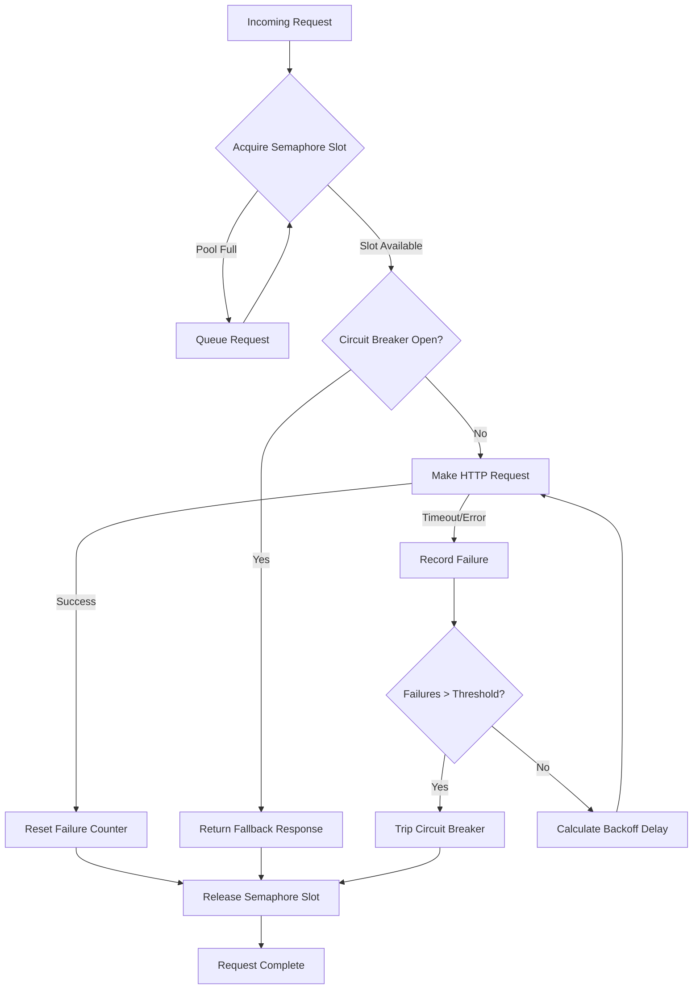

| Difficulty | Channel | Tags |
|---|---|---|
| advanced | backend | asyncio, aiohttp, concurrency |

It was the kind of failure that keeps platform engineers up at night. A single slow dependency was threatening to take down Netflix's entire streaming platform, triggering a cascade that could have affected millions of viewers mid-binge. That crisis led Netflix to pioneer the circuit breaker pattern with Hystrix in 2011, ultimately handling over 10 billion thread-isolated and 200+ billion semaphore-isolated command executions per day [1]. Today, you will learn how to build that same resilience into your Python applications using aiohttp connection pools — because the question is not if your dependencies will fail, but when.

---

> ### Real-World Case — Netflix
>
> Netflix's API system handles over 10 billion thread-isolated and 200+ billion semaphore-isolated command executions per day across 100+ HystrixCommand types and 40+ thread pools. They pioneered the circuit breaker pattern with Hystrix in 2011-2012 to prevent cascading failures in their distributed microservices architecture, where a single slow dependency could take down the entire streaming platform.
>
> | | |
> |---|---|
> | **Challenge** | In high-volume distributed systems, a single slow backend dependency can saturate all application resources in seconds. Netflix discovered that when latency occurs and threads back up, the natural instinct to increase thread pool sizes actually makes things worse — you end up DDoS-ing yourself by holding more connections open against struggling services. They needed a way to automatically detect concurrency limits, shed excess load, and prevent cascade failures without manual tuning. |
> | **Solution** | Netflix implemented Hystrix with thread pool isolation and semaphores to contain failures per-dependency, circuit breakers to stop requests to failing services, and fallback strategies (cached content, popular content defaults). The critical insight: they configured timeouts at the 99.5th percentile of healthy performance, kept thread pools at 10 threads by default, and tuned based on real production traffic. Later, they evolved to adaptive concurrency limits using TCP congestion control algorithms (Vegas algorithm: L * (1 - minRTT/sampleRTT)) that automatically adjust concurrency based on latency measurements, eliminating static pool sizing. |
> | **Outcome** | Achieved dramatic improvement in uptime and resilience. The system self-tunes concurrency limits in real-time, rejecting excess traffic with HTTP 429 errors before queues build up. At the 90th percentile, thread overhead was only 3ms; at 99th percentile, 9ms — deemed acceptable for the resilience benefits. Netflix found that reducing concurrency when latency increases prevents the death spiral where queued requests compound the problem exponentially. |
> | **Lesson** | The counterintuitive discovery: when a downstream service is slow, increasing your concurrency limit makes things worse, not better. A cluster of 100 servers with 10 connections each = 1000 possible concurrent connections. If latency backs them all up, you're using all 1000. Increasing to 20 per server gives you 2000 connections hammering the struggling service. The correct response is to fail fast, shed load, and let the service recover. Netflix learned that 'the circuit breaker exists to release pressure on underlying systems to let it recover instead of pounding it with more requests.' |

---

## Hook — When One Slow Service Brings Down Everything

Picture this: your API gateway is humming along, serving 10,000 requests per second. Then, a downstream authentication service slows from 50ms to 5 seconds. Within minutes, your connection pool fills up, threads pile up waiting for responses, and suddenly your entire system is unresponsive. Sound familiar? This is the classic cascading failure — and it is exactly what Netflix faced at scale before they built their legendary circuit breaker system. The pattern they developed did not just solve their problem; it fundamentally changed how the industry thinks about fault tolerance [1]. Now, here is the thing most developers miss: the solution is not more servers or bigger pools. It is smarter control over when and how connections fail.

## Problem — The Silent Killer of Async Applications

Building on this real-world context, consider your own application. When you fire off requests to multiple microservices or external APIs, you are playing a high-stakes game. Each connection consumes memory, each timeout ties up an event loop, and each failed retry multiplies the load exponentially. Most developers treat connection management as an afterthought — they configure a pool size and hope for the best [2].

However, the reality is far more treacherous. Without proper controls, a single misbehaving service can starve your entire application of resources. The connection pool becomes a bottleneck instead of a safety net. Semaphore-based limiting, while essential, only solves part of the puzzle. What happens when the service recovers? What happens during the recovery period when everyone is trying to reconnect simultaneously? These are the questions that separate production-grade systems from hobby projects.

## Real-World Case — Netflix and the Hystrix Revolution

Netflix's experience with Hystrix provides the definitive case study in cascading failure prevention. Their system handles over 10 billion thread-isolated and 200+ billion semaphore-isolated command executions per day across 100+ HystrixCommand types and 40+ thread pools [1]. Before Hystrix, a single slow dependency could bring down the entire streaming platform.

The impact was dramatic: at the 90th percentile, thread overhead was only 3ms; at 99th percentile, 9ms — a trade-off Netflix deemed acceptable for the resilience benefits. Their system self-tunes concurrency limits in real-time, rejecting excess traffic with HTTP 429 errors before queues build up [1].

Most importantly, Netflix discovered a counterintuitive truth: reducing concurrency when latency increases prevents the death spiral where queued requests compound the problem exponentially. This insight — that less can be more under load — is fundamental to building resilient connection pools.

## Deep Dive — The Anatomy of Resilient Connection Management

Let us break down the three pillars that make connection pools resilient: semaphores, circuit breakers, and exponential backoff.

**Semaphore-based limiting** is your first line of defense. Think of it as a bouncer at a club — only a fixed number of requests get in at once. In Python, asyncio.Semaphore provides this control elegantly [3]. When the pool is full, excess requests wait in queue rather than overwhelming your system.

However, semaphores alone are insufficient. This is where the **circuit breaker pattern** enters the picture. Inspired by electrical engineering, a circuit breaker monitors failures and trips open when too many occur, short-circuiting requests before they waste resources [4]. Netflix's Hystrix implementation showed this pattern at massive scale — when failures exceed a threshold, the circuit opens and returns fallback responses immediately.

**Exponential backoff** adds the final piece. Instead of hammering a failing service with retries, you increase the delay between attempts exponentially: 1 second, 2 seconds, 4 seconds, 8 seconds [5]. This gives the downstream service time to recover while preventing your retry storm from making things worse.

The combination is powerful: semaphores prevent resource exhaustion, circuit breakers prevent cascade failures, and exponential backoff prevents retry storms. Together, they form a defense-in-depth strategy that Netflix proved can handle billions of requests daily.

## Workflow — Building the Connection Pool Manager

The workflow for implementing a resilient connection pool follows a clear progression. First, you initialize the pool with a maximum connection limit. Then, for each incoming request, you acquire a semaphore slot, check the circuit breaker state, and attempt the request. If it succeeds, you reset the failure counter. If it fails, you record the failure and potentially trip the circuit breaker.

The following diagram illustrates this flow:

## Code Example — Production-Ready Connection Pool Manager

Here is a production-ready implementation that combines all three patterns. Notice how each component works together to create a resilient system:

## Lessons Learned — What Netflix's Experience Teaches Us

The journey from basic connection pools to resilient systems reveals several critical lessons:

**Lesson 1: Reduce concurrency when latency increases.** Netflix discovered that the instinct to add more connections when things slow down actually makes things worse [1]. Instead, reduce concurrency and let the system stabilize.

**Lesson 2: Health checks are non-negotiable.** Do not wait for requests to fail to detect problems. Implement proactive health checks that sample connection viability periodically [6].

**Lesson 3: Connection cleanup matters.** Many developers forget to clean up connections on application shutdown, leading to resource leaks that accumulate over time [2].

**Lesson 4: Monitor everything.** Track connection pool utilization, circuit breaker state changes, and retry rates. These metrics are your early warning system [7].

**Lesson 5: Test failure scenarios.** Your connection pool is only as good as its behavior under failure. Use chaos engineering principles to validate your circuit breaker actually trips when it should [8].

Here is the counterintuitive insight: the best connection pool is the one that does the least. It limits, it breaks circuits, it backs off — all to prevent the cascade that would otherwise destroy your system.

---

## Connection Pool Request Flow

<strong>Original Interview Question</strong>

**Q:** How would you implement a connection pool manager for aiohttp that handles graceful degradation under high load and connection timeouts?

**A:** Implement a connection pool manager for aiohttp using a semaphore to limit concurrent connections, exponential backoff for retrying failed requests, and circuit breaker pattern to gracefully degrade under high load and connection timeouts.

## Conclusion

The story of Netflix's Hystrix is not just about circuit breakers — it is about designing systems that fail gracefully. By combining semaphore-based limiting, circuit breakers, and exponential backoff, you create a connection pool that does not just manage connections, it manages failure. Tomorrow, when you are staring at a cascade of 500 errors at 2am, you will be glad you built resilience into your foundation. Start with the code above, monitor your metrics, and remember: the best systems are not the ones that never fail, but the ones that fail without taking everything down with them.

---

## References

1. [Netflix Hystrix Operations Wiki](https://github.com/Netflix/Hystrix/wiki/Operations) — documentation
2. [aiohttp Client Session Documentation](https://docs.aiohttp.org/en/stable/client_advanced.html) — documentation
3. [Python asyncio Semaphore Documentation](https://docs.python.org/3/library/asyncio-sync.html#asyncio.Semaphore) — documentation
4. [Martin Fowler - Circuit Breaker Pattern](https://martinfowler.com/bliki/CircuitBreaker.html) — blog
5. [Exponential Backoff Algorithm](https://en.wikipedia.org/wiki/Exponential_backoff) — documentation
6. [aiohttp GitHub Repository](https://github.com/aio-libs/aiohttp) — documentation
7. [Python asyncio Event Loop Documentation](https://docs.python.org/3/library/asyncio-eventloop.html) — documentation
8. [Netflix Hystrix GitHub Repository](https://github.com/Netflix/Hystrix) — documentation

---

**Author:** Satishkumar Dhule — [GitHub](https://github.com/satishkumar-dhule) · [LinkedIn](https://linkedin.com/in/satishkumar-dhule) · [Website](https://satishkumar-dhule.github.io)
