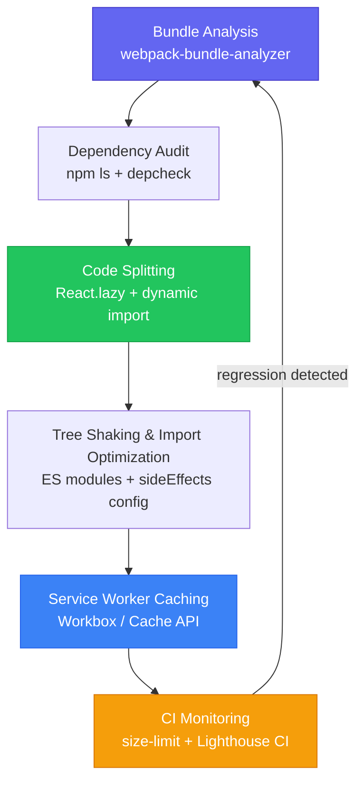

| Difficulty | Channel | Tags |
|---|---|---|
| intermediate | frontend | lighthouse, bundle, lazy-loading |

Twenty-three seconds. That is how long Pinterest users on mid-range Android phones over 3G had to stare at a blank screen before they could even begin scrolling. In an era where a 3-second delay drives away half your traffic, Pinterest was hemorrhaging users before their app even loaded [1]. The culprit? A monolithic React application shipping 2.5MB of JavaScript upfront, choking the main thread and turning casual browsers into bounced visitors. This is the story of how one team rewrote the rules of mobile performance, and the specific techniques you can steal to do the same.

---

> ### Real-World Case — Pinterest
>
> Pinterest's old mobile web experience was a monolithic React app with massive JavaScript bundles. Users on average Android hardware over 3G had to wait 23 seconds before the UI was usable. The app shipped 2.5MB of JavaScript (1.5MB main bundle + 1MB lazily loaded), resulting in terrible bounce rates and near-zero conversion from mobile web visitors.
>
> | | |
> |---|---|
> | **Challenge** | Reduce JavaScript bundle size, implement code splitting and lazy loading, and dramatically improve Time to Interactive (TTI) and First Meaningful Paint (FMP) on constrained mobile devices over slow networks — while maintaining feature parity with native iOS (56MB) and Android (9.6MB) apps. |
> | **Solution** | Pinterest rebuilt their mobile web as a Progressive Web App using React, Redux, and Webpack. They implemented route-based JavaScript chunking so only code needed for the current route was loaded upfront. They used Webpack Bundle Analyzer to discover that most lazily loaded async chunks contained massive amounts of duplicate shared code. The counterintuitive fix: they moved all duplicate code INTO the main chunk — increasing the entry chunk by 20% but decreasing every lazily loaded chunk by up to 90%. They also added Service Worker caching for JS/CSS/assets, implemented Progressive JPEGs with dominant-color placeholders, and used a virtualized Masonry grid to only mount Pin components in the viewport. |
> | **Outcome** | Core JS bundle reduced from 650KB to 150KB (minified+gzipped). First Meaningful Paint dropped from 4.2s to 1.8s. Time to Interactive dropped from 23s to 5.6s on first visit, and 3.9s on repeat visits thanks to Service Worker caching. The PWA required only ~150KB upfront versus 9.6MB for the Android app. Business metrics improved dramatically: 40% more time spent on the app, 60% increase in core user engagement, and 44% higher ad revenue. |
> | **Lesson** | Sometimes the optimal code-splitting strategy is counterintuitive. Pinterest found that consolidating shared duplicate code into the main bundle — even though it made the initial chunk 20% larger — was far better than duplicating that code across every lazy-loaded route chunk. The net effect was a dramatically smaller total payload. Measure with real tools like Webpack Bundle Analyzer rather than assuming your splitting strategy is optimal. |

---

## Hook — The Silent Killer Lurking in Your Bundle

You deploy a feature. Lighthouse score: 65. Your PM doesn't notice. Your users do. Every extra kilobyte of JavaScript your browser must parse, compile, and execute pushes that Time to Interactive number higher. At 2.1MB and 4.2s TTI, you're not just slow, you're actively losing revenue, engagement, and trust. The insidious part? Most of that bundle is code your users will never touch on any given page visit. Third-party analytics, admin-only dashboards, rarely-used modals, and dependencies that imported an entire library for a single function. The average React app ships 3-5x more code than it needs to [2]. That is not a performance problem. That is an architecture problem.

## Problem — When 2.1MB Stands Between You and 90+

Here is the uncomfortable truth: bundle bloat doesn't announce itself. Your app still works. Tests still pass. The PR still gets approved. But underneath, the main thread is drowning. Consider the cascade of pain: a 2.1MB bundle means the browser must download, parse, compile, and execute that JavaScript before users can interact with your page. On a fast connection, that takes 2-3 seconds. On 3G, it takes 23. Moreover, the larger the bundle, the worse your performance on low-end devices where CPU-bound JavaScript parsing becomes the real bottleneck. Many developers think lazy loading is the entire answer. It's not. It's one tool in a systematic optimization workflow. Without bundle analysis to identify what is actually bloated, you're essentially guessing. And guessing doesn't move Lighthouse scores from 65 to 90+.

## Real-World Case — Pinterest's 23-Second Reckoning

Pinterest's old mobile web experience was a cautionary tale. Their monolithic React app delivered 2.5MB of JavaScript: a 1.5MB main bundle plus 1MB lazily loaded. On average Android hardware over 3G, users waited a staggering 23 seconds before the UI became usable. Bounce rates soared. Mobile web conversions were virtually zero. The business impact was devastating: near-zero ad revenue from mobile web, collapsing user engagement metrics, and a growing realization that their Android app, at 9.6MB, was equally problematic for bandwidth-constrained users. The team decided to go all-in on a Progressive Web App rewrite with performance as the primary success metric [1]. The results were transformational. They reduced the core JavaScript payload from 650KB to just 150KB minified and gzipped. First Meaningful Paint dropped from 4.2 seconds to 1.8 seconds. Time to Interactive fell from 23 seconds to 5.6 seconds on first visit, and to 3.9 seconds on repeat visits thanks to aggressive Service Worker caching. The entire PWA required only ~150KB upfront versus 9.6MB for the native Android app [1]. Business metrics followed the technical wins: 40% more time spent on the app, 60% increase in core user engagement, and 44% higher ad revenue. Pinterest proved that performance is not just an engineering metric. It is a business lever.

## Deep Dive — Deconstructing the Bundle Optimization Playbook

Before you touch a single line of code, you need to understand what you're dealing with. Bundle optimization is a systematic process with distinct phases, each building on the last. Let's break down the key strategies and their real trade-offs.

**1. Bundle Analysis: Know Your Enemy**

You cannot optimize what you cannot measure. Tools like webpack-bundle-analyzer generate interactive treemaps that visualize every module in your bundle. Often, the biggest offenders are surprising: a date library you imported for one formatting function, or a full Lodash import when you only need debounce. According to MDN, tree shaking is only effective when dependencies export ES modules, not CommonJS [3]. That means your analysis must account for module format, not just file size.

**2. Code Splitting: Route vs. Component**

Route-based splitting is the low-hanging fruit. Each route becomes its own chunk, so users only download the JavaScript for the page they're visiting. However, component-based splitting goes deeper. If your dashboard has a heavy data visualization library, you can load that component on demand rather than with the route itself. The trade-off? Too many split points create waterfall requests that actually hurt performance on fast connections. Find the balance.

**3. Tree Shaking: The Silent Optimizer**

Tree shaking removes unused exports from your bundle, but only if your configuration is correct. According to the Webpack documentation, you need mode: 'production' enabled and sideEffects set in package.json for tree shaking to work effectively [4]. Many developers think tree shaking just works out of the box. It doesn't. Misconfigured tree shaking is one of the most common reasons bundles remain bloated despite using ES modules.

**4. Dynamic Imports: Lazy Load Everything**

React.lazy() and dynamic import() are your primary tools for lazy loading. But the nuance matters. You don't just lazy load routes. You lazy load anything that isn't needed for initial render: modals, tooltips, charts, even entire features behind authentication. The key insight from Pinterest's case study is that lazy loading alone isn't enough. You need a caching strategy via Service Workers to make repeat visits fast [1].

**5. Dependency Auditing: Cut the Fat**

Run npm ls --all and audit your dependency tree. Common culprits include moment.js (280KB minified, replaced by date-fns at ~10KB for typical usage), entire Lodash imports, and unused polyfills. Every dependency you remove is less JavaScript your users must download and parse.

## Workflow — The 5-Phase Performance Optimization Pipeline

Here is the systematic workflow to move from a 65 Lighthouse score to 90+. Each phase builds on the previous one, creating a repeatable pipeline you can apply to any React application.

The workflow follows this progression:

1. **Analyze** — Run webpack-bundle-analyzer to generate a visual map of your bundle. Identify the top 5 largest modules. Check for duplicate dependencies across chunks.
2. **Audit Dependencies** — Use npm ls and depcheck to find unused packages. Replace heavy libraries with lightweight alternatives. Remove unused polyfills.
3. **Split the Bundle** — Implement route-based code splitting first (React.lazy for each route). Then add component-based splitting for heavy components like charts, editors, or data tables.
4. **Optimize Imports** — Switch to tree-shakeable ES module imports. Configure webpack production mode. Set sideEffects flags in package.json.
5. **Cache & Monitor** — Add Service Workers for repeat visit optimization. Set up Lighthouse CI to prevent regressions. Monitor bundle size in CI with size-limit.

The following diagram illustrates this optimization pipeline:

graph TD
    A[Bundle Analysis] --> B[Dependency Audit]
    B --> C[Code Splitting]
    C --> D[Tree Shaking & Import Optimization]
    D --> E[Service Worker Caching]
    E --> F[CI Monitoring & Regression Prevention]
    F --> A
    style A fill:#f9f,stroke:#333,stroke-width:2px
    style E fill:#bbf,stroke:#333,stroke-width:2px
    style F fill:#bfb,stroke:#333,stroke-width:2px

This is not a one-time effort. It's a continuous loop. Every new feature risks reintroducing bloat, which is why CI monitoring in the final phase feeds back into analysis.

## Code Example — Route-Based Splitting with Error Boundaries

Here's a production-grade implementation of route-based code splitting with proper error handling. This pattern directly addresses the bundle bloat problem by ensuring users only download the JavaScript for the route they visit:

```javascript
import React, { Suspense, Component } from 'react';
import { Routes, Route } from 'react-router-dom';

// Route-level lazy loading: each route becomes a separate chunk
// The browser only downloads Dashboard.js when the user navigates to /dashboard
const Dashboard = React.lazy(() => import('./pages/Dashboard'));
const Analytics = React.lazy(() => import('./pages/Analytics'));
const Settings = React.lazy(() => import('./pages/Settings'));
const Profile = React.lazy(() => import('./pages/Profile'));

// Component-level lazy loading for heavy sub-components
// These load only when needed within their parent routes
const HeavyChart = React.lazy(() => import('./components/HeavyChart'));
const DataExporter = React.lazy(() => import('./components/DataExporter'));

// Error boundary catches chunk loading failures
// Critical for lazy loading — network issues shouldn't crash the app
class ChunkErrorBoundary extends Component {
  state = { hasError: false, error: null };

  static getDerivedStateFromError(error) {
    return { hasError: true, error };
  }

  componentDidCatch(error, errorInfo) {
    // Log to error monitoring service (Sentry, Datadog, etc.)
    console.error('Chunk load failed:', error, errorInfo);
  }

  render() {
    if (this.state.hasError) {
      return (
        <div className="error-fallback">
          <h2>Something went wrong</h2>
          <button onClick={() => window.location.reload()}>
            Reload page
          </button>
        </div>
      );
    }
    return this.props.children;
  }
}

// Loading state shown while chunk is being fetched
function LoadingSpinner() {
  return (
    <div className="loading-skeleton" role="status">
      <span>Loading...</span>
    </div>
  );
}

export default function App() {
  return (
    <ChunkErrorBoundary>
      <Suspense fallback={<LoadingSpinner />}>
        <Routes>
          <Route path="/dashboard" element={<Dashboard />} />
          <Route path="/analytics" element={<Analytics />} />
          <Route path="/settings" element={<Settings />} />
          <Route path="/profile" element={<Profile />} />
        </Routes>
      </Suspense>
    </ChunkErrorBoundary>
  );
}
```

**Step-by-step walkthrough:**

1. **React.lazy() with dynamic import** — Each route component is loaded via `React.lazy(() => import('./pages/Dashboard'))`. This tells webpack to create a separate chunk for each route. The import only executes when the component is first rendered [5].

2. **Suspense boundary** — The `` wrapper provides a fallback UI (the LoadingSpinner) while chunks are being fetched. Without this, React throws an error when a lazy component hasn't loaded yet.

3. **ChunkErrorBoundary** — This is the part many developers skip. If a chunk fails to load (network timeout, deployment during navigation), the error boundary catches it and shows a recovery UI instead of a white screen. Without this, your lazy loading becomes a liability rather than an optimization [6].

4. **Nested lazy loading** — HeavyChart and DataExporter are lazy-loaded at the component level, not just the route level. This means even within the Analytics route, those heavy libraries only load when the user actually scrolls to or clicks on those sections.

The net effect: if a user lands on /dashboard, they download only the Dashboard chunk. The Analytics, Settings, and Profile JavaScript is never fetched. This pattern alone can reduce initial bundle size by 40-60% depending on your application structure.

## Lessons Learned — Battle Scars and Best Practices

After watching countless teams attempt this optimization, here are the patterns that separate the teams that hit 90+ from the ones that stall at 75.

**Lesson 1: Start With Measurement, Not Optimization**

The most common mistake is diving straight into React.lazy() without first understanding what's bloated. Pinterest didn't just add lazy loading. They analyzed their entire JavaScript payload and made surgical cuts [1]. Run webpack-bundle-analyzer first. Identify the top offenders. Then optimize.

**Lesson 2: Tree Shaking Is Not Magic**

Many developers assume tree shaking works automatically. It doesn't. You need three things: ES module imports (not CommonJS), production mode in webpack, and sideEffects: false in package.json for libraries that have no side effects [4]. Miss any of these and your bundle stays bloated.

**Lesson 3: Lazy Loading Without Caching Is Half the Solution**

Pinterest's Time to Interactive dropped from 23s to 5.6s on first visit with code splitting. But the real magic was Service Worker caching bringing repeat visits to 3.9s [1]. Without caching, every navigation triggers new chunk downloads. Implement Workbox or a similar Service Worker strategy alongside your code splitting.

**Lesson 4: Watch Out for Waterfall Requests**

Splitting too aggressively creates waterfall request chains. If Route A loads Component B which loads Component C, you get three sequential network requests. On slow connections, this can actually make things worse. Aim for 15-20 chunks maximum and test on throttled connections [7].

**Lesson 5: Bundle Size Budgets in CI**

The only way to prevent regression is automation. Tools like size-limit or bundlewatch can fail builds when JavaScript exceeds a defined threshold. Set a budget of 200KB for initial JavaScript (gzipped) and enforce it in CI. This is how you stay at 90+ instead of sliding back to 65 [8].

**The Counterintuitive Truth:**

You might think the biggest wins come from the most complex optimizations. They don't. Removing one unused dependency often saves more bytes than hours of webpack configuration tuning. Start with the easy wins: delete unused code, switch to named imports, remove heavy libraries. Then move to code splitting. Only then should you fine-tune your build configuration.

---

## Bundle Optimization Pipeline



<details>
<summary><strong>Original Interview Question</strong></summary>

**Q:** You're tasked with improving a React app's Lighthouse performance score from 65 to 90+. The bundle size is 2.1MB and Time to Interactive is 4.2s. What specific steps would you take to optimize the bundle and implement lazy loading?

**A:** Implement code splitting with React.lazy() and Suspense, analyze bundle composition with webpack-bundle-analyzer to identify largest chunks, remove unused dependencies and optimize imports, add dynamic imports for heavy components and third-party libraries, implement route-based splitting for better initial load times, and utilize tree shaking with proper ES module configuration.

</details>

## Conclusion

The journey from 65 to 90+ isn't about one clever trick. It's a systematic pipeline: analyze your bundle, audit your dependencies, split aggressively, configure tree shaking correctly, and cache everything. Pinterest proved this isn't theoretical. Their 23-second load time became 5.6 seconds, and the business results followed: 44% more ad revenue and 60% higher engagement [1]. The counterintuitive insight is that the biggest wins are often the simplest — deleting unused code and switching to named imports. Start there. Then layer on code splitting. Then Service Workers. Tomorrow morning, run webpack-bundle-analyzer on your project. The treemap will tell you everything you need to know. Your users are waiting. Go make them faster.

---

## References

1. [Pinterest Progressive Web App Performance Case Study](https://medium.com/dev-channel/a-pinterest-progressive-web-app-performance-case-study-3bd6ed2e6154) — blog
2. [MDN: Code splitting and dynamic import](https://developer.mozilla.org/en-US/docs/Web/JavaScript/Reference/Statements/import#dynamic_imports) — documentation
3. [MDN: Tree shaking](https://developer.mozilla.org/en-US/docs/Glossary/Tree_shaking) — documentation
4. [Webpack: Production Configuration](https://webpack.js.org/guides/production/) — documentation
5. [React Documentation: lazy](https://react.dev/reference/react/lazy) — documentation
6. [React Documentation: Error Boundaries](https://react.dev/reference/react/Component#catching-rendering-errors-with-error-boundaries) — documentation
7. [Web.dev: Reduce JavaScript execution time](https://web.dev/articles/reduce-javascript-execution) — blog
8. [Addy Osmani: The Cost of JavaScript in 2019](https://medium.com/@addyosmani/the-cost-of-javascript-in-2019-ef8f2efc44c4) — blog
9. [Workbox: Service Worker Caching Strategies](https://developer.chrome.com/docs/workbox/modules/workbox-strategies/) — documentation

---

**Author:** Satishkumar Dhule — [GitHub](https://github.com/satishkumar-dhule) · [LinkedIn](https://linkedin.com/in/satishkumar-dhule) · [Website](https://satishkumar-dhule.github.io)
