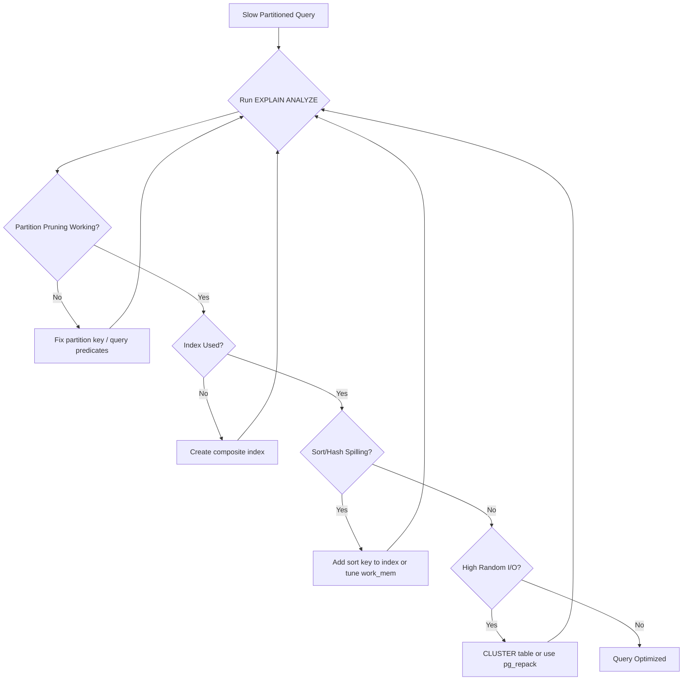

| Difficulty | Channel | Tags |
|---|---|---|
| intermediate | database | explain, query-plan, partitioning |

It was the kind of problem that makes engineers lose sleep: CoinGecko's 1TB+ PostgreSQL table, holding eight years of hourly crypto price data, was grinding to a halt. Queries routinely took over 30 seconds, IOPS breached daily despite scaling to 24K, replica lag spiraled, and Apdex scores cratered [1]. The fix wasn't a bigger machine or a sharded cluster — it was a surgical partitioning strategy that slashed p99 latency by 86% and wiped out replica lag entirely. But here's the uncomfortable truth: many teams implement partitioning and still end up with slow queries. The difference between a 4-second query and a 578ms one often comes down to what happens *after* you partition.

---

> ### Real-World Case — CoinGecko
>
> CoinGecko's 1TB+ PostgreSQL table storing 8 years of hourly crypto price data had grown so large that queries took over 30 seconds on average. IOPS was being breached daily despite scaling to 24K, causing replica lag and degrading Apdex scores. They implemented range partitioning by month on the timestamp column.
>
> | | |
> |---|---|
> | **Challenge** | A massive unpartitioned PostgreSQL table was causing severe query latency, IOPS saturation, and replica lag. Adding indexes wasn't viable because the JSONB column with currency-keyed data meant indexes would only benefit individual applications. They needed to optimize partition pruning while maintaining zero downtime on a production system. |
> | **Solution** | Created a new monthly-range-partitioned table, used Foreign Data Wrappers to read from a warmed-up replica and write to production (avoiding cold-cache penalties), warmed up all partitions including replicas, and used triggers for a live cutover. Critically, they discovered two queries that broke after partitioning: one lacked a lower date limit causing full partition scans, and another used `created_at > ?` with no upper limit scanning empty future partitions. |
> | **Outcome** | 86% reduction in p99 response time (4.13s → 578ms), 20% IOPS reduction across all replicas (multiplying cost savings), and complete elimination of replica lag that had been caused by high IOPS. |
> | **Lesson** | Partitioning can actually make queries SLOWER if the WHERE clause doesn't constrain the partition key properly. A query lacking a lower date limit scanned ALL partitions post-partitioning — something that didn't happen on the unpartitioned table. Always verify partition pruning with EXPLAIN (ANALYZE) and ensure queries include both upper and lower bounds on the partition key. |

---

## Hook — The Query That Shouldn't Be Slow

Picture this: you partitioned your table by month, you added indexes, and your EXPLAIN plan looks... fine. Except your query still takes 12 seconds on a dataset that should return in under 100ms. Sound familiar? This is the moment where most developers stare at the terminal and wonder if they misunderstood partitioning. You didn't misunderstand it — you just stopped too early. The EXPLAIN plan is a map, not a destination. Reading it wrong costs you hours of debugging; reading it right reveals exactly which path your query took and where it got stuck. And the plot twist? Sometimes partitioning actually *introduces* new problems you didn't have before.

## Problem — Why Partitioned Tables Still Slow Down

When a table grows past 50-100 million rows, even simple date-range queries start buckling. The root causes are deceptively layered. First, partition pruning — the mechanism PostgreSQL uses to skip irrelevant partitions — only works if your WHERE clause matches the partition key exactly. Misspell a cast, use a function on the key, or filter on the wrong column, and suddenly every partition gets scanned [2]. Second, index utilization degrades in ways you don't expect: a single-column index on `event_date` helps with the range scan, but if your query also filters on `status`, you're still pulling unnecessary rows into memory. Third, sort operations and hash aggregates quietly blow up memory budgets — a query that returns 10,000 rows from one partition might trigger a sort that spills to disk. The result is a table that's partitioned but not optimized, where the infrastructure is doing more work than it needs to.

## Real-World Case — CoinGecko's 1TB Wake-Up Call

CoinGecko, the cryptocurrency data aggregator, faced this exact nightmare at scale. Their PostgreSQL table storing hourly crypto price data across eight years had ballooned to over 1TB. Queries filtering on specific date ranges were averaging over 30 seconds — unacceptable for a platform that powers real-time market analysis [1]. The IOPS budget was being breached daily despite provisioning 24,000 IOPS, causing cascading replica lag that degraded Apdex scores across the platform. Their solution was range partitioning by month on the timestamp column. The impact was dramatic: p99 response time dropped from 4.13 seconds to 578 milliseconds — an 86% improvement. IOPS usage fell 20% across all replicas, multiplying cost savings. Most critically, the replica lag that had plagued their cluster was completely eliminated. The lesson here isn't just "partition your tables" — it's that partitioning is the foundation, not the finish line. What CoinGecko did next — the index tuning, the EXPLAIN analysis — is where the real performance story lives.

## Deep Dive — Reading the EXPLAIN Plan Like a Detective

When you run `EXPLAIN (ANALYZE, BUFFERS)` on a partitioned table, you're looking for three specific tells [3]. First, partition pruning: your plan should show only the partitions that match your date range, not all 96 partitions. If you see `Append` nodes scanning every partition, pruning has failed — check whether you're casting the date correctly or whether the partition bounds are inclusive/exclusive in the way you expect [4]. Second, index vs. sequential scan: for a filtered query on 100M+ rows, you want to see `Index Scan` or `Bitmap Index Scan`, not `Seq Scan`. A sequential scan on even a single partition means the optimizer decided the index wasn't worth it — usually because the selectivity is too low or the index doesn't cover your WHERE clause [5]. Third, sort and hash operations: look for `Sort` nodes with high `actual rows` and `Sort Method: external merge`, or `HashAggregate` nodes that spill to disk. These are your memory bottlenecks. The counterintuitive insight: a well-partitioned table can make some of these *worse*, because PostgreSQL's optimizer sometimes makes different choices when it knows it's scanning a smaller partition vs. a huge table.

## Workflow — The Four-Step Optimization Playbook

Here's the systematic process to diagnose and fix slow queries on partitioned tables:

**Step 1: Verify partition pruning is working.** Run `EXPLAIN (ANALYZE, BUFFERS)` and count the `Append` nodes. If more partitions appear than your date range should touch, the partition key or your query predicates need adjustment.

**Step 2: Check index utilization.** For each scanned partition, confirm the plan uses an index. If you see `Seq Scan`, the index either doesn't exist, doesn't cover your columns, or the optimizer thinks a full scan is cheaper. Create a composite index that covers your entire WHERE clause.

**Step 3: Identify expensive sorts and aggregates.** Look for `Sort` or `HashAggregate` nodes with disk spillover. Add the sort key to your composite index to eliminate the sort entirely, or increase `work_mem` for the session.

**Step 4: Evaluate clustering.** Even with good indexes, physically scattered rows cause random I/O. `CLUSTER` or `pg_repack` reorganizes data on disk to match your index order, reducing I/O amplification on range scans.



## Code Example — From Slow to Fast in Four Commands

Here's a practical walkthrough. Starting with a slow query on an events table partitioned by `event_date`:

```sql
-- Step 1: Diagnose — run EXPLAIN with BUFFERS to see I/O patterns
EXPLAIN (ANALYZE, BUFFERS) SELECT * FROM events
WHERE event_date BETWEEN '2024-01-01' AND '2024-01-31'
AND status = 'completed';

-- Step 2: Add a composite index covering both filter columns
-- CONCURRENTLY avoids locking the table during index creation
CREATE INDEX CONCURRENTLY idx_events_date_status
ON events (event_date, status);

-- Step 3: Re-run EXPLAIN to confirm the index is being used
EXPLAIN (ANALYZE, BUFFERS) SELECT * FROM events
WHERE event_date BETWEEN '2024-01-01' AND '2024-01-31'
AND status = 'completed';

-- Step 4: Cluster physical data to match index order for scan-heavy workloads
CLUSTER events USING idx_events_date_status;
```

**Walkthrough:** The first command reveals the full query plan with buffer usage — you'll see exactly which partitions were scanned, whether indexes were used, and how much data was read from disk vs. cache [3]. The composite index in step 2 replaces the need for a separate filter on `status` after the date range scan. `CREATE INDEX CONCURRENTLY` is critical for production tables — it builds the index without locking writes [6]. Step 3 confirms the index is now in the plan. Step 4 physically reorders rows on disk to match the index, which dramatically reduces random I/O for sequential range scans. For a 100M-row table, expect this to take minutes to hours depending on I/O throughput — run it during off-peak hours [7].

## Lessons Learned — What Most Teams Get Wrong

Here are the battle scars worth learning from:

- **Partitioning without index tuning is half the solution.** Partition pruning eliminates irrelevant data, but without composite indexes that cover your WHERE clause, you're still scanning within each partition [2].
- **EXPLAIN without ANALYZE is a lie.** Static plans predict; actual plans reveal. Always use `EXPLAIN (ANALYZE, BUFFERS)` to see what actually happened, including timing and I/O [3].
- **The optimizer makes different choices at different scales.** A query plan that looks perfect on a test dataset with 1M rows may behave completely differently on 100M. Always test at production scale [5].
- **`work_mem` is a hidden bottleneck.** Default is 4MB — far too low for queries that sort large result sets. Setting it to 64-256MB per operation can eliminate disk spilling [4].
- **Clustering is expensive but underrated.** Most teams skip it because it requires a table lock (or `pg_repack` for online reorganization). The I/O reduction from clustered data is often the final 2-5x improvement that makes a query truly fast [7].
- **Monitor replica lag after changes.** CoinGecko's experience shows that reducing IOPS on the primary directly benefits replicas — index and partition changes should be validated across the entire cluster [1].

The single most important takeaway: treat EXPLAIN ANALYZE output as your source of truth, not your intuition. Every optimization should be validated by re-running the plan and confirming the improvement in actual execution time and buffer usage.

---

## Partitioned Query Optimization Playbook


<details>
<summary><strong>Original Interview Question</strong></summary>

**Q:** You have a PostgreSQL table with 100M rows partitioned by date. A query filtering on a specific date range is still slow. What would you check in the EXPLAIN plan and how would you optimize it?

**A:** Check partition pruning effectiveness, index utilization patterns, and expensive sort operations. Create composite indexes on (date, filtered_columns) and evaluate clustering strategies for optimal data access.

</details>

## Conclusion

The gap between a partitioned table and an optimized partitioned table is where most performance gains hide. CoinGecko's 86% latency reduction didn't come from partitioning alone — it came from understanding the full query lifecycle through EXPLAIN analysis, building composite indexes that match real access patterns, and physically organizing data on disk [1]. Tomorrow, open your slowest query's EXPLAIN plan and count the partitions it touches. If the number doesn't match your date range, that's your first win. Then check whether an index covers every column in your WHERE clause. These two steps alone recover most of the performance that teams assume is lost to scale.

---

## References

1. [CoinGecko incident report](https://amree.dev/2025/06/13/scaling-postgresql-performance-with-table-partitioning/) — blog
2. [PostgreSQL Partitioning Documentation](https://www.postgresql.org/docs/current/ddl-partitioning.html) — documentation
3. [PostgreSQL EXPLAIN Documentation](https://www.postgresql.org/docs/current/using-explain.html) — documentation
4. [PostgreSQL Memory Configuration (work_mem)](https://www.postgresql.org/docs/current/runtime-config-resource.html) — documentation
5. [PostgreSQL Index Usage and Optimization](https://www.postgresql.org/docs/current/indexes.html) — documentation
6. [CREATE INDEX CONCURRENTLY Documentation](https://www.postgresql.org/docs/current/sql-createindex.html) — documentation
7. [CLUSTER and pg_repack for Table Reorganization](https://www.postgresql.org/docs/current/sql-cluster.html) — documentation
8. [DigitalOcean PostgreSQL Performance Tuning Guide](https://www.digitalocean.com/community/tutorials/how-to-tune-postgresql-for-complex-query-optimization) — blog

---

**Author:** Satishkumar Dhule — [GitHub](https://github.com/satishkumar-dhule) · [LinkedIn](https://linkedin.com/in/satishkumar-dhule) · [Website](https://satishkumar-dhule.github.io)
