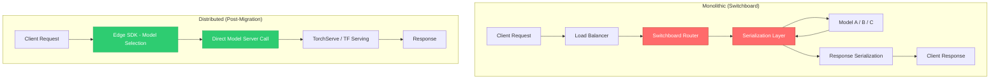

| Difficulty | Channel | Tags |
|---|---|---|
| beginner | devops | mlops, deployment |

Every 1 millisecond of latency costs money, and Netflix learned this the hard way. Their centralized ML model serving platform powered personalized experiences for millions of subscribers across hundreds of model types, but their routing service—Switchboard—was adding 10-20ms of serialization overhead on every single request [1]. In a world where users abandon slow pages in under 100ms, that overhead wasn't just annoying; it was a subscriber retention problem. This is the story of how Netflix uncovered the hidden gap between deployment and serving—and why conflating the two is one of the most expensive mistakes in ML systems.

---

> ### Real-World Case — Netflix
>
> Netflix's centralized ML model serving platform powers personalized experiences (Continue Watching, payment fraud detection) across hundreds of model types. They initially built 'Switchboard' as a central routing service handling 1 million requests per second, but hit critical scaling walls: 10-20ms added latency from serialization overhead, single-point-of-failure risk, and inability to isolate tenant traffic — problems that directly degraded subscriber experience.
>
> | | |
> |---|---|
> | **Challenge** | How to route traffic to the right model instance across cluster shards for millions of concurrent users, while keeping researchers insulated from infrastructure complexity, supporting A/B experiments and canary deployments, and maintaining sub-100ms latency for personalization use cases. Switchboard's monolithic routing design became a bottleneck as model count and traffic grew. |
> | **Solution** | Netflix evolved to 'Lightbulb' — a decoupled architecture that splits routing metadata from the request path. Lightbulb resolves request context to determine a routing key and ObjectiveConfig (model ID + parameters), then delegates actual request routing to Envoy proxy. This eliminates the serialization-deserialization bottleneck: the routingKey is added to headers for Envoy to consume with minimal overhead, while the ObjectiveConfig stays in the request body. They also decoupled experimentation config from serving platform code using Netflix's Gutenberg pub-sub system for independent release cycles and instant rollbacks. |
> | **Outcome** | Eliminated 10-20ms latency overhead from Switchboard's serialization, removed single-point-of-failure risk by taking routing out of the critical path, and maintained the same client abstraction — one integration point, automatic model selection based on A/B allocation, context-aware routing, and dynamic traffic splitting for canaries. The platform continues to serve hundreds of model types at 1M+ RPS while enabling researchers to iterate on models without client coordination. |
> | **Lesson** | The critical insight: model serving and model deployment are fundamentally different concerns that must be decoupled. Deployment is about lifecycle management (CI/CD, config propagation, model validation), while serving is about runtime inference (routing, request enrichment, model execution). Netflix's evolution shows that even well-designed serving abstractions (Switchboard) can become bottlenecks when they conflate these concerns — the solution was to separate routing metadata (a deployment-time concern) from request-path execution (a serving concern) and use Envoy as a thin, proven proxy for the latter. |

---

## Hook — The 20ms That Almost Broke Netflix

Picture this: Netflix's Switchboard is humming along, routing 1 million requests per second through its centralized pipeline. Personalized thumbnails, Continue Watching recommendations, fraud detection—all flowing through a single routing service. Then the data tells a story no one wanted to hear. Serialization overhead alone was injecting 10-20ms of latency into every inference call. For context, the entire end-to-end budget for a real-time ML prediction is often under 100ms [2]. Netflix was burning 10-20% of that budget just on the routing layer. Moreover, Switchboard had become a single point of failure: if it went down, every model in the ecosystem went silent. The kicker? Teams couldn't isolate tenant traffic, meaning one noisy consumer could degrade performance for everyone else. Sound familiar? If you've ever watched a deployment pipeline grow into a monolith, you know this feeling.

## Problem — The Deployment-Serving Conflation Trap

Here is the thing most ML engineers discover too late: deployment and serving are not the same problem, but they share a name that makes teams treat them as one. Deployment encompasses CI/CD pipelines, infrastructure provisioning, rollback strategies, and monitoring—essentially everything that gets a model from a notebook into a production environment [3]. Tools like Kubernetes, MLflow, and Terraform dominate this layer. Serving, on the other hand, is the runtime inference layer: the actual APIs handling real-time requests, routing traffic, loading model artifacts, and optimizing response latency. Frameworks like TensorFlow Serving, TorchServe, and BentoML live here [4].

When teams collapse these two concerns into a single pipeline, three things go wrong simultaneously. First, serving performance becomes hostage to deployment complexity—every new CI/CD step adds latency to the inference path. Second, rollback strategies that work for batch jobs catastrophically fail for real-time traffic. Third, horizontal scaling for serving (which demands sub-100ms response times) collides with deployment orchestration (which demands reliability over speed) [5]. Many developers build a single Kubernetes deployment, wire up a FastAPI endpoint, and call it production ML. It works at 100 QPS. It crumbles at 10,000.

## Real-World Case — Netflix's Switchboard Reckoning

Netflix's centralized ML platform was a masterclass in deployment maturity—models were versioned, CI/CD was automated, monitoring was comprehensive. But the serving layer told a different story. Switchboard was designed as a central routing service handling 1 million requests per second across hundreds of model types. It supported context-aware routing, dynamic traffic splitting for canaries, and automatic model selection based on A/B allocation [1]. On paper, it was elegant.

In practice, the architecture had three critical flaws. The serialization overhead alone added 10-20ms per request—a 10-20% hit against the typical real-time ML latency budget [1]. The centralized routing created a single point of failure: if Switchboard experienced issues, every downstream model consumer lost access to predictions. And the inability to isolate tenant traffic meant that one team's experimental traffic could degrade performance for Netflix's most critical recommendation models.

The impact was measurable: degraded subscriber experience for personalized content, increased infrastructure costs from over-provisioning to compensate for latency, and reduced iteration velocity since researchers couldn't safely experiment without risking production traffic [1]. The solution wasn't better deployment—it was rethinking the serving architecture entirely.

## Deep Dive — The Anatomy of ML Serving Architecture

To understand why Netflix's Switchboard problem was so pervasive, you need to understand the five layers of a production ML serving system and where each one can introduce latency or failure [6].

**Layer 1: Request Ingress** — This is where HTTP/gRPC requests arrive. Load balancers like NGINX or Envoy distribute traffic across serving instances [7]. The trade-off here is immediate: round-robin balancing is fast but ignores server load; least-connections balancing is accurate but adds latency to the routing decision.

**Layer 2: Model Routing** — The layer Netflix built Switchboard for. This decides which model version handles each request, based on A/B test allocation, user context, or traffic splitting rules. The danger is making this decision synchronously in the request path [1].

**Layer 3: Model Loading and Caching** — Loading a model from disk or object storage takes time. TorchServe and TensorFlow Serving pre-load models into memory, but model swapping (for A/B tests or version rollbacks) can trigger cold starts with latencies of 500ms to several seconds [4]. Smart implementations use warm standby pools and model caching.

**Layer 4: Inference Execution** — The actual forward pass through the model. This is GPU-bound or CPU-bound depending on the model, and typically accounts for the majority of end-to-end latency. Batching requests here is the highest-leverage optimization—increasing throughput by 3-5x with marginal latency increases [8].

**Layer 5: Response Serialization** — Converting model outputs back to JSON/protobuf. This is where Netflix's Switchboard added its 10-20ms overhead from serialization overhead in the routing layer [1]. Moving serialization to the edge, where requests and responses are already in the appropriate format, eliminates this entirely.

The critical insight is that deployment manages all five layers, but serving owns the runtime behavior of layers 2-5. Confusing the two leads teams to optimize deployment reliability at the expense of serving performance—or worse, to ignore serving altogether.

## Workflow — From Monolith to Distributed Serving

Netflix's migration away from Switchboard followed a pattern many ML teams eventually adopt. The journey from a monolithic serving pipeline to a distributed, resilient architecture follows these steps:

1. **Audit current latency budget** — Measure per-layer latency overhead across the serving stack. If routing adds more than 5% of your total latency budget, it's a problem.
2. **Decouple routing from inference** — Move model selection logic to the client SDK or an edge layer, eliminating synchronous routing from the critical path [1].
3. **Implement model pre-loading** — Use warm standby pools to eliminate cold start latency for model version swaps.
4. **Deploy independent autoscaling** — Serving pods should scale on inference-specific metrics (QPS, GPU utilization, p99 latency), not deployment metrics (pod restart count, CI/CD pipeline status) [2].
5. **Add circuit breakers** — Isolate failure domains so one model's instability doesn't cascade to others.

The following diagram illustrates the architectural evolution from Netflix's monolithic Switchboard model to a distributed serving topology:

[Mermaid Diagram]

This evolution preserves the client abstraction—teams still get one integration point, automatic model selection, and traffic splitting—but moves the critical path out of the centralized routing layer. The result: Netflix eliminated the 10-20ms overhead, removed single-point-of-failure risk, and maintained the same developer experience [1].

## Code Example — Building a Production-Grade Model Router

The following Python implementation demonstrates the core pattern Netflix applied: a lightweight, client-side model router that makes model selection decisions without adding latency to the serving critical path. This uses FastAPI for the inference endpoint and a custom router that pre-computes model assignments based on A/B test allocation.

```python
import hashlib
from fastapi import FastAPI, Request
from pydantic import BaseModel
from typing import Dict, Optional
import time

app = FastAPI()

# A/B test configuration: maps user segments to model versions
AB_CONFIG = {
    "control": {"model_id": "v2.1", "weight": 0.8},
    "treatment": {"model_id": "v3.0-beta", "weight": 0.2},
}

class InferenceRequest(BaseModel):
    user_id: str
    features: Dict[str, float]

class InferenceResponse(BaseModel):
    prediction: float
    model_version: str
    latency_ms: float

# Pre-loaded model registry (avoids cold starts)
MODEL_REGISTRY: Dict[str, object] = {}

def get_model_version(user_id: str) -> str:
    """Determine model version based on A/B allocation.
    
    Uses consistent hashing so the same user always sees the same
    model version — no synchronous routing service needed.
    """
    hash_val = int(hashlib.md5(user_id.encode()).hexdigest(), 16)
    for segment, config in AB_CONFIG.items():
        threshold = config["weight"] * 100
        if hash_val % 100 < threshold * 100:
            return config["model_id"]
    return AB_CONFIG["control"]["model_id"]

def predict(model_id: str, features: Dict[str, float]) -> float:
    """Run inference against the specified model version.
    
    In production, this delegates to TorchServe/TF Serving.
    The key insight: model selection happens BEFORE this call.
    """
    # Placeholder: real implementation calls model server via gRPC
    # or HTTP based on the model_id
    return sum(features.values()) * 0.1

@app.post("/predict", response_model=InferenceResponse)
async def predict_endpoint(request: InferenceRequest):
    start = time.perf_counter()
    
    # Step 1: Determine model version (client-side logic, no routing call)
    model_version = get_model_version(request.user_id)
    
    # Step 2: Run inference (the only network call)
    prediction = predict(model_version, request.features)
    
    latency_ms = (time.perf_counter() - start) * 1000
    return InferenceResponse(
        prediction=prediction,
        model_version=model_version,
        latency_ms=round(latency_ms, 2),
    )

@app.get("/health")
async def health_check():
    return {"status": "healthy", "models_loaded": len(MODEL_REGISTRY)}
```

**Walkthrough:** The `get_model_version` function uses consistent hashing to determine which model version handles each user's request. This is the critical architectural decision Netflix made: model selection logic runs at the edge, not in a centralized routing service [1]. The `predict` endpoint makes exactly one network call—the actual inference—not two (routing + inference). This eliminates the serialization overhead that cost Netflix 10-20ms per request. In production, you'd replace the placeholder `predict` function with a gRPC call to TorchServe or TensorFlow Serving, and the A/B configuration would be fetched from a config service rather than hardcoded [4].

## Lessons Learned — What Netflix's Migration Teaches Every ML Team

Netflix's Switchboard story isn't just a Netflix problem—it's a pattern that emerges in every ML platform that scales past a few dozen models. Here are the battle-tested lessons:

**1. Deployment and Serving Require Separate Scaling Policies** — Deployment scales on reliability metrics (success rate, rollback frequency). Serving scales on performance metrics (p99 latency, QPS, GPU utilization) [2]. Conflating these means your deployment pipeline's reliability checks are throttling your inference throughput.

**2. The 20ms Rule** — If any middleware in your serving path adds more than 5ms of overhead per request, it needs justification. Netflix's Switchboard added 10-20ms, and eliminating it was a subscriber experience win [1]. Audit every hop in your inference path quarterly.

**3. Client-Side Routing Beats Centralized Routing** — Moving model selection to the client SDK or edge layer eliminates single points of failure and removes latency from the critical path. This is counterintuitive—many teams add infrastructure to solve problems when they should be removing it [1].

**4. Cold Starts Are the Silent Killer** — Loading a model from disk takes 500ms-2s. If your system does this on every request, you've built a latency bomb. Pre-load models into memory and use warm standby pools for version swaps [4].

**5. Invest in Observability Before Optimization** — Before you optimize latency, you need to know where it's being spent. Instrument every layer of your serving stack with per-request latency breakdowns. Without this data, you're guessing [6].

**The takeaway:** The next time your ML platform feels slow, don't just add more GPUs. Audit your serving path. The problem might be the routing layer you built to "help" performance—not the model itself.

---

## Monolithic vs Distributed ML Serving Architecture



<details>
<summary><strong>Original Interview Question</strong></summary>

**Q:** Explain the key differences between model serving and model deployment in ML systems, including specific technologies, scaling considerations, and real-world implementation patterns?

**A:** Deployment encompasses CI/CD pipelines, infrastructure setup, and monitoring using tools like Kubernetes, MLflow, and SageMaker. Serving focuses on runtime inference APIs with frameworks like TensorFlow Serving, TorchServe, or BentoML, handling request routing, model versioning, and autoscaling. Key trade-offs include latency vs throughput, batch vs real-time inference, and cold start optimization.

</details>

## Conclusion

Netflix's Switchboard story reveals a truth that most ML teams learn too late: deployment and serving are separate problems that require separate solutions. Deployment gets your model to production reliably. Serving keeps your model fast, resilient, and scalable once it's there. The next time you wire up a Kubernetes deployment with a FastAPI endpoint and call it "production ML serving," remember Netflix's 10-20ms overhead and the million-requests-per-second scaling wall. Audit your serving path, decouple routing from inference, and invest in per-layer observability. The problem in your ML system probably isn't the model—it's the infrastructure you built around it.

---

## References

1. [Netflix State of Routing in Model Serving](https://netflixtechblog.com/state-of-routing-in-model-serving-16e22fe18741) — blog
2. [Kubernetes Documentation — Horizontal Pod Autoscaler](https://kubernetes.io/docs/tasks/run-application/horizontal-pod-autoscale/) — documentation
3. [MLflow Documentation — Model Deployment](https://docs.mlflow.org/latest/deployment/index.html) — documentation
4. [TorchServe Documentation](https://pytorch.org/serve/) — documentation
5. [AWS SageMaker Documentation — Model Deployment](https://docs.aws.amazon.com/sagemaker/latest/dg/deploy-model.html) — documentation
6. [BentoML Documentation — Model Serving](https://docs.bentoml.com/en/latest/) — documentation
7. [Envoy Proxy Documentation](https://www.envoyproxy.io/docs/envoy/latest/) — documentation
8. [TensorFlow Serving Documentation](https://www.tensorflow.org/tfx/guide/serving) — documentation

---

**Author:** Satishkumar Dhule — [GitHub](https://github.com/satishkumar-dhule) · [LinkedIn](https://linkedin.com/in/satishkumar-dhule) · [Website](https://satishkumar-dhule.github.io)
