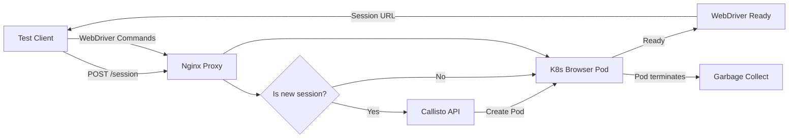

| Difficulty | Channel | Tags |
|---|---|---|
| advanced | system-design | selenium, webdriver, grid |

Wrike, a collaborative project management platform, was running hundreds of thousands of Selenium tests daily. Then their Grid started falling apart — long-lived browser pods consuming memory like leaks in a sinking ship, stateful nodes creating single points of failure, and Kubernetes HPA completely blind to actual session demand [1]. This is the story of how they built Callisto, a stateless, Kubernetes-native Selenium Grid that eliminated memory leaks forever.

---

> ### Real-World Case — Wrike
>
> Wrike, a collaborative project management SaaS platform, needed to run hundreds of thousands of Selenium tests per day across their web application. Their traditional Selenium Grid setup suffered from the classic scaling problems: long-lived browser pods consuming resources even when idle, statefulness creating single points of failure, and Kubernetes HPA unable to properly scale based on actual Selenium session demand rather than CPU/memory metrics.
>
> | | |
> |---|---|
> | **Challenge** | Selenium Grid's hub-node architecture doesn't map cleanly to Kubernetes. Browser pods use variable, unpredictable resources, so HPA can't tell when to scale up. Meanwhile, Kubernetes scales down randomly — killing pods with active tests, breaking connections. Long-lived browser pods also leak memory over time and waste compute when idle between test bursts. |
> | **Solution** | Wrike built Callisto, a Kubernetes-native, stateless replacement that eliminates the Selenium Grid hub entirely. Each test gets its own ephemeral browser pod — Nginx routes the session request, Callisto creates a fresh pod via the K8s API, the test runs, and the pod is deleted (not just stopped). No browser termination logic needed — just delete the pod. Deployed on Google Kubernetes Engine using preemptible (spot) instances for dramatic cost reduction. The architecture is fully stateless: if a node dies mid-test, the test simply retries on a new pod. They open-sourced it as github.com/wrike/callisto. |
> | **Outcome** | Production-ready system handling hundreds of thousands of Selenium tests per day. Zero statefulness means zero single points of failure. Spot instances cut compute costs significantly vs. standard VMs. The stateless design inherently prevents memory leak accumulation — leaked memory dies with the pod. Completely eliminated the need for periodic cluster restarts that plagued their previous setup. |
> | **Lesson** | The biggest insight: don't fight Kubernetes to make Selenium Grid work — throw Selenium Grid out entirely. The hub-node pattern is an artifact of bare-metal deployment, not a cloud-native design. By treating each test as an ephemeral, stateless workload (create pod → run test → delete pod), you get automatic cleanup, fault tolerance, and elastic scaling for free. Memory leaks become a non-issue when pods are destroyed after each test session. |

---

## Hook — The 3 AM Page That Changed Everything

Every developer dreads the 3 AM alert. At Wrike, that alert was alarmingly predictable: OOM kills across the Selenium Grid. Browser pods that should have died hours ago were still alive, eating RAM, refusing to release connections, and slowly bringing the entire testing infrastructure to a crawl. The team would SSH in, drain nodes, restart services, and pray it held until morning. Sound familiar? This cycle — build up, degrade, restart, repeat — is the silent killer of traditional Selenium Grid deployments at scale.

## Problem — Why Traditional Selenium Grids Bleed Memory

The classic Selenium Grid architecture follows a hub-and-node pattern: a central hub routes test requests to worker nodes running browsers. It seems simple enough. But at scale, cracks appear. Each browser node is a stateful beast — it holds WebDriver sessions, browser processes, temporary files, and network connections. When a session ends, cleanup depends on the node remembering to release resources. And memory leaks compound. A node that runs 500 sessions without restarting might consume 3x its baseline memory. Worse, Kubernetes' Horizontal Pod Autoscaler (HPA) can't help — it scales on CPU and memory metrics, not session queue depth. You end up with pods that are memory-starved but low on CPU, so HPA does nothing while your tests timeout.

## Real-World Case — Wrike's Callisto: The Stateless Revelation

Enter Callisto [1]. Wrike's engineers took a radical approach: throw away Selenium Grid components entirely. No hub, no node registrations, no stateful connections. Instead, Nginx proxies session creation requests to a lightweight Go service (Callisto), which creates Kubernetes pods on-demand. Each pod contains exactly one browser and one WebDriver — an ephemeral unit of execution. When the test finishes, the pod terminates. All leaked memory? Gone with it. No periodic restarts needed. No manual cleanup. The results are striking: a system that handles hundreds of thousands of tests per day with zero statefulness, zero single points of failure, and the ability to run on spot instances for significant cost savings [2].

## Deep Dive — Stateless vs. Stateful: The Fundamental Tradeoff

The conventional wisdom says browser nodes should be long-lived because starting a browser takes 5-10 seconds. But Wrike proved that conventional wisdom is wrong — at scale, the cost of idle memory dwarfs the cost of startup latency [3]. Here is the tradeoff you need to understand:

**Stateful Node Architecture** (Traditional Selenium Grid):
- Pros: No startup latency per test, existing tooling support
- Cons: Memory leaks accumulate over hours, stateful = single points of failure, HPA can't see session demand, manual cluster restarts needed

**Stateless Pod Architecture** (Callisto-style):
- Pros: Memory leaks die with the pod, no state means no SPOF, scale on actual session demand, spot-instance friendly, no restarts needed
- Cons: Pay 5-10s startup per test, more etcd pressure from pod churn

To mitigate startup latency, Callisto uses a clever trick: Nginx proxies non-session traffic directly to the browser pod without going through the hub. Once a pod is up, subsequent requests hit it directly. Pre-warming pools further reduce cold starts [4].

## Workflow — How a Test Request Flows Through the System

Here's the lifecycle of a single test in the Callisto architecture, step by step:

1. **Test Client** sends a POST /session request with desired capabilities (browser, version, platform)
2. **Nginx** intercepts the request and proxies it to the Callisto API service
3. **Callisto** creates a Kubernetes pod with the matching browser image and a WebDriver sidecar
4. The pod's readiness probe triggers, and Callisto registers it with the WebDriver URL
5. Callisto responds to the client with the session URL pointing directly to the pod
6. **All subsequent WebDriver commands** go through Nginx directly to the pod — no central bottleneck
7. When the test finishes, the pod is garbage collected by Kubernetes within seconds



## Code Example — Deploying Callisto with Helm

Getting started with a stateless Selenium Grid is simpler than you might think. Here's a minimal Helm deployment based on the Callisto chart [5]:

```yaml
# values.yaml
callisto:
  replicaCount: 2
  image:
    repository: wrike/callisto
    tag: latest
  podManifest:
    containers:
      - name: browser
        image: selenoid/chrome:latest  # any OCI browser image works
        resources:
          requests:
            memory: "2Gi"
            cpu: "1"
          limits:
            memory: "2Gi"
            cpu: "1"
    terminationGracePeriodSeconds: 30

ingress:
  enabled: true
  host: selenium.example.com
```

```bash
# Add the Callisto Helm repo
helm repo add callisto https://wrike.github.io/callisto-chart
helm install my-grid callisto/callisto -f values.yaml

# Run a test against it
SELENIUM_REMOTE_URL=http://selenium.example.com \
  npx playwright test
```

The key insight: each browser pod is disposable. No volumes, no persistent sessions, no state. If a pod crashes mid-test, that test fails fast — but it doesn't take down the whole grid. You trade perfect reliability per test for dramatically better overall system reliability.

## Lessons Learned — What Every Team Should Steal from Wrike

After studying Wrike's Callisto and the broader ecosystem, here are the battle-tested lessons you can apply tomorrow:

1. **Kill your darlings** — Traditional Selenium Grid components may not belong in Kubernetes. Replacing them with native primitives (pods, services, ingress) eliminates whole categories of bugs [1].
2. **Scale on session demand, not CPU** — Use KEDA's Selenium Grid scaler [6] or build your own. HPA on CPU/memory is worse than useless for test infrastructure; it's actively misleading.
3. **Embrace ephemerality** — If a pod lives longer than one test, you're accumulating risk. Short-lived pods mean leaked memory is self-healing [7].
4. **Design for spot instances** — Stateful nodes can't ride spot interruptions. Stateless pods recover instantly. This alone can cut infrastructure costs by 60-90% [8].
5. **Monitor what matters** — Track session queue depth, pod creation latency, and pod churn rate. CPU and memory are symptoms, not causes, of grid health.

The fundamental shift is philosophical: stop treating browser nodes as precious resources to be preserved and start treating them as cattle to be cycled. Your memory leaks will thank you.

---

## Test Request Flow Through Callisto


<details>
<summary><strong>Original Interview Question</strong></summary>

**Q:** Design a scalable Selenium Grid architecture to handle 10,000 concurrent test sessions with 99.9% uptime, ensuring zero memory leaks through automatic session lifecycle management, real-time monitoring, and graceful node failure recovery across multiple data centers?

**A:** Deploy Kubernetes cluster with auto-scaling node pools, Redis session store with TTL policies, Prometheus metrics for memory monitoring, circuit breakers for node isolation, and sidecar containers for session cleanup. Implement health checks, resource quotas, and rolling updates.

</details>

## Conclusion

The next time you find yourself SSHing into a Selenium node at 3 AM, ask yourself: is it the node that's broken, or the architecture? Wrike's Callisto proves that stateless, ephemeral browser pods aren't just viable — they're superior. The insight to share with your team: leaked memory can only hurt you if it has somewhere to live. Don't give it a home.

---

## References

1. [Wrike incident report](https://github.com/wrike/callisto) — article
2. [Callisto: An Easy Way To Run Selenium Tests in the Cloud](https://dev.to/wriketechclub/callisto-an-easy-way-to-run-selenium-tests-in-the-cloud-268) — blog
3. [Selenium Grid documentation - Kubernetes deployment](https://www.selenium.dev/documentation/grid/kubernetes/) — documentation
4. [SeleniumHQ docker-selenium Helm chart](https://github.com/SeleniumHQ/docker-selenium/blob/trunk/charts/selenium-grid/README.md) — documentation
5. [Callisto Helm chart repository](https://github.com/wrike/callisto-chart) — documentation
6. [KEDA Selenium Grid Scaler documentation](https://keda.sh/docs/2.20/scalers/selenium-grid-scaler/) — documentation
7. [Kubernetes Pod lifecycle documentation](https://kubernetes.io/docs/concepts/workloads/pods/pod-lifecycle/) — documentation
8. [Amazon EC2 Spot Instances best practices](https://docs.aws.amazon.com/AWSEC2/latest/UserGuide/spot-instance-best-practices.html) — documentation

---

**Author:** Satishkumar Dhule — [GitHub](https://github.com/satishkumar-dhule) · [LinkedIn](https://linkedin.com/in/satishkumar-dhule) · [Website](https://satishkumar-dhule.github.io)
