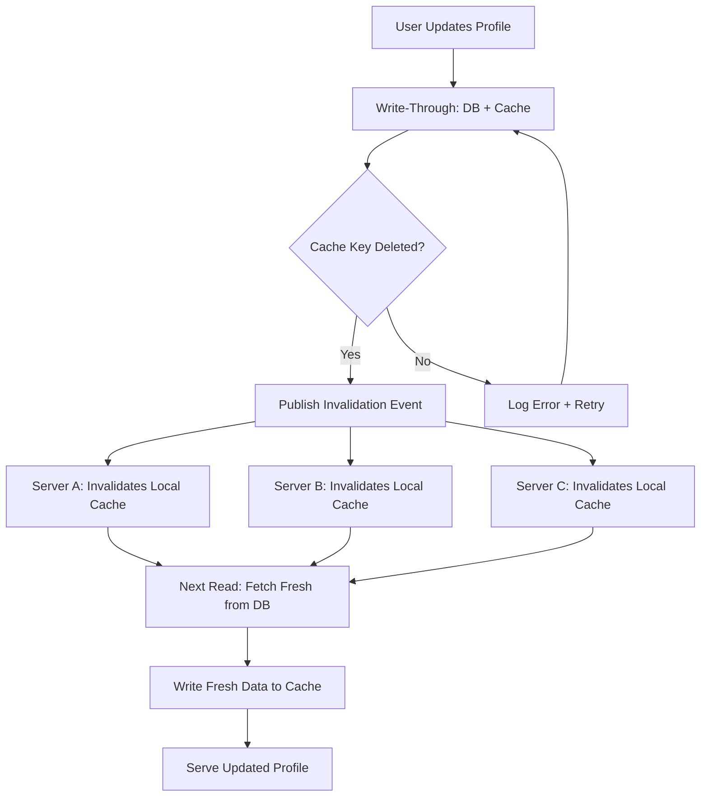

| Difficulty | Channel | Tags |
|---|---|---|
| beginner | backend | redis, memcached, cache-invalidation |

In September 2010, Facebook experienced their worst outage in four years — a full 2.5-hour site-wide shutdown — caused entirely by a cache invalidation system that was supposed to fix things, not break them. An automated system designed to correct stale memcached configuration values triggered a feedback loop that cascaded across their entire database cluster, taking down a site used by hundreds of millions of people [1]. If cache invalidation can bring down one of the world's largest engineering organizations, what chance does your profile service have?

---

> ### Real-World Case — Facebook (Meta)
>
> In September 2010, Facebook experienced a 2.5-hour outage — their worst in four years — caused entirely by a cache invalidation feedback loop. An automated system designed to fix stale memcached configuration values instead triggered a cascade that brought down their database cluster.
>
> | | |
> |---|---|
> | **Challenge** | Facebook ran 28 TB of memcached data across 800 servers. An automated system was designed to detect invalid configuration values in the cache and replace them by querying the persistent database store. The system worked fine for transient cache problems, but failed catastrophically when the persistent store itself contained the invalid value. |
> | **Solution** | When a bad configuration value was written to the persistent store, every client simultaneously detected it as invalid, deleted the cache key, and attempted to fetch the corrected value from the database. This sent hundreds of thousands of queries per second to a database cluster sized only for cache misses. Worse, when database errors occurred, clients interpreted them as invalid values and deleted the keys again — creating a feedback loop where failed database queries caused more cache key deletions, which caused more database queries. The only way to break the cycle was to stop all traffic to the database cluster (effectively turning off the site), let the databases recover, fix the root cause, then gradually restore traffic. |
> | **Outcome** | 2.5-hour total site outage. The incident taught Facebook that automated cache invalidation systems must handle feedback loops gracefully, and they turned off the configuration correction system entirely, redesigning it to handle transient spikes and feedback loops. Facebook operated 28 TB of memcached across 800 servers at the time. |
> | **Lesson** | Cache invalidation automation can create catastrophic feedback loops. The dog-pile effect (thundering herd) is real: when every client invalidates and refills the same key simultaneously, the database becomes the bottleneck. Error handling in invalidation code must avoid triggering more invalidations — a failed database query should not cause another cache key deletion. |

---

## Hook — When 'Fixing' the Cache Breaks Everything

Picture this: your user profile service is humming along. Users update their bio, change their avatar, tweak their settings. Each update flows through your code, hits the database, and — you hope — lands correctly in the cache. But here is the twist that catches teams off guard: the thing that breaks isn't the cache itself. It's the system you built to make sure the cache stays fresh. When a cache invalidation system enters a feedback loop, it doesn't just fail quietly. It screams — in the form of cascading database loads, request timeouts, and ultimately, a complete outage [1]. This isn't a hypothetical. It happened at Facebook, operating 28 terabytes of memcached across 800 servers. And the lesson is brutally simple: getting cache invalidation right isn't about clever algorithms. It's about understanding failure modes you didn't know existed.

## Problem — The Silent Killer of Profile Services

Building on that cautionary scenario, let's talk about the core tension. You're building a user profile service. Profiles get read thousands of times per second. They get updated maybe once every few hours. The math is obvious — you cache aggressively. But the moment you introduce caching, you've created a distributed systems problem hiding in plain sight. Consider what happens when a user updates their profile picture across three backend servers: Server A has the old cached profile, Server B just received the update, and Server C hasn't heard anything yet. Suddenly, one user sees three different profile pictures depending on which server handles their request. This is the cache consistency problem, and it affects every team that scales beyond a single server. The stakes are real — stale profile data means users see wrong information, trust erodes, and support tickets pile up. More dangerously, teams often discover this problem in production, not staging. That's when 2am pages start firing.

## Real-World Case — Facebook's 2.5-Hour Nightmare

However, the problem isn't just about stale data — it's about what happens when your fix becomes the failure. In September 2010, Facebook experienced a 2.5-hour total site outage, their worst in four years, caused entirely by a cache invalidation feedback loop [1]. The root cause was an automated system designed to fix stale memcached configuration values. Instead, it triggered a cascade that brought down their entire database cluster. At the time, Facebook operated 28 TB of memcached across 800 servers — one of the largest memcached deployments in the world [1]. The impact wasn't measured in milliseconds of latency or percentage points of hit rate. It was measured in total darkness: a complete site outage for 2.5 hours. The lesson Facebook learned was sobering — automated cache invalidation systems must handle feedback loops gracefully. Their solution? They turned off the configuration correction system entirely, redesigning it from scratch to handle transient spikes and feedback loops [1]. This illustrates a fundamental truth about cache invalidation: the system you build to solve the problem can become the problem itself.

## Deep Dive — Write-Through, TTLs, and the Redis vs Memcached Fork in the Road

This leads us to the technical heart of the matter. How do you actually implement cache invalidation without becoming the next Facebook outage story? The most reliable pattern for user profile services is write-through caching with TTL-based expiration. Here is the strategy broken down. First, write-through caching ensures consistency by writing data to both the cache and the database simultaneously on every update [2]. When a user updates their profile, you don't just update the database and hope the cache notices. You explicitly delete the stale cache key and write the fresh data to both locations. This eliminates the window where stale data can be served. Second, TTL-based expiration acts as a safety net. Even if your invalidation logic misses an edge case, the TTL ensures stale data expires naturally — typically 5 to 30 minutes for user profiles [3]. Third, the cache-aside pattern for reads keeps your application code clean. On read, check the cache first. On miss, fetch from the database, populate the cache, and return. But here is where the Redis vs Memcached decision becomes critical. Many developers treat them as interchangeable. They are not. Redis offers pub/sub for automatic distributed invalidation [4]. When a profile updates on one server, you publish an invalidation event that all servers subscribe to. Memcached requires manual coordination — you either broadcast invalidation commands to all nodes or accept eventual consistency. Redis also provides persistence, which means your cache survives restarts. Memcached treats everything as ephemeral. Redis supports advanced data structures — hashes, sorted sets, lists — that can model profile data more naturally. Memcached is a flat key-value store, period [5]. The trade-off table tells the real story: Redis wins on features, durability, and complex invalidation patterns. Memcached wins on simplicity, raw speed for pure caching, and lower memory overhead [5]. For a profile service where consistency matters more than raw throughput, Redis is the stronger choice.

## Workflow — The Cache Invalidation Pipeline

Therefore, here's the step-by-step workflow that connects all of this together. The following diagram shows the complete cache invalidation flow for a user profile service. Notice how the write-through pattern ensures every update touches both cache and database, and how pub/sub distributes invalidation across nodes. [Diagram: Profile Service Cache Invalidation Flow]

## Code Example — Implementing Write-Through Cache Invalidation with Redis

Building on the architecture, here's what this looks like in practice. The following Python implementation uses Redis with pub/sub to handle distributed cache invalidation across multiple servers. Each line is annotated to explain the design decisions behind the pattern.

## Lessons Learned — The 5 Rules That Prevent Outages

If this feels overwhelming, you're not alone — every team that scales caching hits these walls eventually. Here's what the Facebook incident and real-world production systems teach us. Rule 1: Never automate cache invalidation without feedback loop detection. Facebook learned this the hard way. Any automated system must detect when its actions trigger cascading effects and back off. Rule 2: Always use TTLs as a safety net. Even perfect invalidation code has edge cases. A 5-30 minute TTL for profiles ensures stale data expires regardless [3]. Rule 3: Monitor cache hit rates obsessively. If your hit rate drops suddenly, something is wrong with your invalidation logic. A healthy profile cache should maintain 85-95% hit rates [6]. Rule 4: Choose your tool based on your consistency requirements. Redis for distributed invalidation with pub/sub. Memcached for simple, fast caching where eventual consistency is acceptable [5]. Rule 5: Design for failure. Every cache invalidation system must handle the scenario where the cache is down. Your database should still serve requests, just slower. After debugging this pattern many times, the insight that sticks is this: cache invalidation isn't a problem you solve once. It's a problem you manage continuously.

---

## Profile Service Cache Invalidation Flow

<strong>Original Interview Question</strong>

**Q:** You're building a user profile service that caches frequently accessed profiles. How would you implement cache invalidation when a user updates their profile, and what trade-offs would you consider between Redis and Memcached?

**A:** Implement write-through caching with TTL-based expiration. On profile update, invalidate the cache by deleting the key and writing new data to both the database and cache. Redis offers pub/sub for automatic distributed invalidation, while Memcached requires manual coordination across nodes.

## Conclusion

The Facebook outage teaches a timeless lesson: cache invalidation is not a problem you solve once — it's a system you must continuously monitor and manage. Start with write-through caching and TTLs as your safety net. Choose Redis over Memcached when distributed consistency matters. And always, always design your invalidation system to fail safely rather than cascade catastrophically. If your profile service handles more than 100 requests per second, audit your cache invalidation logic this week. The next outage you prevent might be your own.

---

## References

1. [Facebook (Meta) engineering post-mortem on September 2010 cache invalidation outage](https://engineering.fb.com/2010/09/23/uncategorized/more-details-on-today-s-outage/) — blog
2. [MDN Web Docs: HTTP Caching](https://developer.mozilla.org/en-US/docs/Web/HTTP/Caching) — documentation
3. [Redis Documentation: TTL and Expiration](https://redis.io/docs/develop/learn/advanced-features/expire/) — documentation
4. [Redis Pub/Sub Documentation](https://redis.io/docs/interact/pubsub/) — documentation
5. [Wikipedia: Memcached](https://en.wikipedia.org/wiki/Memcached) — documentation
6. [AWS ElastiCache for Redis: Monitoring Cache Performance](https://docs.aws.amazon.com/AmazonElastiCache/latest/red-ug/monitoring.html) — documentation
7. [Wikipedia: Cache Invalidation](https://en.wikipedia.org/wiki/Cache_invalidation) — documentation
8. [DigitalOcean: How To Implement Caching with Redis and Python](https://www.digitalocean.com/community/tutorials/how-to-cache-flask-data-with-redis) — blog

---

**Author:** Satishkumar Dhule — [GitHub](https://github.com/satishkumar-dhule) · [LinkedIn](https://linkedin.com/in/satishkumar-dhule) · [Website](https://satishkumar-dhule.github.io)
