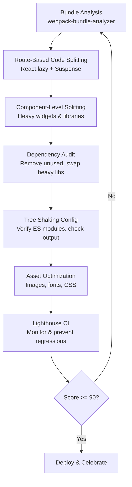

| Difficulty | Channel | Tags |
|---|---|---|
| intermediate | frontend | lighthouse, bundle, lazy-loading |

Netflix's logged-out homepage — the very first impression millions of new users get — was choking on 300kB of JavaScript and taking 7 full seconds to load on a 3G connection [1]. The page relied on server-side rendered React, client-side React, and a grab-bag of utility libraries like Lodash, all conspiring to create a landing page slower than a dial-up modem. Sound familiar? If your React app's Lighthouse score sits at 65, your bundle is 2.1MB, and Time to Interactive stretches to 4.2 seconds, you are not alone — but you are losing users. Here is the thing, though: Netflix solved this exact class of problem, and the playbook they used is one any developer can follow today.

---

> ### Real-World Case — Netflix
>
> Netflix's logged-out homepage (where new users sign up or sign in) was built with server-side rendered React plus client-side React and utility libraries like Lodash. The page contained 300kB of JavaScript and took 7 seconds to load on a simulated 3G connection — far too long for a simple landing page that millions of new users encounter first.
>
> | | |
> |---|---|
> | **Challenge** | The team needed to dramatically reduce Time-to-Interactive and bundle size for the critical sign-up flow, especially for mobile users on slower connections who represented a growing portion of sign-ups. |
> | **Solution** | Rather than optimizing React's code splitting, Netflix made the counterintuitive decision to remove React from the client side entirely for this page. They kept React for server-side rendering (generating the HTML) but rebuilt the client-side interactivity (tabs, language switcher, click handlers) in vanilla JavaScript using just ~300 lines of code. They also implemented prefetching of HTML, CSS, and the full React bundle so it was ready for subsequent navigation to the sign-up flow. |
> | **Outcome** | Loading and Time-to-Interactive decreased by 50% for the logged-out desktop homepage. JavaScript bundle size was reduced by 200kB by switching from React and other client-side libraries to vanilla JavaScript. Prefetching HTML, CSS and JavaScript (React) reduced Time-to-Interactive by 30% for future navigations to the sign-up pages. |
> | **Lesson** | The best React optimization isn't always more React — sometimes the right answer is removing the framework where it isn't needed. If a page is mostly static content with minimal interactivity, server-rendered HTML with vanilla JavaScript can dramatically outperform a client-side framework. Measure first, then choose the lightest tool that works. |

---

## Hook — Your Users Left Before the Page Even Loaded

Picture this: a new user clicks a Google ad for your product. They land on your page. One second passes. Two. Three. The loading spinner still spins. By second four, they hit the back button. They do not even know what your app does. You just lost a customer — not because your product is bad, but because your bundle is [2]. Google's research shows that 53% of mobile users abandon sites that take longer than 3 seconds to load [3]. Your 4.2s Time to Interactive is not a rounding error — it is a revenue leak. And here is the plot twist: most developers think the solution is rewriting their entire app. It is not. The real fix is surgical, systematic, and something you can do this week.

## Problem — The Silent Killer Hiding in Your Bundle

A 2.1MB JavaScript bundle is not just a number on a dashboard — it is a cascade of failure points. Every kilobyte must be downloaded, parsed, and executed before your app becomes interactive. On a fast connection, you might not notice. On a mid-range mobile device over 4G? It is catastrophic. The core problem has three faces: your initial load includes everything your app could ever need, third-party libraries are sneaking in more weight than you realize, and tree shaking is either misconfigured or not working at all [4]. Many developers discover their app ships unused Lodash utilities, entire date libraries they only call once, and duplicate dependencies nested deep in node_modules. The result is a bundle that loads the analytics dashboard even when a user is staring at a login form. Code splitting is not a luxury — it is the difference between a 2.5s interactive time and a 10s interactive time.

## Real-World Case — Netflix's 200kB Wake-Up Call

Netflix faced exactly this problem with their logged-out homepage — the gateway where millions of new users sign up or log in every day. The page was built with server-side rendered React plus client-side React and utility libraries like Lodash. The result: 300kB of JavaScript and a 7-second load time on a simulated 3G connection [1]. For a page whose entire job is to get you to click 'Sign Up,' that is an eternity. Netflix's engineering team attacked the problem from multiple angles. They replaced React and other client-side libraries with vanilla JavaScript for the landing page, slashing 200kB from the bundle. They implemented prefetching for HTML, CSS, and JavaScript so that subsequent navigations to sign-up pages felt instant. The impact was dramatic: Time to Interactive dropped by 50% for the logged-out desktop homepage, and future navigations saw a 30% reduction in TTI [1]. The lesson here is not that React is bad — it is that context matters. A simple marketing landing page does not need a 40kB framework. Sometimes the best optimization is knowing what NOT to ship.

## Deep Dive — Code Splitting, Tree Shaking, and the Art of Shipping Less

Before you touch a single line of code, you need to understand what you are fighting. Let us break down the three pillars of bundle optimization.

**Code splitting** divides your bundle into smaller chunks that load on demand. Instead of forcing the user to download your entire analytics library before they can see a dashboard, you split it into a separate chunk that loads only when the user navigates to the analytics route [5]. React 18's lazy() and Suspense make this almost trivial — but the strategic decisions about WHERE to split are where the real value lives.

**Tree shaking** removes dead code at build time. If you import `import { pick } from 'lodash'`, a properly configured bundler should exclude the other 300+ Lodash functions [6]. The catch: tree shaking only works with ES module syntax. If your dependencies ship CommonJS bundles, you are carrying dead weight no matter what you do. This is where many developers get burned — they configure tree shaking and assume it works, only to find their bundle barely changed because a key dependency is not tree-shakeable.

**Dynamic imports** let you defer loading of code until it is actually needed. A modal that appears on button click? You do not need to load it until the user clicks. A chart library for an analytics page? Only load it when the user navigates there [7]. This is not laziness — it is intelligence.

Here is what the optimization landscape looks like as a workflow:

## Workflow — The Systematic Path from 65 to 90+

The journey from a bloated 2.1MB bundle to a lean, fast app follows a clear sequence. Skip a step and you are guessing. Follow it and you are engineering. Step 1 is always analysis — you cannot optimize what you cannot measure. Run webpack-bundle-analyzer to visualize your bundle composition. Identify the largest chunks. Ask: do we need all of this on initial load? Step 2 is route-based splitting. This is the highest-leverage change for most apps. Each route gets its own chunk, so the user only downloads what they visit. Step 3 is component-level splitting for heavy widgets — think data tables, rich text editors, or chart libraries. Step 4 is dependency auditing. Remove unused packages, swap heavy libraries for lighter alternatives (date-fns over Moment.js, lodash-es over lodash), and verify tree shaking is configured correctly. Step 5 is asset optimization — images, fonts, and CSS. Step 6 is monitoring. Set up Lighthouse CI so regressions do not sneak back in. Here is how this workflow maps visually:

## Code Example — Making It Real with React.lazy and Suspense

Here is a production-grade implementation that demonstrates route-based and component-level code splitting. The key insight is that you do not just lazily load routes — you also split heavy components within those routes, and you wrap everything in error boundaries so a failed chunk does not crash your entire app.

## Lessons Learned — What Separates a Good Score from a Great One

After walking through Netflix's approach and the systematic optimization workflow, here are the insights that separate developers who get a 90+ Lighthouse score from those who plateau at 78.

**Lesson 1: Measure before you optimize.** Run webpack-bundle-analyzer before touching any code. You might discover that 600kB of your 2.1MB bundle is a single date library you use twice. That is low-hanging fruit [8].

**Lesson 2: Route-based splitting is the highest-leverage change.** If you only do one thing, do this. It immediately reduces initial load without refactoring component logic.

**Lesson 3: Tree shaking has limits.** Many popular packages (especially older ones) ship CommonJS bundles that defeat tree shaking. Check with bundlephobia and switch to ES module-compatible alternatives where possible [6].

**Lesson 4: Prefetching is the secret weapon.** Netflix's 30% TTI reduction for future navigations came from prefetching, not lazy loading alone [1]. Once a chunk is needed, load it before the user asks for it.

**Lesson 5: The 200kB rule.** Netflix proved that sometimes the right answer is replacing your framework entirely for specific pages [1]. If a page is simple enough, vanilla JavaScript might be the best optimization.

**Battle scar to avoid:** Do not lazy-load everything. If you split too aggressively, you create waterfall requests where the browser downloads chunk A, discovers it needs chunk B, downloads chunk B, discovers it needs chunk C. The latency compounds. Aim for 2-3 levels of splitting maximum.

**Your action items:**
- Run `npx webpack-bundle-analyzer stats.json` today
- Implement route-based splitting with React.lazy on your top 3 routes
- Set up Lighthouse CI to catch regressions on every PR
- Audit your dependencies: remove unused, swap heavy for light
- Add prefetching on route hover for critical navigation paths

---

## React Bundle Optimization Workflow

<strong>Original Interview Question</strong>

**Q:** You're tasked with improving a React app's Lighthouse performance score from 65 to 90+. The bundle size is 2.1MB and Time to Interactive is 4.2s. What specific steps would you take to optimize the bundle and implement lazy loading?

**A:** Implement code splitting with React.lazy() and Suspense, analyze bundle composition with webpack-bundle-analyzer to identify largest chunks, remove unused dependencies and optimize imports, add dynamic imports for heavy components and third-party libraries, implement route-based splitting for better initial load times, and utilize tree shaking with proper ES module configuration.

## Conclusion

Netflix proved that a 200kB reduction and smart prefetching can halve your load time [1]. Your 2.1MB bundle does not need a full rewrite — it needs a systematic audit. Start with bundle analysis, implement route-based splitting, verify tree shaking, and set up monitoring. The path from a 65 Lighthouse score to 90+ is not about knowing more frameworks — it is about shipping less code. Open your terminal, run the bundle analyzer, and find the dead weight hiding in your app. Your users are already counting the seconds.

---

## References

1. [Netflix Web Performance Case Study](https://medium.com/dev-channel/a-netflix-web-performance-case-study-c0bcde26a9d9) — blog
2. [MDN: Lazy loading](https://developer.mozilla.org/en-US/docs/Web/Performance/Lazy_loading) — documentation
3. [Google: Find out how you're doing on mobile speed and what to fix](https://web.dev/articles/speed) — documentation
4. [webpack-bundle-analyzer on GitHub](https://github.com/webpack-contrib/webpack-bundle-analyzer) — documentation
5. [MDN: Code Splitting](https://developer.mozilla.org/en-US/docs/Glossary/Code_splitting) — documentation
6. [Webpack: Tree Shaking](https://webpack.js.org/guides/tree-shaking/) — documentation
7. [MDN: Dynamic Import](https://developer.mozilla.org/en-US/docs/Web/JavaScript/Reference/Operators/import) — documentation
8. [React: lazy](https://react.dev/reference/react/lazy) — documentation
9. [Google Chrome: Code Splitting for Long Cache Lifetimes](https://developer.chrome.com/blog/code-splitting) — blog

---

**Author:** Satishkumar Dhule — [GitHub](https://github.com/satishkumar-dhule) · [LinkedIn](https://linkedin.com/in/satishkumar-dhule) · [Website](https://satishkumar-dhule.github.io)
