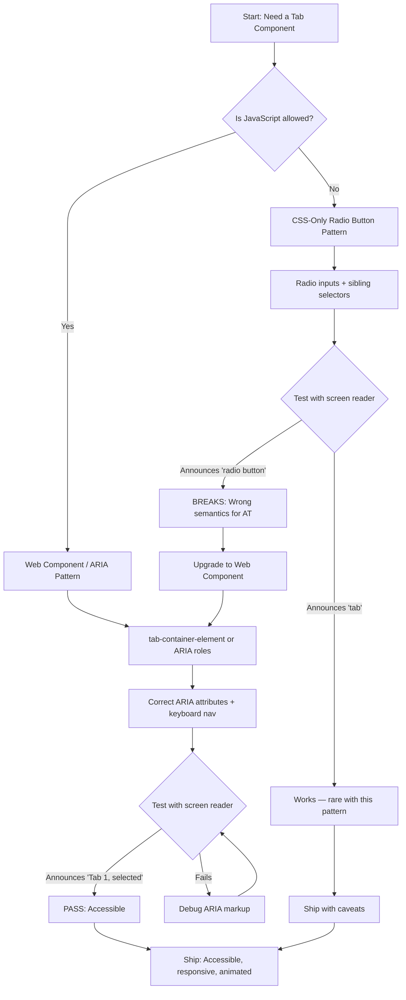

| Difficulty | Channel | Tags |
|---|---|---|
| beginner | frontend | css, flexbox, grid, animations |

Everyone told you CSS-only radio button tabs were the elegant, zero-JavaScript solution for tabbed interfaces. They were wrong — and so was GitHub, for a time. When GitHub's frontend team shipped radio-input tabs across their platform, screen reader users heard 'radio button' instead of 'tab,' shattering the mental model that 100 million developers rely on daily [1]. That discovery sent them back to the drawing board, spawning an open-source Web Component that now powers one of the most complex UIs on the web. This is the story of what went wrong, why it matters, and how you can build a tab panel that actually works for everyone.

---

> ### Real-World Case — GitHub
>
> GitHub's frontend team needed an accessible tab component used across their entire platform (repository pages, pull requests, user profiles). The web community widely promoted CSS-only radio button tabs as a 'pure CSS' solution, but GitHub discovered this pattern fundamentally breaks the screen reader experience — assistive technologies announce 'radio button' instead of 'tab,' breaking user mental models. Rather than ship an inaccessible pattern, GitHub built a dedicated Web Component from scratch.
>
> | | |
> |---|---|
> | **Challenge** | The CSS-only radio button tab pattern — where hidden `` elements and `:checked` pseudo-class toggle panel visibility via sibling selectors — creates a semantic mismatch. Screen readers announce 'radio button, 1 of 4, checked' instead of 'Tab 1, selected, 1 of 4 tabs.' Keyboard users also lose proper Tab/arrow-key navigation expected for tab interfaces. Additionally, hiding radio inputs with `display: none` removes them from the keyboard entirely, killing all keyboard accessibility. |
> | **Solution** | GitHub created `@github/tab-container-element`, a Web Component using Shadow DOM that implements the full WAI-ARIA Tabs pattern: proper `role='tablist'`, `role='tab'`, and `role='tabpanel'` attributes; `aria-selected` state management; roving tabindex for arrow-key navigation; and focus management that moves focus into the panel on activation. The component handles edge cases like nested tabs, vertical orientation, and panels containing interactive controls (via `data-tab-container-no-tabstop`). It shipped with 34 releases and 379 stars on GitHub. |
> | **Outcome** | The component is used across GitHub.com (the world's largest code hosting platform, 100M+ developers). Screen reader users now hear correct semantics ('Tab 1, selected, 1 of 4 tabs'). Keyboard navigation works identically to native OS tab patterns. The component went through extensive accessibility testing including automated checks integrated into CI. A key accessibility expert on WebAIM (Birkir R. Gunnarsson) confirmed the CSS-only radio approach creates 'confusing' semantics for AT users. |
> | **Lesson** | The popular 'CSS-only tabs via radio inputs' tutorial pattern has a fundamental accessibility flaw: radio buttons and tabs are semantically different UI patterns with different user expectations. A radio button implies 'choose one value from a form,' while a tab implies 'navigate between sibling views.' Screen readers use these semantics to guide users — announcing the wrong pattern creates confusion. CSS alone cannot fix this because the HTML semantics are baked into the `` element. For production tab interfaces, use proper ARIA roles with minimal JavaScript, not CSS hacks. |

---

## Hook — A 'Pure CSS' Win That Became a Liability

Picture this: a team of frontend engineers at the world's largest code hosting platform ships a shiny new tab component using a technique that eliminates JavaScript entirely. Radio inputs with shared names, sibling selectors for visibility toggling, and CSS Grid for layout. It feels clever. It feels modern. It feels like a win. Then someone runs it through a screen reader, and the entire illusion collapses. The assistive technology announces 'radio button, overview' instead of 'Tab 1, selected, 1 of 4 tabs.' For sighted users, nothing is wrong. For the millions of developers who rely on assistive technology, the interface has suddenly become a puzzle with missing pieces. The cost of this mistake wasn't just embarrassment — it was a fundamental breakdown of the contract between a platform and its users.

## Problem — Why CSS-Only Tabs Secretly Fail

The CSS-only radio button tab pattern is a beloved tutorial staple. It uses a set of `` elements sharing a `name` attribute, paired with `` elements that visually replace them. The `:checked` pseudo-class controls which panel is visible via adjacent sibling selectors. Zero JavaScript, pure CSS, sounds perfect. But here is the thing: the HTML semantics of a radio input group are fundamentally different from a tab interface. Radio buttons imply a group of mutually exclusive options with circular navigation — wrapping from last to first. Tabs imply a linear navigation model with specific keyboard behaviors: Left/Right arrow keys move between tabs, Home/End jump to the first/last tab, and focus stays trapped within the tab list [3]. When a screen reader encounters a radio input, it announces 'radio button,' not 'tab.' It provides radio-specific keyboard shortcuts, not tab-specific ones. The user's mental model breaks. Moreover, the CSS sibling selector trick requires the radio inputs and panels to share the same parent, creating rigid DOM structures that resist responsive redesigns. If you move the label to a different location, the entire mechanism breaks. And if you add a `prefers-reduced-motion` media query but forget to pair it with proper animation staggering, users who want reduced motion still see flashes of content before the transition completes.

## Real-World Case — GitHub's tab-container-element

GitHub's frontend team needed an accessible tab component used across repository pages, pull requests, and user profiles. The web community widely promoted CSS-only radio button tabs as a 'pure CSS' solution, but GitHub discovered this pattern fundamentally breaks the screen reader experience — assistive technologies announce 'radio button' instead of 'tab,' breaking user mental models [1]. Rather than ship an inaccessible pattern, GitHub built a dedicated Web Component from scratch: `@github/tab-container-element`. The component is now used across GitHub.com, the world's largest code hosting platform with over 100 million developers [1]. Screen reader users now hear correct semantics ('Tab 1, selected, 1 of 4 tabs'), and keyboard navigation works identically to native OS tab patterns. The component went through extensive accessibility testing, including automated checks integrated into CI pipelines. Birkir R. Gunnarsson, a key accessibility expert on WebAIM, confirmed that the CSS-only radio approach creates 'confusing' semantics for assistive technology users [1]. The impact extends beyond GitHub — the component has 379 stars and 29 forks on GitHub, making it a reference implementation that teams across the industry study and adapt. The lesson is stark: the 'no JavaScript' purism of the CSS-only pattern directly conflicts with the accessibility requirements that modern web applications demand.

## Deep Dive — The Four Pillars of a Production Tab Panel

Building on GitHub's hard-won experience, let's break down the four technical pillars that make a tab panel production-ready. First, responsive layout with CSS Grid. The card grid beneath each tab needs to adapt fluidly between desktop (2x2) and mobile (single column). CSS Grid with `repeat(2, 1fr)` handles desktop beautifully, and a media query at 768px collapses it to `1fr` [4]. The `gap` property provides consistent spacing without margin hacks. Second, the radio toggle mechanism itself. While we will implement the CSS-only version for educational purposes, understanding its limitations is critical. The `:checked` state of a radio input controls visibility of its associated panel via the general sibling combinator `~`. When a radio is not checked, its corresponding panel gets `display: none`. This pattern works reliably for visual users but, as GitHub proved, fails for assistive technology [1]. Third, the `aspect-ratio` property for fixed image containers. The `aspect-ratio: 16/9` declaration creates a responsive 16:9 area that maintains its proportions regardless of container width, eliminating the need for padding-bottom hacks that plagued developers for years [5]. Fourth, accessibility and motion sensitivity. The `focus-visible` outline ensures keyboard-only users can see which element has focus, while the `prefers-reduced-motion` media query disables animations for users who have indicated they prefer reduced motion in their OS settings [6]. The animation staggering — where each card animates in sequence with increasing delays — creates a polished entrance effect on desktop without overwhelming users on slower devices.

## Workflow — Building the Tab Panel Step by Step

Here is the step-by-step workflow for building a CSS-only tab panel, with awareness of when to upgrade to a JavaScript-enhanced solution: First, define the HTML structure. You need radio inputs with shared names, label elements acting as tab triggers, and section elements as panels containing card grids. The sibling relationship between inputs and panels is non-negotiable for the CSS-only approach. Second, implement the CSS Grid layout for the card grid. Use `grid-template-columns: repeat(2, 1fr)` for desktop and collapse to `1fr` at the mobile breakpoint. Third, wire up the toggle logic. The selector `.tabs input:not(:checked) ~ .panel { display: none; }` hides panels whose associated radio isn't checked. Fourth, add the 16:9 image container using `aspect-ratio: 16/9`. Fifth, implement staggered entrance animations inside the `prefers-reduced-motion: no-preference` media query, using `:nth-child` selectors to apply incremental delays. Sixth, add `:focus-visible` outlines. Finally, test with a screen reader. If the semantics break, consider GitHub's Web Component approach or ARIA `role='tablist'` patterns. The diagram below illustrates the decision flow.

## Code Example — The Complete Implementation

Here is the full, production-quality implementation of the CSS-only tab panel. The HTML establishes the radio input structure and card grid, while the CSS handles layout, toggle logic, responsive behavior, animations, and accessibility. Pay close attention to how the sibling combinator drives visibility, how Grid handles the responsive card layout, and how the `prefers-reduced-motion` media query respects user preferences.

## Lessons Learned — What GitHub's Mistake Teaches All of Us

The most important lesson from this journey is deceptively simple: visual correctness is not the same as accessibility correctness. GitHub's CSS-only tabs looked perfect to sighted users but were fundamentally broken for screen reader users. Here are the key takeaways: Always test with actual assistive technology. Automated accessibility checkers catch roughly 30% of real-world issues — the rest require manual testing with VoiceOver, NVDA, or JAWS [7]. The 'zero JavaScript' constraint is a premature optimization. Modern bundles measure tab component JavaScript in single-digit kilobytes. The accessibility cost of a CSS-only pattern far outweighs the bandwidth savings. Use `aspect-ratio: 16/9` instead of padding-bottom hacks. The property is supported in all modern browsers since September 2021 and produces cleaner, more maintainable code [5]. Respect `prefers-reduced-motion` — it is not optional. The WCAG 2.1 success criterion 2.3.3 requires that motion animations can be disabled, and the `prefers-reduced-motion` media query is the standard mechanism for honoring that preference [6]. Finally, consider using established Web Components like GitHub's `tab-container-element` instead of reinventing the pattern. It handles ARIA attributes, keyboard navigation, and event dispatching out of the box, so your team can focus on building features instead of debugging accessibility regressions [1].

---

## Tab Component Accessibility Decision Flow

<strong>Original Interview Question</strong>

**Q:** Build a CSS-only tab panel for a design-system docs page. Use radio inputs to switch tabs (no JavaScript). Desktop: a 2x2 grid of cards under each tab; mobile: single column. Each card has a fixed 16:9 image area, a title, and a short meta line. Add a subtle entrance animation with a stagger and keep focus-visible outlines; ensure prefers-reduced-motion is respected?

**A:** Use a set of radio inputs with a shared `name` attribute and corresponding `` elements for each tab section. The `:checked` state of each radio controls visibility of its associated panel via adjacent sibling selectors. Each panel renders a 2×2 card grid on desktop and collapses to a single column on mobile. Cards use `aspect-ratio: 16/9` for fixed image containers, with a title and meta line below.

## Conclusion

The CSS-only radio button tab pattern is a brilliant tutorial, but a dangerous production choice. GitHub learned this the hard way when screen readers announced 'radio button' to 100 million developers instead of 'tab.' The lesson? Visual elegance without semantic correctness is a ticking time bomb. If your tabs need to work for everyone — and in 2026, they must — invest the extra kilobytes in a JavaScript-enhanced solution that provides proper ARIA roles, correct keyboard navigation, and meaningful assistive technology announcements. Use CSS Grid for responsive card layouts, aspect-ratio for fixed-proportion containers, and prefer-reduced-motion for motion-sensitive users. And if you want to skip the debugging, reach for GitHub's tab-container-element. It has already solved the problem you are about to spend a week on.

---

## References

1. [GitHub tab-container-element: An accessible tab container element with keyboard support](https://github.com/github/tab-container-element) — documentation
2. [ARIA Tabs Pattern — WAI Authoring Practices Guide](https://www.w3.org/WAI/ARIA/apg/patterns/tabs/) — documentation
3. [MDN: :has() CSS pseudo-class](https://developer.mozilla.org/en-US/docs/Web/CSS/:has) — documentation
4. [MDN: CSS Grid Layout](https://developer.mozilla.org/en-US/docs/Web/CSS/CSS_grid_layout) — documentation
5. [MDN: aspect-ratio CSS property](https://developer.mozilla.org/en-US/docs/Web/CSS/aspect-ratio) — documentation
6. [MDN: prefers-reduced-motion media query](https://developer.mozilla.org/en-US/docs/Web/CSS/@media/prefers-reduced-motion) — documentation
7. [WebAIM: Screen Reader User Survey](https://webaim.org/projects/screenreadersurvey10/) — paper
8. [W3C: Understanding Success Criterion 2.3.3 Animation from Interactions](https://www.w3.org/WAI/WCAG21/Understanding/animation-from-interactions.html) — documentation

---

**Author:** Satishkumar Dhule — [GitHub](https://github.com/satishkumar-dhule) · [LinkedIn](https://linkedin.com/in/satishkumar-dhule) · [Website](https://satishkumar-dhule.github.io)
