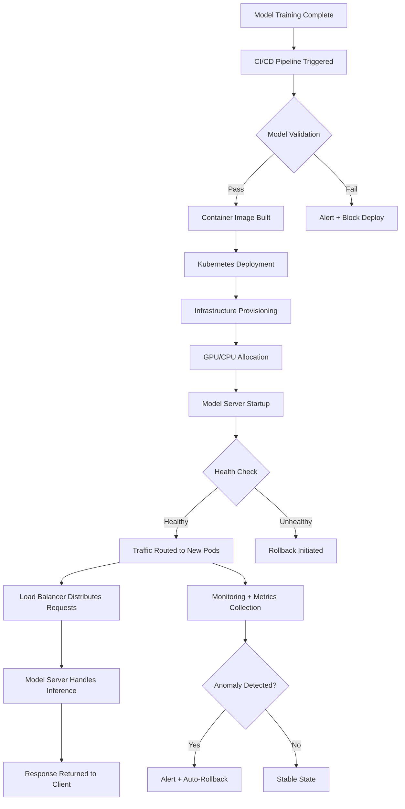

| Difficulty | Channel | Tags |
|---|---|---|
| beginner | devops | mlops, deployment |

Picture this: you've got 200 million subscribers, your recommendation engine runs on XGBoost, your search understands natural language, and your content pipeline processes terabytes daily — all on JVM-based infrastructure that's been battle-tested for a decade. Then large language models show up, and suddenly your entire serving stack feels like it was built for a different era. That's exactly the cliff Netflix faced, and their solution changed how every ML team should think about model serving versus model deployment [1].

---

> ### Real-World Case — Netflix
>
> Netflix built an in-house LLM serving platform from scratch rather than relying on hosted APIs, integrating it directly into their existing production JVM-based serving infrastructure. They needed to serve LLMs alongside traditional ML models (XGBoost, TensorFlow, PyTorch) at member scale, with real-time inference for recommendations, search, and content understanding.
>
> | | |
> |---|---|
> | **Challenge** | The core challenge was distinguishing deployment from serving in practice: deployment meant CI/CD pipelines, versioning, health checking, autoscaling, and multi-region rollout via a Java control plane, while serving meant the actual inference engine (vLLM on Triton), request routing, batch scheduling, and GPU memory management. A critical production issue emerged when their constrained decoding feature — pushing token-level constraints inside the decode loop rather than retrying invalid outputs — created a CPU bottleneck invisible in single-request benchmarks. Under realistic batch concurrency, per-request Python logits processing became sequentially serialized by the GIL, making end-to-end latency CPU-bound even though the GPU forward pass was batched efficiently. |
> | **Solution** | Netflix chose vLLM over TensorRT-LLM as their serving engine for operational fit: it loads custom model architectures without multi-step compilation, has extensibility hooks for custom decoding logic, and was already familiar to their ML practitioners. For deployment, they offer two strategies: Red-Black (blue-green with phased traffic shifting and atomic rollback) for stable model interfaces, and Versioned (maintaining independent deployments for every modelId/modelVersion pair) for breaking I/O schema changes — at the cost of temporary GPU overlap. For the constrained decoding bottleneck, they migrated from vLLM V0 (per-request logits processing) to vLLM V1 (batch-level design), re-implementing the hot path in C++ with multi-threading to bypass the GIL, so logits processing time stays flat as batch size grows. They also added a lightweight HTTP proxy merging Triton and vLLM metrics into a single Prometheus endpoint, since Triton's built-in bridge only surfaced 9 of 40+ vLLM metrics. Cold-start latency was addressed by pre-materializing models on Amazon FSx rather than downloading from S3 at startup. |
> | **Outcome** | The platform serves all production ML models — from small CPU models running in-process to large LLMs requiring GPUs — through a unified interface. The constrained decoding rewrite eliminated the CPU bottleneck, with logits processing time staying flat regardless of batch size. The deployment strategies reduced coordination gaps during model upgrades. A subtle production bug was also caught: Triton's OpenAI-compatible frontend silently dropped response_format before it reached vLLM, meaning callers requesting JSON output received unstructured responses with no error — they patched this by translating response_format into vLLM's guided decoding parameters. |
> | **Lesson** | The most striking insight is that model serving bottlenecks can be completely invisible in single-request benchmarks — the constrained decoding CPU bottleneck only surfaced under realistic batch concurrency due to Python's GIL serializing per-request work. The deeper lesson is that deployment (infrastructure, versioning, rollback) and serving (inference engine, batching, GPU scheduling) are fundamentally different engineering problems that interact in non-obvious ways. Netflix's decision to treat LLMs as first-class citizens alongside XGBoost and PyTorch in the same serving system — rather than building a separate ML silo — forced them to solve both problems simultaneously. |

---

## Hook — The Night Everything Got Complicated

It was the kind of moment every ML engineer dreads. Your existing models work beautifully — XGBoost handles recommendations, TensorFlow powers content understanding, PyTorch runs your latest ranking model — all running smoothly on your JVM-based serving infrastructure. Then leadership announces: we need LLMs. In production. At scale. Now. The question wasn't whether to adopt LLMs, but how to serve them alongside models that were already working. This isn't a hypothetical. This is the exact inflection point Netflix hit, and it forced them to confront a distinction that most teams blur until it's too late: model deployment and model serving are not the same thing — and confusing the two is one of the most expensive mistakes in ML engineering.

## Problem — Two Jobs That Look the Same (But Aren't)

Here's the thing: most ML teams treat deployment and serving as one task. You train a model, you deploy it, done. But this conflation creates a blind spot that haunts you at scale. Deployment is the journey — CI/CD pipelines spinning up, infrastructure provisioning with Terraform, container orchestration through Kubernetes, monitoring dashboards coming online, rollback strategies being tested. It's everything that gets your model from a notebook into an environment where it can receive traffic. Serving, on the other hand, is the destination — the runtime. It's the FastAPI endpoint returning predictions in 50ms, the TensorFlow Serving process loading models into GPU memory, the load balancer deciding which pod handles which request. Many developers discover this distinction the hard way: when a deployment succeeds but serving fails, or when serving works perfectly in staging but crumbles under production load. The consequences are real. A botched deployment means downtime. A broken serving layer means degraded predictions — silently — with every wrong recommendation costing revenue, every slow response losing a user, every stale model version making your product dumber by the hour.

## Real-World Case — Netflix's LLM Serving Pivot

Netflix built an in-house LLM serving platform from scratch rather than relying on hosted APIs, integrating it directly into their existing production JVM-based serving infrastructure [1]. They needed to serve LLMs alongside traditional ML models — XGBoost, TensorFlow, PyTorch — at member scale, with real-time inference for recommendations, search, and content understanding. The impact was significant: their platform now serves all production ML models through a unified interface, from small CPU models running in-process to large LLMs requiring GPUs. A critical production bug emerged during this transition — Triton's OpenAI-compatible frontend silently dropped the `response_format` parameter before it reached vLLM. Callers requesting JSON output received unstructured responses with no error. The fix required translating `response_format` into vLLM's guided decoding parameters directly, bypassing the broken abstraction layer entirely [1]. This incident illustrates why understanding the deployment-serving boundary matters: the deployment layer (Triton) appeared healthy while the serving layer (vLLM) was receiving incomplete instructions. Netflix also discovered that their constrained decoding rewrite eliminated a CPU bottleneck, with logits processing time staying flat regardless of batch size — a scaling win that only became possible because they controlled both layers independently.

## Deep Dive — The Deployment-Serving Boundary

Let's break down exactly where the line sits, because this is where most teams get it wrong.

**Deployment** encompasses everything that happens before a model can receive its first production request:
- **CI/CD pipelines**: GitHub Actions or Jenkins triggering model validation, container builds, and infrastructure provisioning
- **Infrastructure orchestration**: Kubernetes clusters scaling up, GPU nodes being allocated, network policies being applied
- **Monitoring setup**: Prometheus metrics exporters, Grafana dashboards, alerting rules for latency and error rates
- **Rollback mechanisms**: Blue-green deployments, canary releases, traffic shifting strategies

**Serving** is everything that happens from the moment a request arrives:
- **Model loading**: TensorFlow Serving or TorchServe loading model artifacts into GPU memory, warming up inference engines
- **Request routing**: NGINX or Envoy distributing traffic across model instances, handling retry logic and circuit breaking
- **Inference orchestration**: Batch construction, dynamic batching policies, response serialization
- **Versioning at runtime**: A/B testing between model versions, shadow traffic for validation

The trade-offs here are nuanced. Latency versus throughput: a model server optimized for low-latency single predictions wastes GPU cycles, while a throughput-optimized batch server adds unacceptable delay for real-time applications. Batch versus real-time: content understanding can tolerate 200ms; search ranking cannot tolerate 10ms. Cold start optimization becomes critical when serving LLMs, where loading a 70B parameter model into GPU memory can take minutes — far too long for auto-scaling scenarios where traffic spikes unpredictably.

This leads to a critical insight: the technologies you choose for deployment and serving must be complementary but independent. Kubernetes handles deployment orchestration; TorchServe handles model serving. MLflow tracks experiments and manages model artifacts; BentoML packages and serves them. Confusing these layers leads to the kind of silent failures Netflix experienced — where the deployment layer reports success while the serving layer silently degrades.

## Workflow — From Model to Production Request

Here's the step-by-step flow that separates deployment from serving in a production ML system:



Notice the two distinct phases. Steps A through L are deployment — getting the model into an environment where it can serve. Steps M through S are serving — handling real-time inference once traffic arrives. Many teams treat the health check at step J as the finish line. It isn't. The real test is step Q: whether the serving layer can sustain stable inference under production traffic patterns. The deployment succeeded; the serving has yet to prove itself.

## Code Example — Building a Production-Ready Model Server

Here's a practical example showing how to separate deployment configuration from serving logic using FastAPI and Docker — a pattern directly inspired by the Netflix architecture:

```python
from fastapi import FastAPI, HTTPException
from pydantic import BaseModel
import torch
import os
from typing import Optional
import time
import logging

# Deployment layer: configuration loaded from environment
# These values are set during Kubernetes deployment
MODEL_PATH = os.getenv("MODEL_PATH", "/models/ranking/v2")
MODEL_VERSION = os.getenv("MODEL_VERSION", "2.0.0")
MAX_BATCH_SIZE = int(os.getenv("MAX_BATCH_SIZE", "32"))
LOG_LEVEL = os.getenv("LOG_LEVEL", "INFO")

logging.basicConfig(level=getattr(logging, LOG_LEVEL))
logger = logging.getLogger("model-server")

# Serving layer: model loading and inference
# This runs inside the container after deployment succeeds
class ModelServer:
    def __init__(self, model_path: str):
        self.model = None
        self.model_path = model_path
        self.load_time_ms = 0
        self._load_model()
    
    def _load_model(self):
        start = time.time()
        # Load model into GPU memory — the cold start bottleneck
        self.model = torch.jit.load(f"{self.model_path}/model.pt")
        self.model.eval()
        if torch.cuda.is_available():
            self.model = self.model.cuda()
        self.load_time_ms = (time.time() - start) * 1000
        logger.info(f"Model loaded in {self.load_time_ms:.0f}ms")
    
    def predict(self, features: dict) -> dict:
        start = time.time()
        with torch.no_grad():
            input_tensor = torch.tensor(features["input"]).float()
            if torch.cuda.is_available():
                input_tensor = input_tensor.cuda()
            output = self.model(input_tensor)
        latency_ms = (time.time() - start) * 1000
        return {
            "prediction": output.cpu().tolist(),
            "model_version": MODEL_VERSION,
            "latency_ms": round(latency_ms, 2)
        }

# FastAPI application: the serving endpoint
app = FastAPI(title="Ranking Model Server")
server: Optional[ModelServer] = None

@app.on_event("startup")
async def startup():
    global server
    server = ModelServer(MODEL_PATH)
    # Health check endpoint for Kubernetes readiness probe

@app.get("/health")
async def health():
    return {
        "status": "healthy",
        "model_version": MODEL_VERSION,
        "gpu_available": torch.cuda.is_available()
    }

@app.post("/predict")
async def predict(request: dict):
    if server is None:
        raise HTTPException(status_code=503, detail="Model not loaded")
    try:
        result = server.predict(request)
        return result
    except Exception as e:
        logger.error(f"Prediction failed: {e}")
        raise HTTPException(status_code=500, detail=str(e))
```

**What each section does:**
- **Deployment configuration** (lines 4-10): Environment variables injected by Kubernetes at deploy time — these change between deployments but never during serving
- **Model loading** (lines 20-32): The cold start bottleneck — loading a model into GPU memory takes time, which is why Netflix optimized their constrained decoding to keep logits processing flat regardless of batch size
- **Inference** (lines 34-45): The serving runtime — request comes in, prediction comes out, latency is tracked
- **Health check** (line 55): Kubernetes readiness probe — only routes traffic when the model is loaded and ready
- **Error handling** (lines 63-68): The Netflix Triton lesson — silent failures are the most dangerous; always surface errors explicitly

## Lessons Learned — What Netflix's Experience Teaches Every ML Team

The Netflix case study reveals patterns that apply regardless of your scale:

**🎯 Key Point: Separate your layers explicitly.** Deployment configuration (environment variables, resource limits, replica counts) should never mix with serving logic (model loading, inference, batching). When they're separate, you can redeploy infrastructure without restarting model servers, and you can update models without touching deployment pipelines.

**⚠️ Watch Out: Silent failures are your biggest enemy.** The Triton-vLLM bug Netflix caught — where `response_format` was silently dropped — is a cautionary tale. Your monitoring must cover both deployment health (are pods running?) and serving health (are predictions correct and in the expected format?). Prometheus metrics, custom validation endpoints, and canary testing catch these issues before they scale.

**🔥 Hot Take: Cold starts kill more ML systems than bad models.** Loading a 70B parameter LLM into GPU memory takes minutes. If your auto-scaling triggers a new pod during a traffic spike, you've got a gap where requests fail. Pre-warming, model caching, and GPU memory management are not optimizations — they're requirements.

**💡 Insight: Unified serving interfaces reduce coordination overhead.** Netflix's decision to serve all models through a single platform meant deployment teams and serving teams could work independently. The deployment team focused on infrastructure reliability; the serving team focused on inference optimization. This separation of concerns reduced coordination gaps during model upgrades.

**Battle scars from the field:** Many teams start by building a monolithic ML pipeline that handles training, deployment, and serving in one system. It works beautifully at 10 QPS. Then traffic hits 1,000 QPS and the whole thing collapses under its own weight. Start with separation from day one — your future self will thank you.

---

## ML Deployment vs Serving Pipeline


<details>
<summary><strong>Original Interview Question</strong></summary>

**Q:** Explain the key differences between model serving and model deployment in ML systems, including specific technologies, scaling considerations, and real-world implementation patterns?

**A:** Deployment encompasses CI/CD pipelines, infrastructure setup, and monitoring using tools like Kubernetes, MLflow, and SageMaker. Serving focuses on runtime inference APIs with frameworks like TensorFlow Serving, TorchServe, or BentoML, handling request routing, model versioning, and autoscaling. Key trade-offs include latency vs throughput, batch vs real-time inference, and cold start optimization.

</details>

## Conclusion

Netflix didn't build an LLM serving platform because they enjoy reinventing infrastructure. They built it because the alternative — relying on hosted APIs or conflating deployment with serving — couldn't meet their scale, latency, or reliability requirements. The distinction between deployment and serving isn't academic — it's the difference between a system that degrades gracefully and one that fails silently at 3am. Tomorrow, audit your ML pipeline: where does deployment end and serving begin? If you can't draw that line clearly, your next production incident will teach you the hard way.

---

## References

1. [Netflix in-house LLM serving at Netflix](https://netflixtechblog.com/in-house-llm-serving-at-netflix-a5a8e799ea2c) — blog
2. [Kubernetes Documentation - Pods](https://kubernetes.io/docs/concepts/workloads/pods/) — documentation
3. [TorchServe Documentation](https://github.com/pytorch/serve) — documentation
4. [TensorFlow Serving Guide](https://www.tensorflow.org/tfx/guide/serving) — documentation
5. [BentoML Documentation](https://docs.bentoml.com/en/latest/) — documentation
6. [MLflow Model Registry](https://docs.mlflow.org/latest/model-registry/) — documentation
7. [AWS SageMaker Model Deployment](https://docs.aws.amazon.com/sagemaker/latest/dg/deploy-model.html) — documentation
8. [Envoy Proxy Load Balancing](https://www.envoyproxy.io/docs/envoy/latest/intro/arch_overview/upstream/load_balancing/load_balancers) — documentation
9. [FastAPI Documentation](https://fastapi.tiangolo.com/) — documentation

---

**Author:** Satishkumar Dhule — [GitHub](https://github.com/satishkumar-dhule) · [LinkedIn](https://linkedin.com/in/satishkumar-dhule) · [Website](https://satishkumar-dhule.github.io)
