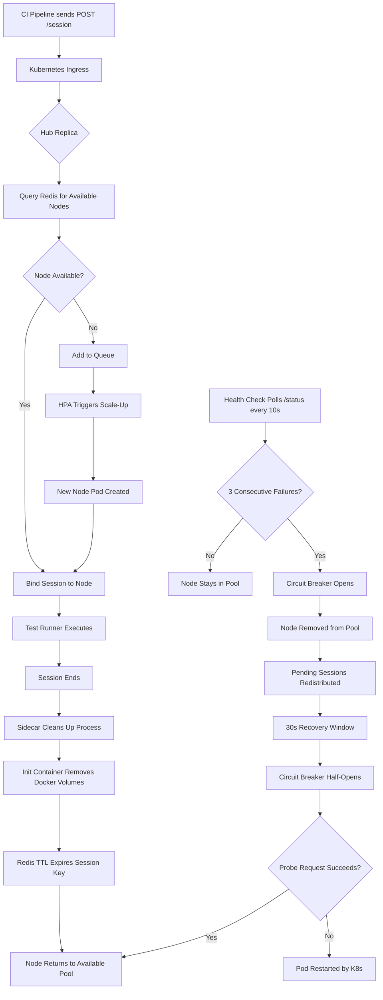

| Difficulty | Channel | Tags |
|---|---|---|
| advanced | system-design | selenium, webdriver, grid |

Your staging environment just passed every test. Your CEO demos the new feature live on stage. Then production burns — a cascading failure across browsers you never tested. This nightmare is exactly what Salesforce stared down when their browser test suite outgrew every infrastructure pattern they tried. They solved it by running over 1 million browser tests per day across thousands of ephemeral VMs [1]. But what if your team can't go fully ephemeral? What does a production-grade Selenium Grid actually look like when you need 10,000 concurrent sessions, 99.9% uptime, and zero memory leaks? That is the architecture we are breaking down.

---

> ### Real-World Case — Salesforce
>
> Salesforce needed to run their massive browser test suite across thousands of VMs daily to validate their multi-tenant CRM platform across every browser and OS combination. Their existing approach couldn't scale to meet the demands of continuous deployment.
>
> | | |
> |---|---|
> | **Challenge** | Running a large library of Selenium test cases across many browser and OS combinations at enterprise scale, with tests needing to execute against a live production-like application — while managing the cost and lifecycle of thousands of ephemeral VMs. |
> | **Solution** | Rather than using traditional Selenium Grid or Jenkins plugins like other companies, Salesforce built a custom infrastructure that continuously provisions and destroys Selenium host VMs on demand. Tests are distributed across these ephemeral VMs, each running a subset of the test suite, and the VMs are terminated immediately after test execution completes. This 'disposable infrastructure' pattern avoids the memory leaks, stale sessions, and node management overhead that plague long-lived Selenium Grid deployments. |
> | **Outcome** | Salesforce runs over 1 million browser tests per day across thousands of VMs, testing against live applications across multiple browser and OS combinations. The ephemeral VM approach eliminated the need for complex session lifecycle management, circuit breakers, or memory leak recovery — because nodes are destroyed after each run rather than recycled. |
> | **Lesson** | The counterintuitive insight is that at extreme scale, the most reliable session lifecycle management is to not manage sessions at all — destroy the entire execution environment after each test run. This 'cattle, not pets' approach to test infrastructure sidesteps memory leaks, zombie processes, and state contamination entirely, rather than trying to detect and recover from them. |

---

## Hook — The 2 AM Call That Changes Everything

Picture this: your CI pipeline is green. Your Selenium Grid is humming along at 2,000 sessions. Then someone merges a PR that bumps a browser version, and within minutes your grid is toast — nodes are leaking memory, sessions are piling up in a queue, and your on-call engineer's phone is vibrating off the nightstand. Every team that has run Selenium Grid at scale has lived some version of this horror story. The dirty secret? Most Selenium Grid failures are not browser bugs — they are infrastructure failures wearing browser costumes. The grid itself becomes the bottleneck, the leak, the single point of failure. Salesforce learned this lesson at a scale most of us will never reach, running 1,000+ concurrent browser sessions across thousands of VMs to validate their multi-tenant CRM across every browser and OS combination [1]. Their answer was elegant: destroy every node after a single run, making session lifecycle management irrelevant entirely. But most teams cannot or will not take the ephemeral VM path. So what does the alternative look like? What does it actually take to build a Selenium Grid that handles 10,000 concurrent sessions without collapsing under its own weight?

## Problem — Why 10,000 Sessions Break Everything You Thought You Knew

Many developers treat Selenium Grid as a set-and-forget utility: deploy a hub, spin up some Docker containers, and let it rip. At 50 sessions, that works fine. At 500, you start noticing flaky tests that are not really flaky — they are slow session allocations hiding behind retry logic. At 5,000, nodes start dying silently, leaking memory, and holding sessions hostage. At 10,000, you are not running a test grid anymore; you are running a distributed systems problem with browser dependencies. Here is what breaks first: memory. Every Chrome session consumes 200-500MB of RAM depending on the page under test. At 10,000 sessions, that is 2-5TB of memory across your fleet, and a single leaked session that does not close properly compounds over hours until a node OOMs and takes 200 sessions down with it. Then there is the cold start problem. Spinning up a new Chrome instance takes 3-8 seconds. If your grid has no pre-warmed nodes and requests spike, you are looking at minutes of queue depth while users (and CI pipelines) stare at spinning wheels. Finally, there is availability. If your hub goes down, every connected session dies. A single-AZ deployment means a single data center hiccup takes down your entire test infrastructure. Salesforce avoided all of this with ephemeral VMs [1] — but if you are building a persistent grid, these are the dragons you are fighting.

## Real-World Case — Salesforce's Million-Test-Day Machine

Salesforce's approach to Selenium at scale is one of the most instructive case studies in test infrastructure engineering. Running their massive browser test suite across thousands of VMs daily, they needed to validate their multi-tenant CRM platform across every browser and OS combination before each release. Their existing approach could not scale to meet the demands of continuous deployment, so they adopted a radical strategy: treat every VM as disposable. Instead of managing session lifecycle, recycling nodes, and debugging memory leaks, Salesforce simply destroyed each VM after a single test run. No cleanup logic. No circuit breakers. No session state management. The result was over 1 million browser tests per day across thousands of VMs [1]. The brilliance is in the simplicity — by removing the need for session lifecycle management entirely, they eliminated an entire class of failure modes. But here is the plot twist: most organizations cannot adopt this pattern. Cloud VM costs scale linearly, not logarithmically. Ephemeral infrastructure requires massive parallelism and fast provisioning. For teams running on fixed budgets with shared infrastructure, the persistent grid model remains the pragmatic choice. The Salesforce story teaches us something deeper though: the fewer moving parts you have, the fewer things can break. Every design decision in this article follows that principle.

## Deep Dive — The Architecture That Actually Works at 10,000 Sessions

Building a Selenium Grid that handles 10,000 concurrent sessions with 99.9% uptime requires thinking about the system in layers. Let us break down each one. **The Kubernetes Foundation.** Deploy your Selenium Grid on Kubernetes using StatefulSets for both the hub and browser node pods. This gives you stable network identities, ordered deployment, and seamless horizontal pod autoscaling (HPA) based on session queue depth [4]. Each browser node pod gets a CPU and memory request of 1 CPU and 2GB RAM, with a hard limit of 4GB to prevent a runaway session from starving neighbors. For 10,000 sessions at 50 sessions per node, you need a minimum of 200 node pods, totaling roughly 520GB of cluster memory with a 30% buffer. **The Redis Session Store.** This is where you manage session state without relying on the hub's in-memory store, which becomes a bottleneck at scale. A Redis cluster with TTL-based expiration (30-minute default) ensures orphaned sessions are cleaned up automatically [5]. Connection pooling via Redis Sentinel prevents connection storms when multiple hub instances query session state simultaneously. **Load Balancing and Health Checks.** Use a weighted round-robin algorithm that factors in both node capacity and response time. Each node exposes an HTTP /status endpoint polled every 10 seconds. Three consecutive failures trigger immediate node removal from the pool. This is where the circuit breaker pattern becomes essential — isolate failing nodes for 30-second recovery windows rather than hammering them with new sessions. **Multi-AZ Deployment.** Deploy hub replicas across at least three availability zones. Use leader election via etcd (which Kubernetes provides natively) to prevent split-brain scenarios where two hubs think they are the primary [6]. Pod Disruption Budgets ensure at least 85% of your node fleet remains available during rolling updates or AZ failures.

## Workflow — From Request to Session in 2 Seconds or Less

Here is how a session request flows through the architecture, from the moment a CI pipeline calls POST /session to the moment the browser is ready. The Mermaid diagram below visualizes this flow. First, the session request hits the Kubernetes Ingress, which routes it to one of the hub replicas via a load balancer. The hub checks Redis for available nodes, filtering by browser type, OS, and current load. If a suitable node exists, the session is bound and the hub returns the session ID to the client. If no node matches, the request enters a queue and the HPA triggers a scale-up event on the appropriate node pool. Meanwhile, a sidecar container on each node pod is continuously monitoring memory usage. When a session ends, the sidecar kills any orphaned browser processes, cleans up Docker volumes via an init container, and removes stale session keys from Redis every five minutes [7]. If a node fails its health check, the circuit breaker opens, the hub marks it unhealthy in Redis, and pending sessions are redistributed to healthy nodes. After 30 seconds, the circuit breaker half-opens and sends a single probe request. If the node responds, it rejoins the pool; if not, the circuit breaker stays open and the pod is restarted by Kubernetes. This entire recovery cycle is invisible to the test runner.

## Code Example — Kubernetes-Helm Deployment with Health Checks and Auto-Scaling

The following Helm chart values file defines the core configuration for a production-grade Selenium Grid on Kubernetes. This is the kind of configuration you would actually ship to a cluster — not a toy example.

```yaml
# selenium-grid-values.yaml — Production Helm chart values
# Based on the official Selenium Grid Helm chart
# Reference: https://github.com/SeleniumHQ/docker-selenium

hub:
  replicas: 3  # Hub replicas across AZs for HA
  resources:
    requests:
      cpu: "2"
      memory: "4Gi"
    limits:
      cpu: "4"
      memory: "8Gi"
  service:
    type: ClusterIP
    port: 4444
  sessionTimeout: 1800  # 30 min TTL for sessions
  healthCheck:
    enabled: true
    path: /status
    intervalSeconds: 10
    timeoutSeconds: 5
    unhealthyThreshold: 3  # Remove node after 3 failures

chromeNode:
  replicas: 50  # Base replica count per browser pool
  resources:
    requests:
      cpu: "1"
      memory: "2Gi"   # Baseline per Chrome node
    limits:
      cpu: "2"
      memory: "4Gi"   # Hard cap prevents OOM cascades
  browserCommand: "--no-sandbox --disable-dev-shm-usage"
  nodeMaxSessions: 50  # Max concurrent sessions per pod
  nodePreferStrict: true
  healthCheck:
    enabled: true
    path: /status
    intervalSeconds: 10
    timeoutSeconds: 5
    unhealthyThreshold: 3
  sidecar:
    enabled: true  # Session cleanup sidecar container
    cleanupInterval: 300  # Scan every 5 minutes
    staleSessionTTL: 1800

autoscaling:
  enabled: true
  minReplicas: 50
  maxReplicas: 200   # Scale to 200 for 10K sessions
  targetQueueDepth: 10  # Trigger scale-up when queue > 10
  scaleUpCooldown: 60
  scaleDownCooldown: 300  # Conservative scale-down

podDisruptionBudget:
  enabled: true
  minAvailable: "85%"  # Keep 85% capacity during disruptions

redis:
  enabled: true
  architecture: cluster  # Redis Cluster for HA
  auth:
    enabled: true
  master:
    persistence:
      enabled: true
      size: 10Gi
  replica:
    replicaCount: 3
```

**Explanation of the configuration:** The hub is deployed as a 3-replica StatefulSet for high availability across availability zones, with 4GB memory each. Chrome nodes start at 50 replicas (50 sessions each) and auto-scale up to 200 pods based on queue depth — hitting the 10,000 session ceiling. The `unhealthyThreshold: 3` on both hub and nodes means three consecutive health check failures trigger automatic removal from the pool, which is the circuit breaker in action. The `nodeMaxSessions: 50` cap per pod ensures no single Chrome node gets overwhelmed. The sidecar container runs cleanup every 5 minutes, scanning for stale sessions and orphaned processes. The Pod Disruption Budget with `minAvailable: 85%` is critical — it ensures that during rolling updates or node failures, Kubernetes will not drain nodes faster than your fleet can absorb. The `scaleDownCooldown: 300` (5 minutes) prevents thrashing — you do not want nodes being destroyed and recreated in rapid succession as load fluctuates. This conservative scale-down is one of the battle scars from teams that set it too aggressively.

---

## Selenium Grid Session Lifecycle and Failure Recovery Flow



<details>
<summary><strong>Original Interview Question</strong></summary>

**Q:** Design a scalable Selenium Grid architecture to handle 10,000 concurrent test sessions with 99.9% uptime, ensuring zero memory leaks through automatic session lifecycle management, real-time monitoring, and graceful node failure recovery across multiple data centers?

**A:** Deploy Kubernetes cluster with auto-scaling node pools, Redis session store with TTL policies, Prometheus metrics for memory monitoring, circuit breakers for node isolation, and sidecar containers for session cleanup. Implement health checks, resource quotas, and rolling updates.

</details>

## Conclusion

The real lesson from Salesforce is not that ephemeral infrastructure is the only answer — it is that every complexity in your grid is a potential failure mode. Memory leaks, session state management, circuit breakers, health checks — each one exists because persistent infrastructure demands it. Salesforce eliminated all of that with disposable VMs [1]. If you cannot go ephemeral, the Kubernetes-native architecture with Redis session stores, circuit breakers, and sidecar cleanup containers is the proven alternative. Start with the health check loop — it catches 80% of grid failures before they cascade. Add the circuit breaker next — it prevents a single bad node from tanking your entire fleet. Then layer in Redis for session state so your hub never becomes a single point of failure. Tomorrow morning, run a memory audit on your current Selenium nodes. If any node has more than 20 sessions and no memory limits set, you are one bad test away from an OOM cascade. Fix that before you fix anything else.

---

## References

1. [Selenium at Salesforce Scale](https://www.slideshare.net/slideshow/selenium-at-salesforce-scale-32539866/32539866) — article
2. [Selenium Grid Documentation](https://www.selenium.dev/documentation/grid/) — documentation
3. [Docker Selenium — Official Helm Chart](https://github.com/SeleniumHQ/docker-selenium) — documentation
4. [Horizontal Pod Autoscaling — Kubernetes Documentation](https://kubernetes.io/docs/tasks/run-application/horizontal-pod-autoscale/) — documentation
5. [Redis TTL — Key Expiration Documentation](https://redis.io/docs/latest/develop/ ttl/) — documentation
6. [Pod Disruption Budgets — Kubernetes Documentation](https://kubernetes.io/docs/tasks/run-application/configure-pdb/) — documentation
7. [Prometheus Monitoring — Getting Started](https://prometheus.io/docs/prometheus/latest/getting_started/) — documentation
8. [Kubernetes StatefulSets Documentation](https://kubernetes.io/docs/concepts/workloads/controllers/statefulset/) — documentation
9. [etcd Leader Election — Kubernetes Documentation](https://kubernetes.io/docs/concepts/architecture/control-plane-node-communication/) — documentation

---

**Author:** Satishkumar Dhule — [GitHub](https://github.com/satishkumar-dhule) · [LinkedIn](https://linkedin.com/in/satishkumar-dhule) · [Website](https://satishkumar-dhule.github.io)
