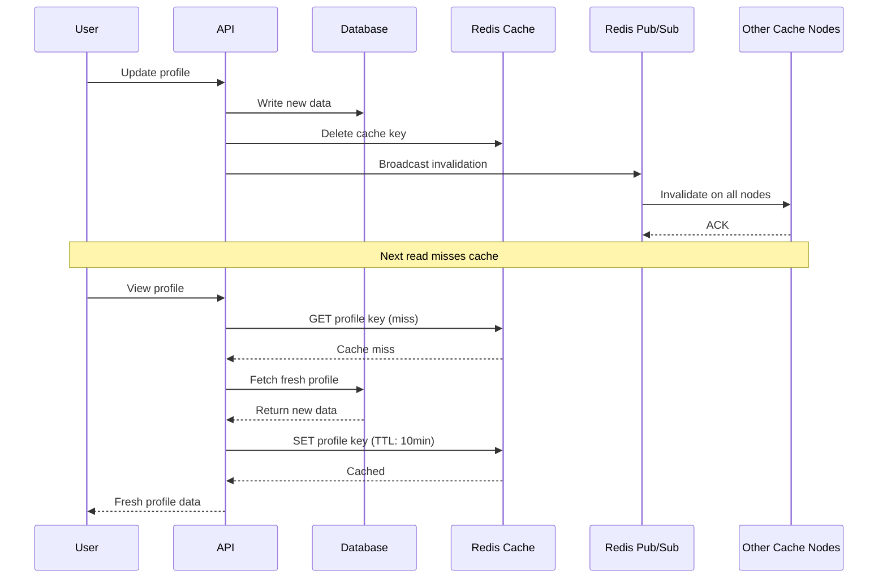

| Difficulty | Channel | Tags |
|---|---|---|
| beginner | backend | redis, memcached, cache-invalidation |

At 3am, an engineer at Meta watched a single metric spike from 1,300 to 17,000 database queries per second — a 13x explosion triggered by nothing more than a cache key expiring at the wrong moment [1]. That thundering herd of MySQL requests, stampeding across thousands of servers, nearly flattened the infrastructure serving a billion users. The lesson? Cache invalidation isn't just a hard problem in computer science — it's a ticking bomb in every production system you build. If you're designing a user profile service that caches frequently accessed data, the question isn't whether cache inconsistency will bite you. It's when.

---

> ### Real-World Case — Meta (Facebook)
>
> Facebook's Memcached cluster served billions of requests per second across thousands of servers fronting MySQL. A single cache key expiring at the wrong moment could spike database queries from 1,300 to 17,000 per second—a thundering herd stampede that could flatten infrastructure in seconds. Cross-region cache inconsistency also threatened to serve users stale data (e.g., an old profile photo after an update).
>
> | | |
> |---|---|
> | **Challenge** | Cache invalidation at Facebook scale introduced two critical failure modes: (1) Stale sets—where outdated data gets written to cache after a concurrent delete, permanently serving stale data until next TTL expiry, and (2) Thundering herds—where a popular key's expiration causes thousands of simultaneous database queries. Additionally, cross-region writes created race conditions where invalidation could arrive before replication completed, caching stale data in secondary regions. |
> | **Solution** | Facebook invented lease tokens—a 64-bit token mechanism enforced by the Memcache server itself. On cache miss, only one client receives a lease to fetch from DB and SET the result; others receive a 'wait' signal and retry. If the key is invalidated while a client holds a lease, the lease is revoked, preventing stale sets. They also built mcsqueal (an invalidation daemon that tails MySQL binlogs), a gutter pool (1% of servers absorbing traffic from failed nodes), and mcrouter (a proxy for batching/routing). Cross-region consistency was handled by ensuring only the storage cluster with the most up-to-date data sends invalidations. |
> | **Outcome** | Peak database query rates dropped from 17,000 req/s to 1,300 req/s—a 92% reduction—using leases alone. The system handles billions of requests per second, stores trillions of key-value pairs, and serves ~1 billion users. The architecture tolerates slightly stale data in exchange for availability, which Facebook explicitly chose as a design principle. |
> | **Lesson** | Cache invalidation is fundamentally a distributed coordination problem, not just a TTL problem. Facebook chose Memcached (not Redis) specifically because their workload was pure key-value caching and they could build the invalidation intelligence at the protocol level via leases. The key insight: the cache server itself—not the application—should arbitrate concurrent writes and prevent stampedes. This is the canonical reference for why cache-aside (look-aside) with explicit invalidation beats write-through for read-heavy social workloads. |

---

## Hook — That Timestamp You Ignored

Picture this: a user updates their profile photo. The write hits your database. The cache still holds the old photo. For the next five minutes, every friend who views that profile sees a face from last month. It sounds minor — until you realize that Meta's systems serve billions of requests per second, and a single stale cache key can spike database queries by a factor of 13 [1]. The old adage goes that there are only two hard problems in computer science: cache invalidation and naming things. After reading this, you'll understand why the first one keeps engineers awake at night.

## Problem — The Profile Photo That Won't Die

You're building a user profile service. Every time someone views a profile, your service checks the cache first, hits the database only on a miss. It's fast, it's efficient, it scales beautifully — until a user edits their bio or swaps their profile picture. Suddenly, the cache is lying. Your database says 'new photo,' but the cache still serves the old one. This is the fundamental tension of cache invalidation: the very thing that makes caching powerful (a fast, in-memory copy of data) is exactly what makes it dangerous when that data changes. The stakes escalate fast. If your cache-to-database ratio is 100:1, a single stale entry means 99 out of 100 users see wrong data. At scale, even a 0.1% inconsistency rate means thousands of users seeing outdated profiles. And here's the part that trips up many developers: naive TTL-based expiration doesn't solve this — it just makes the problem time-bounded, not eliminated. A 30-minute TTL means 30 minutes of stale data, which is an eternity in a world where users expect real-time updates [2].

## Real-World Case — Meta's Thundering Herd

Facebook's Memcached cluster was one of the largest distributed caching systems ever built. It fronted MySQL with billions of key-value pairs across thousands of servers, handling billions of requests per second [1]. But when a popular cache key expired simultaneously across multiple servers, the result was catastrophic: database query rates exploded from 1,300 to 17,000 per second — a 92% spike in traffic hitting already-stressed MySQL. This is the thundering herd problem in its purest form. When a cached key expires, multiple concurrent requests all miss the cache at once and simultaneously hit the database. At Facebook's scale, this wasn't an edge case — it was a recurring crisis. Cross-region cache inconsistency compounded the problem: a user updates their profile photo in one region, but cached data in another region still serves the stale version [1]. The solution? Facebook implemented leases — a mechanism that allows only one request per key to re-fetch data from the database while others wait. This single change reduced peak database query rates from 17,000 req/s to 1,300 req/s — a 92% reduction [1]. The broader insight from Meta's architecture is a deliberate choice: they tolerate slightly stale data in exchange for availability. That trade-off isn't a failure — it's a design principle that powers systems serving a billion users [1].

## Deep Dive — Write-Through vs Cache-Aside vs Write-Behind

When you're deciding how to implement cache invalidation for a profile service, three patterns dominate the landscape — and each carries different trade-offs. The write-through pattern ensures that every write goes to both the cache and the database simultaneously. This guarantees consistency but adds latency to every write operation. It's the safest choice when your data must always be accurate — think financial profiles or medical records. The cache-aside (lazy loading) pattern flips the script: reads check the cache first, and on a miss, fetch from the database and populate the cache. Writes update the database and invalidate the cache key. This is the most common pattern for user profiles because it's simple and effective, though it introduces a brief window of inconsistency between the write and the cache invalidation [3]. The write-behind (write-back) pattern writes to the cache immediately and asynchronously propagates to the database. It's fast but risky — if the cache crashes before flushing, you lose data. Now here's where the Redis vs Memcached decision enters the picture. Redis offers built-in pub/sub messaging, which means when you invalidate a cache key on one server, you can broadcast that invalidation to all other servers automatically [4]. Memcached has no such mechanism — you're left manually coordinating across nodes, which at scale becomes a distributed systems nightmare [5]. Redis also supports persistence, advanced data structures like sorted sets and hashes, and atomic operations like INCR that make it suitable for more than just caching [4]. Memcached, however, is simpler. It has lower memory overhead per key and its multithreaded architecture can be faster for pure key-value caching when you don't need the extras [5]. If this feels like choosing between a Swiss Army knife and a really good pocket knife — you're not wrong. The key question is: does your profile service need the advanced invalidation capabilities, or just raw speed? For most teams building user profile services, Redis's pub/sub for distributed invalidation makes it the pragmatic choice. The simplicity of Memcached is appealing until you're debugging a cross-region cache inconsistency at 3am.

## Workflow — The Invalidation Lifecycle

Here's how a robust cache invalidation flow works for a user profile service, step by step: First, a user submits a profile update through your API. Second, your service writes the new data to the database and simultaneously deletes (invalidates) the corresponding cache key. Third, if you're using Redis, the invalidation is broadcast via pub/sub to all connected cache servers. Fourth, the next read request for that profile misses the cache, fetches fresh data from the database, and repopulates the cache. Fifth, a TTL (typically 5-30 minutes for profiles) acts as a safety net — even if explicit invalidation fails, the stale data expires automatically [3]. The following diagram illustrates this flow, including the distributed invalidation step that prevents cross-region staleness:

## Code Example — Profile Cache Invalidation in Python

Let's walk through a practical implementation. This Python example uses Redis with pub/sub to handle distributed cache invalidation for a user profile service:

## Lessons Learned — What Meta's Engineers Wish They'd Known

The journey from Facebook's thundering herd to a stable cache architecture teaches several lessons worth internalizing. First, always delete — never update — cache keys on write. Updating in place introduces race conditions where a slow reader might see partially updated data [3]. Second, your TTL is your safety net, not your strategy. Explicit invalidation should be the primary mechanism; TTL is the backup that catches anything you miss [3]. Third, distributed invalidation isn't optional at scale. If you're running multiple cache nodes and using Memcached, you're manually building what Redis gives you out of the box with pub/sub [4][5]. The thundering herd problem is real and can be mitigated with leases, request coalescing, or probabilistic early expiration. Fourth, choose your consistency model deliberately. Meta explicitly chose to tolerate slightly stale data in exchange for availability [1]. That's not a compromise — it's a conscious engineering decision. For most user profile services, a 5-30 minute window of potential staleness is perfectly acceptable. Finally, monitor everything. Track your cache hit rate (aim for 95%+), measure the gap between write timestamps and cache invalidation, and set alerts for database query rate anomalies. The teams that avoid 3am pages are the ones that catch the thundering herd before it starts [1]. Cache invalidation remains one of computer science's hard problems — but with the right patterns, you can make it a manageable one.

---

## Profile Cache Invalidation Flow

<strong>Original Interview Question</strong>

**Q:** You're building a user profile service that caches frequently accessed profiles. How would you implement cache invalidation when a user updates their profile, and what trade-offs would you consider between Redis and Memcached?

**A:** Implement write-through caching with TTL-based expiration. On profile update, invalidate the cache by deleting the key and writing new data to both the database and cache. Redis offers pub/sub for automatic distributed invalidation, while Memcached requires manual coordination across nodes.

## Conclusion

Cache invalidation isn't just an academic puzzle — it's the difference between a system that serves a billion users and one that crumbles under its own traffic. Meta's engineers learned this the hard way when a single expiring cache key caused a 13x database spike [1]. The solution isn't complicated: write-through with explicit invalidation, pub/sub for distributed consistency, TTLs as safety nets, and deliberate choices about consistency vs availability. Start by auditing your current cache strategy. Are you deleting keys on write, or naively updating them? Are you broadcasting invalidations across nodes, or hoping TTLs catch everything? The teams that get this right don't just avoid 3am pages — they build systems that scale without fear.

---

## References

1. [Scaling Memcache at Facebook (USENIX NSDI 2013)](https://www.usenix.org/system/files/conference/nsdi13/nsdi13-final170_update.pdf) — paper
2. [Cache Invalidation — Wikipedia](https://en.wikipedia.org/wiki/Cache_invalidation) — documentation
3. [HTTP Caching — MDN Web Docs](https://developer.mozilla.org/en-US/docs/Web/HTTP/Caching) — documentation
4. [Redis Pub/Sub Documentation](https://redis.io/docs/interact/pubsub/) — documentation
5. [Memcached Wiki — GitHub](https://github.com/memcached/memcached/wiki) — documentation
6. [Redis — Wikipedia](https://en.wikipedia.org/wiki/Redis) — documentation
7. [Thundering Herd Problem — Wikipedia](https://en.wikipedia.org/wiki/Thundering_herd_problem) — documentation
8. [AWS ElastiCache for Redis — Amazon Documentation](https://docs.aws.amazon.com/AmazonElastiCache/latest/red-ug/WhatIs.html) — documentation

---

**Author:** Satishkumar Dhule — [GitHub](https://github.com/satishkumar-dhule) · [LinkedIn](https://linkedin.com/in/satishkumar-dhule) · [Website](https://satishkumar-dhule.github.io)
