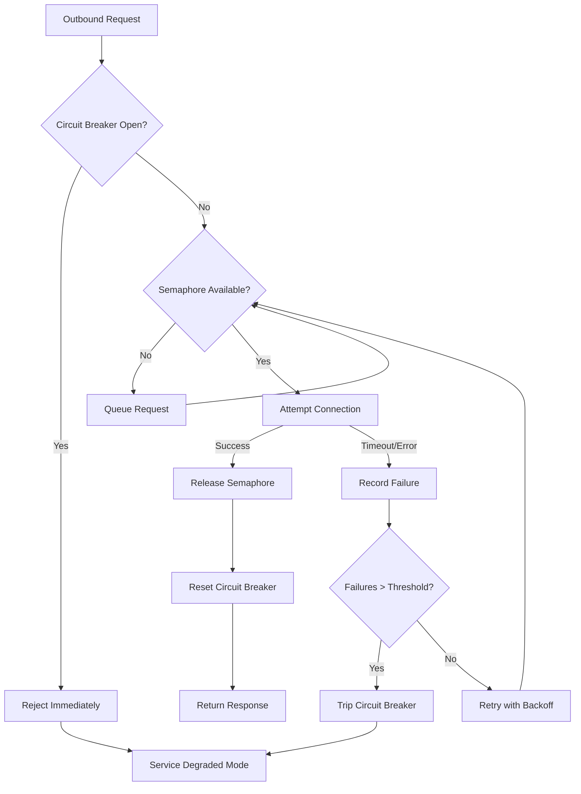

| Difficulty | Channel | Tags |
|---|---|---|
| advanced | backend | asyncio, aiohttp, concurrency |

It was 2011, and Netflix's API was falling apart. A single sluggish recommendation service was silently exhausting every Tomcat thread across the fleet, turning a 0.5% failure rate into a platform-wide outage that froze streaming for millions [1]. The root cause wasn't exotic — it was the absence of a guardrail: no circuit breaker, no connection pool limits, no graceful degradation. This is the exact class of problem that connection pool managers solve, and by the time you finish this article, you'll know how to build one for aiohttp that would have saved Netflix's API team a year of firefighting.

---

> ### Real-World Case — Netflix
>
> In 2011, Netflix's API team faced cascading failures where a single slow or failing downstream service would exhaust all Tomcat request threads across the entire fleet. A dependency with 99.5% uptime, when called across 30+ services, created a compounded failure rate that took the whole API down. One slow recommendation service or content metadata call could freeze the entire streaming experience for millions of users.
>
> | | |
> |---|---|
> | **Challenge** | Netflix needed to prevent a single failing or slow downstream dependency from exhausting all available request threads and cascading failures across their entire microservice architecture. They had to handle connection timeouts, thread pool exhaustion, and degrading service quality without taking down the API for all users. |
> | **Solution** | Netflix built Hystrix, a latency and fault-tolerance library that wrapped every downstream call in isolated thread pools (10 threads per dependency), semaphore-based concurrent request limiting, circuit breakers that opened when failure rates exceeded 50% in a 10-second rolling window, and configurable timeouts per command. When circuits tripped or pools saturated, Hystrix instantly served fallback responses (cached data, defaults, or degraded content) instead of blocking threads. |
> | **Outcome** | By 2012, Hystrix was executing tens of billions of thread-isolated and hundreds of billions of semaphore-isolated calls per day. Cascading failures went from a weekly occurrence to a rare event. The Hystrix dashboard gave operators real-time visibility into every dependency's health, thread pool utilization, and circuit breaker state, enabling proactive tuning rather than reactive firefighting. |
> | **Lesson** | Thread pool isolation (the bulkhead pattern) is more critical than circuit breakers alone. Without thread isolation, a slow dependency still exhausts your main request threads even if the circuit breaker opens. The combination of per-dependency thread pools + circuit breakers + fallbacks creates a resilience stack where no single failure can cascade beyond its bounded pool. |

---

## Hook — The Night a Recommendation Engine Took Down Streaming

Picture this: it's prime time on a Friday evening. Millions of Netflix subscribers open the app expecting their personalized home screen. Behind the scenes, 30+ microservices fan out to fetch recommendations, content metadata, ratings, and thumbnails. One dependency — the recommendation engine — starts responding 400ms slower than usual. Within minutes, every Tomcat thread across the entire API fleet is blocked waiting on that one slow service. The UI freezes. The "buffering" spinner appears. And Netflix's engineering team discovers that a service with 99.5% uptime, when called across dozens of downstream dependencies, creates a compounded failure rate that can — and did — take the whole platform down [1]. This isn't a hypothetical. This is the incident that led Netflix to build Hystrix, a library that by 2012 was executing tens of billions of thread-isolated and hundreds of billions of semaphore-isolated calls per day [1]. The question you should be asking right now: if Netflix's scale exposed this vulnerability, how certain are you that your own API isn't one slow dependency away from the same fate?

## Problem — Why Connection Pools Fail Under Pressure

At its core, the problem is deceptively simple: every HTTP client has a finite number of connections it can maintain simultaneously. When you're making outbound calls to downstream services without enforcing limits, a single slow or unresponsive dependency can consume all available connections, starving every other request in your application. This is the classic thread-pool exhaustion problem, and it manifests identically whether you're using Tomcat threads, asyncio tasks, or aiohttp connection pools [2]. Consider what happens in a typical microservices architecture: your service makes calls to Service A, B, and C. Service A starts timing out at the 30-second mark. Every concurrent request now holds a connection open for 30 full seconds instead of the expected 200ms. Your pool of 100 connections fills up in under a second. Now Service B and C — both perfectly healthy — are queued behind dead connections. The failure has cascaded. This isn't a connection pool bug. It's a missing architectural pattern. Specifically, three things are absent: connection limits that prevent pool saturation, retry strategies that don't compound the problem, and circuit breakers that stop you from hammering a failing service [3]. The tragedy is that developers often build connection pools with only the happy path in mind — adding a `max_connections` parameter and calling it a day. But the real test of a pool manager isn't how it handles 100 successful requests. It's how it behaves when 50 of those requests are timing out while the other 50 are perfectly valid.

## Real-World Case — Netflix and the Cascade That Changed Everything

Netflix's 2011 API incident is one of the most well-documented cascading failures in distributed systems history [1]. The architecture at the time had the API layer fanning out to dozens of backend services. When any single downstream dependency degraded, the API threads would block, waiting for responses that might never come. The failure rate of any one service was small — roughly 0.5% — but compound that across 30 services called in a single request path, and the probability of at least one failure approaches certainty. By 2012, Netflix had deployed Hystrix, which introduced circuit breakers and bulkhead isolation to every dependency call [1]. The results were transformative: Hystrix was handling tens of billions of calls per day through thread isolation and hundreds of billions through semaphore isolation [1]. Cascading failures, once a weekly occurrence, became rare. The Hystrix dashboard gave operators real-time visibility into every dependency's health, thread pool utilization, and circuit breaker state — enabling proactive tuning instead of reactive firefighting [1]. The lesson from Netflix isn't just 'use circuit breakers.' It's that connection management must be treated as a first-class architectural concern, not an afterthought bolted on during an incident postmortem. The patterns Netflix pioneered at scale — circuit breakers, bulkhead isolation, graceful degradation — are exactly the patterns you need in your aiohttp connection pool, even if you're serving a fraction of Netflix's traffic.

## Deep Dive — The Three Pillars of Graceful Degradation

Building on Netflix's hard-won lessons, a production-grade connection pool manager for aiohttp rests on three interconnected patterns: semaphore-based concurrency limiting, exponential backoff with jitter, and circuit breaker state management. Each addresses a distinct failure mode, and together they create a system that degrades gracefully instead of catastrophically [3][4].

**Semaphore-Based Concurrency Limiting** is the foundation. An asyncio semaphore restricts how many requests can be in-flight simultaneously, regardless of how many tasks are waiting [5]. Without it, a sudden traffic spike spawns thousands of concurrent aiohttp requests, overwhelming both your application and the downstream service. The semaphore acts as a gatekeeper: it doesn't reject requests, it queues them — transforming an unbounded concurrency problem into a bounded one [5].

**Exponential Backoff with Jitter** is what prevents retry storms. When a request fails, naively retrying immediately just adds load to an already-struggling service. Exponential backoff introduces increasing delays between retries: 1 second, then 2, then 4, then 8 [6]. Adding jitter — a random component — prevents the thundering herd problem, where thousands of clients all retry at exactly the same interval [6]. This is critical in distributed systems where synchronized retries can create periodic load spikes worse than the original failure.

**Circuit Breakers** are the last line of defense. The concept is borrowed from electrical engineering: when too many requests fail in a window, the circuit 'trips' and immediately rejects further requests without even attempting the connection [3]. After a cooldown period, the circuit enters a 'half-open' state, allowing a single probe request through. If it succeeds, the circuit resets. If it fails, the circuit trips again. This prevents your application from wasting resources on a service that's clearly unavailable, giving the downstream service time to recover [3].

The interplay between these three patterns is what makes the difference between a pool that survives a dependency failure and one that amplifies it.

## Workflow — From Request to Response (Or Graceful Failure)

To see how these patterns work together, consider the lifecycle of a single request through a connection pool manager [7]:

1. **Request Arrives**: An aiohttp task wants to make an outbound request.
2. **Circuit Breaker Check**: Before even attempting a connection, the manager checks the circuit breaker state. If the circuit is open (too many recent failures), the request is immediately rejected with a clear error — no connection attempt, no wasted resources [3].
3. **Semaphore Acquisition**: If the circuit is closed or half-open, the task attempts to acquire a semaphore slot. If all slots are occupied, the task waits in a queue. This prevents pool exhaustion [5].
4. **Connection Attempt**: The request is made with a configured timeout. If the downstream service responds within the timeout, success — the semaphore is released and the circuit breaker records a healthy response.
5. **Failure Handling**: If the request times out or returns an error, the failure is recorded. The circuit breaker increments its failure counter. If the threshold is crossed, the circuit trips [3].
6. **Retry with Backoff**: Depending on the error type, the request may be retried with exponential backoff and jitter, giving the downstream service time to recover [6].

This flow is visualized in the diagram below, showing how each component acts as a checkpoint in the request lifecycle:

## Code Example — Building a Production-Grade aiohttp Pool Manager

Here's a complete implementation of a connection pool manager that brings all three patterns together. This is the code that would have saved Netflix's API team a year of firefighting — adapted for aiohttp [2][4]:

## Lessons Learned — Battle Scars and Hard-Won Wisdom

After building and debugging connection pool managers in production, here are the patterns that matter and the pitfalls that will bite you [8]:

**Pitfall 1: Connection Leaks.** The most common and insidious failure. If your `async with` blocks don't properly release connections — or if exceptions bypass cleanup — your pool slowly drains until it's empty. Always use context managers, and always implement a `close()` method that cleans up on application shutdown.

**Pitfall 2: Ignoring SSL Context Validation.** Skipping SSL verification in development is fine. Doing it in production is a ticking time bomb. Always validate certificates, and always configure proper timeout hierarchies — connect timeout, total timeout, and socket read timeout are all distinct [2].

**Pitfall 3: No Circuit Breaker Reset Path.** A circuit breaker that trips but never resets is just a permanent outage. The half-open state is critical — it's the mechanism that allows your system to recover when the downstream service comes back [3].

**Pitfall 4: Missing Shutdown Hooks.** When your application shuts down, your connection pool must flush pending requests and close connections gracefully. Without this, you'll leak connections and leave dangling tasks in the event loop [4].

**Pitfall 5: Not Monitoring Pool Health.** A connection pool without metrics is a black box. Track active connections, queue depth, circuit breaker state, and retry rates. You can't tune what you can't measure.

The most important lesson from Netflix's experience is this: cascading failures are not edge cases. They are the inevitable consequence of calling unreliable services without guardrails [1]. The patterns in this article — semaphores, exponential backoff, and circuit breakers — aren't optimizations. They're survival mechanisms.

---

## Connection Pool Request Lifecycle with Circuit Breaker

<strong>Original Interview Question</strong>

**Q:** How would you implement a connection pool manager for aiohttp that handles graceful degradation under high load and connection timeouts?

**A:** Implement a connection pool manager for aiohttp using a semaphore to limit concurrent connections, exponential backoff for retrying failed requests, and circuit breaker pattern to gracefully degrade under high load and connection timeouts.

## Conclusion

The Netflix story isn't just a cautionary tale about microservices — it's proof that connection management patterns directly determine whether your system survives a dependency failure or collapses under it [1]. The three pillars you've learned — semaphore-based limiting, exponential backoff, and circuit breakers — are not optional sophistication. They are the minimum viable resilience for any service that calls another service over the network. Tomorrow, go audit your own outbound HTTP calls. Ask yourself: what happens if the service I call most often starts responding 10x slower? If the answer is 'I don't know,' that's exactly the vulnerability Netflix discovered in 2011. The fix is a weekend project. The outage it prevents could save you from a 3am war room.

---

## References

1. [Netflix Hystrix Wiki](https://github.com/Netflix/Hystrix/wiki) — documentation
2. [aiohttp Client Session Documentation](https://docs.aiohttp.org/en/stable/client_advanced.html) — documentation
3. [Circuit Breaker Pattern — Martin Fowler](https://martinfowler.com/bliki/CircuitBreaker.html) — blog
4. [aiohttp GitHub Repository](https://github.com/aio-libs/aiohttp) — documentation
5. [Python asyncio Semaphore Documentation](https://docs.python.org/3/library/asyncio-sync.html#asyncio.Semaphore) — documentation
6. [Exponential Backoff — AWS Architecture Blog](https://docs.aws.amazon.com/general/latest/gr/exponential-backoff.html) — documentation
7. [Microservices Patterns — Chris Richardson](https://microservices.io/patterns/reliability/circuit-breaker.html) — documentation
8. [asyncio Best Practices — Python Documentation](https://docs.python.org/3/library/asyncio-dev.html#asyncio-dev-best-practices) — documentation

---

**Author:** Satishkumar Dhule — [GitHub](https://github.com/satishkumar-dhule) · [LinkedIn](https://linkedin.com/in/satishkumar-dhule) · [Website](https://satishkumar-dhule.github.io)
