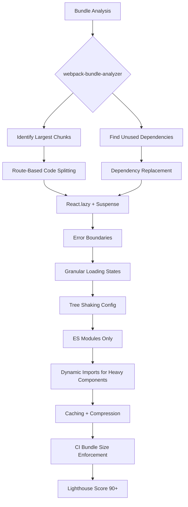

| Difficulty | Channel | Tags |
|---|---|---|
| intermediate | frontend | lighthouse, bundle, lazy-loading |

What happens when the world's largest social network ships a JavaScript bundle so massive it delays time-to-interactive for billions of users? Facebook found out the hard way when they rebuilt facebook.com as a client-side React SPA. The homepage CSS alone weighed 413KB. The initial page load was a serial waterfall of downloading code, then fetching data, then finally rendering — a pattern that turned every navigation into a waiting game. Their fix — splitting the codebase into three loading tiers, parallelizing data and code downloads, and enforcing per-team JavaScript budgets — didn't just fix their own app. It created the blueprint that every React performance optimization story follows today [1].

---

> ### Real-World Case — Meta (Facebook)
>
> When Facebook rebuilt facebook.com as a client-side React single-page application (FB5), they faced a critical performance challenge: shipping a large JavaScript bundle that blocked rendering and delayed time-to-interactive for billions of users. The entire site needed to be rearchitected around React, GraphQL, and Relay while maintaining sub-second perceived load times.
>
> | | |
> |---|---|
> | **Challenge** | A monolithic JavaScript bundle meant the browser had to download and execute all code before rendering anything visible. Time-to-first-paint and time-to-interactive were unacceptable for a site serving billions of daily users. They needed to deliver minimal code for initial render while deferring non-critical JavaScript, all while managing code size creep across hundreds of teams. |
> | **Solution** | Facebook invented a three-tier JavaScript code-splitting system with custom import APIs: Tier 1 (50KB) contains only the code needed for the loading skeleton/first paint; Tier 2 (150KB) uses `importForDisplay()` to load code for fully rendering above-the-fold interactive content; Tier 3 (300KB) uses `importForAfterDisplay()` for non-visual code like analytics. They implemented per-product JavaScript budgets enforced in CI with dependency graph tools and merge request size monitoring. They also reduced CSS by 80% (413KB → 73KB) using atomic CSS with logarithmic growth, and built an EntryPoint system that parallelizes code and data downloads so Relay GraphQL queries and JavaScript modules fetch simultaneously in a single network round trip. |
> | **Outcome** | The homepage CSS dropped from 413KB to 73KB (80% reduction). A 500KB page was split into 50KB/150KB/300KB tiers so the loading skeleton renders almost immediately. Time-to-first-paint improved dramatically because only Tier 1 code is needed for the initial skeleton. Code and data downloading was parallelized, eliminating serial waterfalls. The per-product JavaScript budgets prevented code creep across hundreds of engineering teams. |
> | **Lesson** | Code splitting should follow a priority-based tiering strategy (skeleton → above-the-fold → everything else), not just route boundaries. JavaScript budgets enforced in CI prevent the inevitable size creep that happens when hundreds of teams contribute to a single codebase. Server-side knowledge of what code is needed enables parallel downloads of code and data, breaking the traditional serial waterfall pattern. |

---

## Hook — A 2.1MB Alarm at 3AM

Picture this: your Lighthouse score reads 65. Time to Interactive is 4.2 seconds. The JavaScript bundle sitting on your CDN weighs 2.1MB. Your users on 3G are staring at a blank screen for the better part of five seconds while the browser downloads, parses, and executes code for features they never click. This isn't a hypothetical. This is the daily reality for every React application that grows past a certain complexity threshold — and it's exactly the scenario that forces engineering teams to choose between shipping features and shipping performance. The tension between feature velocity and bundle discipline is one of the most persistent challenges in frontend engineering, and ignoring it has real business consequences: Google reports that 53% of mobile users abandon sites that take longer than 3 seconds to load [2].

## Problem — The Silent Killer of React Applications

Here's the uncomfortable truth: most React applications don't start slow. They end slow. A fresh Create React App ships around 40-50KB of JavaScript — perfectly reasonable. But six months later, after adding a charting library, a rich text editor, a date picker, an admin panel, and a handful of third-party analytics SDKs, that bundle has quietly tripled in size. The problem compounds because of how JavaScript works in the browser. Unlike images or CSS, JavaScript must be downloaded, parsed, AND executed before the browser can respond to user input [3]. A 2.1MB bundle doesn't just take longer to download — it takes longer to parse on low-end devices, longer to execute on the main thread, and longer before Time to Interactive becomes interactive. Consider the math: on a mid-range Android phone over 3G, downloading 1MB takes roughly 3-4 seconds [4]. Parsing and executing that JavaScript adds another 1-2 seconds. That's your 4.2s TTI explained in cold, mechanical terms. Meanwhile, the user sees nothing. No skeleton, no spinner, no indication that something is happening. Just a blank screen eroding trust with every passing millisecond.

## Real-World Case — Meta's FB5 Rearchitecture

Facebook faced this exact crisis when they rebuilt facebook.com as a client-side React SPA called FB5. The old server-rendered site had served billions reliably, but it couldn't deliver the app-like interactivity users expected. The new architecture — built on React, GraphQL, and Relay — needed sub-second perceived load times while supporting hundreds of engineering teams contributing simultaneously [1]. The solution was elegant: tier-based code splitting. Instead of shipping one monolithic bundle, Facebook split their JavaScript into three tiers. Tier 1 contained just the layout and UI skeletons — enough code to render a loading state almost instantly. Tier 2 held everything needed for above-the-fold content to become fully interactive. Tier 3 captured everything else: analytics subscriptions, background data syncing, and features below the fold. The results were dramatic. Homepage CSS dropped from 413KB to 73KB — an 80% reduction — thanks to atomic CSS that eliminated redundant style rules [1]. Code and data downloading were parallelized, eliminating the serial waterfall where the browser had to finish downloading JavaScript before it could even begin fetching data. They even enforced per-team JavaScript budgets to prevent code creep across hundreds of engineering teams [5]. This wasn't just optimization. It was a fundamental rethinking of how large-scale React applications should deliver code to users.

## Deep Dive — The Anatomy of Bundle Optimization

Understanding how to go from a 2.1MB bundle to a sub-second Time to Interactive requires mastering six interconnected techniques. Each one addresses a different bottleneck in the loading pipeline.

**Bundle Analysis: You Can't Optimize What You Can't See**
Before touching a single import statement, you need to visualize what's actually in your bundle. Tools like webpack-bundle-analyzer generate interactive treemaps showing every module's contribution to the final output [6]. What most developers discover is surprising: a single import of `moment.js` with all locales can add 300KB to a bundle. Importing `lodash` instead of `lodash/debounce` pulls in the entire utility library. These aren't edge cases — they're the norm.

**Code Splitting: Breaking the Monolith**
Route-based splitting is the highest-ROI optimization you can make. Instead of loading code for every page upfront, each route gets its own chunk that loads only when the user navigates to it [7]. For a 10-route application, this alone can reduce the initial bundle by 60-70% because the average user visits 2-3 routes per session.

**Tree Shaking: Eliminating Dead Code**
Modern bundlers like webpack and Rollup can statically analyze your import graph and eliminate code that's never actually used [3]. But tree shaking only works reliably with ES modules. If your dependencies ship CommonJS, they become opaque black boxes that bundlers can't optimize.

**Dynamic Imports: Loading On Demand**
Beyond routes, individual components and libraries can be lazy-loaded based on user interaction. A rich text editor needed only when the user clicks "compose"? A charting library loaded only on the analytics page? Dynamic imports make this granular splitting straightforward [7].

**Dependency Auditing: The Hidden Tax**
Third-party dependencies are often the biggest bundle offenders. Replacing `moment.js` (300KB) with `day.js` (2KB) or `date-fns` (tree-shakable) is a common win. Replacing `lodash` (70KB) with `lodash-es` (tree-shakable) is another. Bundlephobia makes it easy to evaluate the cost before adding any new dependency [4].

**Caching and Compression: The Multiplier Effect**
Once your bundle is small, compression (Brotli or gzip) and long-term caching headers ensure repeat visitors load near-instantly. A well-cached 50KB chunk with a strong `immutable` header loads in under 100ms on a warm cache.

## Workflow — The Step-by-Step Battle Plan

Here's the systematic process for taking a 65 Lighthouse score to 90+:

## Code Example — Production-Grade Lazy Loading with Error Boundaries

The following implementation demonstrates route-based code splitting with error boundaries — the production pattern that prevents a single failed chunk from crashing your entire application:

## Lessons Learned — What Actually Moves the Needle

After implementing bundle optimization across dozens of production React applications, several patterns consistently emerge:

**The 80/20 of Bundle Optimization**
Route-based code splitting and dependency auditing account for roughly 80% of the performance improvement with 20% of the effort. If you do nothing else, do these two things first.

**The Suspense Boundary Anti-Pattern**
Many developers wrap their entire app in a single `` boundary. This is a mistake. If any lazy component takes 3 seconds to load, the entire screen shows a spinner. Instead, use granular Suspense boundaries per region — sidebar, main content, modals — so loading states are localized [8].

**The Named Export Trap**
`React.lazy()` only works with default exports. If a module uses named exports, you need a wrapper or a `.then()` mapping. This catches nearly every team at least once.

**The Budget Conversation**
Facebook's per-team JavaScript budgets are worth emulating. Set a hard cap — say, 30KB per route chunk — and enforce it in CI with size-limit or bundlesize. The conversation about "who added 200KB to the bundle" becomes automatic instead of confrontational.

**Measurement Is Not Optional**
Run Lighthouse in your CI pipeline. Track bundle size trends over time. A 5KB regression today becomes a 50KB regression in six months if nobody's watching. Tools like Lighthouse CI and Bundlewatch make this automated and non-negotiable [2].

**The Counterintuitive Insight**
Many developers think lazy loading only matters for mobile users on slow networks. But on desktop Chrome, JavaScript parsing still takes 100-200ms per 100KB of code. A 2.1MB bundle adds 2-4 seconds of parsing time even on a fast connection. Lazy loading benefits every user, not just the ones on 3G.

---

## Bundle Optimization Battle Plan

<strong>Original Interview Question</strong>

**Q:** You're tasked with improving a React app's Lighthouse performance score from 65 to 90+. The bundle size is 2.1MB and Time to Interactive is 4.2s. What specific steps would you take to optimize the bundle and implement lazy loading?

**A:** Implement code splitting with React.lazy() and Suspense, analyze bundle composition with webpack-bundle-analyzer to identify largest chunks, remove unused dependencies and optimize imports, add dynamic imports for heavy components and third-party libraries, implement route-based splitting for better initial load times, and utilize tree shaking with proper ES module configuration.

## Conclusion

The journey from a 65 Lighthouse score to 90+ isn't about finding one silver bullet. It's about systematically addressing every bottleneck in the loading pipeline — analysis, splitting, tree shaking, lazy loading, caching, and enforcement. Facebook proved this at planetary scale, reducing homepage CSS by 80% and splitting their page into three loading tiers that rendered skeletons almost instantly [1]. The techniques they pioneered are now accessible to every React developer through `React.lazy()`, `Suspense`, and modern bundlers. The single most actionable takeaway: start with bundle analysis. Run webpack-bundle-analyzer today. You'll almost certainly discover a dependency that's silently inflating your bundle by 100KB or more. Fix that, implement route-based splitting, and you're already halfway to 90+.

---

## References

1. [Tech stack rebuild for a new Facebook.com](https://engineering.fb.com/2020/05/08/web/facebook-redesign/) — blog
2. [Google Lighthouse Performance Scoring](https://developer.chrome.com/docs/lighthouse/performance/performance-scoring) — documentation
3. [Webpack Code Splitting Guide](https://webpack.js.org/guides/code-splitting/) — documentation
4. [BundlePhobia — Search for npm packages and see their bundle size](https://bundlephobia.com/) — documentation
5. [Optimization Strategies for the New Facebook.com — Ashley Watkins at React Conf](https://www.infoq.com/news/2020/04/facebook-optimization-strategies/) — blog
6. [webpack-bundle-analyzer GitHub Repository](https://github.com/webpack-contrib/webpack-bundle-analyzer) — documentation
7. [Webpack Lazy Loading Guide](https://webpack.js.org/guides/lazy-loading/) — documentation
8. [React Official Documentation — Suspense](https://react.dev/reference/react/Suspense) — documentation
9. [Facebook FB5 UX Optimizations — InfoQ Deep Dive](https://www.infoq.com/news/2020/11/facebook-fb5-ux-optimizations/) — blog
10. [MDN Web Docs — Dynamic Import Syntax](https://developer.mozilla.org/en-US/docs/Web/JavaScript/Reference/Statements/import#dynamic_import) — documentation

---

**Author:** Satishkumar Dhule — [GitHub](https://github.com/satishkumar-dhule) · [LinkedIn](https://linkedin.com/in/satishkumar-dhule) · [Website](https://satishkumar-dhule.github.io)
