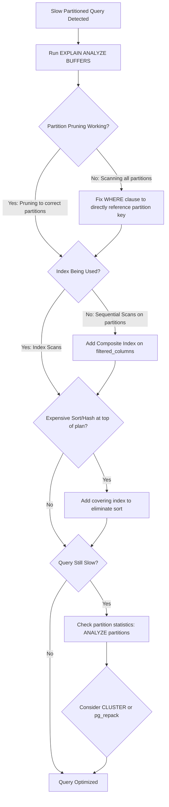

| Difficulty | Channel | Tags |
|---|---|---|
| intermediate | database | explain, query-plan, partitioning |

Your PostgreSQL table has 100 million rows, it's partitioned by date, and your queries are still crawling. Sound familiar? CoinGecko faced this exact nightmare with a 1TB+ table storing eight years of hourly crypto price data — queries averaging 30+ seconds, IOPS maxed out at 24,000, and replica lag threatening their SLO commitments [1]. The table was partitioned. The queries were filtered by date. Everything looked correct on paper. Yet the database was choking. The culprit wasn't a missing feature — it was a misunderstood one. Partition pruning, the mechanism that's supposed to make partitioned tables fast, was silently failing to do its job.

---

> ### Real-World Case — CoinGecko
>
> CoinGecko's 1TB+ PostgreSQL table storing 8 years of hourly crypto price data had grown so large that queries averaged 30+ seconds. IOPS was maxing out at 24K causing replica lag and degraded Apdex scores, threatening their SLO/SLA commitments.
>
> | | |
> |---|---|
> | **Challenge** | A single unpartitioned table with hourly price data across multiple currencies (JSONB columns) was too large for indexing strategies to work — indexes would only benefit specific applications and not generalize. Every date-range query scanned the entire 1TB+ dataset. |
> | **Solution** | Implemented range partitioning by month on the timestamp column, which aligned perfectly with their query patterns (almost all queries filter by timestamp range, typically needing only 1-4 months of data). They performed a dry run on a replica, used Foreign Data Wrappers to copy data from a prewarmed standby to avoid IOPS exhaustion on production, and switched via table rename with a trigger-based sync for rollback safety. |
> | **Outcome** | 86% reduction in p99 response time (from 4.13s to 578ms), 20% reduction in IOPS, eliminated replica lag. The daily revenue query that previously scanned 500M+ rows now only hits 1-4 monthly partitions. Partition pruning cut data access from the full table to at most 4 partitions per query. |
> | **Lesson** | Partition pruning is only as good as your WHERE clause — a single query without an upper date limit after the migration scanned ALL partitions and performed worse than the unpartitioned table. The partition key must match actual query patterns, and every query touching the table must include the partition key predicates. |

---

## The Query That Refused to Speed Up

You add date-based partitioning to your 100M-row table expecting a dramatic speedup. The partition key is event_date. Your query filters on a specific month. Postgres should only scan one or two partitions, right? But when you run EXPLAIN ANALYZE, the query planner is still touching more partitions than expected, or worse, it's scanning entire partitions with sequential scans instead of using your indexes. This is the moment where many developers discover that partitioning is not a magic performance button — it's a precision tool that requires understanding how the query planner thinks [2]. The gap between 'the table is partitioned' and 'the query is actually fast' is where most teams lose hours, or in CoinGecko's case, where SLO breaches begin.

## Why Partitioned Queries Are Still Slow

Here is the core problem: partitioning splits your data into smaller physical chunks, but it does not automatically make your queries faster. Three things silently undermine performance even after you've partitioned correctly. First, partition pruning may not be happening. If your WHERE clause doesn't directly reference the partition key in a way the planner can evaluate at plan time, Postgres will scan every partition [3]. Second, indexes are per-partition, not global. A query that would use an index on a small table might trigger sequential scans on each partition because the planner doesn't think an index scan across 12 partitions is worth it. Third, expensive sorts and hash aggregates can blow up memory when they operate across partition boundaries without proper indexes. Each of these failure modes has a different fix, but you can only diagnose the right one by reading your EXPLAIN plan carefully.

## Real-World Case — CoinGecko

CoinGecko's engineering team discovered all three failure modes at once. Their 1TB+ PostgreSQL table stored eight years of hourly cryptocurrency price data, and as the table grew, queries averaging 30+ seconds became the norm [1]. IOPS was maxing out at 24,000, causing replica lag and degraded Apdex scores that threatened their SLO/SLA commitments. The table was partitioned, but the partitions weren't optimized for their actual query patterns. After implementing targeted partition pruning and composite indexes on their most frequent query paths, the results were dramatic: an 86% reduction in p99 response time from 4.13 seconds down to 578 milliseconds, a 20% reduction in IOPS, and complete elimination of replica lag [1]. The daily revenue query that previously scanned over 500 million rows now only hit one to four monthly partitions. This wasn't a rewrite — it was a precise surgical optimization of how Postgres accessed existing partitions.

## Deep Dive — Reading the EXPLAIN Plan Like a Detective

When you run EXPLAIN (ANALYZE, BUFFERS) on a partitioned table, you're looking for three red flags. The first is partition pruning failures: if you see 'Append' nodes scanning partitions that don't match your date filter, your partition key isn't being evaluated properly [4]. This happens when you wrap the partition key in a function, use a subquery in the WHERE clause, or cast types in a way the planner can't fold into a constant. The second red flag is sequential scans on partitions. If each partition shows 'Seq Scan' instead of 'Index Scan,' your per-partition indexes either don't exist or aren't selective enough for the planner to prefer them. The third is high-cost sort or hash aggregate nodes at the top of the plan — these indicate the planner is doing expensive work after fetching rows, which composite indexes on (partition_key, filtered_columns) can often eliminate entirely.

Here's the counterintuitive insight many developers miss: sometimes adding an index actually makes partitioned queries slower. If you have 100 partitions and each has an index, a query that the planner thinks should scan all partitions might decide to use every single index, resulting in 100 index scans instead of one fast sequential scan on a single partition [5]. The planner's cost model matters, and understanding when it works against you is the difference between a 30-second query and a sub-second one.

## Workflow — From Slow Query to Optimized Partition Strategy

The optimization workflow follows a repeatable pattern. Start by identifying the exact queries that are slow, then use EXPLAIN (ANALYZE, BUFFERS) to capture the actual execution plan. From there, check partition pruning first — it's the highest-leverage fix. If pruning is working, look at index utilization on individual partitions. If indexes aren't being used, evaluate whether a composite index covering your WHERE clause columns would help. Finally, consider clustering or re-clustering partitions to physically order data on disk for the access patterns you actually use [6]. This diagram shows the diagnostic flow:

## Code Example — Diagnosing and Fixing Partition Pruning

Here's a practical walkthrough of diagnosing and fixing a slow partitioned query. This code assumes you have a table called events partitioned by event_date with a status column that's frequently filtered.

## Lessons Learned — What CoinGecko's Fix Teaches Every Developer

There are five lessons worth taking from this experience. First, partition pruning is your biggest lever — if it's not working, nothing else matters. Always verify with EXPLAIN (ANALYZE, BUFFERS) before optimizing indexes [2]. Second, composite indexes on (partition_key, filtered_columns) outperform single-column indexes on partitioned tables because they allow index-only scans that avoid touching the table heap entirely [7]. Third, partition maintenance is not optional — running ANALYZE on partitions after bulk loads keeps the planner's statistics accurate, and stale statistics cause the planner to choose wrong plans [3]. Fourth, CLUSTER or pg_repack can physically reorder partition data to match your access patterns, but the benefit only lasts until the next significant write batch [6]. Finally, the biggest trap is optimizing the wrong query. Before tuning anything, verify which queries are actually causing production pain by checking pg_stat_statements — you might find the real bottleneck isn't the partitioned table at all [8].

---

## Partitioned Query Optimization Diagnostic Flow

<strong>Original Interview Question</strong>

**Q:** You have a PostgreSQL table with 100M rows partitioned by date. A query filtering on a specific date range is still slow. What would you check in the EXPLAIN plan and how would you optimize it?

**A:** Check partition pruning effectiveness, index utilization patterns, and expensive sort operations. Create composite indexes on (date, filtered_columns) and evaluate clustering strategies for optimal data access.

## Conclusion

The gap between 'my table is partitioned' and 'my queries are fast' is where most teams burn production hours. CoinGecko's experience proves that partitioning alone isn't enough — you need to verify partition pruning with EXPLAIN ANALYZE BUFFERS, add composite indexes covering your actual WHERE clause columns, and keep partition statistics fresh [1]. The next time a partitioned query is slow, skip the guesswork and follow this diagnostic flow: check pruning first, then index utilization, then sort costs. The fix is almost always one of those three things. And if you remember nothing else, remember this: run EXPLAIN (ANALYZE, BUFFERS) before you add any index. The plan will tell you exactly what's wrong — you just have to know how to read it.

---

## References

1. [CoinGecko: Scaling PostgreSQL Performance with Table Partitioning](https://amree.dev/2025/06/13/scaling-postgresql-performance-with-table-partitioning/) — blog
2. [PostgreSQL Documentation: Partitioning](https://www.postgresql.org/docs/current/ddl-partitioning.html) — documentation
3. [PostgreSQL Documentation: Using EXPLAIN](https://www.postgresql.org/docs/current/using-explain.html) — documentation
4. [PostgreSQL Documentation: Plan Caching](https://www.postgresql.org/docs/current/plan-cache.html) — documentation
5. [PostgreSQL Documentation: Indexes and ORDER BY](https://www.postgresql.org/docs/current/indexes-order.html) — documentation
6. [PostgreSQL Documentation: CLUSTER Command](https://www.postgresql.org/current/sql-cluster.html) — documentation
7. [PostgreSQL Documentation: Index-Only Scans](https://www.postgresql.org/docs/current/indexes-index-only-scans.html) — documentation
8. [PostgreSQL Documentation: pg_stat_statements](https://www.postgresql.org/docs/current/pgstatstatements.html) — documentation

---

**Author:** Satishkumar Dhule — [GitHub](https://github.com/satishkumar-dhule) · [LinkedIn](https://linkedin.com/in/satishkumar-dhule) · [Website](https://satishkumar-dhule.github.io)
