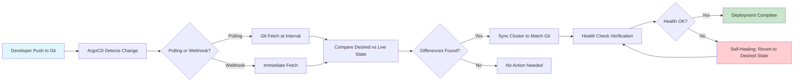

| Difficulty | Channel | Tags |
|---|---|---|
| beginner | devops | argocd, flux, declarative |

When Cabify's ride-hailing platform needed to scale their deployment infrastructure, they turned to ArgoCD and GitOps. What happened next was a cautionary tale every platform engineer should know [1]. A single ArgoCD instance, trying to reconcile 25,000 applications across 50 isolated Kubernetes Testing Environments, hammered their GitLab with approximately 8,300 git fetch requests every single minute. The fix didn't just solve their problem — it made ArgoCD 100x faster for monorepos worldwide. This is the story of declarative infrastructure, the traps that trip up even experienced teams, and how a configuration change turned chaos into calm.

---

> ### Real-World Case — Cabify
>
> Cabify, a ride-hailing company, adopted GitOps with ArgoCD to manage deployments across 50+ isolated Kubernetes Testing Environments (KTEs) for their engineering teams. Their single ArgoCD instance became overwhelmed trying to reconcile more than 25,000 applications (50 KTEs × 500 services), and the default 3-minute polling interval generated approximately 8,300 git fetch requests per minute to their GitLab instance, bringing it to its knees.
>
> | | |
> |---|---|
> | **Challenge** | Scaling ArgoCD to handle tens of thousands of applications across dozens of ephemeral Kubernetes clusters while maintaining fast deployments and not overwhelming their Git hosting infrastructure. The default reconciliation loop and polling behavior created cascading performance issues - both in ArgoCD itself (slow reconciliation, resource exhaustion) and in GitLab (too many concurrent git fetch requests). |
> | **Solution** | Cabify iterated through three architecture approaches: (1) a single ArgoCD instance with ApplicationSets using a matrix generator for N services × M clusters, which hit scalability limits; (2) per-cluster ArgoCD instances, which solved ArgoCD performance but overloaded GitLab with git fetch requests; (3) a centralized model with dedicated ArgoCD instances per KTE isolated in their own namespaces, webhooks instead of polling to eliminate unnecessary git fetches, and the `argocd.argoproj.io/manifest-generate-paths` annotation to reduce cache invalidation. They also disabled custom health checks, orphan resource monitoring, and configured resource exclusions to reduce reconciliation overhead. They contributed these optimizations upstream, making ArgoCD 100x faster for monorepo scenarios. |
> | **Outcome** | Deployment times dropped from up to 30 minutes (with pipeline delays and manual interventions) to seconds. The 8,300 requests/minute to GitLab were reduced to approximately 50 requests per deployment event. Developer satisfaction with deployment processes increased measurably. The optimizations contributed upstream made ArgoCD 100x faster for monorepo scenarios, benefiting the broader community. |
> | **Lesson** | The obvious GitOps pattern (poll Git every N minutes) breaks catastrophically at scale - webhook-driven reconciliation is essential. Also, the assumption that 'more ArgoCD instances = better' can backfire when each instance independently hits the same Git server. The real solution required rethinking the entire architecture: centralized control plane, webhook-based sync triggers, and careful optimization of what ArgoCD actually needs to reconcile. |

---

## Hook — 8,300 Requests Per Minute: When GitOps Fights Back

Picture this: your engineering team has just rolled out 50 isolated Kubernetes Testing Environments so every squad can deploy independently. Sounds like a dream, right? Then the alerts start firing. GitLab is buckling under load. ArgoCD is stuck in reconciliation loops. Deployments that used to take minutes now crawl toward half an hour. The culprit? Your shiny new GitOps setup is doing exactly what you asked — it just wasn't built for this volume. This is the reality Cabify faced, and their experience reveals something most GitOps tutorials skip entirely: the infrastructure you choose matters as much as the methodology you adopt.

## Problem — The Hidden Cost of "Just Configure It"

Many developers think setting up GitOps means spinning up ArgoCD, pointing it at a repo, and walking away. The declarative model sounds simple: define your desired state in YAML, let the tool reconcile reality against it. But here is the thing — when you scale from a handful of services to thousands, every assumption you made about polling intervals, reconciliation frequency, and repository structure gets stress-tested in ways you never anticipated. The core tension lies in two approaches: declarative GitOps (define state in Git, let tools sync) versus imperative changes (kubectl apply, hope for the best). Declarative sounds superior on paper — version control, audit trails, rollbacks — but it comes with operational overhead. Every sync is a git fetch. Every health check is an API call. Every self-healing cycle is compute time. At small scale, this is negligible. At Cabify's scale, it nearly brought down their source control.

## Real-World Case — Cabify's ArgoCD Reckoning

Cabify, the ride-hailing company operating across multiple countries, adopted GitOps with ArgoCD to manage deployments across more than 50 isolated Kubernetes Testing Environments (KTEs). Each KTE housed roughly 500 services, resulting in a staggering 25,000+ ArgoCD applications running from a single instance [1]. The default 3-minute polling interval meant ArgoCD was issuing approximately 8,300 git fetch requests per minute to their GitLab instance. GitLab, not designed for this throughput, began degrading. Deployment pipelines slowed from seconds to 30 minutes. Engineers grew frustrated. The promised efficiency of GitOps was collapsing under operational reality. The fix? ArgoCD's contributors worked directly with Cabify to implement monorepo optimizations — reducing those 8,300 requests to roughly 50 per deployment event. The result: deployments dropped back to seconds, developer satisfaction surged, and the upstream changes contributed to making ArgoCD 100x faster for monorepo scenarios [1]. This wasn't a configuration mistake — it was a scaling blind spot that even experienced platform teams encounter.

## Deep Dive — Declarative vs Imperative: The Real Tradeoffs

Now that you understand the stakes, let's dissect the two fundamental approaches at the heart of GitOps. The declarative approach means defining your entire desired state in version control. Whether you use raw YAML manifests, Helm charts, or Kustomize overlays, ArgoCD continuously monitors Git and reconciles what it finds there against the actual cluster state [2]. Every change flows through a commit, every rollback is a revert, and every environment is reproducible from a single source of truth. This is powerful — but it demands discipline. Imperative changes, by contrast, are the kubectl commands you run at 2am when something is on fire. They bypass Git entirely. They create configuration drift. They make environments snowflakes — unique, fragile, and impossible to reproduce. Many teams oscillate between both, which is precisely the problem. The plot twist? Neither approach alone is sufficient. The strongest GitOps implementations use declarative as the default and reserve imperative for true emergencies, with every manual change immediately committed back to Git. The lesson from Cabify applies here too: the methodology is only as strong as the tooling and process surrounding it.

## Workflow — From Git Push to Cluster Sync

Here's how the ArgoCD GitOps workflow operates end-to-end. Understanding this flow is critical because every step is a potential bottleneck at scale. First, a developer pushes a change to the Git repository — whether it's a Helm chart update, a Kustomize overlay adjustment, or a raw YAML manifest edit. ArgoCD, configured with an Application Custom Resource Definition (CRD), detects this change through its polling mechanism or a webhook trigger [3]. The controller then fetches the desired state from Git, compares it against the live Kubernetes cluster state, and calculates the diff. If differences exist, ArgoCD syncs the cluster to match Git's declared state. Health checks verify the rollout succeeded, and self-healing automatically reverts any manual changes that deviate from the declared configuration [4]. The diagram below illustrates this complete reconciliation loop.

## Code Example — ArgoCD Application CRD in Practice

Theory meets reality here. The following example shows a production-ready ArgoCD Application CRD definition that you'd use to configure auto-sync, health checks, and self-healing for a microservice. Notice the specific configuration choices — the sync policy, the retry strategy, and the resource filtering — that prevent the kind of scaling issues Cabify encountered.

## Lessons Learned — Battle Scars from GitOps at Scale

Cabify's experience, combined with patterns seen across the industry, yields several hard-won insights. First, never accept default polling intervals in production. The 3-minute default is designed for small setups — at scale, it becomes a denial-of-service attack on your own Git server. Second, monorepo optimizations matter enormously if your services share a repository. ArgoCD's ability to use a single clone for multiple applications reduces git fetch volume dramatically [1]. Third, self-healing is powerful but must be scoped carefully. Reverting every manual change sounds ideal until someone is debugging a production incident and their fix gets rolled back automatically. Fourth, always implement Progressive Sync or application set patterns when managing hundreds of applications. The ApplicationSet controller lets you generate ArgoCD Applications declaratively from templates, eliminating per-service configuration sprawl [5]. Finally, the deepest lesson: GitOps is not just a deployment strategy — it's an operational philosophy. It demands that every change, including emergency fixes, flows through version control. This discipline is uncomfortable at first, but it transforms how teams collaborate, debug, and recover from failures.

---

## ArgoCD GitOps Reconciliation Loop

<strong>Original Interview Question</strong>

**Q:** You're setting up GitOps for a microservices deployment. How would you configure ArgoCD to automatically sync changes from your Git repository to Kubernetes, and what's the difference between declarative and imperative approaches in this context?

**A:** I'd configure ArgoCD by setting up a Git repository containing Kubernetes manifests or Helm charts, creating an Application CRD that points to the Git repository, enabling auto-sync with a health check interval of 3 minutes, and implementing self-healing to automatically revert any manual changes. The declarative approach involves defining the desired state in Git through YAML manifests, Helm charts, or Kustomize configurations, where ArgoCD continuously reconciles the actual state with the desired state. In contrast, the imperative approach uses kubectl commands to make direct changes to the cluster, bypassing the Git repository as the single source of truth.

## Conclusion

Cabify's journey from 8,300 requests per minute to a streamlined GitOps workflow proves that the methodology is only as strong as your attention to operational details. The declarative approach is powerful — it gives you auditability, reproducibility, and automated rollbacks — but it demands you think about polling intervals, repository structure, and reconciliation frequency before scaling. Start by auditing your current ArgoCD setup: check your sync intervals, verify your self-healing scope, and confirm your Git repository can handle the fetch volume. If you are managing more than a handful of services, investigate ApplicationSets and monorepo optimizations now, not after you hit the wall. The teams that get GitOps right are the ones who treat their deployment infrastructure with the same rigor as their application code. Your future self, and your on-call engineer at 2am, will thank you.

---

## References

1. [Cabify: Making ArgoCD 100x Faster](https://tech.cabify.com/blog/engineering/making-argocd-100x-faster/) — blog
2. [Kubernetes Documentation: Declarative Management](https://kubernetes.io/docs/concepts/overview/working-with-objects/object-management/) — documentation
3. [ArgoCD Documentation: Application Spec](https://argo-cd.readthedocs.io/en/stable/operator-manual/declarative-setup/) — documentation
4. [ArgoCD Documentation: Self-Healing](https://argo-cd.readthedocs.io/en/stable/user-guide/auto-sync/) — documentation
5. [ArgoCD ApplicationSets Documentation](https://argo-cd.readthedocs.io/en/stable/operator-manual/applicationset/) — documentation
6. [GitOps Working Group: Principles](https://opengitops.dev/) — documentation
7. [Helm Documentation: Charts Guide](https://helm.sh/docs/topics/charts/) — documentation
8. [Kustomize Documentation](https://kubectl.docs.kubernetes.io/guides/introduction/kustomize/) — documentation
9. [Flux CD Documentation: GitOps Toolkit](https://fluxcd.io/flux/) — documentation
10. [CNCF GitOps Landscape](https://landscape.cncf.io/card-mode?category=app-definition-and-development&group=projects-and-products) — documentation

---

**Author:** Satishkumar Dhule — [GitHub](https://github.com/satishkumar-dhule) · [LinkedIn](https://linkedin.com/in/satishkumar-dhule) · [Website](https://satishkumar-dhule.github.io)
