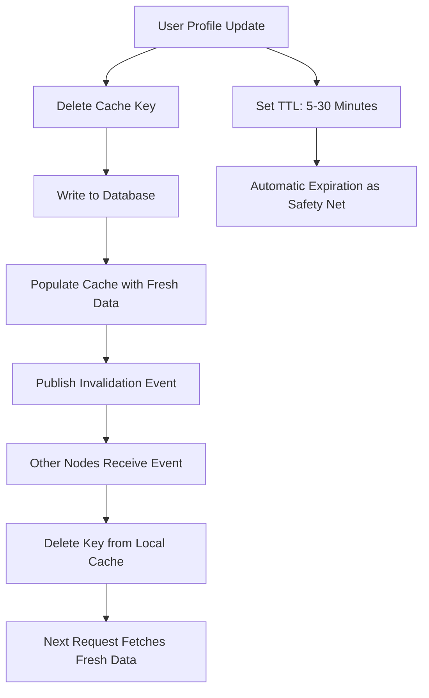
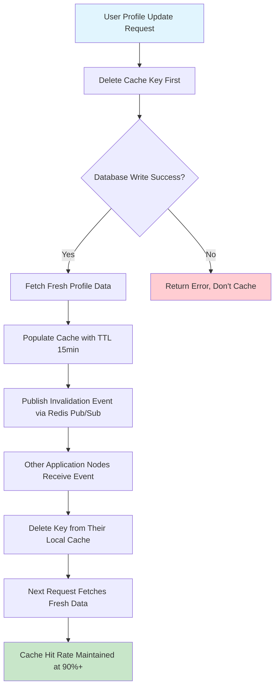

| Difficulty | Channel | Tags |
|---|---|---|
| beginner | backend | redis, memcached, cache-invalidation |

At 3am on a quiet Tuesday, Netflix engineers noticed something terrifying: users in Tokyo were seeing recommendations for users in São Paulo. The cause? A cache invalidation bug in their globally distributed system that was silently serving stale data across 130+ countries [1]. This wasn't just a minor glitch—it was a fundamental challenge that every backend engineer faces when building high-performance systems. Cache invalidation, famously called one of the two hardest things in computer science, becomes exponentially more complex when you're serving 400 million operations per second across multiple regions. The question isn't whether you'll face this problem, but when.

---

> ### Real-World Case — Netflix
>
> Netflix needed to build a globally distributed caching system (EVCache) to serve personalized recommendations, viewing history, and ratings across 130+ countries with sub-second latency. The core challenge was cache invalidation: when a user's profile or viewing data updates in one region, how do you propagate that change to all other regions without blocking local read/write performance?
>
> | | |
> |---|---|
> | **Challenge** | With 22,000 cache server instances managing 14 petabytes across four regions, Netflix needed to replicate cache mutations globally while keeping local cache operations fast and decoupled from replication latency. A key question: should they replicate full data on every update, or just invalidate the key? |
> | **Solution** | Netflix built EVCache, a distributed caching layer based on Memcached, with a Kafka-backed asynchronous replication system. Critically, they chose to replicate only metadata (the key) rather than full data for most cache entries — sending a DELETE to remote regions instead of a SET. When a key is invalidated in a remote region, the next read causes a cache miss and the application handles it like a normal miss, pulling fresh data on-demand. This avoided the cost and latency of constantly shipping full data payloads across regions. The replication pipeline uses Kafka topics per cache cluster, with per-region Replication Relay and Replication Proxy services that are fully decoupled from application read/write paths. |
> | **Outcome** | EVCache handles 400 million operations per second globally with 30 million cross-region replication events, managing ~2 trillion items. By replicating only invalidation signals rather than full data, Netflix reduced network bandwidth significantly. The system maintained local cache performance unaffected by replication delays, and the eventual consistency model was acceptable since slightly different recommendations across regions didn't impact user experience. The approach enabled Netflix to scale from a single region to 130+ countries without cache architecture changes. |
> | **Lesson** | For distributed caching, full data replication isn't always necessary — invalidation-only replication (sending DELETEs instead of SETs) is cheaper and sufficient when cache misses are tolerable and the data can be cheaply recomputed or fetched on-demand. This is a counterintuitive trade-off: accepting more cache misses in remote regions can be far better than the cost and complexity of keeping every region's cache perfectly synchronized. |

---

## Hook — The 3am Page That Changed Everything

Picture this: your production alert fires. Cache hit rates have dropped 40% in the last 10 minutes. Users are complaining about seeing outdated profile information. Your database CPU is spiking because every request is now a cache miss, hammering your primary database. Sound familiar? Every backend developer eventually faces this nightmare scenario. The root cause? A cache invalidation strategy that couldn't keep up with your application's write patterns. This isn't hypothetical—it's the daily reality for teams managing user profile services, recommendation engines, and any system where data freshness matters.

## Problem — Why Cache Invalidation Is Your System's Achilles' Heel

When you implement caching to improve read performance, you've signed an unspoken contract with the universe: your cache will eventually become stale. The core problem is deceptively simple—when a user updates their profile, how do you ensure every cache node across your distributed system reflects that change immediately? If you're too aggressive with invalidation, you destroy your performance gains. If you're too lazy, users see corrupted or outdated data. The tension between consistency and performance creates a nightmare scenario where every solution feels like a compromise. Most developers discover this the hard way, usually at 2am when production alerts are screaming.

## Real-World Case — Netflix's Global Caching Challenge

Netflix faced this exact problem at planetary scale. When they built EVCache, their globally distributed caching system, they needed to serve personalized recommendations, viewing history, and ratings across 130+ countries with sub-second latency [1]. The core challenge was cache invalidation: when a user's profile or viewing data updates in one region, how do you propagate that change to all other regions without blocking local read/write performance? Their solution was elegant: EVCache handles 400 million operations per second globally with 30 million cross-region replication events, managing approximately 2 trillion items. But here's the key insight—by replicating only invalidation signals rather than full data, Netflix reduced network bandwidth significantly. The system maintained local cache performance unaffected by replication delays, and the eventual consistency model was acceptable since slightly different recommendations across regions didn't impact user experience [1]. This approach enabled Netflix to scale from a single region to 130+ countries without cache architecture changes.

## Deep Dive — Write-Through vs Cache-Aside and the Redis vs Memcached Decision

Building on Netflix's lessons, you need to understand the fundamental patterns for cache invalidation. The write-through pattern ensures cache consistency by writing data to both the database and cache simultaneously. On profile update, you invalidate the cache by deleting the key and writing new data to both stores. This guarantees consistency but adds write latency since you're updating two systems. The cache-aside pattern, conversely, puts you in control: reads check cache first, and on miss, fetch from database and populate cache. Writes only update the database, and you delete the cache key to force a refresh on next read. Many developers prefer cache-aside for read-heavy workloads like profile services because it avoids the write amplification problem.

Now, the Redis vs Memcached decision. Redis offers pub/sub for automatic distributed invalidation—when one node invalidates a key, all subscribers know about it [2]. It also provides persistence, advanced data structures like sorted sets and hashes, and Lua scripting for atomic operations. Memcached takes a different philosophy: simpler architecture, faster for pure caching, no persistence overhead [3]. Redis is better for complex invalidation patterns and durability requirements. Memcached offers lower memory overhead and simpler horizontal scaling. The trade-off isn't about raw performance—both handle millions of operations per second. It's about your specific needs: do you need distributed pub/sub, data persistence, or complex data structures? If yes, Redis. If you just want a bulletproof in-memory cache with minimal operational complexity, Memcached might be your answer.

## Workflow — Implementing Distributed Cache Invalidation

Here's the step-by-step workflow for implementing cache invalidation in a user profile service. First, you establish a write-through pattern with TTL-based expiration. Set appropriate TTLs for profiles—typically 5-30 minutes depending on how fresh data needs to be [4]. On profile update, you delete the cache key first (to prevent serving stale data during the write), then write to the database, then populate the cache with fresh data.

For distributed systems, you need cache invalidation coordination. With Redis, leverage pub/sub channels: when you invalidate a key, publish an invalidation event to a dedicated channel. Other Redis nodes subscribe to this channel and remove the key from their local cache. With Memcached, you rely on TTL expiration or implement manual coordination through a message queue.

Monitor your cache hit rates obsessively. A healthy cache maintains 90%+ hit rates for frequently accessed data. If hit rates drop, investigate your TTL settings, invalidation patterns, and access patterns. Use Redis's INFO command or Memcached's stats to track performance metrics in real-time [5].



## Code Example — Python Implementation with Redis Pub/Sub

Here's a production-ready Python implementation showing write-through caching with Redis pub/sub for distributed invalidation:

```python
import redis
import json
import hashlib
from datetime import datetime, timedelta

# Redis connection with connection pooling for performance
redis_pool = redis.ConnectionPool(host='localhost', port=6379, db=0, max_connections=20)
cache = redis.Redis(connection_pool=redis_pool)

# Pub/Sub for distributed invalidation
pubsub = cache.pubsub()
INVALIDATION_CHANNEL = 'profile:invalidations'

def get_cache_key(user_id: str) -> str:
    """Generate consistent cache key for user profiles"""
    return f"profile:{user_id}"

def get_profile(user_id: str) -> dict:
    """Cache-aside read pattern: check cache first, fallback to database"""
    cache_key = get_cache_key(user_id)
    
    # Try cache first (fast path)
    cached_data = cache.get(cache_key)
    if cached_data:
        return json.loads(cached_data)
    
    # Cache miss: fetch from database (slow path)
    profile = fetch_profile_from_database(user_id)
    
    # Populate cache with 15-minute TTL
    cache.setex(
        name=cache_key,
        time=timedelta(minutes=15),
        value=json.dumps(profile)
    )
    
    return profile

def update_profile(user_id: str, updates: dict) -> bool:
    """Write-through pattern with distributed invalidation"""
    cache_key = get_cache_key(user_id)
    
    # Step 1: Delete cache key first (prevent stale reads during write)
    cache.delete(cache_key)
    
    # Step 2: Write to database with retry logic
    success = write_profile_to_database(user_id, updates)
    if not success:
        return False
    
    # Step 3: Fetch fresh data and populate cache
    fresh_profile = fetch_profile_from_database(user_id)
    cache.setex(
        name=cache_key,
        time=timedelta(minutes=15),
        value=json.dumps(fresh_profile)
    )
    
    # Step 4: Publish invalidation event to all nodes
    invalidation_event = {
        'user_id': user_id,
        'timestamp': datetime.utcnow().isoformat(),
        'node_id': get_node_identifier()
    }
    cache.publish(INVALIDATION_CHANNEL, json.dumps(invalidation_event))
    
    return True

def subscribe_to_invalidations():
    """Subscribe to invalidation events from other nodes"""
    pubsub.subscribe(**{INVALIDATION_CHANNEL: handle_invalidation})
    
    # Run in background thread
    import threading
    thread = threading.Thread(target=pubsub.run_in_thread, daemon=True)
    thread.start()

def handle_invalidation(message):
    """Process invalidation events from other nodes"""
    if message['type'] == 'message':
        event = json.loads(message['data'])
        cache_key = get_cache_key(event['user_id'])
        
        # Only process if not from this node (avoid self-invalidation)
        if event['node_id'] != get_node_identifier():
            cache.delete(cache_key)
            print(f"Invalidated cache for user {event['user_id']} from node {event['node_id']}")

def get_node_identifier() -> str:
    """Unique identifier for this cache node"""
    import socket
    return f"{socket.gethostname()}-{socket.getpid()}"

# Helper functions (implement these based on your database)
def fetch_profile_from_database(user_id: str) -> dict:
    """Fetch user profile from your database"""
    # Implementation depends on your database (PostgreSQL, MongoDB, etc.)
    pass

def write_profile_to_database(user_id: str, updates: dict) -> bool:
    """Write profile updates to your database"""
    # Implementation depends on your database
    pass

# Initialize invalidation listener on app startup
subscribe_to_invalidations()
```

This implementation demonstrates several key patterns: cache-aside for reads (checking cache before database), write-through for writes (deleting cache, updating database, repopulating cache), and Redis pub/sub for distributed coordination across multiple application servers. The TTL acts as a safety net—even if invalidation fails, stale data expires automatically. The node identifier prevents self-invalidation loops.

## Lessons Learned — What Netflix's Struggle Teaches You

After seeing Netflix solve this at scale and debugging countless cache invalidation issues in production, here are the critical lessons:

**Battle Scars to Avoid:**
- Never set TTLs too short (under 1 minute) unless absolutely necessary—you'll destroy your cache hit rates
- Don't forget to delete cache keys before database writes; stale reads during write windows cause confusing bugs
- Avoid cache stampedes by implementing random jitter on TTLs—if all keys expire simultaneously, you'll hammer your database
- Monitor cache hit rates religiously; a drop from 95% to 80% means your invalidation strategy needs tuning

**The Real Trade-offs:**
- Redis pub/sub adds complexity but solves distributed invalidation elegantly
- Memcached simplicity wins for single-region deployments with straightforward invalidation needs
- TTL-based expiration is your safety net, not your primary invalidation strategy
- Eventual consistency is acceptable for most user profile scenarios; strong consistency is overkill

**Actionable Next Steps:**
1. Audit your current cache TTLs—are they aligned with your data freshness requirements?
2. Implement cache-aside for reads and write-through for writes if you haven't already
3. Set up cache hit rate monitoring and alerting (aim for 90%+ for hot data)
4. Test your invalidation strategy under load; simulate cache misses to ensure your database can handle the traffic
5. Consider Redis if you need distributed pub/sub; Memcached if you want operational simplicity

The insight from Netflix's EVCache applies everywhere: replicate invalidation signals, not full data [1]. Your system might not span 130 countries, but the principle of minimizing replication overhead while maintaining consistency remains the same.

---

## Distributed Cache Invalidation Workflow



<details>
<summary><strong>Original Interview Question</strong></summary>

**Q:** You're building a user profile service that caches frequently accessed profiles. How would you implement cache invalidation when a user updates their profile, and what trade-offs would you consider between Redis and Memcached?

**A:** Implement write-through caching with TTL-based expiration. On profile update, invalidate the cache by deleting the key and writing new data to both the database and cache. Redis offers pub/sub for automatic distributed invalidation, while Memcached requires manual coordination across nodes.

</details>

## Conclusion

Cache invalidation isn't just a theoretical problem—it's the silent killer of production systems. Netflix's EVCache proved that even at 400 million operations per second, you can solve this elegantly by replicating invalidation signals rather than full data [1]. The patterns you learned here—write-through with TTL safety nets, Redis pub/sub for distributed coordination, and cache-aside for read performance—scale from your local profile service to planetary infrastructure. Tomorrow, audit your cache TTLs, set up hit rate monitoring, and test your invalidation strategy under load. The 3am page you prevent will be worth it.

---

## References

1. [Netflix EVCache: Global Caching Architecture](https://netflixtechblog.com/caching-for-global-netflix-cacheseverywhere-57e00f2a4a78) — blog
2. [Redis Documentation - Pub/Sub](https://redis.io/docs/latest/develop/interact/pubsub/) — documentation
3. [Memcached - Wikipedia](https://en.wikipedia.org/wiki/Memcached) — documentation
4. [AWS ElastiCache for Redis - Best Practices](https://docs.aws.amazon.com/AmazonElastiCache/latest/red-ug/BestPractices.html) — documentation
5. [Redis INFO Command Documentation](https://redis.io/docs/latest/commands/info/) — documentation
6. [Cache Invalidation - Wikipedia](https://en.wikipedia.org/wiki/Cache_invalidation) — documentation
7. [Redis GitHub Repository](https://github.com/redis/redis) — documentation
8. [MDN Web Docs - HTTP Caching](https://developer.mozilla.org/en-US/docs/Web/HTTP/Caching) — documentation

---

**Author:** Satishkumar Dhule — [GitHub](https://github.com/satishkumar-dhule) · [LinkedIn](https://linkedin.com/in/satishkumar-dhule) · [Website](https://satishkumar-dhule.github.io)
