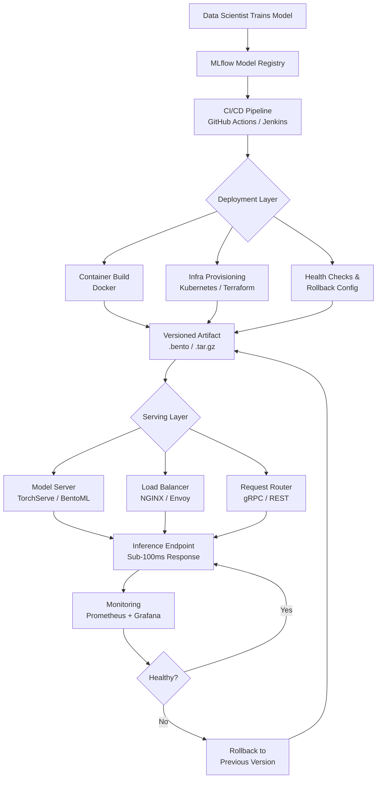

| Difficulty | Channel | Tags |
|---|---|---|
| beginner | devops | mlops, deployment |

Your ML pipeline ships a model to production. Your dashboard says "deployed." So why are users complaining about sluggish recommendations at 2am? Because deployment and serving are not the same thing — and conflating them is one of the costliest mistakes in ML engineering. Netflix learned this the hard way when their centralized routing proxy, Switchboard, became a single point of failure that added 10-20ms of latency to every single request across 250M+ users [1]. The fix wasn't a faster model. It was recognizing that the architecture serving your model is a fundamentally different beast from the one that deployed it.

---

> ### Real-World Case — Netflix
>
> Netflix's ML platform serves hundreds of model types across 250M+ users at 1M+ requests per second. They built Switchboard — a centralized ML routing proxy — to decouple client microservices from model infrastructure. But at scale, Switchboard became a single point of failure adding 10-20ms latency to every request, and its monolithic design meant one tenant's bursty traffic could cascade failures to all ML-powered experiences. They evolved to the Lightbulb architecture to solve these problems.
>
> | | |
> |---|---|
> | **Challenge** | Distinguishing deployment (CI/CD, infrastructure provisioning, monitoring) from serving (real-time inference routing, A/B testing, model selection) at scale — and solving the serving-layer routing bottleneck without losing deployment safety guarantees like canary rollouts and instant rollback. |
> | **Solution** | Netflix built Switchboard as a custom gRPC proxy handling context-aware routing with Experimentation Platform integration, shadow mode testing, and instant rollback — solving deployment lifecycle management within the serving layer. When it hit scaling limits (single point of failure, added latency, poor tenant isolation), they split responsibilities: Lightbulb handles model selection logic (determining which model version to use) while Envoy handles actual request routing (mapping routingKeys to cluster VIPs). This separated deployment config (Switchboard Rules as JavaScript configs with independent release cycles) from serving infrastructure (Envoy-based routing), eliminating the serialization-deserialization overhead that added 10-20ms per request. |
> | **Outcome** | The centralized platform serves hundreds of model types and versions at 1M+ RPS across 30+ client services. The evolution from Switchboard to Lightbulb eliminated the single point of failure, removed 10-20ms of added latency per request, and enabled per-tenant isolation — all while preserving canary deployments, shadow testing, and instant rollback capabilities. |
> | **Lesson** | Model deployment (the CI/CD pipeline, config management, rollback mechanisms) and model serving (the runtime routing and inference) are deeply intertwined but must be architecturally separable. Netflix's key insight was that routing decisions (which model version? which shard?) should be resolved as lightweight metadata — not as a full proxy hop — and pushed to the existing service mesh (Envoy). This let them keep deployment safety features (A/B splitting, canaries, rollback) without the latency and reliability cost of a monolithic serving proxy in the critical path. |

---

## The Deploy-and-Pray Trap

Here is a pattern you have probably seen: a data scientist trains a model, hands it to an engineer, and someone wraps it in a FastAPI endpoint and calls it "deployed." Weeks later, latency spikes, rollback is a nightmare, and nobody can answer basic questions like "which version is serving traffic right now?" The root cause is that teams treat deployment as a single event — upload the model, call it done. But in reality, deployment is the orchestration layer (CI/CD, infrastructure, monitoring, rollback), while serving is the runtime engine (inference APIs, request routing, model loading, response optimization). Conflating the two means you get neither right. You ship fast but serve poorly, or you serve well but can't iterate. The teams that win at scale are the ones that treat these as two distinct disciplines that share a boundary.

## Real-World Case — Netflix: When Serving Ate Deployment Alive

Netflix's ML platform handles hundreds of model types across 250M+ subscribers, processing over 1 million requests per second [1]. To manage this, they built Switchboard — a centralized ML routing proxy that decoupled client microservices from the underlying model infrastructure. On paper, it was elegant. In practice, it became a catastrophic single point of failure. Because every ML-powered request flowed through Switchboard, one tenant's bursty traffic could cascade failures into every other ML experience on the platform. Worse, the monolithic design injected 10-20ms of added latency on every single request — an eternity when you're trying to serve sub-100ms recommendations [1].

The real kicker? Switchboard's design made it nearly impossible to isolate tenants or perform graceful degradation. A spike in one service's demand meant every service paid the tax. Netflix's evolution to the Lightbulb architecture solved this by distributing routing intelligence closer to consumers, enabling per-tenant isolation, canary deployments, shadow testing, and instant rollback — all without the centralized bottleneck [1]. The lesson wasn't just technical; it was architectural. Serving infrastructure needs to be designed with the same rigor as the models themselves.

## Deep Dive — Deployment vs. Serving: The Technical Anatomy

Let's break down exactly where these two worlds diverge. Deployment is everything that happens before a request hits your model. It includes your CI/CD pipeline (GitHub Actions, Jenkins), infrastructure provisioning (Kubernetes, Docker, Terraform), experiment tracking (MLflow, Weights & Biases), and monitoring (Prometheus, Grafana) [2]. Think of deployment as the factory floor — it builds the product and gets it onto the shelf.

Serving, by contrast, is everything that happens when a real user sends a real request. It encompasses inference frameworks (TensorFlow Serving, TorchServe, BentoML), request routing (NGINX, Envoy, gRPC), model versioning at runtime, and autoscaling policies [3]. Serving is the storefront — it handles the customer the moment they walk in.

Here is where it gets nuanced. Deployment concerns include:
- Artifact versioning and registry management
- Infrastructure-as-code for reproducibility
- Canary and blue-green deployment strategies
- Rollback automation and health checks
- Monitoring for drift and performance degradation

Serving concerns include:
- Request routing and load balancing
- Model hot-swapping without downtime
- Batching vs. real-time inference trade-offs
- GPU memory management and kernel optimization
- Latency budgets per inference call

The trade-offs are real and consequential. Batch inference might give you 10x throughput but adds minutes of latency. Real-time serving gets you sub-100ms responses but requires expensive GPU autoscaling. Many developers discover too late that they optimized for the wrong axis [4].

## Workflow — From Model Training to Production Serving

The journey from a trained model to a production serving endpoint follows a predictable pipeline, but the devil is in the details at each stage. Here's the architecture that most mature ML platforms converge on:

The flow starts with experiment tracking and model registry (MLflow), feeds into a CI/CD pipeline that validates the model artifact, provisions infrastructure via container orchestration (Kubernetes + Docker), deploys to a serving framework (TorchServe or TensorFlow Serving), and routes traffic through a load balancer (NGINX or Envoy) — all while monitoring collects latency, throughput, and error metrics in real time [2][3][5].

This diagram captures the full lifecycle — pay attention to where deployment ends and serving begins, because that boundary is where most failures hide:

## Code Example — Building a Production Model Server with BentoML

Enough theory. Here's what a production-ready model serving setup actually looks like using BentoML, which abstracts away much of the complexity while still giving you control over the deployment/serving boundary:

The code below defines a model artifact, wraps it in a service with explicit batching and latency controls, and generates a deployment artifact that separates the deployment concern (packaging, versioning) from the serving concern (request handling, inference optimization) [6].

Key design decisions in this example:
- The `@bentoml.service` decorator explicitly separates serving logic from deployment packaging
- `runnable` configuration enables GPU-specific optimization separate from CPU routing
- The `adaptive_batching` config controls the throughput vs. latency trade-off at serving time
- The `.bento` artifact is deployment output; the HTTP endpoint is serving behavior

This separation means you can version and roll back the deployment artifact independently of the serving configuration — exactly the decoupling Netflix needed when they evolved past Switchboard [1].

## Lessons Learned — What the Battle Scars Teach You

After watching teams struggle with this distinction across dozens of production ML systems, here are the patterns that separate the mature from the fragile:

**Treat deployment and serving as separate services with a clear API contract.** Deployment produces versioned artifacts; serving consumes them. When you couple them, you lose the ability to roll back one without affecting the other.

**Latency budgets must be defined before you write code.** If your recommendation API needs sub-100ms responses, that constraint must drive every architectural decision — from model size to batching policy to hardware selection [4]. Netflix's 10-20ms penalty from Switchboard wasn't a bug; it was an architectural debt that compounded at scale [1].

**Monitor both layers independently.** Deployment health (pipeline success rate, infrastructure drift, artifact integrity) and serving health (p50/p99 latency, error rates, throughput) are different signal sets. Conflating them means you can't diagnose whether a problem is "the pipeline broke" or "the model is slow" [7].

**Start with horizontal scaling, optimize for vertical only when data demands it.** Kubernetes pod replicas give you cheap, fast scaling for CPU-bound serving. GPU-bound workloads need vertical scaling (more memory per instance) and careful kernel optimization — but that's an optimization, not a starting point [5].

**Plan for canary and shadow deployment from day one.** You will need to test new model versions against production traffic without exposing users to risk. If your serving layer can't split traffic or shadow-test, you'll end up doing full-rollout gambles [1][8].

The teams that get this right don't just ship models faster — they ship models that stay fast, stay up, and stay trustworthy when it matters most.

---

## ML Deployment vs. Serving Architecture Lifecycle

<strong>Original Interview Question</strong>

**Q:** Explain the key differences between model serving and model deployment in ML systems, including specific technologies, scaling considerations, and real-world implementation patterns?

**A:** Deployment encompasses CI/CD pipelines, infrastructure setup, and monitoring using tools like Kubernetes, MLflow, and SageMaker. Serving focuses on runtime inference APIs with frameworks like TensorFlow Serving, TorchServe, or BentoML, handling request routing, model versioning, and autoscaling. Key trade-offs include latency vs throughput, batch vs real-time inference, and cold start optimization.

## Conclusion

The Netflix story isn't just about one company's routing proxy — it's a cautionary tale about what happens when deployment and serving become entangled. The teams that build production ML systems with the same architectural rigor they apply to their models are the ones whose systems survive contact with real traffic. Start by drawing a clear line: deployment produces versioned artifacts, serving consumes them under strict latency budgets. Monitor both layers independently. Plan for canary and shadow testing from day one. And if your serving layer ever becomes a single point of failure, you already know what happens next. The question isn't whether you'll face the Netflix problem — it's whether your architecture will be ready when you do.

---

## References

1. [Netflix State of Routing in Model Serving](https://netflixtechblog.com/state-of-routing-in-model-serving-16e22fe18741) — blog
2. [MLflow Documentation — Model Registry](https://mlflow.org/docs/latest/mlflow-model-registry.html) — documentation
3. [TorchServe Documentation](https://pytorch.org/serve/) — documentation
4. [Google MLOps: Continuous Delivery and Automation Pipelines in Machine Learning](https://cloud.google.com/architecture/mlops-continuous-delivery-and-automation-pipelines-in-machine-learning) — documentation
5. [Kubernetes Documentation — Horizontal Pod Autoscaler](https://kubernetes.io/docs/tasks/run-application/horizontal-pod-autoscale/) — documentation
6. [BentoML Documentation — Quickstart](https://docs.bentoml.com/en/latest/quickstart.html) — documentation
7. [Monitoring ML Models in Production — Google Cloud Architecture Center](https://cloud.google.com/architecture/monitoring-ml-models-in-production) — documentation
8. [TensorFlow Serving Architecture Overview](https://www.tensorflow.org/tfx/guide/serving) — documentation

---

**Author:** Satishkumar Dhule — [GitHub](https://github.com/satishkumar-dhule) · [LinkedIn](https://linkedin.com/in/satishkumar-dhule) · [Website](https://satishkumar-dhule.github.io)
