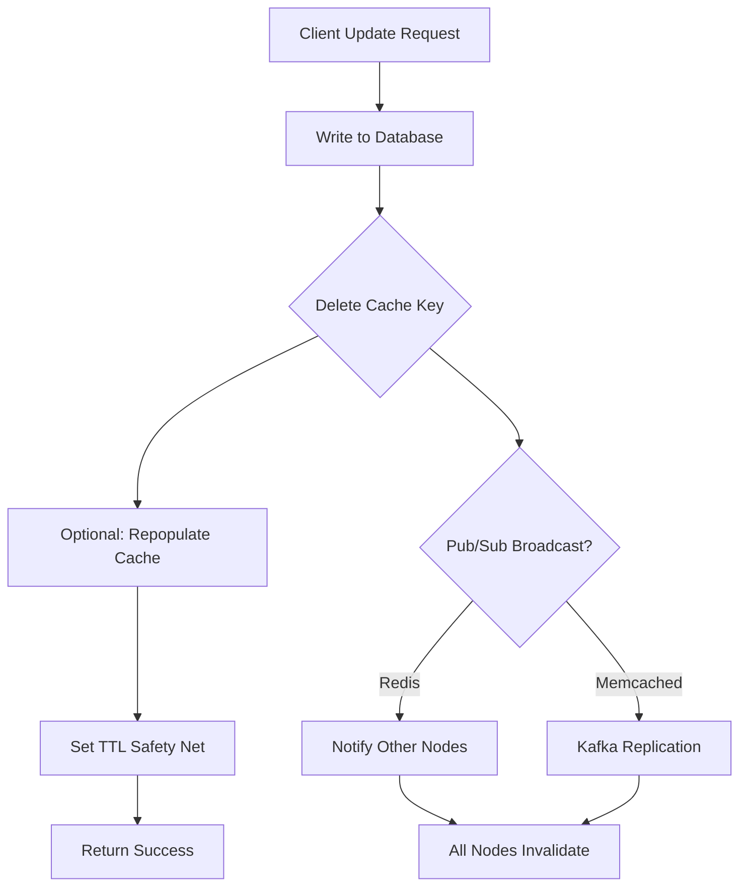
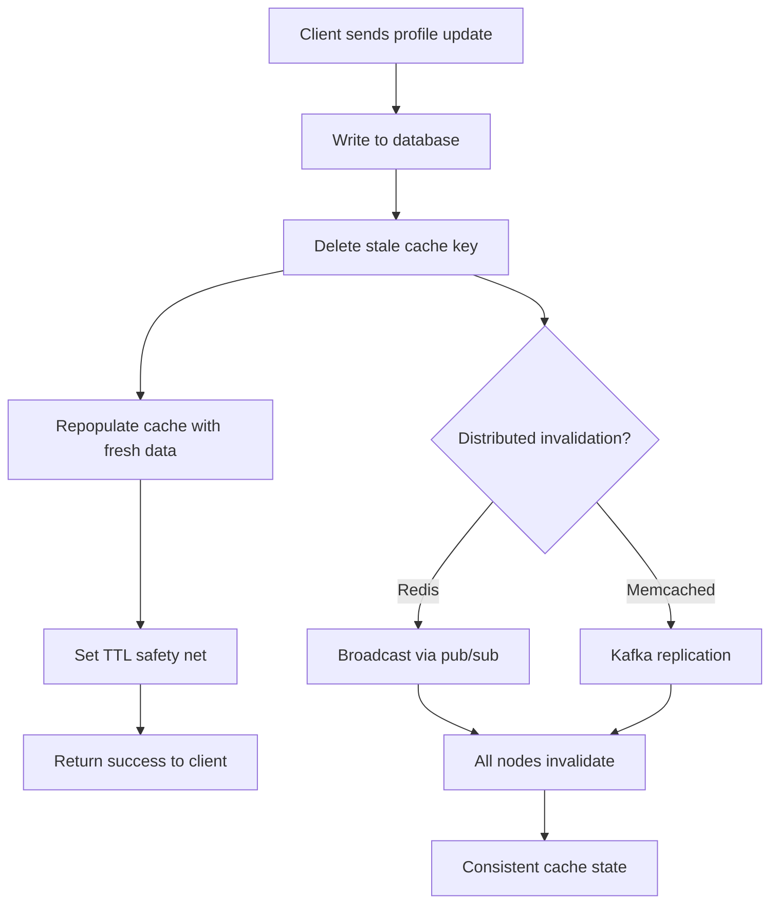

| Difficulty | Channel | Tags |
|---|---|---|
| beginner | backend | redis, memcached, cache-invalidation |

Picture this: it's peak Friday night, millions of users are streaming their favorite shows, and your profile cache just served stale data to a user who updated their preferences ten minutes ago. They see recommendations for horror movies when they explicitly said they hate horror. Sound familiar? Netflix faced this exact challenge at astronomical scale—processing over 30 million requests per second at peak with hundreds of billions of cached objects across tens of thousands of servers [1]. What they built, EVCache, became one of the most sophisticated distributed caching systems in the world, handling roughly 2 trillion requests per day. The secret wasn't just choosing the right cache—it was mastering the art of cache invalidation.

---

> ### Real-World Case — Netflix
>
> Netflix built EVCache (Ephemeral Volatile Cache), a Memcached-based distributed caching layer that handles 30+ million requests per second at peak, storing hundreds of billions of objects across tens of thousands of memcached instances globally. When they expanded to 130+ countries, they needed a global cache invalidation system that could keep user profiles, recommendations, and session data consistent across regions without strong consistency requirements.
>
> | | |
> |---|---|
> | **Challenge** | With users streaming from any region, cached user profile and recommendation data written in one region needed to be available globally. They faced the classic cache invalidation problem at massive scale: how to propagate writes across regions while maintaining low latency and tolerating eventual consistency, all without overwhelming databases during failover or cold-start scenarios. |
> | **Solution** | Netflix implemented a Kafka-based cross-region replication system with three components: a Replication Proxy in each source region that captures metadata (key, TTL) of cache writes and publishes to Kafka, a Replication Relay in each destination region that consumes Kafka messages and writes to local EVCache, and a writer service that applies the changes locally. For profile updates, they use write-through caching with TTL-based expiration and CDC streams. Critically, they sometimes replicate just a DELETE (invalidation) rather than the full data—forcing a local recompute on next read, which is cheaper than constant replication when cross-region read traffic is low. They also built cache warming to handle node replacements, warming new replicas in under 15 minutes. |
> | **Outcome** | EVCache processes ~2 trillion requests per day globally across 4 AWS regions with 22,000 server instances managing 14.3 petabytes of data. The Kafka-based replication handles 1.5 million replication events per second at peak. Zstandard batch compression reduced cross-region network bandwidth by 35%, and switching from NLBs to Eureka DNS-based routing cut network transfer costs by 50%. Local cache reads target sub-millisecond latency while remote EVCache targets 100-microsecond latency. |
> | **Lesson** | You don't always need to replicate the full data—sometimes just replicating the invalidation (DELETE) is cheaper and more efficient, letting the destination region recompute on demand. Also, eventual consistency is perfectly acceptable for non-critical user data like recommendations; strong consistency only matters for the database source of truth. The key insight is treating caches like materialized view engines rather than simple key-value stores. |

---

## Hook — When Stale Data Costs You Millions of Users

Here's the dirty secret of caching: storing data is the easy part. Getting rid of it at exactly the right moment? That's where engineers lose sleep. Every caching system eventually faces the same paradox—cache faster, serve more users, but risk serving outdated information. When a user updates their profile, changes their password, or modifies their subscription, every cached copy of that data becomes a ticking time bomb. Leave stale data lingering for even seconds, and you're looking at corrupted sessions, frustrated users, and trust erosion that no amount of engineering can easily reverse. The question isn't whether you'll face cache invalidation challenges—it's when.

## Problem — The Impossible Choice Between Speed and Freshness

At its core, cache invalidation presents a deceptively simple problem: when the source of truth changes, how do you ensure every cache node knows about it instantly? But here's the tension—every invalidation strategy carries trade-offs between consistency, performance, and complexity. Choose aggressive invalidation, and you hammer your database with requests. Choose lazy expiration, and users see stale data. Choose eventual consistency, and you pray nothing critical slips through the cracks. Many developers discover the hard way that a naive "just delete the cache key" approach crumbles under real load. Distributed systems amplify every weakness: what works beautifully on one server becomes a coordination nightmare across dozens. The real challenge isn't choosing between fast and fresh—it's building a system that's both.

## Real-World Case — Netflix's Global Cache at 2 Trillion Requests Per Day

Netflix confronted this problem at a scale few companies ever reach. As they expanded to 130+ countries, their caching infrastructure needed to keep user profiles, viewing history, and recommendation data consistent across four AWS regions—without sacrificing the sub-millisecond latency users expected [1]. Their solution, EVCache (Ephemeral Volatile Cache), is built on Memcached but extended with a custom replication layer powered by Kafka. At peak, EVCache processes 1.5 million replication events per second across 22,000 server instances managing 14.3 petabytes of data [1]. The engineering trade-offs were stark: Netflix chose not to enforce strong consistency across regions, accepting eventual consistency in exchange for blazing-fast local reads. They adopted Zstandard batch compression to reduce cross-region network bandwidth by 35%, and replaced traditional network load balancers with Eureka DNS-based routing—cutting network transfer costs by 50% [1]. The lesson? Perfect consistency isn't the goal. Serving 230 million subscribers with near-zero latency while keeping data fresh enough is.

## Deep Dive — Redis vs Memcached: The Real Trade-Offs Nobody Tells You About

Many developers think of Redis and Memcached as interchangeable key-value stores. They're wrong. The differences run deep and directly impact how you handle cache invalidation.

Here is the thing though: the choice between Redis and Memcached isn't about which is "better"—it's about which problem you're solving.

**Redis** brings pub/sub messaging to the table, enabling automatic distributed invalidation without external coordination [2]. When a profile updates on one server, Redis can broadcast that invalidation to every subscribing node in real time [3]. It also supports persistence (RDB snapshots and AOF), meaning your cache survives restarts. For complex invalidation patterns—like invalidating related keys or using sorted sets for time-based expiry—Redis is the clear winner [4].

**Memcached**, on the other hand, embraces simplicity [5]. It's a single-threaded, in-memory cache with lower memory overhead per object. Netflix chose Memcached specifically because it scales horizontally with minimal coordination [1]. For pure read-heavy workloads where cache misses simply mean a database fetch, Memcached's simplicity is a feature, not a limitation. But it requires manual coordination for distributed invalidation—no built-in pub/sub means you need external systems like Kafka to keep nodes in sync [1].

Consider these trade-offs:

| Factor | Redis | Memcached |
|--------|-------|----------|
| Invalidation | Built-in pub/sub | Manual coordination |
| Persistence | RDB + AOF | None |
| Memory efficiency | Higher overhead | Lower overhead |
| Data structures | Rich (lists, sets, hashes) | Simple key-value |
| Latency | ~100μs local | ~100μs local |
| Complexity | Higher | Lower |

Many teams pick Redis for the flexibility, then realize Memcached's simplicity would have been sufficient. Conversely, Netflix proved that Memcached's simplicity scales brilliantly when paired with the right replication layer [1].

## Workflow — Write-Through Caching with Intelligent Invalidation

The write-through caching pattern ensures that both your cache and database stay in sync by updating them together on every write operation [6]. Here's how it works in practice:

1. **Client sends update**: A user changes their profile (email, preferences, avatar).
2. **Write to database**: The update hits your primary database first—source of truth always wins.
3. **Invalidate cache**: Delete the stale cache key immediately. Don't try to update the cache—deletion is safer and simpler [7].
4. **Optionally repopulate**: Write the fresh data to the cache, ensuring the next read gets current data.
5. **Set TTL**: Even with write-through, always set a time-to-live (5-30 minutes for profiles) as a safety net [8].

The critical insight is step 3: delete, don't update. Updating the cache risks race conditions where a concurrent read between database write and cache write serves stale data. Deletion is atomic and unambiguous.



This flow ensures cache consistency across distributed nodes. Redis handles this natively through pub/sub [3], while Memcached requires external orchestration like Netflix's Kafka-based approach [1].

## Code Example — Building a Resilient Cache Invalidation Layer

Here's a practical implementation of write-through caching with invalidation in Python, supporting both Redis and Memcached with a clean abstraction layer:

```python
import json
import time
from typing import Any, Optional
from functools import wraps

# Abstract cache interface supporting both Redis and Memcached
class CacheManager:
    def __init__(self, backend='redis', ttl=300):
        """
        Initialize cache with backend choice.
        backend: 'redis' or 'memcached'
        ttl: Time-to-live in seconds (default 5 minutes)
        """
        self.ttl = ttl
        if backend == 'redis':
            import redis
            self.client = redis.Redis(host='localhost', port=6379, db=0)
            self.pubsub = self.client.pubsub()
            self.is_redis = True
        else:
            import pymemcache
            self.client = pymemcache.Client(('localhost', 11211))
            self.is_redis = False

    def _build_key(self, user_id: str) -> str:
        """Consistent key format for profile cache."""
        return f"user:profile:{user_id}"

    def get_profile(self, user_id: str) -> Optional[dict]:
        """
        Cache-aside read: check cache first, fall back to database.
        Returns None if not cached (triggers DB fetch).
        """
        key = self._build_key(user_id)
        cached = self.client.get(key)
        if cached:
            if isinstance(cached, bytes):
                return json.loads(cached)
            return cached
        return None  # Cache miss — caller should fetch from DB

    def invalidate_profile(self, user_id: str) -> None:
        """
        Delete the cache key on profile update.
        For Redis, broadcasts invalidation via pub/sub.
        """
        key = self._build_key(user_id)
        # Step 1: Delete stale cache entry
        self.client.delete(key)
        # Step 2: Notify other nodes (Redis only)
        if self.is_redis:
            self.client.publish(
                'cache:invalidate',
                json.dumps({'key': key, 'timestamp': time.time()})
            )
        # Step 3: Log for monitoring
        print(f"[CACHE] Invalidated key: {key}")

    def set_profile(self, user_id: str, profile_data: dict) -> None:
        """
        Write-through: update database and cache atomically.
        """
        key = self._build_key(user_id)
        # Write to database first (source of truth)
        self._write_to_database(user_id, profile_data)
        # Then update cache with fresh data
        serialized = json.dumps(profile_data)
        self.client.set(key, serialized, ex=self.ttl)
        # Broadcast invalidation to other nodes
        if self.is_redis:
            self.client.publish(
                'cache:invalidate',
                json.dumps({'key': key, 'timestamp': time.time()})
            )
        print(f"[CACHE] Set key: {key} with TTL: {self.ttl}s")

    def _write_to_database(self, user_id: str, data: dict) -> None:
        """Placeholder for actual database write."""
        # In production: UPDATE users SET profile = data WHERE id = user_id
        print(f"[DB] Updated profile for user: {user_id}")

# Usage example
if __name__ == '__main__':
    cache = CacheManager(backend='redis', ttl=300)

    # Simulate: user updates their profile
    user_id = 'user_12345'
    updated_profile = {
        'name': 'Jane Doe',
        'email': 'jane@example.com',
        'preferences': {'genre': 'sci-fi', 'language': 'en'}
    }
    cache.set_profile(user_id, updated_profile)

    # Next read gets fresh data
    profile = cache.get_profile(user_id)
    print(f"Retrieved profile: {profile}")
```

**Walkthrough:**

- The `CacheManager` class abstracts away backend differences, letting you switch between Redis and Memcached with a single config change [2].
- `get_profile()` implements the cache-aside pattern: check cache first, return `None` on miss so the caller fetches from the database [6].
- `invalidate_profile()` does the critical work—deletes the stale key and, for Redis, broadcasts the invalidation via pub/sub so all subscribing nodes invalidate their copies [3].
- `set_profile()` follows write-through semantics: database first, then cache, then broadcast [7].
- TTL is always set as a safety net—even if invalidation fails, stale data expires automatically [8].

After debugging this pattern many times, here's what works: always log invalidation events for monitoring cache hit rates. A sudden drop in hit rates after a deploy usually means invalidation logic broke.

## Lessons Learned — The Cache Invalidation Playbook

If this feels overwhelming, you are not alone. Even Netflix needed years of iteration to get their cache architecture right [1]. Here are the battle scars worth learning from:

**1. Delete, don't update.** Updating cache entries creates race conditions where concurrent reads serve stale data. Deletion is atomic and forces a clean fetch on the next read [7].

**2. Always set a TTL.** No matter how robust your invalidation logic, a TTL is your safety net. For user profiles, 5-30 minutes is the sweet spot [8]. For session data, shorter TTLs (30 seconds to 2 minutes) prevent security issues.

**3. Monitor cache hit rates religiously.** A hit rate below 80% usually signals invalidation problems or wrong TTL settings. Netflix tracks hit rates across all 22,000 EVCache instances to catch anomalies early [1].

**4. Redis for complex patterns, Memcached for simplicity.** If you need pub/sub invalidation, persistence, or rich data structures, Redis is the choice [4]. If you're caching simple key-value data and scaling horizontally, Memcached's simplicity shines [5].

**5. Plan for distributed invalidation from day one.** Netflix's biggest lesson: global cache invalidation can't be an afterthought. They built Kafka-based replication specifically because Memcached doesn't handle cross-region coordination natively [1].

**6. Compress cross-region traffic.** Netflix reduced bandwidth by 35% using Zstandard compression [1]. If your cache spans data centers, compression isn't optional—it's essential.

**7. Test with production-like load.** Cache behavior under 100 requests per second is nothing like behavior at 30 million [1]. Load test your invalidation paths, not just your read paths.

**8. Use circuit breakers.** When your cache goes down, your database shouldn't have to absorb 100% of traffic instantly. Implement circuit breakers and graceful degradation [3].

The real insight from Netflix's journey? Cache invalidation isn't a problem to solve once—it's a system to monitor, tune, and iterate on continuously. Start simple with write-through caching and TTL-based expiration. As your scale grows, layer in pub/sub invalidation and cross-region replication. The best cache architecture is the one you can debug at 3am.

---

## Write-Through Cache Invalidation Flow



<details>
<summary><strong>Original Interview Question</strong></summary>

**Q:** You're building a user profile service that caches frequently accessed profiles. How would you implement cache invalidation when a user updates their profile, and what trade-offs would you consider between Redis and Memcached?

**A:** Implement write-through caching with TTL-based expiration. On profile update, invalidate the cache by deleting the key and writing new data to both the database and cache. Redis offers pub/sub for automatic distributed invalidation, while Memcached requires manual coordination across nodes.

</details>

## Conclusion

Cache invalidation isn't just a technical problem—it's a business problem. When Netflix processes 2 trillion requests per day, a stale profile doesn't just annoy a user; it undermines the recommendation engine that drives 80% of content consumed on the platform. Start with write-through caching and TTL-based expiration. When your scale demands it, layer in pub/sub invalidation and cross-region replication. Monitor everything. And remember: the best cache is the one you can trust to forget when it should.

---

## References

1. [Netflix Global Cache Architecture with EVCache](https://www.infoq.com/articles/netflix-global-cache/) — blog
2. [Redis Documentation — Pub/Sub](https://redis.io/docs/interact/pubsub/) — documentation
3. [Redis Documentation — Topics Overview](https://redis.io/topics/) — documentation
4. [Redis Documentation — Data Types Overview](https://redis.io/docs/about/redis-at-a-glance/) — documentation
5. [Memcached Official Documentation](https://github.com/memcached/memcached/wiki) — documentation
6. [AWS Caching Strategies Documentation](https://docs.aws.amazon.com/AmazonElastiCache/latest/mem-ug/Strategies.html) — documentation
7. [Martin Fowler — Caching Strategies](https://martinfowler.com/bliki/CacheOtherwise.html) — blog
8. [Redis Documentation — Expiration](https://redis.io/docs/management/expiration/) — documentation

---

**Author:** Satishkumar Dhule — [GitHub](https://github.com/satishkumar-dhule) · [LinkedIn](https://linkedin.com/in/satishkumar-dhule) · [Website](https://satishkumar-dhule.github.io)
