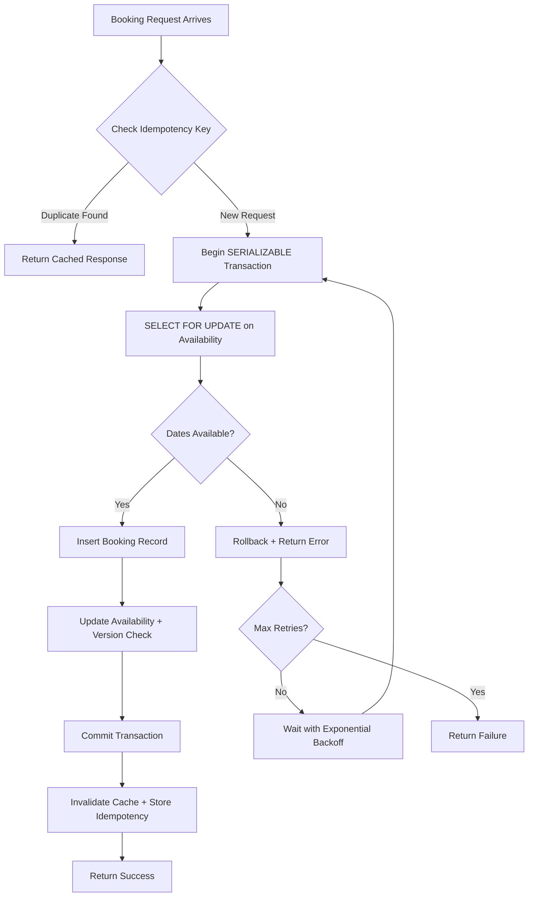

| Difficulty | Channel | Tags |
|---|---|---|
| intermediate | database | acid, isolation-levels, mvcc |

Picture this: it is peak season, and a guest just booked a villa in Bali. They hit "Confirm," the spinner spins, and then—nothing. A timeout. They hit "Book" again. This time it works. But now they have two reservations, and the calendar shows the property as overbooked. Sound familiar? As Airbnb migrated to a Service Oriented Architecture for their payments system, they faced the terrifying reality of double payments—where network retries, flaky mobile connections, and impatient users could trigger duplicate financial transactions across distributed services. The challenge was maintaining data integrity and eventual consistency across microservices where each API call triggered downstream state changes [1]. What Airbnb learned about preventing duplicate operations at scale holds the blueprint for any developer building booking, reservation, or inventory systems.

---

> ### Real-World Case — Airbnb
>
> As Airbnb migrated to a Service Oriented Architecture for its payments system, they faced the critical problem of double payments — where network retries, flaky mobile connections, or users clicking 'Book' multiple times could trigger duplicate financial transactions across distributed services. The challenge was maintaining data integrity and eventual consistency across microservices where each API call triggered downstream state changes.
>
> | | |
> |---|---|
> | **Challenge** | In a distributed SOA, network calls are inherently unreliable. A client may successfully trigger a payment but never receive the response due to a timeout. Retrying the same payment could result in a double charge. Conversely, failing to retry could leave payments in an inconsistent state. The system needed exactly-once semantics across a distributed architecture where true exactly-once delivery is theoretically impossible. |
> | **Solution** | Airbnb built 'Orpheus', a generic idempotency framework implemented as a reusable Java library. Every API request is split into three phases — Pre-RPC (database writes only), RPC (network call to payment processor), and Post-RPC (database writes only) — with no mixing of network calls and database transactions. Each request acquires a database row-level lock on its idempotency key (a lease), and all reads/writes hit the sharded master database exclusively — never replicas — to avoid replica-lag-induced double payments. Exceptions are classified as 'retryable' vs 'non-retryable' to guide client retry behavior. |
> | **Outcome** | Achieved five nines (99.999%) consistency for payments, even as annual payment volume doubled. The framework was adopted across all payments services as a standard library, preventing double payments at scale across billions in transactions. |
> | **Lesson** | The key insight is separating network communication from database transactions — mixing them causes connection pool exhaustion and inconsistent states. Reading idempotency data from master-only (not replicas) prevents a subtle but catastrophic race condition where replica lag allows duplicate payment execution. Pushing idempotency into a reusable library ensures every service inherits correctness guarantees without each team rebuilding the pattern. |

---

## Hook — The 3am Phone Call Nobody Wants

It was 3am when the on-call engineer's pager screamed to life. Two guests had confirmed the same property on the same dates. The Airbnb support inbox was flooded with complaints from hosts discovering their calendars showed impossible overlaps. The root cause? A classic race condition: two users clicked "Book" within milliseconds of each other, and the system happily accepted both. The booking API read the availability table, saw the dates were open, and inserted two reservations—because neither transaction could see the other's write until it was too late. This is not a hypothetical scenario. It is the exact problem that haunted Airbnb as they scaled from a monolithic Rails application to a distributed microservices architecture [1]. Every network partition, every retry, every dropped connection became a potential doorway to data corruption. The stakes were not just engineering pride—they were real money, real trust, and real guests standing in front of locked doors.

## Problem — Why Double Bookings Are a Distributed Systems Nightmare

When you are building a booking system, the fundamental challenge is deceptively simple: ensure that when two or more users try to reserve the same resource simultaneously, exactly one of them succeeds. But "simultaneously" in a distributed system is a dangerous word. Consider the anatomy of a race condition in a booking flow. User A queries the availability table and sees March 15-20 is open. User B does the same. User A inserts a reservation. User B inserts a reservation. Now you have two bookings for the same property on the same dates—and neither user nor the system noticed the conflict until it was too late [2]. The problem compounds when you factor in network latency, service timeouts, and the reality that mobile users on flaky connections will retry aggressively. Every retry is a gamble: will the second request see the first one's effects, or will it operate on stale data? In PostgreSQL's default READ COMMITTED isolation level, each statement within a transaction sees only committed data at the time the statement begins—meaning a SELECT to check availability and an INSERT to create the booking are not atomic from the perspective of concurrent transactions [3]. This is where the CAP theorem becomes painfully real: you must choose between consistency (rejecting conflicting bookings) and availability (accepting booking requests even under load), and partition tolerance is not optional when you operate across data centers [4].

## Real-World Case — Airbnb's Orpheus Framework

Airbnb's engineering team documented this exact problem in their landmark 2019 blog post on avoiding double payments in a distributed payments system [1]. As they migrated to SOA, an API call to one service could trigger downstream calls to multiple other services—each changing state and potentially having side effects. Network retries, flaky mobile connections, and users clicking "Book" multiple times could all trigger duplicate financial transactions. The impact was staggering: with annual payment volume doubling, even a tiny fraction of duplicate payments meant millions in refunds, customer support costs, and eroded trust. Airbnb's solution was a general-purpose idempotency library called Orpheus—named after the Greek hero who could charm all living things. The framework enforced that every API request carried a unique idempotency key. If a request was retried, the system recognized the duplicate and returned the original response rather than reprocessing the payment. The result? Five nines (99.999%) consistency for payments, even as transaction volume scaled to billions [1]. The framework was adopted across all payments services as a standard library, preventing double payments at massive scale. This was not a band-aid fix—it was a fundamental architectural decision that treated idempotency as a first-class concern, not an afterthought.

## Deep Dive — SERIALIZABLE Isolation, MVCC, and Optimistic Locking

Understanding how to prevent double bookings requires diving into three interconnected database concepts that work together like a well-rehearsed orchestra. First, MVCC (Multi-Version Concurrency Control) is PostgreSQL's engine for concurrent access. Instead of locking rows for readers, MVCC preserves multiple versions of each row. Every row in PostgreSQL carries two hidden system columns: xmin (the transaction ID that created this version) and xmax (the transaction ID that deleted or updated it). When a transaction reads a row, it checks visibility rules based on these transaction IDs [5]. The critical property: readers never block writers, and writers never block readers. This is the single most important property for OLTP workloads. However, MVCC alone does not prevent double bookings—it just ensures each transaction sees a consistent snapshot. Second, SERIALIZABLE isolation is the strictest transaction isolation level PostgreSQL offers. It emulates serial transaction execution—as if transactions had been executed one after another, rather than concurrently [3]. PostgreSQL implements this using Serializable Snapshot Isolation (SSI), which builds on snapshot isolation by monitoring for conditions that could create serialization anomalies. When such a condition is detected, one transaction is rolled back with a serialization failure, and the application must retry. Third, optimistic locking adds an application-level safety net. By including a version column in your table and checking it during updates, you detect conflicts that slipped through isolation boundaries. The pattern is elegant: read the row and its version, do your work, then update only if the version matches what you read. If another transaction modified the row in between, zero rows are affected, and you know to retry [6]. The trade-off is clear: SERIALIZABLE provides the strongest correctness guarantees but increases transaction abort rates under contention. Optimistic locking is lightweight but requires application-level retry logic. For a booking system, the winning combination is often SERIALIZABLE for the critical booking path with optimistic version checks as an additional guard.

## Workflow — The Atomic Booking Pipeline

Here is the step-by-step flow that prevents double bookings in production. The Mermaid diagram below visualizes the entire atomic booking pipeline, from request arrival to commit or rollback: graph TD A[Booking Request Arrives] --> B{Check Idempotency Key} B -->|Duplicate| C[Return Previous Result] B -->|New Request| D[Begin SERIALIZABLE Transaction] D --> E[SELECT FOR UPDATE on Availability] E --> F{Dates Available?} F -->|No| G[Rollback + Return Error] F -->|Yes| H[Insert Booking Record] H --> I[Update Availability Table] I --> J[Commit Transaction] J --> K[Invalidate Cache] K --> L[Return Success] G --> M[Retry with Exponential Backoff?] M -->|Yes| D M -->|Max Retries| N[Return Failure] The flow begins with idempotency key validation—identical to Airbnb's Orpheus pattern [1]. If the key exists, the system returns the cached response without reprocessing. For new requests, the system enters a SERIALIZABLE transaction and acquires a row-level lock using SELECT FOR UPDATE [7]. This lock serializes concurrent booking attempts for the same property and date range. The system then checks availability, inserts the booking, and updates the availability calendar—all within the same atomic transaction. After commit, the cache is invalidated to ensure subsequent reads reflect the new state. If any step fails due to a serialization anomaly, the system retries with exponential backoff—a critical detail, because SERIALIZABLE transactions are designed to abort under contention rather than block [3].

## Code Example — Implementing Atomic Bookings in PostgreSQL

The following Python implementation demonstrates a production-grade booking function that combines SERIALIZABLE isolation, SELECT FOR UPDATE, optimistic version checking, and retry logic with exponential backoff. This is the pattern you would deploy for an Airbnb-like booking system. import psycopg2
import time
import uuid
from psycopg2 import sql
from contextlib import contextmanager

# Connection pool configuration
DB_CONFIG = {
    "host": "localhost",
    "database": "bookings",
    "user": "app_user",
    "password": "secure_password"
}

@contextmanager
def get_connection():
    """Context manager for database connections with auto-commit/rollback."""
    conn = psycopg2.connect(**DB_CONFIG)
    try:
        yield conn
        conn.commit()
    except Exception:
        conn.rollback()
        raise
    finally:
        conn.close()

def check_idempotency(conn, idempotency_key):
    """Check if this booking request was already processed (Airbnb Orpheus pattern)."""
    with conn.cursor() as cur:
        cur.execute(
            "SELECT result FROM idempotency_keys WHERE key = %s",
            (idempotency_key,)
        )
        row = cur.fetchone()
        return row[0] if row else None

def store_idempotency(conn, idempotency_key, result):
    """Store the result for future duplicate detection."""
    with conn.cursor() as cur:
        cur.execute(
            "INSERT INTO idempotency_keys (key, result) VALUES (%s, %s)",
            (idempotency_key, result)
        )

def create_booking(property_id, check_in, check_out, guest_id, max_retries=3):
    """
    Atomic booking with SERIALIZABLE isolation and retry logic.
    Prevents double bookings through row-level locking and version checks.
    """
    idempotency_key = str(uuid.uuid4())
    
    for attempt in range(max_retries):
        with get_connection() as conn:
            # Set SERIALIZABLE isolation for this transaction
            conn.set_isolation_level(
                psycopg2.extensions.ISOLATION_LEVEL_SERIALIZABLE
            )
            
            try:
                # Step 1: Check idempotency (deduplicate retries)
                existing = check_idempotency(conn, idempotency_key)
                if existing:
                    return existing
                
                with conn.cursor() as cur:
                    # Step 2: Lock the availability row for this property
                    # SELECT FOR UPDATE prevents concurrent modifications
                    cur.execute(
                        """
                        SELECT id, version, available_dates
                        FROM property_availability
                        WHERE property_id = %s
                        FOR UPDATE
                        """,
                        (property_id,)
                    )
                    availability = cur.fetchone()
                    
                    if not availability:
                        raise ValueError("Property not found")
                    
                    avail_id, version, available_dates = availability
                    
                    # Step 3: Validate date availability (application logic)
                    if not dates_available(available_dates, check_in, check_out):
                        raise ValueError("Dates not available")
                    
                    # Step 4: Insert booking record
                    booking_id = str(uuid.uuid4())
                    cur.execute(
                        """
                        INSERT INTO bookings (id, property_id, guest_id, check_in, check_out)
                        VALUES (%s, %s, %s, %s, %s)
                        """,
                        (booking_id, property_id, guest_id, check_in, check_out)
                    )
                    
                    # Step 5: Update availability with version check
                    # The WHERE version = %s clause is the optimistic lock
                    cur.execute(
                        """
                        UPDATE property_availability
                        SET available_dates = remove_dates(available_dates, %s, %s),
                            version = version + 1
                        WHERE id = %s AND version = %s
                        """,
                        (check_in, check_out, avail_id, version)
                    )
                    
                    if cur.rowcount == 0:
                        raise ValueError("Concurrent modification detected")
                    
                    # Step 6: Store idempotency key
                    store_idempotency(conn, idempotency_key, booking_id)
                    
                    return booking_id
                    
            except psycopg2.errors.SerializationFailure:
                # SERIALIZABLE detected a conflict - retry with backoff
                conn.rollback()
                if attempt = check_out:
            return True
    return False

# Example usage
try:
    booking_id = create_booking(
        property_id="prop_123",
        check_in="2025-03-15",
        check_out="2025-03-20",
        guest_id="guest_456"
    )
    print(f"Booking confirmed: {booking_id}")
except ValueError as e:
    print(f"Booking failed: {e}")
except psycopg2.errors.SerializationFailure:
    print("System under high contention - please retry")

The implementation walks through each critical step. The idempotency check at the top ensures that if a client retries the same request (common on mobile with flaky connections), the system returns the original result instead of creating a duplicate [1]. The SELECT FOR UPDATE acquires a row-level lock on the property availability row, serializing concurrent booking attempts [7]. The SERIALIZABLE isolation level provides the strongest correctness guarantee, detecting serialization anomalies that lower isolation levels would miss [3]. The version column check in the UPDATE statement acts as an optimistic lock—if another transaction modified the availability between our read and write, we detect it immediately [6]. Finally, the exponential backoff retry loop handles the expected transaction aborts under SERIALIZABLE, with jitter to prevent thundering herd problems when multiple clients retry simultaneously.

---

## Atomic Booking Pipeline with Idempotency and Retry Logic

<strong>Original Interview Question</strong>

**Q:** You're building a booking system for Airbnb where multiple users can reserve the same property simultaneously. How would you design the transaction handling to prevent double bookings while maintaining high availability?

**A:** Use SERIALIZABLE isolation with optimistic concurrency control. Implement row-level locks on property availability tables, use MVCC snapshot reads for checking availability, and apply application-level validation to ensure atomic booking operations.

## Conclusion

The double-booking problem is not really about databases—it is about respecting the laws of distributed systems. Airbnb learned this the hard way when their SOA migration exposed race conditions that monolithic architectures hid behind single-process locks [1]. The solution is a layered defense: SERIALIZABLE isolation catches serialization anomalies at the database level, SELECT FOR UPDATE serializes concurrent access to specific rows, optimistic version checks detect application-level conflicts, and idempotency keys prevent duplicate processing of retried requests. None of these mechanisms alone is sufficient. SERIALIZABLE without retry logic will fail under contention. Optimistic locking without idempotency will process duplicates on network retries. SELECT FOR UPDATE without proper transaction boundaries will release locks too early. The takeaway for tomorrow: audit your booking or reservation system for the three failure modes—race conditions on concurrent reads, duplicate processing on retries, and stale data on cache invalidation. If any of these are unhandled, you are one flaky mobile connection away from a support ticket. Implement the layered defense pattern shown in this article, and you will sleep better during on-call rotations.

---

## References

1. [Avoiding double payments in a distributed payments system](https://medium.com/airbnb-engineering/avoiding-double-payments-in-a-distributed-payments-system-2981f6b070bb) — blog
2. [CAP theorem - Wikipedia](https://en.wikipedia.org/wiki/CAP_theorem) — documentation
3. [Transaction Isolation - PostgreSQL Documentation](https://www.postgresql.org/docs/current/transaction-iso.html) — documentation
4. [Introduction to MVCC - PostgreSQL Documentation](https://www.postgresql.org/docs/current/mvcc-intro.html) — documentation
5. [Multi-Version Concurrency Control - PostgreSQL Wiki](https://wiki.postgresql.org/wiki/Serializable) — documentation
6. [Optimistic locking with version columns - Stack Overflow](https://stackoverflow.com/questions/129329/optimistic-vs-pessimistic-locking) — blog
7. [SELECT FOR UPDATE in PostgreSQL - Stormatics](https://stormatics.tech/blogs/select-for-update-in-postgresql) — blog
8. [High Concurrency Booking System - GitHub](https://github.com/kirany2522/high-concurrency-booking-system) — documentation
9. [PostgreSQL Advisory Locks for Preventing Double-Bookings](https://www.alvinquach.dev/blog/postgresql-advisory-locks-double-booking) — blog
10. [Eventual Consistency - Wikipedia](https://en.wikipedia.org/wiki/Eventual_consistency) — documentation

---

**Author:** Satishkumar Dhule — [GitHub](https://github.com/satishkumar-dhule) · [LinkedIn](https://linkedin.com/in/satishkumar-dhule) · [Website](https://satishkumar-dhule.github.io)
