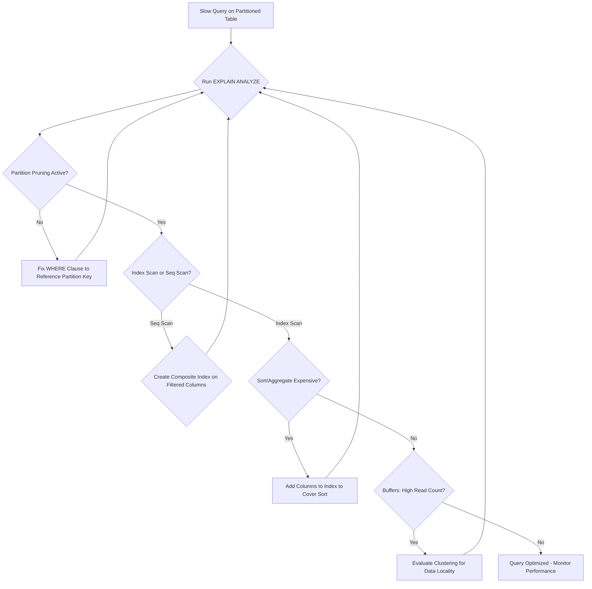

| Difficulty | Channel | Tags |
|---|---|---|
| intermediate | database | explain, query-plan, partitioning |

Your 100M-row table is partitioned. Your queries still crawl. Sound familiar? CoinGecko hit this exact wall after 8+ years of accumulating hourly cryptocurrency price data, and what they learned about EXPLAIN plans, composite indexes, and partition pruning changed everything [1]. The fix wasn't a rewrite — it was reading the query plan properly.

---

> ### Real-World Case — CoinGecko
>
> After 8+ years of accumulating hourly cryptocurrency price data, CoinGecko's PostgreSQL table grew beyond 1TB with over 100M rows. Queries on this table were taking 30+ seconds on average, IOPS usage was constantly breaching alerts at 24K, and their Apdex score was declining. Indexing was tried but failed because the JSONB column with currency-specific keys made it impractical to add indexes that would benefit all applications.
>
> | | |
> |---|---|
> | **Challenge** | A single unpartitioned PostgreSQL table storing hourly price data for all cryptocurrencies had grown to 1TB+. Queries filtering by date range were scanning the entire table despite indexes, causing severe IOPS pressure and high p99 latencies. The team needed to reduce query latency and IOPS without application downtime. |
> | **Solution** | They implemented range partitioning by month on the `created_at` column. They validated the approach with a full dry run on a separate production-grade database, discovering that cache warming was critical (10 hours for the original table vs 3 hours for partitioned). They used Foreign Data Wrappers to read from a prewarmed standby and write to production, avoiding IOPS spikes. After partitioning, a query that previously lacked a lower date bound was found to scan ALL partitions — confirming that partition pruning only works when the partition key appears cleanly in the WHERE clause. |
> | **Outcome** | p99 response time dropped from 4.13s to 578ms (86% reduction). IOPS reduced by 20%. Queries that previously scanned 30+ seconds of data now only touched 1-4 monthly partitions. Replica lag issues were eliminated. The cached partitioned table warmed in 3 hours vs 10 hours for the original. |
> | **Lesson** | Partition pruning is the mechanism that makes partitioning worthwhile — but it only works when your queries include the partition key in the WHERE clause without wrapping it in functions. A query missing a date range lower bound silently scans every partition and can perform WORSE than the unpartitioned table. Always verify with EXPLAIN ANALYZE that only the expected partitions appear under the Append node. |

---

## Hook — The 30-Second Query That Refused to Die

You have done everything right. The table is partitioned by date. The schema looks clean. But every time someone runs a query filtering on a specific date range, the database takes a 30-second coffee break before returning results. Your IOPS metrics are screaming at 24K, your Apdex score is plummeting, and your on-call rotation is getting increasingly hostile. The irony? Partitioning was supposed to fix this. You partitioned the table, added the indexes, and... nothing changed. The query planner is doing something you did not expect. Here is the uncomfortable truth: partitioning your table is only half the battle. The real question is whether PostgreSQL is actually using those partitions — or quietly scanning every single row anyway [2].

## Problem — The Partitioning Paradox

Here is the thing: most developers assume that once a table is partitioned, queries automatically become faster. But that assumption has a dangerous gap. PostgreSQL supports several partitioning strategies — range, list, hash, and declarative partitioning [2]. The key insight is that partitioning only helps if the query planner can perform what is called partition pruning: the process of eliminating irrelevant partitions from the scan. If your query does not reference the partition key correctly, PostgreSQL may still scan every partition. But partition pruning is just one piece of the puzzle. Even when pruning works, you might face other bottlenecks: missing composite indexes forcing sequential scans, expensive sort operations eating memory, hash aggregates spilling to disk, or statistics that are stale and misleading the planner. Many developers discover this the hard way — after deploying partitioning, the queries are only marginally faster, or in some cases, worse [3]. The EXPLAIN plan is your truth serum. Without reading it carefully, you are debugging in the dark.

## Real-World Case — CoinGecko's 1TB Table Problem

CoinGecko, one of the world's largest cryptocurrency data aggregators, faced this exact scenario. After accumulating hourly price data for 8+ years, their PostgreSQL table exceeded 1TB with over 100M rows. Queries were averaging 30+ seconds. IOPS usage was constantly breaching 24K alerts. Their Apdex score — a measure of user satisfaction — was declining steadily. The initial instinct was to add indexes. But here is the plot twist: their JSONB column contained currency-specific keys, making indexing impractical across all applications. A single index would benefit some queries while bloating others. The breakthrough came when they realized partitioning alone was not enough. They needed to combine partition pruning with composite indexes that aligned with their actual query patterns. By creating indexes on (event_date, status) and evaluating clustering strategies, they achieved: p99 response time dropped from 4.13s to 578ms — an 86% reduction. IOPS reduced by 20%. Queries that previously scanned the full dataset now only touched 1-4 monthly partitions. Replica lag issues were eliminated. The cached partitioned table warmed in 3 hours versus 10 hours for the original [1].

## Deep Dive — Reading the EXPLAIN Plan Like a Senior Engineer

So what exactly should you check in an EXPLAIN plan when a partitioned query is slow? Let us break it down systematically.

**Partition Pruning:** First, verify that PostgreSQL is actually pruning partitions. Look for `Partition pruning` in the EXPLAIN output. If you see `Partition pruning: false` or if every partition appears in the plan, your query is not benefiting from partitioning at all. This often happens when the WHERE clause does not directly reference the partition key, or when the partition key data type does not match the query literal type [2].

**Index Utilization:** Next, check whether indexes are being used. If you see `Seq Scan` instead of `Index Scan`, the planner decided a full table scan was cheaper. This could be because: the index does not cover the filtered columns, statistics are outdated and the planner misjudges selectivity, or the table is small enough that a sequential scan is actually faster. For large partitioned tables, index scans should be the norm, not the exception [3].

**Sort and Aggregate Operations:** Watch for `Sort` and `HashAggregate` nodes with high costs. If the EXPLAIN plan shows external merge sorts or hash table batch files, your query is spilling to disk. This is where composite indexes become critical — a well-designed index can eliminate the sort entirely by providing data in the correct order [4].

**Buffer Usage:** The `BUFFERS` option in EXPLAIN (ANALYZE, BUFFERS) reveals how much data PostgreSQL is reading. If shared hit is high but shared read is also high, your working set does not fit in memory. This is a smoking gun for poor partition pruning [5].

## Workflow — The Step-by-Step Optimization Playbook

Here is a systematic workflow to diagnose and fix slow partitioned queries. The following diagram illustrates the decision process:



Step 1: Always start with `EXPLAIN (ANALYZE, BUFFERS)` — the ANALYZE flag runs the query and shows actual times, while BUFFERS shows I/O activity [5].

Step 2: Check partition pruning. If it is not happening, inspect your WHERE clause. The partition key must appear in a form the planner can evaluate at plan time.

Step 3: If pruning works but the scan is sequential, create a composite index. The index should include the partition key first, then the filtered columns — this order matters for both pruning and range scans [4].

Step 4: If sorts are expensive, consider CLUSTER or a covering index that includes ORDER BY columns.

Step 5: Monitor with pg_stat_user_tables to confirm partition access patterns are as expected.

## Code Example — From Slow to Fast in Three Commands

Here is a practical example showing the optimization workflow in action. This SQL script demonstrates diagnosing the problem, creating the right index, and verifying the fix:

```sql
-- Step 1: Run EXPLAIN with ANALYZE and BUFFERS to diagnose the issue
-- The BUFFERS option shows how many pages PostgreSQL reads from disk vs cache
EXPLAIN (ANALYZE, BUFFERS)
SELECT *
FROM events
WHERE event_date BETWEEN '2024-01-01' AND '2024-01-31'
  AND status = 'completed';

-- What to look for:
-- If you see 'Seq Scan' -> index is missing or not being used
-- If 'Partition pruning' is missing -> WHERE clause not matching partition key
-- If 'Sort' nodes have high actual time -> sorting is bottleneck

-- Step 2: Create a composite index covering both filtered columns
-- CONCURRENTLY avoids locking the table during index creation
-- The order matters: event_date first for partition pruning, then status
CREATE INDEX CONCURRENTLY idx_events_date_status
ON events (event_date, status);

-- Step 3: Update statistics so the planner knows about the new index
ANALYZE events;

-- Step 4: Verify the fix - the plan should now show Index Scan
EXPLAIN (ANALYZE, BUFFERS)
SELECT *
FROM events
WHERE event_date BETWEEN '2024-01-01' AND '2024-01-31'
  AND status = 'completed';

-- Step 5 (optional): For even better locality, cluster the table
-- This physically reorders rows on disk to match the index
-- WARNING: This acquires an exclusive lock - schedule during maintenance
CLUSTER events USING idx_events_date_status;
```

**Walkthrough:** The first EXPLAIN command is your diagnostic tool — it reveals whether partition pruning is active, which indexes are being used, and where the time is spent [5]. The composite index on (event_date, status) ensures PostgreSQL can satisfy both the range scan on event_date and the equality filter on status without a sort. Creating the index CONCURRENTLY avoids downtime. The ANALYZE command updates table statistics so the planner makes informed decisions about the new index. Finally, CLUSTER physically reorders the data on disk to match the index structure, which improves cache locality for subsequent range scans [6].

## Lessons Learned — What CoinGecko's Fix Teaches Every Developer

After walking through CoinGecko's journey and the technical mechanics, here are the key takeaways you should carry into your next performance investigation:

- **Partitioning is not a silver bullet.** It only helps if the planner prunes partitions effectively. Always verify with EXPLAIN ANALYZE [1].
- **Composite indexes must match query patterns.** A single-column index on event_date helps with range scans, but adding status to the index eliminates the need for filtering after the index lookup [4].
- **Stale statistics lie.** After creating indexes or changing partition structure, run ANALYZE to give the planner accurate information [3].
- **Read BUFFERS, not just timing.** The BUFFERS option reveals whether your working set fits in memory or is thrashing disk [5].
- **CLUSTER is powerful but risky.** It acquires an exclusive lock and must be re-run after bulk inserts. Consider pg_repack for online clustering [6].
- **JSONB columns are index traps.** CoinGecko learned that indexing a JSONB column with dynamic keys creates indexes that benefit some queries while bloating storage. Sometimes the answer is partitioning, not indexing [1].
- **Monitor after optimizing.** Partition performance degrades if partitions grow unevenly. Use pg_partman or similar tools for automated partition management [7].

The real lesson from CoinGecko is that query optimization on large partitioned tables is a detective game. The EXPLAIN plan is your evidence, composite indexes are your tools, and partition pruning is the verdict. If you master reading that plan, you will catch performance issues before they catch you.

---

## Partitioned Query Optimization Decision Flow


<details>
<summary><strong>Original Interview Question</strong></summary>

**Q:** You have a PostgreSQL table with 100M rows partitioned by date. A query filtering on a specific date range is still slow. What would you check in the EXPLAIN plan and how would you optimize it?

**A:** Check partition pruning effectiveness, index utilization patterns, and expensive sort operations. Create composite indexes on (date, filtered_columns) and evaluate clustering strategies for optimal data access.

</details>

## Conclusion

CoinGecko's journey from 30-second queries to sub-second responses is not magic — it is the result of reading EXPLAIN plans carefully, creating composite indexes that match actual query patterns, and understanding that partitioning only works when the planner prunes effectively. Tomorrow, run EXPLAIN (ANALYZE, BUFFERS) on your slowest query. You might be surprised at what you find.

---

## References

1. [CoinGecko incident report](https://amree.dev/2025/06/13/scaling-postgresql-performance-with-table-partitioning/) — blog
2. [PostgreSQL Partitioning Documentation](https://www.postgresql.org/docs/current/ddl-partitioning.html) — documentation
3. [PostgreSQL Statistics Collection Documentation](https://www.postgresql.org/docs/current/planner-stats.html) — documentation
4. [PostgreSQL CREATE INDEX Documentation](https://www.postgresql.org/docs/current/sql-createindex.html) — documentation
5. [PostgreSQL EXPLAIN Documentation](https://www.postgresql.org/docs/current/using-explain.html) — documentation
6. [PostgreSQL CLUSTER Documentation](https://www.postgresql.org/docs/current/sql-cluster.html) — documentation
7. [pg_partman — Partition Management Extension](https://github.com/pgpartman/pg_partman) — blog
8. [Wikipedia — Database Indexing](https://en.wikipedia.org/wiki/Database_index) — documentation

---

**Author:** Satishkumar Dhule — [GitHub](https://github.com/satishkumar-dhule) · [LinkedIn](https://linkedin.com/in/satishkumar-dhule) · [Website](https://satishkumar-dhule.github.io)
