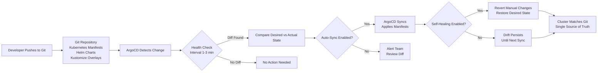

| Difficulty | Channel | Tags |
|---|---|---|
| beginner | devops | argocd, flux, declarative |

Imagine managing 4,000 engineers, 130+ Kubernetes clusters, and 3,000 production applications — and needing to ship changes in minutes, not days. That was the impossible situation Intuit, the company behind TurboTax, QuickBooks, and Mint, found themselves in as they scaled their Kubernetes platform. After acquiring Applatix, the startup behind Argo, they built ArgoCD into a production-grade GitOps engine that slashed their mean time to recovery from 45 minutes to under 5, completely redefining what deployment velocity looks like at enterprise scale [1]. Their secret? A fundamentally different way of thinking about how code reaches production.

---

> ### Real-World Case — Intuit
>
> Intuit (maker of TurboTax, QuickBooks, and Mint) needed to accelerate developer velocity for 4,000 engineers deploying to Kubernetes. They acquired Applatix, the startup behind Argo, and built ArgoCD into a production-grade GitOps platform managing 3,000 applications across 130+ Kubernetes clusters.
>
> | | |
> |---|---|
> | **Challenge** | After lift-and-shift to public cloud, development velocity barely improved—teams still took days or weeks to deploy releases. New developer onboarding took 3 days just to set up local environments. The company needed to containerize and adopt cloud native technologies while maintaining strict financial compliance requirements. |
> | **Solution** | Intuit acquired Applatix in 2018 and used their Argo platform to build a self-service developer platform called 'Modern SaaS'. They implemented ArgoCD for declarative GitOps deployments with automated sync, self-healing, and RBAC. The platform uses GitHub as the single source of truth, with Jenkins for CI and ArgoCD for continuous delivery to 130+ multi-tenant Kubernetes clusters. |
> | **Outcome** | MTTR dropped from 45 minutes to under 5 minutes. Deployment cycles decreased from days to minutes. Service creation went from 3 days to under 10 minutes. In 18 months, they went from zero to 2,000+ services on Kubernetes. ArgoCD became a CNCF graduated project used by thousands of companies worldwide. |
> | **Lesson** | The company that built the tool uses it at the largest scale—proving GitOps with ArgoCD works when you treat Git as the single source of truth. Intuit's VP Pratik Wadher: 'No more manual arcane scripts. Git is a source of truth for your code and deployments, from build to apps in production.' |

---

## Hook — The Deploy That Took 3 Days (And Why It Should Have Taken 10 Minutes)

Picture this: it is Friday at 4pm. A critical security patch needs to ship. Your team has the fix ready, tested, and approved. But now comes the hard part — actually getting it into production. There is the staging environment to update, then the canary rollout, then the full deployment. Each step requires manual commands, coordination across teams, and a prayer that nothing drifts between environments. By the time the patch is live, it is Saturday morning, and your on-call engineer has been staring at kubectl output for eight hours straight. This is the deployment nightmare that almost every organization running Kubernetes eventually hits. And it is exactly the problem Intuit was drowning in before they discovered a radically different approach [1].

## Problem — The Configuration Drift Trap

Here is the uncomfortable truth about running Kubernetes at scale: the imperative approach — manually running kubectl commands to modify your cluster — feels fast at first. You SSH into a box, apply a quick YAML change, and move on. But this shortcut creates a deadly trap. Every manual change that bypasses version control is a ticking time bomb. Nobody knows what the actual state of the cluster is. Nobody can reproduce what was done. And when something breaks at 3am, you are debugging a system that nobody fully understands because the "truth" lives in a dozen different terminal sessions [2]. Configuration drift is not just an inconvenience — it is an existential threat to reliability. When your staging environment silently diverges from production, when a developer applies a hotfix that nobody documents, when the "known good" state of your cluster exists only in someone's memory — you are one kubectl apply away from an outage. Studies show that the majority of production incidents in containerized environments stem from untracked configuration changes [3]. For teams deploying hundreds of microservices across multiple clusters, this is not a theoretical risk. It is a daily reality.

## Real-World Case — Intuit's 18-Month Transformation

Intuit did not just adopt GitOps — they went from zero to 2,000+ services on Kubernetes in 18 months, a transformation that would be impossible with traditional imperative workflows [1]. Before ArgoCD, their deployment cycle took days. Service creation required three days of manual setup. Mean time to recovery sat at 45 minutes — an eternity during an outage affecting millions of TurboTax users during tax season [1]. After building ArgoCD into their platform, the numbers told a staggering story: deployment cycles dropped from days to minutes. Service creation went from 3 days to under 10 minutes. MTTR fell from 45 minutes to under 5. And their ArgoCD instance managed 3,000 applications across 130+ Kubernetes clusters [1]. The impact was not just operational — it was cultural. Developers could now see exactly what was running in production, propose changes through Git, and have those changes automatically reconciled by ArgoCD. No more guessing. No more drift. No more Friday afternoon deploy nightmares. ArgoCD became so battle-tested at Intuit that they donated it to the CNCF, where it graduated as a top-level project used by thousands of companies worldwide [4].

## Deep Dive — Declarative vs Imperative: The Two Worlds of Kubernetes Management

To understand why Intuit's transformation worked, you need to grasp the fundamental tension between two philosophies of infrastructure management. In the imperative world, you tell the system *how* to achieve a state. Run this kubectl command. Delete that pod. Scale this deployment to 5 replicas. It is procedural, step-by-step, and dangerously easy to lose track of [2]. Many developers discover the imperative approach first because it mirrors how they think about writing code: execute commands in sequence, see results immediately. But infrastructure is not code — it is a living system that needs to converge on a desired state, not follow a one-time set of instructions. The declarative approach flips this entirely. Instead of commands, you declare *what* the desired state looks like. You write a YAML file that says "this deployment should have 3 replicas, use this container image, and expose port 8080" [5]. Then you hand that file to a reconciliation engine — like ArgoCD — that continuously compares the actual state of your cluster against the declared state and makes corrections. Think of it like GPS navigation versus paper maps. The imperative approach is GPS: you follow turn-by-turn directions, and if you miss a turn, you are lost. The declarative approach is a map showing your destination: no matter what detours you take, you always know where you are heading. This distinction is not just academic — it has profound implications for reliability, auditability, and team collaboration.

## Workflow — The ArgoCD GitOps Pipeline

So how does this actually work in practice? Here is the step-by-step workflow that teams like Intuit use to keep their clusters in perfect sync [6]:

## Code Example — Your First ArgoCD Application

Let's translate theory into practice. Below is a production-ready ArgoCD Application manifest that points to a Git repository containing your Kubernetes manifests, enables auto-sync, and configures self-healing — the three pillars of a proper GitOps setup [6][7]:

## Lessons Learned — What 3,000 Applications Teach You About GitOps

Intuit's journey from chaos to GitOps mastery, and the patterns of countless teams who have followed, reveal several critical lessons [1][3][8]:

**Start with self-healing, not auto-sync.** Many teams enable auto-sync on day one and immediately regret it. A misconfigured manifest can cascade across your entire fleet before anyone notices. Start by letting ArgoCD show you the diff between desired and actual state. Only enable auto-sync once you trust your manifests and your CI pipeline.

**Treat your Git repository as sacred.** The moment you allow manual kubectl changes that bypass Git, you have broken the single source of truth. ArgoCD's self-healing feature will revert those changes — but the disruption could have been avoided entirely. Make it a team policy: if it is not in Git, it does not exist.

**Use health checks aggressively.** The default 3-minute sync interval is reasonable, but your health check configuration matters more than you think. Set inappropriate readiness probes and ArgoCD will mark healthy applications as degraded, or worse, promote broken code to production [6].

**Beware the "it works in staging" trap.** Declarative systems shine when every environment is defined in code. If your staging cluster has manual tweaks that production does not, you have already lost the plot. Use Kustomize overlays or Helm value files to keep environments consistent [9].

**Invest in observability from day one.** ArgoCD provides sync status and health indicators, but you need deeper visibility. Integrate with Prometheus and Grafana to track sync latency, failed reconciliations, and drift detection metrics [10].

The hidden cost of imperative management is not the outages — it is the slow erosion of confidence. When nobody is sure what is actually running, every deployment becomes a gamble. GitOps, implemented properly with ArgoCD, replaces that uncertainty with auditable, reproducible, self-healing infrastructure [4]. That is not just better DevOps — it is better engineering.

---

## ArgoCD GitOps Sync Workflow

<strong>Original Interview Question</strong>

**Q:** You're setting up GitOps for a microservices deployment. How would you configure ArgoCD to automatically sync changes from your Git repository to Kubernetes, and what's the difference between declarative and imperative approaches in this context?

**A:** I'd configure ArgoCD by setting up a Git repository containing Kubernetes manifests or Helm charts, creating an Application CRD that points to the Git repository, enabling auto-sync with a health check interval of 3 minutes, and implementing self-healing to automatically revert any manual changes. The declarative approach involves defining the desired state in Git through YAML manifests, Helm charts, or Kustomize configurations, where ArgoCD continuously reconciles the actual state with the desired state. In contrast, the imperative approach uses kubectl commands to make direct changes to the cluster, bypassing the Git repository as the single source of truth.

## Conclusion

Intuit's journey from 45-minute recoveries to sub-5-minute MTTR is not a story about better tools — it is a story about better philosophy [1]. The declarative, GitOps-driven approach with ArgoCD replaces tribal knowledge with auditable manifests, manual kubectl roulette with automated reconciliation, and configuration drift with a single source of truth. If your team is still SSH-ing into clusters and running imperative commands, you are carrying technical debt that compounds with every deploy. Start small: pick one service, define its complete state in Git, set up an ArgoCD Application with self-healing enabled, and watch the diff between desired and actual state shrink to zero. That is the moment you stop fighting your infrastructure and start trusting it.

---

## References

1. [Intuit CNCF Case Study](https://www.cncf.io/case-studies/intuit/) — article
2. [Kubernetes Documentation — Declarative Management](https://kubernetes.io/docs/concepts/overview/working-with-objects/object-management/) — documentation
3. [CNCF GitOps Principles](https://opengitops.dev/) — documentation
4. [ArgoCD — GitOps Continuous Delivery for Kubernetes](https://github.com/argoproj/argo-cd) — documentation
5. [Kubernetes Documentation — Managing Resources Declaratively](https://kubernetes.io/docs/concepts/overview/working-with-objects/kubernetes-objects/) — documentation
6. [ArgoCD Application Specification](https://argo-cd.readthedocs.io/en/stable/operator-manual/declarative-setup/) — documentation
7. [Helm — Kubernetes Package Manager](https://helm.sh/docs/) — documentation
8. [Kustomize — Kubernetes Native Configuration Management](https://kustomize.io/) — documentation
9. [DigitalOcean — How To Set Up an ArgoCD Workflow for Kubernetes](https://www.digitalocean.com/community/tutorials/how-to-set-up-an-argo-cd-workflow-for-kubernetes) — blog
10. [Flux CD — GitOps Toolkit for Kubernetes](https://fluxcd.io/) — documentation

---

**Author:** Satishkumar Dhule — [GitHub](https://github.com/satishkumar-dhule) · [LinkedIn](https://linkedin.com/in/satishkumar-dhule) · [Website](https://satishkumar-dhule.github.io)
