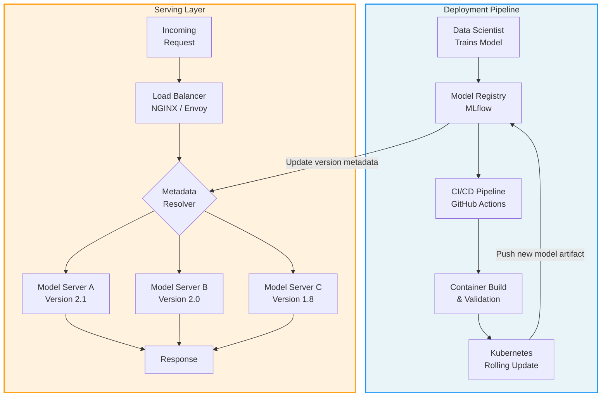

| Difficulty | Channel | Tags |
|---|---|---|
| beginner | devops | mlops, deployment |

At 1 million requests per second, every millisecond counts. Netflix discovered this the hard way when their model serving routing layer, Switchboard, became the bottleneck threatening the experience of 250 million users [1]. What started as an elegant solution to route ML inference across hundreds of model types became a single point of failure buried in every request path. The story of how Netflix evolved from Switchboard to Lightbulb is a masterclass in understanding a distinction that trips up even experienced ML engineers: the difference between model deployment and model serving.

---

> ### Real-World Case — Netflix
>
> Netflix needed to serve hundreds of ML model types and versions to 250 million users at over 1 million requests per second across personalized recommendations, fraud detection, search ranking, and thumbnail selection. Their initial custom routing layer 'Switchboard' solved the problem but introduced critical scaling issues — a single point of failure in the request path, 10-20ms added latency from serialization, and reduced client flexibility.
>
> | | |
> |---|---|
> | **Challenge** | How to route the right request to the right model instance, on the right cluster shard, for the right user and A/B test — while keeping client services completely decoupled from model versioning, sharding, and experimentation complexity. Off-the-shelf API gateways (AWS API Gateway, service mesh proxies) lacked first-class integration with Netflix's experimentation platform, gRPC support, and model-specific lifecycle management (shadow mode, canaries, rollbacks). |
> | **Solution** | Netflix built Switchboard — a centralized routing service that acted as the mandatory entry point for all ML traffic. It provided context-aware routing based on user device, locale, and A/B test allocation, with researchers defining traffic splits via JavaScript configuration rules (Switchboard Rules). When Switchboard became a bottleneck (10-20ms added latency, single point of failure), Netflix evolved to 'Lightbulb' — a decoupled architecture where a lightweight metadata service determines model selection while Envoy proxy handles actual routing via headers. This separated model inputs from request metadata and eliminated the routing service from the critical request path. |
> | **Outcome** | The platform serves hundreds of model types and versions at 1 million requests per second with high availability. The Switchboard-to-Lightbulb evolution eliminated the single point of failure, removed 10-20ms of unnecessary latency from the critical path, and maintained all routing capabilities (A/B testing, canary deployments, instant rollbacks) while enabling independent scaling of routing metadata resolution versus actual request routing. |
> | **Lesson** | The critical distinction between model deployment (CI/CD, infrastructure, monitoring) and model serving (runtime inference, request routing, model versioning) becomes vividly real at scale. Netflix's 'Objective' abstraction — where a single client integration handles all model versions transparently — demonstrates that serving infrastructure must decouple product clients from model/version/shard churn. But the routing layer itself must eventually become lightweight, cacheable, and close to the networking substrate rather than a monolithic proxy in every request path. |

---

## Hook — The Night the Routing Layer Became the Problem

Imagine your team has built a machine learning platform that serves hundreds of model versions — personalized recommendations, fraud detection, search ranking, thumbnail selection — all running simultaneously across 250 million users. The models work fine. The infrastructure scales. But then you notice something creeping into your latency numbers. Your custom routing layer, designed to direct traffic to the right model version, is adding 10-20ms of pure overhead to every single request. At 1 million requests per second, that is not just an inconvenience. It is a systemic problem hiding in plain sight. Here is the uncomfortable truth many ML teams learn the hard way: building models and deploying them to production are entirely different challenges. And confusing deployment with serving? That is how you end up with a beautifully packaged model sitting behind a routing layer that collapses under real traffic.

## Problem — The Confusion That Costs Teams Months

Many developers think deployment and serving are the same thing until their first production incident proves otherwise. The confusion is understandable — both deal with getting models into production, both involve infrastructure, and both use tools that seem to overlap. But they solve fundamentally different problems. Deployment is the assembly line. It is the CI/CD pipeline that takes a trained model artifact, packages it into a container, pushes it through staging, runs validation checks, and rolls it out to production infrastructure. Tools like Kubernetes [5], MLflow [6], and Terraform handle this orchestration. When deployment works well, it is invisible — your team ships a new model version, and the infrastructure quietly updates. Serving, on the other hand, is the storefront. It is what happens after deployment — the runtime layer that accepts incoming requests, loads the correct model into memory, runs inference, and returns a response within your latency budget. Frameworks like TensorFlow Serving [2], TorchServe [3], and BentoML [4] operate at this layer. Serving handles request routing, model versioning, A/B testing, and autoscaling — all in real time. The stakes are different too. A deployment failure means your latest model update did not roll out. A serving failure means your product is returning garbage — or nothing at all — to users right now. Consider the trade-offs teams face daily:

- **Latency vs Throughput**: Optimizing for one often hurts the other. Batch processing maximizes throughput but adds latency; real-time serving minimizes latency but demands more infrastructure.
- **Batch vs Real-time Inference**: Not everything needs sub-100ms responses. Feature engineering and training data preparation can tolerate seconds or even minutes.
- **Cold Start Optimization**: Loading a large model into GPU memory can take 30-60 seconds. Serverless platforms promise to solve this but introduce their own latency penalties.
- **A/B Testing Overhead**: Running multiple model versions simultaneously requires traffic splitting logic that adds complexity to the serving layer.

The key insight is that deployment is largely a solved problem for most organizations — CI/CD pipelines, container orchestration, and infrastructure-as-code handle it well. Serving is where the real engineering challenges live.

## Real-World Case — Netflix's Switchboard to Lightbulb Evolution

Netflix's journey perfectly illustrates why this distinction matters at scale. The company needed to serve hundreds of ML model types and versions to 250 million users, with traffic exceeding 1 million requests per second [1]. Their initial approach, a custom routing layer called Switchboard, sat in the critical path of every request. Switchboard performed metadata resolution — determining which model version should handle each request based on user context, A/B test assignments, and canary deployment rules. It worked, but it introduced three critical problems:

1. **Single point of failure**: If Switchboard went down, every ML-powered feature — recommendations, search, thumbnails — went with it.
2. **Latency overhead**: The serialization overhead added 10-20ms of latency to every request, which is catastrophic when your latency budget is under 100ms [1].
3. **Coupled concerns**: It tightly coupled metadata resolution with request routing, preventing independent scaling of each concern.

The solution was Lightbulb, which decoupled these two responsibilities. Metadata resolution — figuring out which model should handle a request — moved to a separate, independently scalable service. Request routing — actually forwarding the traffic — stayed lightweight and close to the serving infrastructure. The result: Netflix eliminated the single point of failure, removed 10-20ms of unnecessary latency from the critical path, and gained the ability to scale routing metadata resolution independently from the actual request routing [1]. This is a classic serving-layer problem. Netflix's deployment pipeline was fine — their models were packaged and shipped correctly. The bottleneck was in how those models received and routed traffic at runtime.

## Deep Dive — The Technology Stack You Actually Need

Building on Netflix's lesson, let us break down the technology landscape for each layer. The deployment stack handles everything from code commit to production readiness. Container orchestration through Kubernetes [5] provides the foundation — managing pod replicas, rolling updates, and resource allocation. Infrastructure-as-code tools like Terraform define your cloud resources declaratively. ML-specific platforms like MLflow [6] track experiments, manage model artifacts, and coordinate deployment pipelines. Cloud offerings like AWS SageMaker [8] or Google Vertex AI abstract away much of this complexity, though they lock you into specific ecosystems.

The serving stack is where things get interesting — and where most teams make their first expensive mistakes. Model servers like TensorFlow Serving [2] and TorchServe [3] are purpose-built for loading model artifacts, managing GPU memory, and executing inference. Web frameworks like FastAPI or gRPC handle the HTTP layer. Load balancers like NGINX or Envoy [9] distribute traffic across model server instances.

Here is the technology comparison that matters most:

| Concern | Deployment Tools | Serving Tools |
|---|---|---|
| **Infrastructure** | Kubernetes, Docker, Terraform | NGINX, Envoy, Load Balancers |
| **ML Platform** | MLflow, SageMaker, Vertex AI | TensorFlow Serving, TorchServe, BentoML |
| **CI/CD** | GitHub Actions, Jenkins | Health probes, traffic shifting |
| **Monitoring** | Pipeline success, rollback frequency | p50/p95/p99 latency, QPS, error rate |
| **Scaling** | Pod replicas, resource quotas | GPU memory, autoscaling, request queuing |

The monitoring metrics that matter are also different between the two layers. Deployment monitors pipeline success rates, rollback frequency, and deployment velocity. Serving monitors p50/p95/p99 latency, throughput (QPS), error rates, GPU utilization, and model accuracy drift [7]. Many developers discover the hard way that their deployment pipeline is solid, but their serving layer has no concept of graceful degradation, model fallback, or traffic splitting.

## Workflow — From Model Artifact to Production Inference

Here is how these two layers work together in a production ML system. The deployment workflow begins when a data scientist completes model training. The artifact is versioned and stored in a model registry (like MLflow [6]). A CI/CD pipeline — triggered by GitHub Actions or Jenkins — packages the model into a container image, runs integration tests against a staging environment, and pushes the image to a container registry. Kubernetes [5] then performs a rolling update: new pods with the updated model are spun up, health checks pass, and traffic gradually shifts from old to new.

The serving workflow activates once the model is live. An incoming request hits a load balancer, which routes it to an available model server instance. The serving layer checks the model registry for the correct version (handling A/B test assignments, canary percentages, or user-specific routing rules), loads the model into memory if it is not already there, executes inference on the input features, and returns the prediction. If the model server is overloaded, autoscaling kicks in — spinning up additional pods based on CPU, GPU, or custom metrics. If a model fails health checks, traffic automatically shifts to a healthy instance.

The diagram below visualizes how deployment and serving interact as distinct but connected layers:

## Code Example — A Production-Ready Model Serving Pattern

Here is a practical implementation of a model serving layer with versioning, health checks, and graceful degradation — patterns you would use in production:

## Lessons Learned — What Netflix, and a Dozen Other Teams, Wish They Knew Earlier

If this feels like a lot, here is the distilled wisdom from Netflix's journey [1] and patterns across the industry:

- **Deployment and serving are not the same thing.** Deployment gets your model to production. Serving keeps it alive and useful. Confusing the two leads to systems that deploy beautifully but collapse under real traffic.
- **Your serving layer deserves its own architecture.** Netflix's Switchboard story proves that even world-class engineering teams can accidentally create single points of failure when they treat serving as an afterthought [1]. Decouple metadata resolution from request routing. Monitor serving metrics separately from deployment metrics.
- **Latency budgets are non-negotiable.** Define your p95 and p99 latency targets before you write a line of infrastructure code. A recommendation engine that responds in 200ms is a recommendation engine that might as well not exist.
- **Start with managed, then go custom.** TorchServe [3] and BentoML [4] are excellent middle grounds between fully managed (SageMaker) and fully custom infrastructure. Use them for your first few models, then migrate when you outgrow them.
- **The most common mistake is over-engineering deployment while under-engineering serving.** Teams spend weeks on CI/CD sophistication and then serve their models through a Flask app with no health checks, no versioning, and no autoscaling.

Here is one memorable insight to share with your team: deployment is a solved problem for most organizations. Serving is where your competitive advantage — or your next 3am incident — lives. Treat your serving infrastructure with the same rigor you give your training pipeline, and you will be ahead of 90% of ML teams.

---

## Deployment vs Serving Architecture

<strong>Original Interview Question</strong>

**Q:** Explain the key differences between model serving and model deployment in ML systems, including specific technologies, scaling considerations, and real-world implementation patterns?

**A:** Deployment encompasses CI/CD pipelines, infrastructure setup, and monitoring using tools like Kubernetes, MLflow, and SageMaker. Serving focuses on runtime inference APIs with frameworks like TensorFlow Serving, TorchServe, or BentoML, handling request routing, model versioning, and autoscaling. Key trade-offs include latency vs throughput, batch vs real-time inference, and cold start optimization.

## Conclusion

Netflix's Switchboard-to-Lightbulb evolution is not just an interesting war story — it is a pattern that repeats across every ML team that scales past the prototype stage [1]. The deployment pipeline gets your model to production. The serving layer determines whether your users actually benefit from it. Tomorrow, audit your serving infrastructure: do you have health-check-based routing, weighted traffic splitting, and per-version latency tracking? If not, you are one bad deploy away from Netflix's Switchboard moment. Start by adding the ModelRouter pattern from this article to your serving layer — it is a small investment that prevents the kind of 3am incidents that make ML engineers question their career choices.

---

## References

1. [Netflix State of Routing in Model Serving](https://netflixtechblog.com/state-of-routing-in-model-serving-16e22fe18741) — blog
2. [TensorFlow Serving Guide](https://www.tensorflow.org/tfx/guide/serving) — documentation
3. [PyTorch TorchServe Documentation](https://pytorch.org/serve/) — documentation
4. [BentoML Documentation](https://docs.bentoml.com/) — documentation
5. [Kubernetes Documentation](https://kubernetes.io/docs/concepts/overview/) — documentation
6. [MLflow Documentation](https://mlflow.org/docs/latest/) — documentation
7. [Seldon Core — Machine Learning Deployment](https://github.com/SeldonIO/seldon-core) — documentation
8. [AWS SageMaker Developer Guide](https://docs.aws.amazon.com/sagemaker/latest/dg/whatis.html) — documentation
9. [Envoy Proxy Documentation](https://www.envoyproxy.io/) — documentation

---

**Author:** Satishkumar Dhule — [GitHub](https://github.com/satishkumar-dhule) · [LinkedIn](https://linkedin.com/in/satishkumar-dhule) · [Website](https://satishkumar-dhule.github.io)
