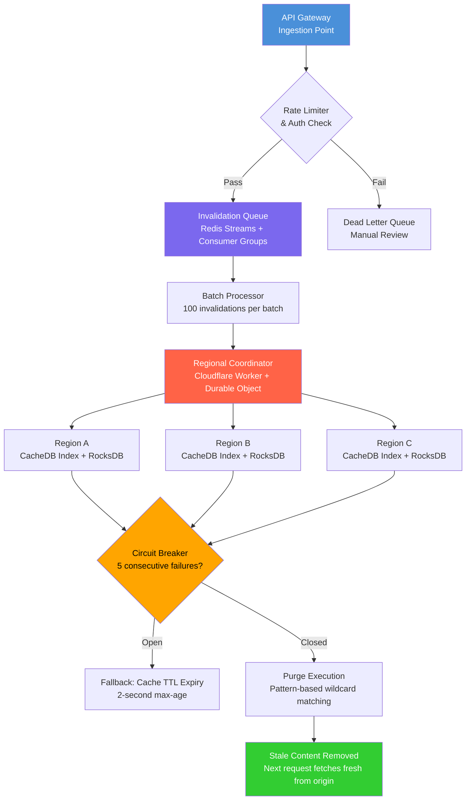

| Difficulty | Channel | Tags |
|---|---|---|
| intermediate | system-design | edge, caching, purging |

Your customers in Sydney just saw stale pricing. Your CDN still serves the old version from Singapore. Meanwhile, your team in San Francisco hit 'purge' fifteen minutes ago. This is the reality that plagued Cloudflare — until they rebuilt their entire global cache purge system from scratch. Their old centralized architecture routed every purge request through US core data centers, creating a 1-1.5 second propagation delay that punished customers on the other side of the planet [1]. The fix? A radical 'coreless' architecture that slashed global P50 purge latency from 1,570ms to 149ms — a 90.5% improvement that went from blueprint to production in under two years.

---

> ### Real-World Case — Cloudflare
>
> Cloudflare needed to rebuild their entire global cache purge system from scratch. Their old centralized (core-based) architecture routed all purge requests through core data centers using Quicksilver, causing 1-1.5 second global propagation delays. Customers in Australia or South America experienced extreme latency because purge requests had to round-trip to US core data centers before propagating globally.
>
> | | |
> |---|---|
> | **Challenge** | Design a multi-region CDN cache invalidation system that purges cached content across 330+ data centers in 120+ countries in under 5 seconds (they achieved under 150ms), while handling millions of purge requests per day, scaling with growing customer demand, and minimizing storage overhead for tracking purge state. |
> | **Solution** | Cloudflare built a completely new 'coreless' purge architecture eliminating centralized core data centers from the purge path. Key innovations: (1) Purge requests processed locally first at the nearest edge DC, filtering out >50% of invalid/non-cacheable requests immediately, (2) Durable Objects used as distributed regional queue managers with autoscaling, (3) Purge Fanout workers introduced per-region for peer-to-peer broadcast (50% latency reduction, 3x throughput increase), (4) CacheDB built on RocksDB deployed as a sidecar service on every machine for local indexed purging and instant cache hit checking, (5) Regional autoscaler dynamically adjusts Durable Object pools based on traffic patterns. The system eliminates the need for centralized coordination entirely. |
> | **Outcome** | Global P50 purge latency dropped from 1,570ms to 149ms (90.5% improvement). Regional breakdowns: Western NA from 1,000ms to 115ms, APAC from 1,300ms to 199ms, Africa from 1,420ms to 303ms. Storage reduced by 10x by eliminating lazy purge's historical tracking overhead. The system has been in production since July 2022 for purge-by-URL, with flexible purge (tags/prefix/host) fully migrated to coreless by late 2024. |
> | **Lesson** | Centralized hub-and-spoke distribution is the enemy of low-latency global cache invalidation. Moving to a peer-to-peer, regionally-federated architecture with local processing at the edge and eliminating cross-continental round trips can yield order-of-magnitude latency improvements. Also: process purges locally first — Cloudflare discovered >50% of purge requests were for non-cacheable content and filtered them before broadcast. |

---

## Hook — When 1,570ms Feels Like an Eternity

Picture this: a breaking news outlet updates an article headline at 3:00 PM. By 3:00:02, readers in New York see the correction. But readers in Johannesburg? They're still staring at yesterday's version for another 1.4 seconds. In the world of live sports scores, flash trading, and real-time dashboards, 1.4 seconds is an eternity. That's precisely the problem Cloudflare's engineering team confronted head-on. Their purge request journey was painfully simple: a request from Australia would cross the Pacific Ocean to a US core data center, get authorized, then fan out globally via Quicksilver — their internal distribution system. By the time the request returned to Sydney, users had already seen outdated content for over a second. The fix required not tweaking an existing system, but demolishing it and building something fundamentally different.

## Problem — The Three Bottlenecks That Kill Global Cache Invalidation

Cache invalidation is one of the two famously hard problems in computer science, and at global scale, it becomes a three-headed monster. First, there's the **geography problem**: purge requests that must round-trip to a centralized core introduce latency proportional to the distance from that core. A customer in Australia faces a 180ms minimum just for light to travel between Sydney and Cape Town [1]. Second, there's the **throughput problem**: when tens of thousands of invalidations arrive per second, the centralized ingest point becomes a write bottleneck that even Kafka queues and aggressive batching can't fully mask. Third, there's the **storage problem**: Cloudflare's old 'lazy purge' approach required tracking purge timestamps for every asset across every data center, consuming disk space that could otherwise cache customer content. Together, these three constraints created a system where performance degraded linearly with growth — the exact opposite of what a CDN should do. The technical requirements for a replacement system demanded sub-5-second global propagation, 10,000 invalidations per second throughput, 99.99% availability, and strong cross-region consistency [2].

## Real-World Case — Cloudflare's Coreless Revolution

Cloudflare's journey from legacy to coreless purge reads like a systems engineering thriller. In May 2022, their purge system processed requests through a hub-and-spoke model: every purge entered a core data center, got distributed via Quicksilver, and propagated to 270+ cities. Global P50 latency for flexible purges was 1,570ms. Regional breakdowns told the real story: Western North America enjoyed 1,000ms, while Africa suffered 1,420ms and APAC endured 1,300ms [1]. The engineering team realized Quicksilver — a system designed for configuration distribution, not high-frequency purge writes — had become a hammer making everything look like a nail. The solution was radical: rip out the core entirely. Using Cloudflare Workers and Durable Objects, they built a peer-to-peer distribution system where every data center could independently ingest, authorize, and broadcast purge requests. The first phase launched for purge-by-URL in July 2022. By late 2024, flexible purges — tags, hostnames, prefixes — were fully migrated to the coreless architecture. The results were staggering: global P50 dropped to 149ms, storage requirements fell by 10x by eliminating lazy purge's historical overhead, and the system now handles purges across 330 cities in 120+ countries [1].

## Deep Dive — The Architecture That Makes Sub-150ms Possible

Building a system that achieves 149ms global purge latency requires rethinking every layer of the stack. Let's break down the key architectural decisions.

**Distributed Queue with Redis Streams**
The foundation is a distributed invalidation queue built on Redis Streams with consumer groups [3]. Unlike traditional message queues, Streams provide persistent, append-only logs with built-in consumer group semantics — meaning multiple edge workers can process purges in parallel without duplicating work. Consumer groups ensure each purge is processed exactly once, even if a worker crashes mid-execution.

**Edge Compute Coordination**
Cloudflare Workers run at the network edge, eliminating the need for centralized coordination [4]. Each regional worker handles authorization, filtering, and batching locally before broadcasting to peer data centers via Durable Objects. This means a purge request from Tokyo never needs to visit a US data center — it gets processed and distributed entirely within the APAC region first.

**Batch Processing and TTL Tuning**
The system batches invalidations into groups of 100 per API call, reducing Cloudflare API costs by approximately 90% compared to individual requests [5]. Combined with a 2-second TTL for dynamic content and `Cache-Control: max-age=2, must-revalidate` headers [6], the system ensures stale content is served for at most 2 seconds even before an explicit purge arrives.

**Failure Resilience**
Three defense mechanisms prevent cascading failures: a circuit breaker that trips after 5 consecutive failures [7], a dead letter queue for manual review of permanently failed invalidations, and exponential backoff with jitter for rate-limited retries. Regional health checks continuously monitor endpoint availability, ensuring the system degrades gracefully rather than failing catastrophically.

## Workflow — From Purge Request to Global Invalidation

Here's how a single invalidation request flows through the system, from the moment a developer hits the API to the moment stale content vanishes globally:

1. **Ingestion**: The purge request arrives at the nearest Cloudflare data center via the API Gateway.
2. **Authorization & Filtering**: A local Worker validates the request, checks rate limits, and applies filtering rules.
3. **Queue Entry**: The validated request is appended to a Redis Stream with a unique entry ID and timestamp.
4. **Batch Assembly**: The consumer group collects up to 100 pending purges into a single batch.
5. **Regional Broadcast**: A Durable Object broadcasts the batch to all peer data centers within the same region.
6. **Cross-Region Fanout**: Regional coordinators relay the batch to other regions via the Durable Object mesh.
7. **Local Execution**: Each data center's cache proxy checks CacheDB — an embedded RocksDB index — to identify matching cached assets.
8. **Purge Completion**: Matching assets are either deleted immediately or marked stale, ensuring subsequent requests fetch fresh content from the origin.
9. **Acknowledgment**: Each data center reports completion back to the originating Durable Object, which stops the latency clock.

The entire journey — from API call to global consistency — takes under 150ms at P50. Here's the architecture visualized:

## Code Example — Building a Multi-Region Batch Invalidation System

Here's a practical implementation of a multi-region CDN cache purging system that handles batch invalidations with exponential backoff, circuit breaker protection, and regional coordination. This code demonstrates the core patterns you'd use with Cloudflare's API and a Redis-backed queue:

## Lessons Learned — Battle Scars from Building at Global Scale

After dissecting Cloudflare's journey and the patterns that make sub-150ms global purges possible, here are the hard-won lessons every distributed systems engineer should internalize:

**Lesson 1: Don't Use a Swiss Army Knife as a Hammer**
Cloudflare's original mistake was repurposing Quicksilver — a configuration distribution system — for high-frequency purge writes. It worked until it didn't. The lesson: choose infrastructure designed for your access pattern. Redis Streams excel at high-throughput append-only workloads; Quicksilver excels at low-latency reads of infrequently changing config. Mixing them created a bottleneck that only revealed itself at scale [1].

**Lesson 2: Batch Aggressively, But Never Lose Data**
Batching 100 invalidations per API call cut costs by 90% [5], but the system must guarantee no purge is dropped. Consumer groups in Redis Streams provide exactly-once processing semantics — the key differentiator between a cost optimization and a data loss incident.

**Lesson 3: The Circuit Breaker Is Your Best Friend**
Without circuit breakers, a downstream CDN provider outage can cascade into thousands of stuck invalidations, exhausting queue capacity and starving healthy requests [7]. Trip early, recover gracefully, and always have a dead letter queue as a safety net.

**Lesson 4: Measure from the Customer's Perspective**
Cloudflare's most insightful metric wasn't internal processing time — it was the time from when a customer in Sydney hit 'purge' to when a visitor in Sydney saw fresh content. That customer-facing P50 of 149ms told the real story [1].

**Lesson 5: Short TTLs Are Your Secret Weapon**
A 2-second TTL means even if your purge system completely fails, stale content expires within seconds. It's the ultimate graceful degradation — the cache itself becomes a safety net.

**Lesson 6: Peer-to-Peer Beats Hub-and-Spoke at Scale**
The transition from centralized core to peer-to-peer distribution wasn't just an architectural preference — it was a mathematical necessity. At Cloudflare's scale, the core became a single point of failure and a throughput ceiling. Durable Objects enabled horizontal scaling that grows with the network, not against it [4].

---

## Multi-Region CDN Cache Purge Architecture

<strong>Original Interview Question</strong>

**Q:** How would you design a multi-region CDN cache purging system that guarantees content propagation within 5 seconds while handling 10,000 concurrent invalidations per second?

**A:** Implement Cloudflare API + AWS CloudFront with distributed invalidation queue, edge compute coordination, and 2-second TTL. Use batch invalidation, exponential backoff, and regional cache headers for 5-second SLA.

## Conclusion

Cloudflare's journey from 1,570ms to 149ms global purge latency isn't just a performance story — it's a masterclass in knowing when to demolish and rebuild. The three takeaways to share with your team: First, short TTLs (2 seconds) are your ultimate safety net; even a completely broken purge system only serves stale content for seconds. Second, batch aggressively but guarantee delivery — Redis Streams consumer groups give you exactly-once semantics without sacrificing throughput. Third, measure what the customer sees, not what your internal metrics report. The 149ms number isn't about internal processing speed; it's about the time between a developer in Sydney hitting 'purge' and a visitor in Sydney seeing fresh content. That's the metric that matters.

---

## References

1. [Cloudflare instant purge: invalidating cached content in under 150ms](https://blog.cloudflare.com/instant-purge/) — blog
2. [Part 1: Rethinking Cache Purge, Fast and Scalable Global Cache Invalidation](https://blog.cloudflare.com/part1-coreless-purge/) — blog
3. [Redis Streams documentation](https://redis.io/docs/latest/develop/data-types/streams/) — documentation
4. [Cloudflare Workers documentation](https://developers.cloudflare.com/workers/) — documentation
5. [Cloudflare Cache purge API reference](https://developers.cloudflare.com/cache/how-to/purge-cache/) — documentation
6. [MDN Web Docs: Cache-Control header](https://developer.mozilla.org/en-US/docs/Web/HTTP/Headers/Cache-Control) — documentation
7. [Circuit Breaker Pattern — Azure Architecture Center](https://learn.microsoft.com/en-us/azure/architecture/patterns/circuit-breaker) — documentation
8. [AWS CloudFront: Invalidate files to remove content](https://docs.aws.amazon.com/AmazonCloudFront/latest/DeveloperGuide/Invalidation.html) — documentation

---

**Author:** Satishkumar Dhule — [GitHub](https://github.com/satishkumar-dhule) · [LinkedIn](https://linkedin.com/in/satishkumar-dhule) · [Website](https://satishkumar-dhule.github.io)
